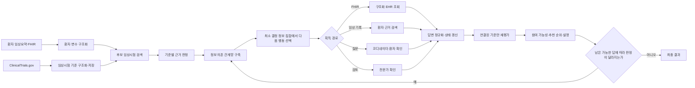
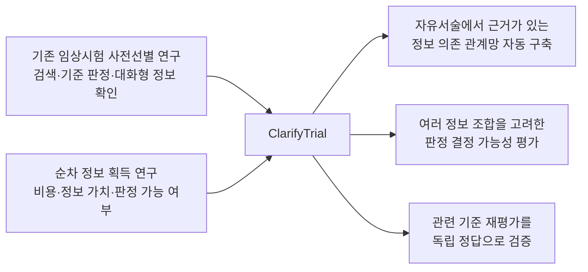

# ClarifyTrial

**임상시험 코디네이터와 임상의를 위한 대화형 임상시험 사전선별·추천 시스템**


지원서에 옮겨 쓸 문안은 [APPLICATION_KO.md](APPLICATION_KO.md)에 정리되어 있다.
이 문서는 ClarifyTrial이 어떤 문제를 풀고, 어떤 데이터와 알고리즘으로 구현하며,
어떻게 성능을 검증할지를 한곳에 모은 프로젝트 통합 설명서다.

## 목차

- **개요와 구조:** [한눈에 보기](#한눈에-보기) · [1. 해결하려는 문제](#1-해결하려는-문제) · [2. 최종 결과](#2-사용자가-받는-최종-결과) · [3. 전체 흐름](#3-전체-처리-흐름) · [4. 공유 상태](#4-공유-상태와-핵심-데이터-구조)
- **구현 방법:** [5. 단계별 구현](#5-단계별-구체적-구현-방법) · [6. 전문 역할과 지시문](#6-전문-역할과-지시문-구성) · [7. 검색 증강 생성](#7-검색-증강-생성rag-구성)
- **데이터와 평가:** [8. 데이터와 정답](#8-데이터-구성과-정답-자료-생성) · [9. 비교 실험](#9-비교-실험) · [10. API 비용](#10-api-호출과-비용-측정)
- **선행연구와 기여:** [11. 선행연구 지도](#11-선행연구-지도-무엇이-이미-연구되었는가) · [12. 논문별 분석](#12-논문별-상세-분석) · [13. 연구 기여](#13-선행연구를-바탕으로-검증할-연구-기여)
- **산출물과 구현 설계:** [14. 기대 산출물](#14-기대-산출물) · [15. 구현 상태](#15-현재-구현-상태와-다음-구현) · [16. 파일 설계와 완료 조건](#16-구현-파일-설계와-완료-조건)
- **실행과 문서:** [17. 실행 방법](#17-실행-방법) · [18. 문서 구조](#18-문서-구조) · [의료적 면책](#의료적-면책)

## 한눈에 보기

ClarifyTrial은 환자 기록과 임상시험 참여 기준을 비교한 뒤, 판정에 꼭 필요한 정보가
빠져 있으면 그 정보를 확인하고 결과를 다시 계산한다. 여러 전문 역할이 하나의
환자별 공통 상태를 읽고 갱신하므로, 질문 전 판단과 질문 후 판단을 모두 추적할 수
있다.

| 순서 | 하는 일 | 확인할 수 있는 결과 |
|---|---|---|
| 1 | 환자 기록과 임상시험 참여 기준을 구조화한다. | 어떤 원문에서 어떤 정보를 읽었는지 |
| 2 | 관련 임상시험을 찾고 참여 기준을 하나씩 판정한다. | 충족·위반·확인 필요 상태와 근거 문장 |
| 3 | 여러 임상시험에 공통으로 필요한 부족 정보를 합친다. | 한 번 확인해 여러 판정을 바꿀 수 있는 정보 |
| 4 | 판정을 결정하는 최소 정보 집합을 계산해 조회하거나 질문한다. | 다음에 확인할 정보와 선택 이유 |
| 5 | 새 답변과 관련된 기준만 다시 판정한다. | 질문 전후에 달라진 기준과 추천 |
| 6 | 참여 가능성, 추천 순위, 설명과 의료적 면책 고지를 낸다. | 코디네이터가 검토할 최종 결과 |

### 용어 안내

문서 본문은 쉬운 한글 표현을 우선한다. 다만 데이터 파일과 프로그램이 사용하는
필드명·상태값은 재현성을 위해 영문 코드 그대로 표시한다.

| 이 문서에서 쓰는 말 | 뜻 | 프로그램 표기 예 |
|---|---|---|
| 참여 기준 | 임상시험의 선정 기준과 제외 기준 | `criterion`, `criteria` |
| 부족 정보 | 판정에 필요하지만 환자 기록에 없는 정보 | `missing_variable` |
| 정보 의존 관계망 | 어떤 환자 정보가 어떤 참여 기준과 임상시험 판정에 영향을 주는지 연결한 구조 | `dependency_graph` |
| 판정 결정 가능 | 남은 정보에 어떤 유효한 답이 들어와도 현재 최종 판정이 달라지지 않는 상태 | `determinable` |
| 최소 결정 정보 집합 | 함께 확인하면 판정을 확정할 수 있는 가장 작은 부족 정보 묶음 | `decision_frontier` |
| 관련 기준 재평가 | 새 답변과 연결된 기준만 다시 판정하는 방식 | `targeted_re_evaluation` |
| 환자별 공통 상태 | 환자 정보, 기준 판정, 질문과 답변을 한곳에 모은 기록 | `PatientSession` |
| 검색 증강 생성 | 저장된 임상시험·환자 근거를 먼저 검색해 언어모델에 제공하는 방식 | RAG |
| 기계 판정값 | 자동 채점과 프로그램 연결에 쓰는 고정 상태값 | `met`, `unmet`, `unknown` |

## 1. 해결하려는 문제

기존 임상시험 사전선별 시스템은 대체로 이미 주어진 환자 기록과 임상시험 기준을
한 번 비교한다. 그러나 실제 선별 과정에서는 병기, 바이오마커, 최근 검사값,
치료 시점처럼 판정에 필요한 정보가 기록에 빠져 있는 경우가 많다. 정보가 없다는
이유만으로 탈락시키면 안 되고, 모든 부족 정보를 한꺼번에 확인하면 코디네이터의
업무가 불필요하게 늘어난다.

ClarifyTrial은 다음 질문을 푼다.

> 지금 가진 정보로 기준별 판단을 먼저 수행한 뒤, 여러 후보 임상시험의 상태를
> 연결한 정보 의존 관계망에서 여러 정보를 함께 알아야 하는 경우까지 고려하면,
> 고정 순서나 다음 답 하나만 보는 방식보다 낮은 비용으로 완전한 환자 정보의
> 판단에 더 빨리 도달할 수 있는가?

시스템은 환자 정보를 임상시험과 직접 비교하는 데서 끝나지 않는다. 부족 정보를
찾고, 같은 정보를 요구하는 여러 임상시험 기준을 하나로 묶고, 전자의무기록 조회·임상 기록
검색·직접 질문 중 알맞은 경로를 선택한다. 새 정보가 들어오면 그 정보와 연결된
기준만 다시 평가하고 추천을 갱신한다.

## 2. 사용자가 받는 최종 결과

최종 화면과 결과 JSON에는 다음 항목이 함께 있어야 한다.

| 결과 | 사용자 표시 | 내부 상태 |
|---|---|---|
| 임상시험 참여 가능성 | 제출용 `eligible`, `ineligible`, `uncertain` | `likely_eligible`, `likely_ineligible`, `uncertain`, `needs_human_review`를 별도 `screening_status`로 유지 |
| 기준별 판단 | `satisfied`, `violated`, `unknown`, `not_applicable` | 기준의 참·거짓인 `criterion_truth`와 참여에 미치는 `eligibility_effect`를 분리 |
| 판단 근거 | 환자 기록 문장과 사용한 변수 | `EvidenceContext`와 `SourceSentence` |
| 부족 정보 | 빠진 정보, 영향을 받는 기준과 임상시험 | 공통 부족 정보 목록 |
| 확인 질문 | 질문, 기대 답변 형식, 답변 | 공통 질문 대기열과 답변 이력 |
| 추천 | 환자별 임상시험 순위와 설명 | 참여 차단 기준을 우선한 순위 계산 |
| 고지 | 의료적 면책 고지 | 모든 최종 출력에 고정 포함 |

예상 출력 구조는 다음과 같다. 문장 표현이 아니라 ID, 상태, 근거 연결이 채점의
핵심이다.

```json
{
  "patient_id": "SYN-001",
  "recommendations": [
    {
      "trial_id": "NCT00000000",
      "rank": 1,
      "submission_label": "uncertain",
      "screening_status": "uncertain",
      "review_required": false,
      "criterion_judgments": [
        {
          "criterion_id": "NCT00000000-INC-03",
          "criterion_type": "inclusion",
          "status": "unknown",
          "criterion_truth": "unknown",
          "eligibility_effect": "uncertain",
          "evidence_sentence_ids": [],
          "missing_variable_keys": ["ecog_performance_status"],
          "reason": "최근 ECOG 수행능력 정보가 기록에 없음"
        }
      ],
      "explanation": "질환과 치료 단계는 연구 대상과 일치하지만 ECOG 확인이 필요함"
    }
  ],
  "follow_up_questions": [
    {
      "question_id": "Q-001",
      "missing_variable_key": "ecog_performance_status",
      "question": "현재 일상생활 수행능력에 가장 가까운 ECOG 점수는 0~4 중 몇 점입니까?",
      "affected_trial_ids": ["NCT00000000", "NCT00000001"]
    }
  ],
  "medical_disclaimer": "연구 및 사전검토용 결과이며 최종 적격성 판단을 대체하지 않습니다."
}
```

`satisfied`가 항상 참여에 유리한 것은 아니다. 예를 들어 “중증 신부전이 있으면
제외”라는 exclusion criterion이 `satisfied`이면 제외 조건에 해당하므로
`eligibility_effect=blocks_eligibility`다. 따라서 최종 JSON과 화면에는
`criterion_type`, `status`, `eligibility_effect`를 항상 함께 표시한다.
`needs_human_review`는 제출용으로는 `uncertain`에 포함하되 `review_required`와
사유를 삭제하지 않는다.

## 3. 전체 처리 흐름




대규모 언어모델(LLM)은 자유문장을 구조화하거나 근거를 설명하는 역할을 맡는다. 상태 갱신,
ID 검증, 부족 변수 중복 제거, 재평가 대상 선택, inclusion/exclusion 효과 변환과
최종 판정 우선순위는 Python 조정 코드가 담당한다. 따라서 여러 에이전트가 서로
다른 결론을 말하더라도 하나의 `PatientSession`만 최종 상태가 된다.

## 4. 공유 상태와 핵심 데이터 구조

현재 저장소의 중심 객체는 [models.py](models.py)의 `PatientSession`이다.

| 객체 | 저장 내용 | 상태를 바꾸는 단계 |
|---|---|---|
| `PatientProfile` | 연령, 성별, 질환, 약물, 정규화 변수, 원문 | 환자 이해, 답변 정규화 |
| `TrialProtocol` | NCT ID, 제목, 질환, 중재, 원문 참여 기준, 출처 | ClinicalTrials.gov 연동 모듈 |
| `Criterion` | 기준 ID, 선정·제외 구분, 원문, 필요한 정보 | 기준 구조화 단계 |
| `CriterionState` | 충족·미충족·확인 필요·충돌 상태, 효과, 근거 | 기준 판정 단계 |
| `GlobalMissingVariablePoolItem` | 같은 부족 정보와 연결된 모든 기준·임상시험 | 부족 정보 통합 단계 |
| `FollowUpQuestion` | 질문, 답변 형식, 대상 정보와 기준 | 질문 생성 단계 |
| `AnswerUpdate` | 원답, 정규화 값, 갱신 기준, 회차 | 답변 반영 단계 |
| `TrialRecommendation` | 참여 가능성, 차단 기준, 불확실 기준, 점수와 순위 | 추천 단계 |

목표 구현에서는 각 환자 변수에 값만 저장하지 않고 다음 메타데이터를 함께 둔다.

```text
variable_key, value, unit, observed_at, source_type,
source_ref, evidence_sentence_ids, negated, confidence
```

예를 들어 `creatinine=1.4`만 저장하면 단위와 검사 시점을 잃는다. 대신
`value=1.4`, `unit=mg/dL`, `observed_at=2026-07-01`,
`source_type=FHIR.Observation`을 보존해야 “최근 14일 이내 검사” 같은 기준을
판단할 수 있다.

## 5. 단계별 구체적 구현 방법

### 5.1 환자 정보 이해

**입력**은 합성 환자 임상요약, clinical note 또는 Synthea FHIR Bundle이다.

1. 문장을 sentence ID 단위로 나눈다.
2. 연령, 성별, 진단, 병기, 바이오마커, ECOG, 치료 이력, 동반질환, 검사값,
   지역을 표준 변수로 추출한다.
3. 부정 표현과 시간 표현을 값에서 분리한다. “3개월 전 pembrolizumab 중단”은
   치료명, 상태, 종료 시점으로 나눈다.
4. 검사값은 원 단위와 표준 단위를 함께 저장한다.
5. 모든 변수에 원문 sentence ID를 붙인다.
6. 명시되지 않은 값은 음성으로 추정하지 않고 `unknown`으로 남긴다.

FHIR 입력을 사용하는 경우의 초기 매핑은 다음과 같다.

| 환자 변수 | FHIR resource | 선택 규칙 |
|---|---|---|
| 연령·성별 | `Patient` | birthDate와 기준일로 연령 계산 |
| 진단·병기 | `Condition`, 관련 `Observation` | active 또는 최근 상태 우선 |
| 약물·치료 | `MedicationRequest`, `Procedure` | 상태와 기간 보존 |
| 검사값·바이오마커 | `Observation`, `DiagnosticReport` | 코드, 값, 단위, 검사일 보존 |
| 수행능력 | `Observation` 또는 note | 구조화 값이 없으면 note 검색으로 이동 |

**출력 검증**은 필드 타입, 허용 단위, source reference 존재 여부를 확인한다.
LLM 출력이 실패하면 명확한 연령·수치·키워드만 현재의 결정론적 parser로 추출하고
나머지는 unknown으로 유지한다.

### 5.2 ClinicalTrials.gov 수집과 참여 기준 저장

[ClinicalTrials.gov API v2](https://clinicaltrials.gov/data-api/about-api)의
`/api/v2/studies`와 `/api/v2/studies/{nctId}`를 사용한다. 검색 시 모집 상태,
질환, 국가·지역, 연령과 성별처럼 API에서 직접 필터링 가능한 필드를 먼저 적용한다.
원문 참여 기준은
`protocolSection.eligibilityModule.eligibilityCriteria`에서 읽는다.

수집 결과에는 다음 정보를 남긴다.

```text
nct_id, source_url, api_data_timestamp, study_last_update,
query_parameters, retrieved_at, response_sha256
```

참여 기준 구조화는 매 환자마다 다시 하지 않는다. 원본 응답은 검색 조건,
`retrieved_at`과 `response_sha256`으로 고정하고, 구조화 결과의 저장 키는
`nct_id + study_last_update + response_sha256 + parser_version`으로 만든다.
임상시험 원문이나 구조화 프로그램이 바뀐 경우에만 새로 처리한다. 실행 기록에는
ClinicalTrials.gov 처리일, 사용 필드와 정규화·필터링 방식을 함께 기록한다.

### 5.3 선정·제외 기준 구조화

원문 기준을 먼저 inclusion과 exclusion 구역으로 분리하고, 목록 번호와 원래
순서를 보존한다. 원문 목록 한 항목을 무조건 참여 기준 하나로 보거나 마침표마다 자르지
않는다. `A and (B or C)`, 예외 조건, 수치 범위와 시간 창은 논리 구조 트리
(Boolean AST)로 보존해야 하기 때문이다. 원문 항목은 `source_item_id`로 유지하고,
실제 판정 단위는 논리 구조 트리의 가장 작은 조건으로 둔다.

각 참여 기준은 다음 필드를 갖는다.

```json
{
  "criterion_id": "NCT00000000-INC-03",
  "source_item_id": "NCT00000000-INC-BULLET-03",
  "criterion_type": "inclusion",
  "source_text": "ECOG performance status of 0 or 1",
  "source_span": {"start": 184, "end": 218},
  "logic_ast": {
    "op": "atom",
    "atom_id": "NCT00000000-INC-03-A01",
    "variable_key": "ecog_performance_status",
    "normalized_predicate": "ecog_performance_status in [0, 1]",
    "operator": "in",
    "target_value": [0, 1],
    "temporal_constraint": {"anchor": "screening", "window": "current"}
  },
  "source_order": 3
}
```

논리 구조 트리의 최소 조건은 선정 기준이면 “충족해야 하는 조건”, 제외 기준이면
“해당하면 차단되는 조건”으로 표준화한다. 제외 기준 원문이 부정문이면 부정 범위를
해석해 참여를 막는 조건으로 바꾸되 원문과 위치는 그대로 보존한다. 그래야
`exclusion + met = blocks` 규칙이 문장 표현과 무관하게 일관된다.

언어모델에는 전체 임상시험 설명을 판단 근거로 주지 않고 참여 기준 원문과 필요한
기본 정보만 제공한다. 출력 후에는 원문 항목별 포함 범위, 최소 조건 ID 중복,
선정·제외 구분, 괄호 구조, 숫자·단위·시간 범위 보존 여부를 검사한다.
원문 목록 하나가 여러 최소 조건으로 나뉠 수 있으므로 두 개수의 일치는 검증 조건으로
쓰지 않는다. 실패한 원문 항목만 재요청하고 전체 임상시험을 다시 호출하지 않는다.

### 5.4 후보 임상시험 검색

검색은 “관련 임상시험을 넓게 찾는 단계”와 “적격성을 엄격하게 판정하는 단계”를
분리한다.

1. 환자 정보에서 질환명, 하위 유형, 병기, 핵심 바이오마커, 치료 이력,
   지역 검색어를 만든다.
2. 모집 상태와 명백한 구조화 조건으로 1차 필터링한다.
3. 임상시험 제목, 질환, 요약, 중재, 참여 기준을 BM25로
   검색한다.
4. 같은 필드를 의미 유사도 방식으로 검색한다.
5. 두 순위를 Reciprocal Rank Fusion으로 합친다.

```text
RRF(trial) = sum(1 / (60 + rank_in_retriever))
```

6. 환자 질환과 무관한 임상시험을 관련성 재정렬 단계에서 제거한다.
7. 남은 후보에만 기준별 판정을 수행한다.

정확한 후보 수는 미리 고정하지 않는다. 후보 수를 늘리면서 TREC의 참여 가능
임상시험 재현율과 환자당 기준 판정 비용을 함께 그려, 관련 임상시험을 충분히 포함한
뒤 추가 이득이 작아지는 범위를 선택한다. 검색 단계의 관련성 점수는 추천
순위에는 사용할 수 있지만 명시적 exclusion 위반을 뒤집을 수 없다.

### 5.5 참여 기준별 근거 판정

환자-임상시험 한 쌍에서 선정 기준과 제외 기준을 구분해 평가한다.
각 참여 기준에 대해 다음 순서를 강제한다.

1. 논리 구조 트리의 최소 조건이 요구하는 환자 정보를 확인한다.
2. `PatientProfile`과 환자 근거 검색에서 연결된 문장을 찾는다.
3. 수치, 단위, 시간 창, 부정 여부를 비교한다.
4. leaf마다 `met`, `unmet`, `unknown`, `not_applicable`, 필요 시 `conflict`를 낸다.
5. 논리 구조 트리를 로컬의 참·거짓·확인 필요 규칙으로 집계해 전체 판단을 만든다.
6. 근거 문장 ID, 사용 정보, 최소 조건별 이유와 전체 집계 이유를 함께 낸다.

```text
ALL: 하나라도 unmet이면 unmet; unmet 없이 unknown/conflict가 있으면 unknown;
     나머지 적용 leaf가 모두 met이면 met
ANY: 하나라도 met이면 met; met 없이 unknown/conflict가 있으면 unknown;
     적용 leaf가 모두 unmet이면 unmet
NOT: met과 unmet을 뒤집고 unknown/conflict는 유지
```

`not_applicable`인 최소 조건은 해당 분기 집계에서 제외하되 모든 최소 조건이 적용되지
않으면 참여 기준 전체도 `not_applicable`이다. 근거 충돌은 검토 표시에 별도 보존한다.

판정 규칙은 다음과 같다.

| 상황 | 기준 판정값 |
|---|---|
| 요구 조건을 근거가 충족 | `met` |
| 근거가 요구 조건과 명시적으로 불일치 | `unmet` |
| 필요한 값이 없거나 시점·단위가 불충분 | `unknown` |
| 해당 환자에게 적용할 수 없는 분기 | `not_applicable` |
| 서로 양립하지 않는 두 근거가 존재 | `conflict` |

언어모델이 참여에 미치는 영향까지 정하지는 않는다. [rules.py](rules.py)가 참여 기준
유형과 판정값을 다음과 같이 변환한다.

| 기준 종류 | 기준 판정값 | 참여에 미치는 영향 |
|---|---|---|
| inclusion | met | supports eligibility |
| inclusion | unmet | blocks eligibility |
| exclusion | met | blocks eligibility |
| exclusion | unmet | supports eligibility |
| 둘 다 | unknown/conflict | uncertain |
| 둘 다 | not_applicable | neutral |

제출용 `satisfied`/`violated`는 참여 기준 문장의 참·거짓을 나타낸다. 참여에 유리한지
여부는 별도 effect로 표시한다.

| 기준 종류와 판단 | 제출 상태 | 참여에 미치는 영향 | 화면 표현 |
|---|---|---|---|
| inclusion + met | `satisfied` | supports | 선정 기준 충족 |
| inclusion + unmet | `violated` | blocks | 선정 기준 미충족, 참여 차단 |
| exclusion + met | `satisfied` | blocks | 제외 기준 해당, 참여 차단 |
| exclusion + unmet | `violated` | supports | 제외 기준 비해당 |
| unknown | `unknown` | uncertain | 확인 필요 |
| not applicable | `not_applicable` | neutral | 적용되지 않음 |
| conflict | `unknown` | uncertain + review | 근거 상충, 전문가 검토 필요 |

### 5.6 부족 정보 탐지와 여러 임상시험 간 중복 제거

`unknown`인 참여 기준마다 판단에 필요한 부족 정보의 정확한 조건을 추출한다.
같은 환자의 여러 임상시험이 의미적으로 같은 정보를 요구할 때만 질문을 하나로
합친다. 변수 이름이 같더라도 검사 시점, 검체, 단위 또는 대상이 다르면 별도
항목이다.

```text
ecog_performance_status
  -> NCT-A-INC-02
  -> NCT-B-INC-04
  -> NCT-C-EXC-01
```

각 항목에는 연결된 참여 기준 ID, 임상시험 ID, 기대 자료형, 단위, 시간 범위, 가능한
정보 획득 경로와 근거 원문 위치를 기록한다. 이 연결 구조를 **정보 의존 관계망**으로
저장하며, 답변 뒤 재평가 범위와 다음 정보 선택의 공통 입력으로 사용한다.

```text
semantic_missing_key =
  patient_or_subject + concept + value_type + canonical_unit
  + specimen_or_body_site + temporal_anchor + temporal_window
```

예를 들어 “현재 ECOG”와 “치료 시작 전 ECOG”는 같은 의학 개념이라도 서로 합치지
않는다. 반대로 표현이 `performance status`, `ECOG PS`, `ECOG score`로 달라도
나머지 조건이 같으면 하나로 통합한다.

한 답을 여러 참여 기준에 재사용하려면 환자 또는 검사 대상, 의학 개념과 자료형,
검체·신체 부위, 변환 가능한 단위, 기준 시점·허용 시간 범위와 자료 최신성이 모두
호환되어야 한다. 하나라도 확인할 수 없으면 자동으로 합치지 않는다. 이 조건을
프로그램 규칙으로 남겨 잘못 합친 경우와 불필요하게 나눈 경우를 각각 채점한다.

### 5.7 다음에 확인할 정보 선택

질문 수에 고정 상한은 두지 않는다. 대신 매 단계에서 어떤 정보를 먼저 얻을지
계산한다. 연속 수치를 임의로 전 구간에 균등 분포시켜 “기대효용”을 만들지 않는다.
참여 기준의 경계값을 이용해 판정이 같은 값 구간을 먼저 만든다. 예를 들어 eGFR
판정이 30과 60에서만 바뀌면 `<30`, `30~60`, `>60`의
대표값만 대입한다.

#### 비교 방식 1: 한 단계 앞만 보는 우선순위

현재 구현하기 쉬운 첫 방식은 아래 항목을 위에서부터 차례대로 비교하는 고정
정렬이다. 가능한 **다음 답 하나**가 임상시험 상태를 바로 바꿀 수 있는지를 보므로
이 문서에서는 `Greedy-1`이라고 부른다.

```text
priority_key(v) = (
  flip_capable_trial_count(v),
  affected_trial_count(v),
  affected_decision_critical_criterion_count(v),
  -minimum_feasible_route_cost_tier(v),
  stable_variable_key(v)
)
```

- `flip_capable_trial_count`: 가능한 값에 따라 상태가 바뀔 수 있는 임상시험 수
- `affected_trial_count`: 이 정보를 요구하는 서로 다른 임상시험 수
- `affected_decision_critical_criterion_count`: 답에 따라 차단 여부가 달라지는 기준 수
- `minimum_feasible_route_cost_tier`: 구조화 조회, 임상 기록 검색, 직접 질문 순의 비용 등급
- `stable_variable_key`: 앞 항목이 같을 때 실행을 재현하기 위한 최종 고정 정렬 키

각 값은 언어모델이 쓴 중요도 문장이 아니라 구조화된 참여 기준에 대표값을 임시로
적용하고 로컬 규칙으로 참여 기준과 임상시험 상태를 다시 계산해 얻는다. 아직
조회하지 않은 FHIR·임상 기록의 실제 값 존재 여부는 우선순위 계산에 사용하지 않고,
조정 코드가 이미 볼 수 있는 출처 정보와 정보 획득 경로 연결만 사용한다.

가중 점수는 주 정책이 아니라 민감도 비교용 보조 정책으로 둔다.

```text
heuristic_priority_score(v) =
  (0.30*C + 0.30*F + 0.20*R + 0.20*A) / (1 + 0.50*B)
```

여기서 `C`는 연결 범위, `F`는 판정 변화 가능성, `R`은 순위 민감도, `A`는 현재
확인 가능한 출처 정보에 따른 획득 가능성, `B`는 미리 정한 경로 비용 등급이다.
이 값은 확률로 보정된 기대효용이 아니다. 정규화 범위와 가중치는 개발용 자료에서
고정하고, 고정 순서·연결 기준 수 우선·판정 변화만 보는 방식과 별도로 비교한다.

`Greedy-1`은 한 정보만으로 바로 판정이 바뀌지 않는 경우를 놓칠 수 있다. 예를 들어
조건이 `(A와 B) 또는 (C와 D)`이고 네 값이 모두 없으면, A 하나를 알아도 아직 판정은
확정되지 않는다. 그렇다고 A가 쓸모없는 정보는 아니다. A와 B를 함께 알면 한 논리
경로를 확인할 수 있기 때문이다.

#### 제안 방식: 최소 결정 정보 집합 우선

주 연구 방식은 구조화된 선정·제외 기준의 AND·OR 논리에서 **판정을 확정하는 데
필요한 가장 작은 미확인 정보 묶음**을 찾는다. 프로그램 표기는 `AST-frontier`,
문서에서는 “최소 결정 정보 집합 우선”이라고 쓴다.

1. 현재 알려진 값으로 이미 참·거짓이 결정된 논리 가지를 줄인다.
2. 참여 가능 또는 참여 불가를 확정할 수 있는 최소 부족 정보 집합을 모두 구한다.
3. 여러 집합과 여러 임상시험에 반복해서 나타나며, 남은 집합 크기를 많이 줄이고,
   실행 가능한 획득 비용이 낮은 정보를 먼저 고른다.
4. 답변을 반영한 뒤 최소 집합과 순서를 다시 계산한다.

최소 집합은 논리 구조 트리를 아래에서 위로 계산한다. 모르는 최소 조건은 해당 정보
하나를 집합으로 만들고, AND에서는 자식 집합들을 합치며, OR에서는 대안 집합들을
나란히 유지한다. 각 단계에서 중복 집합과 이미 더 작은 집합을 포함하는 불필요한
상위 집합을 제거한다. 참여 불가를 증명하는 집합은 선정 기준 위반 또는 제외 기준
충족 경로에서, 참여 가능을 증명하는 집합은 모든 필수 선정 기준 충족과 제외 기준
비해당 경로에서 따로 계산한다.

```text
frontier_priority(v) = (
  number_of_determining_sets_containing(v),
  affected_trial_count(v),
  -smallest_remaining_determining_set_size(v),
  -minimum_feasible_route_cost_tier(v),
  stable_variable_key(v)
)
```

이 정렬도 확률값이 아니라 논리 구조에서 계산한 재현 가능한 비교 키다. 작은 평가
사례에서는 다음 정보 두 개의 조합까지 미리 대입하는 `Lookahead-2`와 가능한 확인
순서를 모두 열거해 얻은 사후 최적값도 계산한다. 전자는 두 단계 미리보기 비교 방식,
후자는 실제 시스템이 사용하는 정책이 아니라 각 방식이 최선의 순서에서 얼마나
떨어졌는지 재는 하한선이다.

### 5.8 정보 획득 경로와 질문 생성

핵심 실험에서는 부족 정보 선택 방식과 정보 출처 최적화를 섞지 않는다. 다음 정보
하나를 고른 뒤 현재 확인 가능한 출처에 따라 아래의 고정 순서를 사용한다.

1. FHIR 연결이 있고 최신 구조화 값이 있으면 해당 자원을 조회한다.
2. 구조화 값이 없지만 임상 기록에 있을 가능성이 있으면 환자 기록을 문장 단위로 검색한다.
3. 두 경로에서 찾지 못하면 코디네이터 또는 환자에게 직접 질문한다.
4. 답변이 서로 충돌하거나 전문 해석이 필요한 경우 전문가 확인 상태로 보낸다.

이 단계는 “여러 경로 중 최적 경로를 학습한다”는 주장이 아니라 재현 가능한 정보
획득 절차다. 경로 자체를 비교하려면 같은 환자 사실을 FHIR만 존재, 임상 기록만
존재, 직접 답변만 가능, 복수 출처 일치·충돌, 획득 불가 상태로 각각 배치한 별도
`SyntheticRouteCase`에서 평가한다. Synthea FHIR 시연 결과는 TrialGPT 기반
대화형 평가 점수와 합산하지 않는다.

질문 생성 에이전트에는 자유롭게 질문을 만들라고만 하지 않는다. 다음 정보를 준다.

```text
missing_variable_key
plain-language definition
expected answer type and allowed values
required unit and time window
affected criteria and trials
already asked questions
```

핵심 평가에서 질문 한 번은 부족 정보 하나와 질문 의도 하나만 요구한다.
필요한 단위와 기준 시점을 포함하며, 이미 답한 내용을 다시 묻지 않아야 한다.
여러 변수를 묶은 질문은 행동 수의 의미를 바꾸므로 별도 UX 실험에서만 다룬다.
표현 품질은 LLM이 담당하지만 어떤 변수를 묻는지는 controller가 결정한다.

### 5.9 답변 정규화와 관련 기준 재평가

답변은 바로 판정에 넣지 않는다. Answer Normalizer가 원답을
`value + unit + observed_at + source`로 변환하고 schema validator가 검사한다.
“모름” 또는 해석할 수 없는 답은 값을 바꾸지 않고 unresolved로 남긴다. 기존 값과
충돌하면 덮어쓰지 않고 conflict를 기록한다.

정상 답변이 들어오면 다음 순서로 갱신한다.

1. `PatientProfile`의 해당 변수 하나를 갱신한다.
2. 공통 부족 정보 목록의 항목을 해결됨으로 바꾼다.
3. 관련 질문을 답변 완료로 바꾼다.
4. 기준 연결표에서 연결된 참여 기준 ID만 가져온다.
5. 해당 참여 기준만 판정기에 다시 보낸다.
6. 변경된 임상시험의 추천과 전체 순위를 다시 계산한다.
7. 질문 전 상태, 답변, 질문 후 상태를 대화 이력에 남긴다.

이 방식은 답변 하나 때문에 모든 임상시험과 모든 참여 기준을 다시 호출하는 것을
막는다. 비교 실험에서는 동일 답변을 넣고 전체 재평가와 표적 재평가의 결과가
같은지만 확인하지 않는다. 두 방식이 같은 오류를 낼 수 있으므로 다음 세 결과를
함께 비교한다.

1. 완전한 환자 기록과 사람이 확인한 규칙에서 만든 독립 정답
2. 모든 참여 기준을 고정 판정기로 다시 계산한 전체 재평가
3. 정보 의존 관계망으로 고른 기준만 계산한 관련 기준 재평가

정확한 동등성 시험은 고정 판정기 또는 저장해 둔 동일 판정 결과로 수행하고, 매번
출력이 달라질 수 있는 실시간 언어모델 재호출 결과는 별도로 보고한다. 자연어 설명
문장 자체는 동등성 비교에서 제외하고 참여 기준 상태·참여 영향, 임상시험 상태,
추천 등급과 근거 ID를 비교한다. 같은 답을 두 번 넣어도 상태가 더 바뀌지 않는지,
무관한 기준은 그대로인지, 서로 독립인 두 답의 입력 순서를 바꿔도 결과가 같은지,
기록을 처음부터 재생해도 같은 상태가 되는지도 검사한다.

### 5.10 참여 가능성, 추천 순위와 설명

정식 실험과 최종 출력은 다음의 엄격한 우선순위를 사용한다.

1. 한 개라도 `blocks_eligibility`이면 `likely_ineligible`이다.
2. 차단 기준은 없지만 conflict 등 검토 표시가 있으면 `needs_human_review`다.
3. 차단은 없지만 판정에 중요한 참여 기준 중 하나라도 `unknown`이면
   `uncertain`이다.
4. 적용 가능한 모든 inclusion이 `met`이고 모든 exclusion이 `unmet`일 때만
   `likely_eligible`이다.

판정에 중요하다는 것은 가능한 유효 답 중 하나가 해당 기준을 참여 차단 상태로
바꿀 수 있다는 뜻이다. 따라서 필수 바이오마커 하나가 `unknown`인데 다른 기준이
많이 충족됐다는 이유로 eligible이 되지 않는다. 현재 [rules.py](rules.py)의
`0.4` 부족 정보 비율은 기존 로컬 실행 골격의 동작을 재현하기 위한 값이며,
공개 평가 실행기에서는 위 엄격 규칙으로 교체한다.

임상시험 분류를 먼저 정한 뒤 같은 분류 안에서만 관련성과 불확실성을 사용해
순위를 정한다.

```text
uncertainty_ratio = uncertain_criteria / non_neutral_criteria
within_tier_score = trial_relevance_score * (1 - uncertainty_ratio / 2)

category_order =
  likely_eligible
  > unresolved_tier(uncertain or needs_human_review)
  > likely_ineligible
```

불확실 기준의 비율은 순위와 검토 우선순위에는 사용할 수 있지만 임상시험 전체의
참여 가능성 분류를 결정하지 않는다. 설명 에이전트는 구조화 상태를 자연어로
설명할 뿐 판정을 다시 내리지 않는다. 설명에는 지원 기준, 차단 기준, 남은
`unknown`, 확인한 답변과 추천 순위 이유를 포함한다.

### 5.11 반복 종료 조건

기본 조정 코드에는 고정 질문 횟수 제한이 없다. 각 임상시험에 대해 아직 모르는
정보가 취할 수 있는 모든 유효한 값 구간을 대입했을 때 가능한 최종 판정의 집합을
계산한다.

```text
possible_labels(trial, state) =
  남은 정보의 유효한 모든 완성 상태에서 나올 수 있는 최종 판정 집합

determinable(trial, state) =
  possible_labels의 원소가 하나뿐임
```

실제 구현은 모든 환자 값의 조합을 무작정 만들지 않는다. 각 최소 조건이 현재
`참`, `거짓`, `둘 다 가능` 중 어느 상태인지 표시하고 AND·OR 트리의 가능한 결과
집합을 아래에서 위로 전파한다. 두 단계 미리보기와 모든 순서 열거만 작은 평가
사례에서 제한적으로 수행한다.

목표 후보 임상시험이 모두 판정 결정 가능 상태가 되면 종료한다. 아직 결정 가능하지
않더라도 획득 가능한 부족 정보가 없거나 사용자가 더 답할 수 없다고 명시하면
`uncertain` 또는 사람 검토 상태로 종료한다. **다음 답 하나가 바로 판정을 바꾸지
않는다는 이유만으로 끝내지는 않는다.** 보조 가중 점수의 임계값 종료는 민감도
실험에서만 사용한다.

실험에서는 각 행동 이후의 성능과 누적 비용을 모두 저장해 질문 횟수별 곡선을
그린다. 이 곡선에서 추가 질문의 이득이 작아지는 구간을 찾는 것이 연구 대상이며,
임의의 고정 횟수를 기본 전제로 삼지 않는다.

### 5.12 환자 한 명을 처리하는 예시

아래는 실제 환자가 아닌 합성 예시다. 초기 note에는 “58세 비소세포폐암,
이전 치료 이력 있음, 최근 eGFR 72 mL/min/1.73m2”만 있고 ECOG와 EGFR 결과는 없다.

| 임상시험 | 참여 기준 | 최초 판단 | 참여에 미치는 영향 | 원인 |
|---|---|---|---|---|
| Trial A | 성인 비소세포폐암 | met | supports | note sentence 1 |
| Trial A | 현재 ECOG 0~1 | unknown | uncertain | ECOG 누락 |
| Trial A | eGFR 30 미만이면 제외 | unmet | supports | eGFR 72, 제외 기준 비해당 |
| Trial B | 성인 비소세포폐암 | met | supports | note sentence 1 |
| Trial B | 현재 ECOG 0~1 | unknown | uncertain | ECOG 누락 |
| Trial B | EGFR 변이 양성 | unknown | uncertain | EGFR 누락 |

공통 부족 정보 목록은 `ECOG|current`를 임상시험 A와 B의 두 기준에 연결하고,
`EGFR_status|current`를 임상시험 B 하나에 연결한다. `priority_key`에서 ECOG는 두
임상시험의 상태를 바꿀 수 있으므로 먼저 선택된다. 질문 생성 역할은 다음 정보 하나만 묻는다.

```text
현재 일상생활 수행능력에 가장 가까운 ECOG 점수는 0~4 중 몇 점입니까?
```

합성 답변이 “현재 ECOG 1”이면 답변 정규화 역할은
`{value: 1, observed_at: current, source: direct_answer}`로 저장한다. 기준 연결표는
ECOG와 연결된 두 기준만 다시 판정하고 EGFR 기준은 건드리지 않는다. 갱신 결과는
다음과 같다.

| 임상시험 | 질문 전 | 바뀐 참여 기준 | 질문 후 |
|---|---|---|---|
| Trial A | uncertain | ECOG unknown → met | likely_eligible |
| Trial B | uncertain | ECOG unknown → met | EGFR가 남아 uncertain |

임상시험 A의 제외 기준은 문장 자체가 거짓이므로 제출 상태는 `violated`지만
참여에는 유리한 `supports_eligibility`다. 이처럼 상태값만 보여주지 않고 기준 종류와
참여 영향을 함께 표시해야 한다. 다음 행동에서는 EGFR를 확인할 가치가 남아 있는지
다시 계산한다.

## 6. 전문 역할과 지시문 구성

논리적 역할은 여섯 개이며, 실제 HTTP 요청 수는 묶음 처리와 저장 결과 재사용 여부에 따라
달라진다.

| 역할 | LLM 입력 | 강제 출력 | 로컬 검증 |
|---|---|---|---|
| 기준 구조화 | 참여 기준 원문, NCT ID | 원문 위치가 있는 논리 구조 트리 | 원문 포함 범위, ID, 수치·단위·괄호 보존 |
| 환자 정보 이해 | 환자 기록/FHIR 요약 | 표준화된 환자 정보와 근거 ID | 자료형, 단위, 출처 존재 여부 |
| 기준별 판정 | 임상시험 참여 기준, 환자 근거 | 모든 기준의 상태·근거·부족 정보 | ID 누락·중복, 허용 상태값, 근거 참조 |
| 질문 생성 | 선택된 정보와 답변 형식 | 핵심 실험에서는 질문 한 개·의도 한 개 | 이미 물은 정보, 단위·시점, 중복 검사 |
| 답변 정규화 | 질문, 원답, 기존 값 | 표준화된 값 또는 미해결·충돌 상태 | 형식, 값 범위, 기존 값 충돌 |
| 결과 설명 | 확정된 구조화 상태 | 사용자용 설명 | 확정된 판정을 바꾸지 않았는지 검사 |

모든 지시문(프롬프트)은 다음 순서를 공통으로 사용한다.

1. 역할과 금지 사항
2. 판정값 정의
3. 입력 데이터와 출처 ID
4. 판단 절차
5. JSON 출력 형식
6. 모든 입력 ID를 빠짐없이 정확히 한 번 출력하라는 규칙
7. 근거가 없으면 `unknown`으로 남기라는 규칙

생성 다양성 설정값은 재현 실험에서 0으로 두고, 원본 응답과 구조화 결과를 분리 저장한다.
JSON 형식 검사가 실패하면 누락 ID와 오류 위치만 포함해 한 번 수정 요청을 하고,
그래도 실패하면 해당 항목을 `unknown`으로 남겨 재시도 목록에 보낸다. 허용 상태값과
참여 영향은 언어모델의 설명을 그대로 믿지 않고 로컬 코드로 다시 계산한다.

## 7. 검색 증강 생성(RAG) 구성

RAG는 두 개의 서로 다른 검색 문제로 나눈다.

### 임상시험 후보 검색

- 검색 단위: 임상시험 기본 정보와 참여 기준 조각
- 검색 필드: 제목, 질환, 중재, 요약, 참여 기준, 모집 상태, 지역
- 단어 일치 검색: BM25
- 의미 유사도 검색: 의료 문장 임베딩
- 검색 결과 통합: RRF
- 최종 정렬: 환자 정보와 참여 기준의 관련성
- 결과 재사용 기준: NCT ID, 마지막 수정일, 구조화 프로그램 버전

### 환자 근거 검색

- 검색 단위: 환자 기록의 문장 또는 FHIR 자원
- 검색어: 참여 기준에 필요한 정보, 동의어, 시간 범위
- 출력: 출처 ID가 붙은 근거만 기준 판정 단계에 전달
- 원칙: 검색되지 않은 환자 사실을 외부 의학 지식으로 만들어내지 않음

임상시험 설명은 검색 관련성에만 사용한다. 환자를 탈락시키는 근거는 임상시험 계획서에
명시된 참여 기준과 환자 기록의 근거에서만 나온다.

## 8. 데이터 구성과 정답 자료 생성

| 평가 구분 | 데이터 | 구체적 용도 | 정답 단위 |
|---|---|---|---|
| 임상시험 입력 | [ClinicalTrials.gov](https://clinicaltrials.gov/data-api/about-api) | 실제 임상시험과 참여 기준 입력·실시간 시연 | 정답이 아니라 시점을 고정한 시스템 입력 |
| 기준 구조화 | [Leaf Clinical Trials Corpus](https://www.nature.com/articles/s41597-022-01521-0) | 참여 기준의 의학 개념·원문 위치·속성 추출 평가 | 사람이 주석한 참여 기준 |
| A. 기준별 판정 | [TrialGPT Criterion Annotations](https://huggingface.co/datasets/ncbi/TrialGPT-Criterion-Annotations) | 기준 판정값과 근거 문장 평가 | 환자-참여기준 쌍 |
| B. 대화형 정보 확인 | TrialGPT에서 파생한 불완전 기록 자료 | 부족 정보 탐지, 확인 순서, 답변 반영, 종료 평가 | 환자 한 명의 질문·답변 과정 |
| C. 후보 검색 | [TREC Clinical Trials 2021](https://trec.nist.gov/data/trials2021.html)·[2022](https://trec.nist.gov/data/trials2022.html) | 과거 자료의 후보 검색과 순위 | 환자 주제-임상시험 검색 정답 |
| D. 정보 출처 선택 | 동기화한 합성 FHIR·임상 기록·답변 사례 | 정보 획득 경로 시연과 별도 평가 | 출처별 정보 존재 여부 사례 |

TrialGPT, TREC와 합성 정보 출처 사례는 환자·임상시험·주석 범위가 다르므로 하나의
임상 정답으로 합치지 않는다. TrialGPT는 기준별 판정과 대화형 평가, TREC는 과거
후보 검색과 순위, Synthea는 FHIR 입력 생성에만 사용하고 결과표도 평가별로 분리한다.

### 8.1 TrialGPT 판정값 변환

| TrialGPT expert label | ClarifyTrial status |
|---|---|
| inclusion `included` | `met` |
| inclusion `not included` | `unmet` |
| exclusion `excluded` | `met` |
| exclusion `not excluded` | `unmet` |
| `not enough information` | `unknown` |
| `not applicable` | `not_applicable` |

TrialGPT에는 conflict 정답이 없으므로 conflict는 별도의 합성 사례로만 검사한다.
TREC qrel은 criterion 정답으로 재사용하지 않는다.

### 8.2 불완전 환자 정보 평가 자료 생성

이 평가 자료는 공개 데이터에 바로 존재하지 않으므로 TrialGPT의 환자 기록,
전문가 기준 판정과 전문가 근거 문장을 이용해 만든다.

1. expert evidence가 있고 필요한 patient variable을 식별할 수 있는 annotation을
   고른다.
2. evidence sentence 전체에서 같은 사실을 표현하는 값, 단위, 시점 span을 모두
   찾고, 의미가 드러나는 key 대신 `egfr_value` 같은 중립 key를 만든다.
3. 같은 환자의 여러 환자-임상시험 쌍을 묶고, 질문 순서 평가 사례에는 서로
   다른 부족 정보를 복수로 선택한다. 정보 하나만 가린 사례는 답변 반영
   단위 테스트에만 사용한다.
4. 원본 note는 보존하고 평가용 note에서는 모든 동등 근거를 자연스럽게 삭제하거나
   문장을 다시 쓴다. `[MASK]`, `unknown`처럼 빠진 위치를 직접 알려주는 표시는 쓰지
   않는다.
5. 완전한 기록, 답을 얻을 수 없는 자연스러운 `unknown`, 추가 행동이 필요 없는
   사례도 포함해 항상 질문하는 방식을 구분한다.
6. 독립 검토 절차로 완전한 기록의 원 판정 복원, 불완전 기록의 `unknown`, 무관한
   참여 기준의 불변을 확인한다.
7. `semantic_missing_key`, 원래 구조화 값, 기대 답변 형식, 연결 참여 기준을
   채점기 전용 정답에 저장한다.
8. 질문이 요구한 정보·단위·시간 범위가 정답과 맞을 때만 답변을 반환한다.

한 사례에는 세 답변 분기를 만들 수 있다.

| 분기 | 답변 | 기대 결과 |
|---|---|---|
| 복원 | 원본 note에서 가린 실제 값 | 원래 expert label 복원 |
| 반대 조건 | 참여 기준을 반대로 판정하게 하는 유효한 합성 값 | 연결 기준과 임상시험 판정 변화 |
| 불명확 | “모름” 또는 질문 문맥으로도 해석할 수 없는 답 | unknown 유지 |

반대 조건 값은 참여 기준 경계값에서 판정이 같은 구간을 나눈 뒤 만들고, 환자의
다른 사실과 모순되지 않는지 검사한다. 이 분기는 전문가 정답이 아니라
`rule_derived_counterfactual_gold`로 표시한다. 모든 사례는 다음 조건을 통과해야
한다.

```text
full note
  -> original expert criterion label

masked note
  -> unknown for every intentionally hidden target

masked note + restored typed answers
  -> original expert criterion labels

unrelated criterion states
  -> unchanged
```

정답 레코드는 다음 형태로 저장한다.

```json
{
  "source_annotation_id": 17,
  "patient_id": "P-01",
  "full_note": "...",
  "masked_note": "...",
  "masked_variables": [
    {
      "semantic_missing_key": "ecog_performance_status|current",
      "question_intent": {"variable": "ECOG", "time_window": "current", "unit": null},
      "hidden_typed_answer": {"value": 1, "unit": null},
      "affected_criterion_ids": ["NCT00000000-INC-03", "NCT00000001-INC-02"]
    },
    {
      "semantic_missing_key": "egfr_value|screening_14d",
      "question_intent": {"variable": "eGFR", "time_window": "14d", "unit": "mL/min/1.73m2"},
      "hidden_typed_answer": {"value": 72, "unit": "mL/min/1.73m2"},
      "affected_criterion_ids": ["NCT00000001-EXC-04"]
    }
  ],
  "gold_source": "derived_mask_gold",
  "gold_before": "unknown",
  "gold_after_restore": "original_expert_labels"
}
```

질문 문장은 여러 방식으로 표현될 수 있으므로 문장 전체가 같은지로 채점하지 않는다.
질문이 요구한 정보, 단위, 시간 범위가 정답 의도와 일치하는지를 채점한다.

### 8.3 평가 자료형과 비공개 정답지

서로 다른 데이터의 정답을 한 기록에 억지로 합치지 않고 다섯 가지 형식으로 나눈다.

| 자료형 | 포함 내용 | 포함하지 않는 것 |
|---|---|---|
| `CriterionBenchmarkCase` | TrialGPT 원문, 전문가 기준 판정, 근거 문장 | 질문·답변 이력, TREC 검색 정답 |
| `DependencyGraphCase` | 참여 기준 논리, 정보 노드의 자료형·단위·시점, 기준-정보 연결, 같은 정보 묶음과 원문 근거 | 질문 순서 정책의 출력, TREC 검색 정답 |
| `InteractiveAcquisitionSession` | 완전·불완전 환자 기록, 복수 부족 정보, 구조화 답변 분기, 전후 기준과 고정 규칙에서 계산한 임상시험 상태 | TREC 검색 정답, 최신 임상시험에 대한 주장 |
| `TrecRetrievalTopic` | TREC 환자 주제, 과거 자료 버전, 공동 평가 정답 | 질문·답변 정답 |
| `SyntheticRouteCase` | 같은 사실의 FHIR·임상 기록·직접 답변 존재 여부와 기대 획득 경로 | TrialGPT/TREC 점수 |

`InteractiveAcquisitionSession`의 비공개 정답지에는 원본과 불완전 환자 기록, 질문
전후 기준 정답, 허용 질문 의도, 복원·반대·불명확 답변, 무관한 참여 기준의 예상
불변 상태와 완전한 기록의 고정 규칙에서 계산한 임상시험 상태를 넣는다. 임상시험
전체 값은 `derived_trial_state_gold`로 부르며 TREC 정답 또는 임상 전문가 정답이라고
부르지 않는다.

`DependencyGraphCase`는 자동 생성 결과를 그대로 정답으로 사용하지 않는다. 선정한
기준 묶음에 대해 기준-정보 연결선, 같은 정보를 묶은 결과, 답 재사용 가능 조건과
최소 결정 정보 집합을 사람이 확인한다. 이 정답으로 관계망 정확도를 먼저 측정한 뒤,
연결 오류가 질문과 최종 판정에 미친 영향을 추적한다.

실행 에이전트는 공개 입력 묶음만 읽고 채점기는 별도 과정에서 비공개 정답 묶음을
읽는다. 정답 파일은 지시문, 검색 색인과 실행 디렉터리에 넣지 않는다.

## 9. 비교 실험

### 9.1 실험 A: 부족 정보를 확인하는 순서

모든 방식은 같은 시작 상태, 후보 임상시험, 구조화된 참여 기준, 기준 판정기,
부족 정보 목록, 구조화된 정답과 **같은 재평가 프로그램**을 사용한다.
달라지는 것은 다음에 확인할 정보, 확인 순서와 종료 결정뿐이다.

| 정책 | 동작 | 역할 |
|---|---|---|
| 추가 확인 없음 (`No-acquisition`) | 추가 정보를 얻지 않고 현재 상태로 종료 | 한 번만 판단하는 기준선 |
| 고정 순서 (`Fixed-order`) | 원문 순서 또는 고정 정보 키 순서 | 우선순위 없는 순차 기준선 |
| 무작위 순서 (`Random-order`) | 정해 둔 여러 난수 초기값으로 순서를 섞음 | 순서 정책이 없는 경우의 분포 확인 |
| 연결 기준 수 우선 (`Coverage-only`) | 연결된 참여 기준 수가 많은 정보부터 선택 | 단순 중복 제거 효과 확인 |
| 과거 비용·범위 우선 (`Historical-cost-coverage`) | 낮은 획득 비용, 연결 임상시험 수, 연결 기준 수 순으로 선택 | Fink 등(2004) 방식에 맞춘 역사적 비교 기준 |
| 한 단계 판정 변화 우선 (`Greedy-1`) | 다음 답 하나가 참여 가능성을 바꿀 수 있는 정보부터 선택 | 현재의 단순 판정 변화 방식 |
| 최소 결정 정보 집합 우선 (`AST-frontier`) | 함께 알아야 판정이 결정되는 최소 정보 묶음을 따라 선택 | 주 제안 방식 |
| 두 단계 미리보기 (`Lookahead-2`) | 다음 두 정보 조합까지 작은 사례에서 계산 | 여러 정보 조합 효과 확인 |
| 모든 정보 확인 (`Ask-all`) | 답을 얻을 수 있는 모든 정보를 확인 | 완전한 정보에 가까운 상한선 |

과거 비용·범위 우선 방식은 아래 고정 정렬을 사용한다. 과거 시스템의 실제 검사비를
그대로 재현하는 것이 아니라, 현재 자료에서 정의한 정보 획득 경로 비용 등급으로
Fink 등(2004)의 비교 원리를 구현한 기준선이다.

```text
historical_cost_coverage_key(v) = (
  -minimum_feasible_route_cost_tier(v),
  affected_trial_count(v),
  affected_criterion_count(v),
  stable_variable_key(v)
)
```

무작위 순서는 사전에 고정한 30개 난수 초기값으로 반복해 평균·표준편차와 개별 실행
범위를 모두 보고한다.

정보 확인 순서 자체를 평가할 때는 정답 부족 정보 목록을 직접 주는 모드와,
부족 정보 탐지 결과부터 사용하는 전체 실행 모드를 나눈다. 전자는 순서 선택 효과를,
후자는 탐지 오류까지 포함한 전체 동작을 보여준다.

### 9.2 실험 B: 재평가 범위

동일한 시작 상태, 정보 확인 순서와 구조화된 답변 이력을 아래 세 경로에 넣는다.

| 결과 | 만드는 방법 | 확인 목적 |
|---|---|---|
| 독립 정답 (`Independent gold`) | 완전한 환자 기록과 사람이 확인한 기준 규칙으로 별도 생성 | 두 재평가 방식이 함께 틀리는 경우 탐지 |
| 전체 재평가 (`Full re-evaluation`) | 모든 후보 임상시험의 모든 참여 기준을 고정 판정기로 다시 계산 | 계산을 줄이지 않은 비교 기준 |
| 관련 기준 재평가 (`Targeted re-evaluation`) | 정보 의존 관계망으로 연결된 참여 기준만 다시 계산 | 제안 계산 방식 |

`관련 기준 ↔ 독립 정답`, `전체 ↔ 독립 정답`, `관련 기준 ↔ 전체`의 세 일치율을 모두
보고한다. 또한 무관한 기준이 바뀌지 않는지, 같은 답의 중복 반영과 답변 순서 변경에도
상태가 안정적인지, 호출·토큰·비용·응답 시간이 얼마나 줄어드는지를 측정한다. 실제
실행 흐름은 실험 A의 정보 선택 방식과 여기서 검증한 관련 기준 재평가를 결합한다.

### 9.3 연구 질문

- **연구 질문 1:** 자유서술 참여 기준과 환자 근거에서 정확한 정보 의존 관계망을 자동으로 만들 수 있는가?
- **연구 질문 2:** 일부 정보를 지운 환자 기록에서 실제 부족 정보와 그 영향을 받는 기준을 찾을 수 있는가?
- **연구 질문 3:** 최소 결정 정보 집합 우선 방식이 고정·무작위·과거 비용·범위·한 단계
  방식보다 같은 비용으로 완전한 정보의 판정을 더 빨리 복원하는가?
- **연구 질문 4:** 여러 정보를 함께 알아야 하는 사례에서 한 단계 방식의 조기 종료를 줄이는가?
- **연구 질문 5:** 정보 의존 관계망의 잘못된 통합·분리·연결 누락이 최종 판정과 추천에 어떤 오류를 만드는가?
- **연구 질문 6:** 관련 기준 재평가가 독립 정답과 전체 재평가를 모두 유지하면서 API
  호출과 응답 시간을 줄이는가?
- **연구 질문 7:** 별도 합성 자료에서 전자의무기록, 임상 기록, 직접 질문 순의 확인
  절차가 사용 가능한 출처를 고르고 획득 불가·근거 충돌을 올바르게 표시하는가?

### 9.4 단계별 지표

| 단계 | 지표 | 계산 단위 |
|---|---|---|
| 참여 기준 구조화 | 구성요소 F1, 논리 구조 일치율, 원문 포함 범위, 논리 계산 결과 정확도 | 독립 검토 기준과 사람이 만든 시험값 |
| 환자 정보 추출 | 정보 항목 F1, 수치·단위·시점 정확도 | 독립 검토 환자 정보 모음 |
| 기준별 판정 | 선정·제외 기준별 F1, 전체 균형 F1, 오분류표 | 환자-참여기준 쌍 |
| 근거 연결 | 근거 문장 정밀도·재현율·F1, 근거 없는 주장 비율 | 문장 ID |
| 부족 정보 탐지 | 가린 정보 재현율, 잘못 찾은 정보 비율, MRR | 부족 정보 항목 |
| 정보 의존 관계망 | 기준-정보 연결 F1, 같은 정보 묶기 F1, 잘못된 통합·분리율, 영향 기준 재현율 | 연결선·정보 묶음·기준 ID |
| 질문 생성 | 정보 항목·단위·시간 범위·전체 의도 일치율 | 질문 한 번 |
| 답변 반영 | 구조화 값 정확도, 충돌 탐지, 잘못 확정한 비율 | 답변 한 번 |
| 대화형 결과 | 기준 정답 회복률, 임상시험 상태 일치율, 무관한 기준 변경률, 완전정보 순위에 대한 nDCG 개선량 | 정보 확인 한 번 |
| 확인 순서 효율 | 공통 비용 구간의 정규화 곡선 면적, 목표 품질·판정 결정 가능 상태 도달 비용, 사후 최적 순서와의 차이 | 환자 한 명의 전체 과정 |
| 종료 판단 | 너무 일찍 끝낸 비율, 불필요하게 계속한 비율, 남은 최소 결정 정보 집합 수 | 환자 한 명의 전체 과정 |
| 오류 방향과 판단 보류 | 차단 기준 누락률, 잘못된 참여 불가 판정률, 자동판정률, 자동판정 사례 오류율, 자동판정률-오류율 곡선 아래 면적 | 환자-임상시험 쌍 |
| TREC 후보 검색 | nDCG@10, P@10, RPrec, MRR; 참여 가능 임상시험 Recall@k 보조 | 과거 환자 주제 |
| 관련 기준 재평가 | 독립 정답·전체 재평가와의 각 일치율, 누락·불필요 재평가율, 상태 안정성, 호출·토큰·비용·응답 시간 | 동일 답변 이력 재실행 |

정보 의존 관계망의 연결선은 정밀도·재현율·F1으로 채점한다. 여러 표현을 같은 정보로
묶은 결과는 각 정보 항목 관점에서 같은 묶음 구성원이 얼마나 맞는지를 평균하는
`B³ precision/recall/F1`을 사용한다. 서로 다른 검사·시점 정보를 잘못 합치면 답 하나가
여러 기준에 잘못 퍼질 수 있으므로 “잘못된 통합”과 “불필요한 분리”를 별도 수치로
보고한다. 연결 누락 때문에 답변 뒤 다시 계산하지 못한 기준과, 잘못된 연결 때문에
불필요하게 다시 계산한 기준도 각각 센다.

참여 기준 구조화는 괄호가 중첩된 AND·OR, 예외 표현, 이중 부정, 검사 시점, 기간과
단위 변환을 포함한 작은 독립 검토 묶음을 사용한다. 사람이 만든 환자 값 조합을 원문
기준과 구조화된 논리에 각각 대입해 최종 참·거짓이 같은지 확인한다. 구성요소가 비슷해
보여도 논리 의미가 달라진 구조화 오류를 이 시험으로 잡는다.

unknown 처리 결과는 하나의 감소율로 합치지 않고 세 값으로 나눈다.

```text
correctly_resolved = gold와 같은 non-unknown으로 바뀐 수
wrongly_committed = gold와 다른 non-unknown으로 바뀐 수
remaining_unknown = 답변 뒤에도 unknown인 수

criterion_recovery(step) =
  full-information gold로 복원된 intentionally masked criterion 수
  / answerable masked criterion 수
```

확인 순서의 곡선 면적은 모든 방식에 같은 비용 구간을 사용한다. 각 사례에서 모든
답을 얻는 방식의 총비용을 `C_all`로 두고 누적 비용을 `0~1`로 나눈다. 어떤 방식이
일찍 끝나면 마지막 품질을 `C_all`까지 유지해 그린다. 값을 얻지 못한 조회나 답변도
실제 행동 비용에 포함한다. 작은 사례에서는 가능한 순서를 모두 계산한 사후 최적값과
각 방식의 차이도 보고하되, 이 값은 실행 가능한 정책의 성능으로 표기하지 않는다.

오류 방향은 하나의 정확도로 합치지 않는다. 독립 정답에서 참여를 차단해야 하는데
자동 결과가 차단하지 못한 비율을 `blocking_miss_rate`, 독립 정답에서는 차단되지
않는데 자동으로 참여 불가라고 한 비율을 `false_ineligible_rate`로 둔다. 자동 확정을
보류한 사례의 비율과 그 보류 집합 안의 오류율도 함께 보고해, 오류를 줄인 결과인지
단순히 모든 판단을 보류한 결과인지 구분한다.

질문 전후 추천 순위는 완전한 환자 정보에서 얻은 순위를 기준으로 nDCG를 계산하고,
답변 하나가 추가될 때의 증가량을 `clarification_gain`으로 기록한다. 판단 보류는
자동으로 `eligible` 또는 `ineligible`을 낸 사례의 비율과 그 사례 안의 오류율을
함께 그린다. 신뢰도 임계값 방식과 판정 결정 가능성 방식의 곡선 아래 면적을 비교해,
정확도가 높아 보이는 이유가 단순히 대부분을 `uncertain`으로 보냈기 때문인지 구분한다.

TREC nDCG는 공식 설정에 맞춰 eligible=2, excluded=1, not relevant=0의 가중치를
사용한다. 원래 값 복원, 반대 조건, 불명확 답변은 실제 발생 확률을 뜻하지 않으므로
먼저 각각 보고하고, 합산할 때만 사전에 고정한 가중치를 사용한다. TREC 공동 평가에서
판단되지 않은 임상시험을 확인된 부정 사례로 바꾸지 않는다.

### 9.5 공정한 비교를 위한 실행 절차

1. 데이터 출처 버전과 구조화 프로그램·지시문·모델 버전을 고정한다.
2. TrialGPT 기반 자료는 환자 ID 단위로 개발용과 최종 평가용을 나누고, 같은 환자의
   임상시험·정보 삭제 변형·답변 분기를 같은 구분에 둔다.
3. 후보 검색, 구조화된 참여 기준과 최초 판정 결과를 저장해 모든 방식이 같은 시작
   상태를 사용하게 한다.
4. 정보 의존 관계망의 연결선과 같은 정보 묶음 정답은 정보 선택 정책과 분리해 먼저 평가한다.
5. 확인 순서 비교에서는 재평가 프로그램을 고정하고, 관련 기준·전체 재평가 비교에서는
   정보 확인 행동과 답변 이력을 고정한다.
6. 무작위 순서는 사전에 고정한 여러 난수 초기값으로 반복하고 평균과 분산을 함께 기록한다.
7. 정보 획득 행동마다 질문, 경로, 답변, 변경된 참여 기준, 추천 변화와 비용을 기록한다.
8. 종료 후 각 평가의 채점기로 점수를 계산하며 TrialGPT 대화형 점수와 TREC 검색 순위
   점수를 합산하지 않는다.
9. 같은 환자의 두 결과를 짝지어 부트스트랩으로 지표 차이의 95% 구간을 계산한다.
10. 행동 수별 성능·비용 곡선, 종료 시점과 답변 종류별 결과를 함께 보고한다.

### 9.6 구성요소 제거 실험

ClarifyTrial의 어느 부분이 실제 효과를 내는지 다음 변형을 비교한다.

- 정보 의존 관계망의 같은 정보 통합 삭제: 임상시험마다 따로 질문
- 최소 결정 정보 집합 계산 삭제: 한 단계 판정 변화 방식으로 대체
- 판정 변화 계산 삭제: 과거 비용·범위 우선 또는 연결 기준 수만 사용
- 두 단계 미리보기 삭제: 최소 결정 정보 집합 우선과 비교
- 관련 기준 재평가 삭제: 같은 답변 이력에서 모든 후보 기준을 재평가
- 근거 문장 요구 삭제: 판정값만 생성
- 종료 판단 삭제: 답을 얻을 수 있는 모든 정보를 확인

정보 출처 선택은 위 구성요소 제거 실험과 섞지 않고 `SyntheticRouteCase`에서
구조화 조회, 임상 기록 검색, 직접 질문, 전문가 이관 상태를 따로 평가한다.

## 10. API 호출과 비용 측정

요청 수와 예산을 임의의 금액으로 고정하지 않는다. 환자 한 명을 처리할 때의 이론적
호출 수는 다음처럼 분해한다.

```text
calls = patient_extraction
      + uncached_trial_parsing
      + initial_trial_matching_batches
      + sum(question_generation
            + answer_normalization
            + linked_criterion_rematching)
      + final_explanation
```

각 요청에는 다음 필드를 기록한다.

```text
request_id, patient_id, trial_id, agent_name, model,
prompt_version, total_input_tokens, cached_input_tokens,
uncached_input_tokens, output_tokens,
latency_ms, retry_count, estimated_cost, status
```

비용은 API 제공자의 실행 시점 단가를 실행 기록에 남긴 뒤 다음 식으로 계산한다.
API 제공자가 전체 입력 토큰 안에 재사용 입력 토큰을 포함해 반환하는 경우를 전제로 중복 계산을
막는다.

```text
uncached_input_tokens = total_input_tokens - cached_input_tokens

cost = uncached_input_tokens * uncached_input_unit_price
     + cached_input_tokens   * cached_input_unit_price
     + output_tokens         * output_unit_price
```

비용을 줄이는 순서는 다음과 같다.

1. 임상시험 참여 기준 구조화 결과와 의미 표현을 버전별로 저장해 재사용한다.
2. 구조화 필터와 검색으로 무관한 임상시험을 먼저 제거한다.
3. 한 임상시험의 여러 참여 기준을 묶어 한 번에 판정한다.
4. 공통 시스템 지시문과 참여 기준 앞부분을 저장해 다음 요청에서 재사용한다.
5. 답변 뒤에는 연결된 참여 기준만 재평가한다.
6. 데이터 형식과 JSON 검사는 로컬 코드로 처리한다.
7. 누락되거나 구조화에 실패한 항목만 재시도한다.

저장 결과가 없는 최초 실행 비용과 참여 기준·지시문 저장 결과를 재사용한 비용을
따로 보고한다. API 제공자마다 사용량 필드의 의미가 다르면 연동 모듈이 공통 형식으로
변환하고, 제공자의 원본 응답도 사용량 기록에 함께 보존한다.

초기 비용 분석에서는 단계별 토큰 비중과 응답 시간을 측정하고, 가장 큰 비중을
차지하는 기준 판정 묶음 크기와 후보 수를 먼저 조정한다. 모델을 비교할 때는
정확도만이 아니라 참여 기준 하나와 환자 한 명의 전체 과정을 완료하는 비용을 함께
보고한다.

## 11. 선행연구 지도: 무엇이 이미 연구되었는가

ClarifyTrial은 이미 검증된 임상시험 검색과 기준 판정 방법을 바탕으로 한다. 여기에
의료 문진 분야의 순차 질문 방법과 대화형 임상시험 선별 연구를 연결한다. 아래 표는
각 연구를 단순히 나열하지 않고, **어떤 문제를 해결했으며 우리 설계의 어느 부분에
쓰이는지**를 보여준다.

| 연구 영역 | 대표 연구 | 이미 확인된 내용 | ClarifyTrial에서 쓰는 방식 |
|---|---|---|---|
| 부족 정보 확인과 시험 순서의 역사 | [Bhanja 등(1998)](https://cdn.aaai.org/FLAIRS/1998/FLAIRS98-016.pdf), [Fink 등(2004)](https://www.cs.cmu.edu/~eugene/research/full/trial-selection.pdf) | 여러 임상시험에 공통인 부족 정보를 합치고, 논리 관계·영향 범위·검사 비용으로 확인 순서를 정하며, 답마다 참여 가능성을 다시 계산하는 방법이 이미 존재함 | 기존 방법을 역사적 비교 기준으로 재현하고, 자유서술 기준에서 자동 생성한 관계망의 정확도와 여러 정보 조합을 별도로 검증 |
| 후보 임상시험 검색 | [TrialGPT](https://www.nature.com/articles/s41467-024-53081-z), [TrialMatchAI](https://www.nature.com/articles/s41467-026-70509-w), [Trial2Vec](https://aclanthology.org/2022.findings-emnlp.476/) | 키워드 검색과 의미 검색을 함께 쓰고, 환자와 관련된 임상시험을 먼저 좁힐 수 있음 | 검색 점수와 실제 참여 가능성 판정을 분리하고, 필드별 검색 결과를 합침 |
| 참여 기준별 판정 | [TrialGPT](https://www.nature.com/articles/s41467-024-53081-z), [DeepEnroll](https://arxiv.org/abs/2001.08179), [COMPOSE](https://arxiv.org/abs/2006.08765) | 환자 기록과 선정·제외 기준을 항목별로 비교할 수 있으며, 수치 정보와 선정·제외 구분이 중요함 | 값·단위·검사 시점과 근거 문장을 보존하고 선정·제외 효과를 고정 규칙으로 계산 |
| 참여 기준 구조화 | [Leaf Clinical Trials Corpus](https://www.nature.com/articles/s41597-022-01521-0) | 참여 기준 원문에서 질환·약물·검사·수치·시간 표현을 세밀하게 표시할 수 있음 | 기준 구조화 프로그램의 개념·속성·원문 위치 추출을 평가 |
| 검색 순위 평가 | [TREC Clinical Trials 2021·2022](https://trec.nist.gov/pubs/trec31/papers/Overview_trials.pdf) | 환자 기록에 맞는 임상시험 검색 순위를 공식 정답으로 비교할 수 있음 | `nDCG@10`, `P@10`, `RPrec`, `MRR`로 후보 검색만 따로 평가 |
| 순차 정보 획득과 명확화 질문 | [Adaptive Submodularity](https://arxiv.org/abs/1003.3967), [Learning to Ask Medical Questions](https://proceedings.mlr.press/v126/shaham20a.html), [Qulac](https://arxiv.org/abs/1907.06554), [ACO](https://arxiv.org/abs/2302.13960), [ProMed](https://aclanthology.org/2026.acl-long.1500/) | 이전 답에 따라 다음 질문을 고르고, 비용 대비 정보 증가와 검색 결과 개선을 측정하는 연구가 충분히 축적되어 있음. 한 정보씩만 보는 방식은 함께 얻을 때 유용한 정보 조합을 놓칠 수 있음 | 부족 정보를 획득 행동으로 보고, 질문 뒤 판정·추천 순위 개선량과 판정 결정 가능 상태 도달 비용을 측정. 한 단계 방식과 최소 결정 정보 집합 방식을 비교 |
| 판단 보류와 자동판정 범위 | [Selective Classification](https://papers.neurips.cc/paper_files/paper/2017/hash/4a8423d5e91fda00bb7e46540e2b0cf1-Abstract.html), [ClinDet-Bench](https://aclanthology.org/2026.acl-industry.47/) | 오류 위험이 큰 사례는 자동 확정을 보류하고, 자동으로 판단한 사례의 비율과 그 안의 오류율을 함께 평가할 수 있음. 불완전 정보에서는 가능한 모든 답에서도 결론이 같은지 확인해야 함 | `eligible`·`ineligible` 자동 확정 범위와 오류율의 곡선을 그리고, `uncertain`·사람 검토를 판단 보류로 측정. 판정 결정 가능성을 종료 조건으로 사용 |
| 의료 후속 질문 생성 | [FollowupQ](https://aclanthology.org/2025.acl-long.1226/) | 환자 메시지와 진료 기록을 함께 사용해 후속 질문을 만들고, 문장이 아니라 질문 의도로 평가할 수 있음 | 질문이 요구한 정보·단위·시점이 정답과 맞는지 평가 |
| 대화형 임상시험 선별 | [Chen 등, Scientific Reports 2025](https://www.nature.com/articles/s41598-025-11876-0), [Yang, UTHealth Houston 2026](https://sbmi.uth.edu/research/phd-dissertations/a-patient-centric-chatbot-for-improving-clinical-trial-accessibility.htm) | 참여 기준을 환자용 질문으로 바꾸고, 답변을 반영해 임상시험을 선별하는 구조가 이미 존재함 | 자동 관계망 정확도, 여러 정보 조합의 확인 순서, 관련 기준 재평가의 독립 정답 일치를 분리 평가 |

### 선행연구와 우리 연구의 경계

| 구분 | 내용 |
|---|---|
| 그대로 가져오는 기반 | 후보 검색, 기준별 판정, 근거 연결, 공통 부족 정보 통합, 비용·영향 기반 확인 순서, 답변 뒤 재판정, 환자용 질문 생성 |
| 직접 비교해야 하는 연구 | Bhanja·Fink의 대화형 전문가 시스템, Chen·Yang의 대화형 임상시험 선별, ACO·ProMed의 순차 정보 획득 |
| 이론과 평가를 가져오는 인접 분야 | 적응형 부분모듈 최적화의 비용 대비 순차 선택, Qulac의 질문 뒤 검색 개선 평가, 선택적 분류의 자동판정률-오류율 평가 |
| ClarifyTrial이 검증할 부분 | 자유서술 기준에서 근거와 자료형이 있는 정보 의존 관계망을 자동 구축하는 정확도, 여러 정보를 함께 알아야 하는 경우의 판정 결정 가능성, 관련 기준 재평가의 독립 정답 일치와 계산 절감 |



## 12. 논문별 상세 분석

### 12.1 Bhanja(1998)와 Fink(2004): 가장 직접적인 역사적 선행연구

**Bhanja 등이 한 일.** 1998년 FLAIRS 논문은 임상시험 규칙을 퍼지 논리와 방향이
있는 의존 관계망으로 표현했다. 여러 임상시험 규칙에서 필요한 환자 정보를 한
목록으로 합치고, 아직 모르는 정보가 최종 참여 점수에 미치는 영향에 따라 순서를
정했다. 답변을 받으면 관계망을 따라 관련 값을 전파해 참여 가능성을 다시 계산했다.
두 유방암 프로토콜의 각 50개 합성 사례에서 무작위 순서보다 제안 순서가 판정까지
필요한 평균 정보 수를 `7.72→4.26`, `5.24→2.86`으로 줄였다고 보고했다.

**Fink 등이 한 일.** 2004년 연구는 참여 조건과 탈락 조건을 논리식으로 저장하고,
정보가 부족하면 추가 검사를 제안했다. 검사 비용, 그 검사가 필요한 임상시험 수,
검사 결과가 들어가는 논리 절 수를 함께 사용해 다음 검사의 순서를 정했으며, 결과가
들어올 때마다 모든 후보 임상시험의 참여 가능성과 남은 검사 순서를 다시 계산했다.
과거·현재 유방암 환자 261명 자료에서 임상시험 발견 결과와 검사 순서에 따른 비용을
평가했다.

**우리 주장에 주는 영향.** 여러 임상시험의 공통 부족 정보 통합, 영향·비용 기반
순서, 답변 뒤 반복 재판정은 새 개념으로 주장할 수 없다. `Coverage-only`와
`Historical-cost-coverage`는 이 역사적 방법을 현대 평가에 맞춘 비교 기준으로 둔다.

**ClarifyTrial이 달리 검증하는 것.** 두 연구는 사람이 입력한 소수 임상시험 규칙과
검사 연결을 사용했다. ClarifyTrial은 자유서술 참여 기준과 환자 근거에서 자료형,
단위, 시점, 원문 근거가 있는 정보 의존 관계망을 자동으로 만들고 관계망 자체의
정확도를 채점한다. 또한 한 정보만으로 결론이 바뀌지 않는 논리 조합과 관련 기준
재평가의 독립 정답 일치를 별도 실험으로 다룬다.

### 12.2 TrialGPT: 검색·기준 판정·추천의 직접 기반

**무엇을 했나.** TrialGPT는 자유형식 환자 기록에서 검색어를 만들고, 단어가 겹치는
문서를 찾는 검색과 뜻이 비슷한 문서를 찾는 검색을 결합해 후보 임상시험을 좁힌다.
그다음 각 선정·제외 기준에 대해 판정, 설명, 근거가 되는 환자 문장의 위치를 만들고,
기준별 결과를 모아 임상시험 순위를 계산한다.

**확인 가능한 자료.** 연구진이 공개한 자료에는 전문가가 검토한 1,015개의
환자-참여기준 쌍과 근거 문장이 포함되어 있다. 따라서 기준별 판정과 근거 연결을
함께 시험할 수 있는 가장 직접적인 공개 평가 자료다.

**ClarifyTrial에 가져오는 것.** 후보 검색, 기준별 판정, 근거 문장, 최종 추천이라는
큰 흐름과 판정값 변환 규칙을 참고한다. TrialGPT 자료는 우리 기준 판정 에이전트의
정확도와 근거 정확도를 검증하는 데 사용한다.

**남아 있는 차이.** TrialGPT는 처음 받은 환자 기록을 고정한 채 판단한다. 부족한
정보의 원인을 찾아 질문하고, 답변을 받은 뒤 일부 기준만 다시 계산하는 과정은
주요 평가 대상이 아니다. 따라서 TrialGPT는 검색과 최초 판정의 비교 기준이지,
ClarifyTrial의 정보 확인 순서를 평가하는 비교 기준은 아니다.

### 12.3 TrialMatchAI: 최신 임상시험 검색과 구조화 설명

**무엇을 했나.** TrialMatchAI는 환자와 임상시험의 의학 용어를 표준화하고 동의어를
확장한 뒤, BM25 검색과 가까운 의미의 문서를 찾는 k-최근접 이웃 검색을 결합한다.
환자와 관련된 참여 기준을 다시 정렬하고, 선정 기준과 제외 기준을 서로 다른
판정값으로 평가해 구조화된 설명을 만든다.

**ClarifyTrial에 가져오는 것.** 환자 표현 정규화, 두 검색 방식의 결합, 검색 관련성과
참여 가능성의 분리, 선정·제외 기준을 나눠 집계하는 방식을 설계 근거로 사용한다.

**남아 있는 차이.** 이 연구 역시 주어진 환자 정보로 결과를 만드는 데 초점을 둔다.
ClarifyTrial은 최초 판정 뒤 부족 정보를 실제로 얻고 결과가 어떻게 바뀌는지까지
평가한다. 두 검색 방식을 섞는 것 자체는 우리 연구의 새 기여로 주장하지 않는다.

### 12.4 DeepEnroll과 COMPOSE: 수치 정보와 선정·제외 기준 처리

| 연구 | 무엇을 했나 | ClarifyTrial에 가져오는 것 | 남아 있는 차이 |
|---|---|---|---|
| [DeepEnroll](https://arxiv.org/abs/2001.08179) | 시간에 따라 쌓인 전자의무기록과 참여 기준 문장의 논리적 일치 여부를 학습하고, 수치 정보를 별도로 표현 | 검사값을 문자열로만 저장하지 않고 값·단위·검사 시점으로 분리 | 다음에 어떤 정보를 확인할지는 다루지 않음 |
| [COMPOSE](https://arxiv.org/abs/2006.08765) | 의료 개념 체계를 이용해 환자 기록을 표현하고 선정 기준과 제외 기준의 의미를 다르게 학습 | 기준 문장의 참·거짓과 실제 참여에 미치는 효과를 분리한 고정 규칙 | 완성된 환자 기록을 입력으로 사용하므로 대화형 정보 획득은 다루지 않음 |

두 연구가 보여주는 핵심은 환자 기록을 단순한 문장 덩어리로만 처리해서는 안 된다는
점이다. ClarifyTrial은 이를 복잡한 학습 손실로 다시 구현하기보다, 수치·단위·시점과
선정·제외 효과를 명시적인 데이터 구조와 규칙표로 보존한다.

### 12.5 Leaf Clinical Trials Corpus: 참여 기준 구조화의 평가 자료

**무엇을 제공하나.** Leaf Clinical Trials Corpus는 1,000개가 넘는 임상시험 참여
기준에 사람이 질환, 약물, 검사, 수치, 시간 같은 개념과 속성, 해당 원문 위치를
표시한 자료다.

**ClarifyTrial에 가져오는 것.** 참여 기준 구조화 프로그램이 필요한 환자 정보,
의학 개념, 수치와 시간 속성, 원문 위치를 제대로 추출하는지 평가한다.

**사용 범위.** 이 자료에는 환자별 참여 가능성 정답, 완전한 논리 구조 트리, 후속
질문 정답이 모두 들어 있는 것은 아니다. 따라서 괄호 논리와 원문 항목 분해는 별도
독립 검토 자료로 평가한다. Leaf 점수를 전체 시스템 정확도로 해석하지 않는다.

### 12.6 Trial2Vec과 TREC: 후보 검색과 순위 평가

**Trial2Vec이 한 일.** Trial2Vec은 제목, 질환, 참여 기준처럼 임상시험 문서의 구성을
활용해 임상시험 전체와 각 필드의 의미 표현을 학습했다. ClarifyTrial은 이 아이디어를
따라 질환·요약·중재·참여 기준을 한 문장으로 뭉개지 않고 필드별 검색 결과를 유지한다.

**TREC이 제공하는 것.** TREC Clinical Trials 2021·2022는 입원 기록 형태의 환자
주제와 당시의 ClinicalTrials.gov 자료를 사용하고, 전문가가 각 임상시험을
`Eligible`, `Excluded`, `Not Relevant`로 평가한 검색 순위 정답을 제공한다.

**사용 범위.** TREC은 후보 검색과 추천 순위의 비교에만 쓴다. 기준별 근거나 후속
질문의 정답은 제공하지 않으므로, 질문 평가에는 TrialGPT에서 파생한 별도 자료를
사용한다. 2022 평가도 2021년 4월 27일의 임상시험 자료를 사용하므로 최신 모집 상태
평가와 혼동하지 않는다.

### 12.7 Learning to Ask Medical Questions: 다음 질문 선택

**무엇을 했나.** Shaham 등은 환자 정보 일부를 가린 뒤, 학습 에이전트가 질문 하나를
선택해 정보를 확인하고 충분히 확신하면 예측을 끝내도록 했다. 환자마다 질문 순서가
달라지고, 이전 답에 따라 다음 행동이 바뀐다는 점을 실험했다.

**ClarifyTrial에 가져오는 것.** 부족 정보를 단순한 빈칸이 아니라 선택 가능한 행동으로
본다. 지금까지의 답을 바탕으로 다음에 확인할 정보와 종료 시점을 정한다.

**남아 있는 차이.** 원 연구는 고정된 환자 특징과 하나의 최종 예측을 다룬다.
ClarifyTrial은 한 정보가 여러 임상시험의 여러 기준에 동시에 미치는 영향을 계산하고,
직접 질문뿐 아니라 전자의무기록 조회와 임상 기록 검색도 정보 획득 행동으로 다룬다.
초기 구현은 강화학습보다 결과를 재현하기 쉬운 논리 기반 우선순위 규칙으로 시작한다.
한 단계 방식과 최소 결정 정보 집합 방식을 구분해 여러 정보가 함께 필요할 때의
차이를 직접 측정한다.

### 12.8 FollowupQ, Diaformer, DxFormer: 질문 내용과 종료 판단

**FollowupQ가 한 일.** FollowupQ는 환자 메시지, 병력, 약물 목록을 나눠 살펴본 뒤
후속 질문 후보를 합친다. 질문 문장이 정답과 똑같은지보다 같은 정보를 요구하는지를
평가하는 지표도 제안했다. ClarifyTrial은 이 관점을 받아 질문이 요구한 정보, 단위,
기준 시점이 정답과 맞는지 평가한다.

**Diaformer와 DxFormer가 한 일.** 두 연구는 증상 질문을 이어가는 단계와 최종 진단을
내리는 단계를 분리했다. ClarifyTrial은 진단 시스템은 아니지만, “더 확인할 것인가,
현재 정보로 결과를 낼 것인가”를 별도 조정 코드가 결정하는 구조를 가져온다.

**사용 범위.** 이 연구들의 목표는 질환 진단이므로 학습 자료와 점수를 임상시험
추천 성능으로 그대로 옮기지 않는다. 질문 선택과 종료라는 문제 구조만 참고한다.

### 12.9 Chen 등(2025): 참여 기준에서 환자용 문진표 생성

**무엇을 했나.** Chen 등은 ClinicalTrials.gov의 참여 기준을 대규모 언어모델로
환자용 문진표로 바꾸고, 환자 답변을 원래 기준과 연결해 참여 가능성을 평가했다.
의학 용어 질문에는 지식 관계망을 이용한 보조 질의응답도 제공했다.

**왜 중요한가.** 참여 기준에서 질문을 만들고 그 답으로 참여 가능성을 다시 판단하는
전체 연결이 이미 임상시험 분야에 존재함을 보여주는 직접 선행연구다. 따라서
ClarifyTrial은 “후속 질문을 만든다”는 사실 자체를 새 기여로 주장하지 않는다.

**ClarifyTrial이 달리 검증하는 것.** 임상시험마다 문진표 전체를 먼저 만드는 대신,
자유서술 기준에서 여러 후보 임상시험의 정보 의존 관계망을 자동으로 만든다. 이
관계망의 연결 정확도, 여러 정보를 함께 알아야 하는 사례의 확인 순서, 답변 뒤 관련
기준만 다시 계산한 결과의 독립 정답 일치를 각각 분리해 측정한다.

### 12.10 Yang(2026): 현대 대화형 임상시험 선별 연구

**무엇을 했나.** UTHealth Houston 박사학위 연구는 비슷한 참여 기준 묶기, 환자가
이해하기 쉬운 질문 생성, 답변과 기준의 비교, 맞지 않는 임상시험을 대화 중 제거하는
과정을 결합했다. “임상시험 분야에는 후속 질문 연구가 없다”는 설명이 맞지 않음을
보여주는 현대 대화형 직접 비교 대상이다.

**ClarifyTrial이 집중하는 차이.** 여러 임상시험에서 같은 환자 정보를 요구할 때 이를
하나로 합치는 정확한 조건과 기준-정보 연결을 사람이 확인한 관계망과 비교한다.
한 단계 판정 변화 방식과 최소 결정 정보 집합 방식을 나누고, 관련 기준 재평가는
전체 재평가뿐 아니라 독립 정답과도 비교한다. 전자의무기록·임상 기록·직접 질문의
선택은 별도 합성 자료로 검증한다.

### 12.11 순차 정보 획득·명확화 질문·판단 보류

이 절은 임상시험에만 한정된 논문이 아니라, ClarifyTrial의 질문 선택과 종료 문제를
오랫동안 다뤄 온 인접 분야를 하나의 연구 축으로 정리한다.

**Adaptive Submodularity: 비용 대비 다음 정보 선택의 이론.** Golovin과 Krause는
결과를 미리 알 수 없는 행동을 하나씩 수행하면서, 이미 관찰한 결과에 따라 다음
행동을 바꾸는 문제를 다뤘다. 정보가 쌓일수록 같은 행동의 추가 이득이 줄어드는
조건이 성립하면, 매 단계에서 비용 대비 이득이 가장 큰 행동을 고르는 방식이 최적
정책에 가까워진다는 보장을 제공한다.

ClarifyTrial에서는 `행동=부족 정보 확인`, `관찰=구조화된 답변`, `비용=조회·질문
비용`, `이득=확정된 중요 기준 또는 판정 결정 가능 상태가 된 임상시험 수`로 대응할
수 있다. 다만 이론적 조건이 자동으로 성립한다고 가정하지 않는다. 개발 자료의 실제
답변 경로에서 정보가 늘수록 추가 이득이 줄어드는지 먼저 검사하고, 조건이 맞을 때만
비용 대비 한계 이득 정책을 이론 기반 비교 방식으로 둔다. 조건이 맞지 않으면 보장된
알고리즘이라고 부르지 않고 경험적 비교 방식으로만 보고한다.

**Qulac: 질문 뒤 검색 결과가 실제로 좋아졌는지 평가.** Qulac은 사용자의 모호한
검색 요구를 명확하게 만드는 질문을 선택하고, 답변 뒤 검색 성능이 얼마나 향상되는지
오프라인에서 평가한다. 공개 자료는 198개 TREC 주제와 762개 세부 의도, 1만 개가
넘는 질문-답변 쌍으로 구성된다. 원 질문과 이전 질문·답변 이력을 함께 사용해 다음
질문을 고른다는 점에서 순차 정보 획득과 같은 문제 구조를 가진다.

ClarifyTrial에서는 `검색 질의=현재 환자 정보`, `세부 의도=부족한 임상 변수`,
`검색 결과=임상시험 추천 순위`로 대응한다. 질문 문장 품질만 평가하지 않고 답변 전후
추천 순위가 완전한 환자 정보의 순위에 얼마나 가까워졌는지를 측정한다.

```text
clarification_gain(step) =
  nDCG(current_ranking_after_answer, full_information_ranking)
  - nDCG(previous_ranking, full_information_ranking)
```

Qulac의 일반 검색 자료를 임상 정확도 자료로 사용하지는 않는다. 질문 선택 뒤 검색
개선량을 재는 평가 설계만 가져온다.

**ACO와 ProMed: 한 단계보다 먼 정보 가치.** ACO는 다음 정보 하나의 즉시 효과만
보는 방식이 여러 정보를 함께 얻을 때 생기는 가치를 놓칠 수 있다고 지적했다.
ProMed는 질문이 제공하는 정보와 문맥상 중요도를 Shapley 정보 이득으로 계산하고,
몬테카를로 트리 탐색과 강화학습으로 능동적 의료 질문 정책을 학습했다. ClarifyTrial은
처음부터 학습 정책을 쓰기보다 참여 기준 논리에서 최소 결정 정보 집합을 계산하고,
후속 실험에서 같은 평가 자료에 학습 정책을 비교한다.

**선택적 분류: 자동으로 확정할 범위와 오류율의 균형.** 선택적 분류는 모델이 모든
사례를 억지로 확정하지 않고, 불확실한 사례에서는 판단을 보류하도록 한다. 핵심은
자동판정 정확도만 보는 것이 아니라 전체 사례 중 자동으로 확정한 비율과 그 확정
사례 안의 오류율을 함께 보는 것이다.

```text
automatic_decision_coverage =
  eligible 또는 ineligible로 자동 확정한 수 / 전체 사례 수

selective_error =
  자동 확정했지만 정답과 다른 수 / 자동 확정한 수
```

ClarifyTrial에서는 `uncertain`과 `needs_human_review`를 판단 보류로 두고,
자동판정률-오류율 곡선과 곡선 아래 면적을 보고한다. 참여 가능을 잘못 확정한 경우와
참여 불가를 잘못 확정한 경우의 의미가 다르므로 두 오류도 따로 표시한다. 신뢰도
임계값으로 판단을 보류하는 방식과 논리적으로 판정 결정 가능 여부를 계산하는 방식을
같은 자료에서 비교한다.

**ClinDet-Bench: 불완전 정보에서 정말 판단 가능한가.** 이 연구는 빠진 정보의 모든
가능한 값에서도 결론이 같을 때만 현재 정보로 판정 가능하다고 본다. 언어모델이
완전한 정보에서는 잘 판단해도 불완전한 정보에서 너무 일찍 확정하거나 불필요하게
판단을 보류할 수 있음을 보였다. ClarifyTrial은 이 정의를 종료 조건으로 사용하고,
여러 정보를 함께 알아야 하는 사례에서 너무 일찍 끝낸 비율과 불필요하게 계속한
비율을 따로 측정한다.

## 13. 선행연구를 바탕으로 검증할 연구 기여

기존 연구에는 후보 검색, 참여 기준 판정, 공통 부족 정보 통합, 영향·비용 기반 확인
순서, 환자용 질문, 답변 뒤 재판정이 모두 존재한다. ClarifyTrial의 연구 기여는 이
기능들을 다시 나열하는 데 있지 않다. 다음 다섯 가설을 같은 자료와 채점 체계에서
검증하는 데 있다.

1. **근거가 있는 정보 의존 관계망 자동 구축:** 자유서술 참여 기준과 환자 기록에서
   기준-정보 연결, 같은 정보 묶음, 단위·검체·시점 호환 조건과 원문 근거를 자동으로
   만들 수 있는지 직접 채점한다.
2. **여러 정보 조합을 고려한 판정 결정 가능성:** 다음 답 하나만 보는 `Greedy-1`보다
   최소 결정 정보 집합 방식이 AND·OR 조합 사례에서 너무 이른 종료를 줄이고 더 낮은
   비용으로 완전한 정보의 판정을 복원하는지 확인한다. 질문 한 번이 완전정보 추천
   순위에 얼마나 가까워지게 했는지도 함께 측정한다.
3. **역사적 방법을 포함한 공정한 정책 비교:** 고정·무작위·연결 범위·과거 비용·범위
   방식과 제안 방식을 같은 비용 구간에서 비교하고, 작은 사례에서는 사후 최적 순서와의
   차이를 계산한다.
4. **관련 기준 재평가의 독립 검증:** 관련 기준 재평가를 전체 재평가와만 비교하지 않고
   독립 정답에도 비교한다. 중복 답변, 무관한 답변, 독립 답변의 순서 변경과 실행 기록
   재생에서도 같은 상태를 유지하는지 검사한다.
5. **관계망 오류에서 최종 결과까지의 추적:** 잘못된 통합·불필요한 분리·연결 누락이
   질문 순서, 기준 회복, 참여 가능성, 추천 순위와 계산량에 미친 영향을 연결해 보고한다.
   차단 기준 누락과 잘못된 참여 불가 판정을 따로 제시하고, 자동판정률-오류율 곡선으로
   판단 보류가 실제 오류 감소에 기여했는지 확인한다.

전자의무기록 조회, 임상 기록 검색, 직접 질문과 전문가 검토 전환은 연구 기여를
부풀리기 위한 항목이 아니라 전체 실행을 보여주는 정보 획득 경로로 구현하고 별도
합성 자료에서 확인한다. 위 다섯 항목도 “최초”라는 선언이 아니라 원 논문과 직접
비교해 반증할 수 있는 연구 가설이다.

## 14. 기대 산출물

- ClinicalTrials.gov 연동 모듈과 버전별 임상시험 저장소
- TrialGPT·TREC·Synthea 자료 연동 모듈
- 다섯 종류의 평가 자료형과 각각의 채점기
- 여러 정보를 지운 환자 기록 생성기, 공개 입력 묶음과 비공개 정답지
- 기준-정보 연결·같은 정보 묶음·최소 결정 정보 집합을 검증한 관계망 정답 자료
- 기준별 근거, 부족 정보, 질문·답변, 질문 전후 상태가 포함된 실행 결과
- 추가 확인 없음·고정·무작위·연결 범위·과거 비용·범위·한 단계·최소 결정 정보 집합·모든 정보 확인 비교 실행기
- 같은 답변 이력을 사용한 독립 정답·전체 재평가·관련 기준 재평가 비교 실행기
- 단계별 지표, 행동 수별 품질·비용 곡선과 TREC 별도 결과표
- 지시문·모델·데이터 버전을 남긴 재현 기록
- 명령줄 실행기 또는 시연 화면과 의료적 면책 고지

## 15. 현재 구현 상태와 다음 구현

| 영역 | 현재 저장소 | 다음 구현 |
|---|---|---|
| 상태 계약 | Pydantic `PatientSession`, 참여 기준·질문·추천 모델 구현 | 출처·단위·시간 필드 확장 |
| 규칙 | 선정·제외 영향, 참여 차단 우선, 부족 정보 비율을 이용한 초기 순위 구현 | 판정에 중요한 부족 정보를 반영한 엄격한 최종 판정 추가 |
| 환자 이해 | 합성 문장용 로컬 규칙 | LLM/FHIR 연동과 근거 문장 연결 |
| 기준 구조화 | 합성 기준용 고정 규칙 | ClinicalTrials.gov 논리 구조 트리와 원문 위치 검증기 |
| 기준별 판정 | 제한된 로컬 대체 규칙 | 여러 기준을 묶어 처리하는 LLM 판정기와 환자 근거 검색 |
| 부족 정보 | 여러 임상시험의 중복 제거와 단순 우선순위 구현 | 근거가 있는 정보 의존 관계망, 판정이 같은 값 구간, 최소 결정 정보 집합 계산 |
| 질문 | 공통 정보 질문 틀과 무제한 회차 기본값 | 참여 기준을 반영한 표현과 질문 의도 검증기 |
| 답변 반영 | 정보 하나의 정규화·반영 구현 | 질문 대기열 통합과 관련 기준 재평가 |
| 추천 | 고정 규칙 기반 추천과 순위 구현 | 엄격한 참여 가능성 상태와 질문 전후 상태 비교 |
| 설명 | 출력 형식 존재 | 실제 결과 설명 에이전트 구현 |
| 검증 | 합성 자료 시연, 자동 테스트, GitHub 자동 검사 | 분리된 다섯 평가 구분과 결과 보고서 |

현재 [agents/answer_update_reevaluation.py](agents/answer_update_reevaluation.py)의
환자 상태 반영·관련 기준 재평가와
[agents/result_explanation.py](agents/result_explanation.py)의 최종 설명은 아직
구현 대상이다. 공개 데이터 연동 모듈과 실제 LLM 호출 모듈도 같은 상태다. 위 표는
완료된 초기 골격과 연구 구현 범위를 구분하기 위한 것이다.

## 16. 구현 파일 설계와 완료 조건

아래는 새 구현에서 사용할 목표 모듈 구조다. 현재 없는 파일은 계획 항목이며,
기존 `agents`와 `models.py`를 한 번에 재작성하지 않고 데이터 연동과 채점 경계부터
고정한다.

| 목표 모듈 | 핵심 함수 | 입력 → 출력 | 완료 조건 |
|---|---|---|---|
| `adapters/clinicaltrials.py` | `search_studies`, `fetch_study`, `freeze_response` | query/NCT ID → hash가 있는 raw study cache | 같은 manifest에서 byte-identical cache 재사용 |
| `adapters/trialgpt.py` | `load_criterion_cases` | source revision → `CriterionBenchmarkCase` | label mapping과 evidence ID 검증 통과 |
| `adapters/trec.py` | `load_topics`, `load_qrels` | historical corpus → `TrecRetrievalTopic` | official topic·qrel 수와 ID 검증 통과 |
| `adapters/synthea_fhir.py` | `load_bundle`, `map_resource` | FHIR Bundle → provenance가 있는 patient variables | resource ID·단위·시점 보존 |
| `retrieval/trial_index.py` | `build_index`, `retrieve_rrf` | cached trials + profile → ranked candidates | BM25/dense 개별 순위와 fused score 저장 |
| `retrieval/patient_evidence.py` | `index_sources`, `retrieve_evidence` | note/FHIR + criterion AST → source IDs | 반환 근거가 원 source에 실제 존재 |
| `orchestration/controller.py` | `run_session`, `apply_action`, `should_stop` | `PatientSession` → state transition log | 모든 전이가 ID와 전후 hash를 남김 |
| `orchestration/priority.py` | `build_dependency_graph`, `minimal_determining_sets`, `priority_key` | criteria + missing pool → 관계망과 stable action order | 관계망 근거 보존, Greedy-1/AST-frontier/역사적 정책 교체 가능 |
| `benchmarks/build_interactive.py` | `build_session`, `validate_contract` | TrialGPT case → visible/oracle bundles | full·masked·restore·non-target 계약 통과 |
| `evaluation/run_policy.py` | `run_policy_matrix` | 동일 initial state → policy trajectories | 정책별 차이는 action order/stop뿐임 |
| `evaluation/run_reevaluation.py` | `replay_gold_full_targeted` | 동일 trajectory → 세 state logs | 독립 정답·전체·관련 기준 일치와 비용 동시 출력 |
| `evaluation/score.py` | `score_track`, `build_report` | 평가별 출력 + 정답 → JSON/Markdown 보고서 | 다섯 평가 점수를 합산하지 않고 각각 출력 |

구현 순서는 날짜가 아니라 앞 단계 결과가 다음 단계에 필요한 관계로 관리한다.

1. 허용 상태값, 논리 구조 트리, 공통 부족 정보 키와 최종 출력 형식을 먼저 고정한다.
2. 데이터 출처 기록과 ClinicalTrials.gov·TrialGPT·TREC 연동 모듈을 구현한다.
3. 환자 정보·참여 기준 구조화와 근거 연결을 요소별 정답에서 검증한다.
4. 최초 기준별 판정과 엄격한 임상시험 상태 집계를 완성한다.
5. 기준-정보 연결과 같은 정보 묶음 정답을 만들고 자동 정보 의존 관계망을 먼저 평가한다.
6. 여러 정보를 지우는 생성기와 공개 입력·비공개 정답 분리 채점기를 만든다.
7. 고정·무작위·역사적 방식과 한 단계·최소 결정 정보 집합 방식을 같은 실행기에서 비교한다.
8. 같은 답변 이력을 독립 정답·전체 재평가·관련 기준 재평가로 다시 실행한다.
9. 단계별 지표, 품질·비용 곡선, TREC 표와 정보 획득 경로 시연을 최종 보고서로 묶는다.
10. 명령줄 실행기나 시연 화면은 위 결과물을 읽어 질문 전 상태, 정보 확인 행동,
   질문 후 상태와 최종 설명을 환자 한 명의 흐름으로 보여준다.

## 17. 실행 방법

Python 3.10 이상에서 현재 로컬 실행 골격을 실행한다.

```powershell
pip install -r requirements.txt
pytest -q
python scripts/run_end_to_end_demo.py
```

추가 로컬 시연:

```powershell
python scripts/run_patient_profile_extraction_demo.py
python scripts/run_criteria_parser_demo.py
python scripts/run_criterion_matching_demo.py
python scripts/run_missing_info_clarification_demo.py
python scripts/validate_synthetic_data.py
```

## 18. 문서 구조

- `README.md`: 거시 계획, 상세 구현법, 데이터·실험·선행연구를 합친 통합 설명서
- `APPLICATION_KO.md`: 지원서 제출용 문안
- `docs/assets`: GitHub에서 보이는 순서도와 SVG 원본
- `docs/internal`: 개발 계약, 세부 상태 전이, 데이터 출처와 내부 검증 문서

## 의료적 면책

모든 환자 예시는 합성 데이터만 사용한다. ClarifyTrial의 결과는 연구 및
사전검토를 위한 보조 정보이며 의료적 자문, 임상시험 적격성 확정 또는 등록 결정을
대체하지 않는다. 최종 판단은 자격을 갖춘 임상 전문가가 수행해야 한다.

전문은 [docs/internal/MEDICAL_DISCLAIMER.md](docs/internal/MEDICAL_DISCLAIMER.md)에
정리한다.
