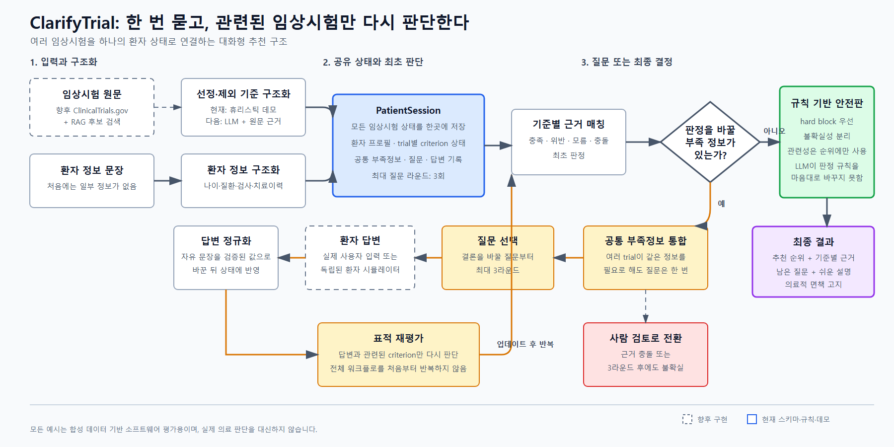

# ClarifyTrial Agent v1.2-final — Skeleton

A minimal, self-verifying Python skeleton for **ClarifyTrial Agent**, a
shared-state multi-agent system for **Interactive Clinical Trial
Recommendation**. This repository contains the locked v1.2-final data
schemas, pure rule functions, typed agent contracts with deterministic
fallbacks, docs, a synthetic demo session,
and a pytest validation harness.

> All examples are synthetic/mock. No real patient data, credentials, or
> private institutional information. This is a software skeleton and
> validation harness — **not medical advice**.

## 한눈에 보기



ClarifyTrial의 핵심은 에이전트 수가 아닙니다. 여러 임상시험의 판단을
`PatientSession` 하나에 연결하고, 같은 부족 정보를 묻는 질문은 한 번으로
합치며, 답변이 들어오면 관련된 기준만 다시 판단하는 구조입니다.

ClarifyTrial의 핵심 구현 원칙은 다음 네 가지입니다.

1. 환자·trial·criterion 변화를 `PatientSession` 공유 상태로 추적합니다.
2. trial마다 질문하지 않고 공통 부족 정보를 전역 질문 큐에서 통합합니다.
3. 답변 뒤 전체 판단을 다시 만들지 않고 영향받은 criterion만 재평가합니다.
4. LLM은 추출·매칭·설명을 돕고, 제외·불확실·순위 규칙은 Python 코드가 고정합니다.

현재 저장소에는 스키마, 결정 규칙, 휴리스틱 데모, 합성 데이터와 102개
테스트가 구현돼 있습니다. 실제 ClinicalTrials.gov 수집/RAG, Solar 호출,
LangGraph 실행·중단·재개, 독립 환자 답변 시뮬레이터는 다음 구현 단계입니다.
쉽게 읽는 전체 설명과 구현 순서는
[`docs/project-overview-ko.md`](docs/project-overview-ko.md)에 정리돼 있습니다.
검증한 공개 데이터의 역할·라벨 범위·이용조건은
[`DATA_SOURCES.md`](DATA_SOURCES.md)에 기록돼 있습니다.

## Architecture summary

- The **Eligibility State Tracker** owns the central shared state:
  `PatientSession`, which is **session-level and keyed by `patient_id`**.
- Multiple trials are stored under **`trial_states_by_trial_id`**; each
  trial has its own `trial_context` and `criterion_states`.
- Missing variables are **deduplicated globally by `missing_variable_key`**
  in `global_missing_variable_pool`.
- Clarification questions live in one **global clarification queue**, never
  per trial. `clarification_round_count` is session-level, **max 3**.
- **`trial_relevance_score` affects ranking only, never hard eligibility.**
- Free-text clarification answers are **normalized by the Patient Profile
  Understanding Agent before any rule update**.
- Trial descriptions support context/relevance but **must not create new
  blocking eligibility criteria** unless explicitly stated in the protocol.
- Eligibility effects and recommendations are decided by **pure rules**
  (`rules.py`), never directly by LLM agents:
  - effect mapping (inclusion/exclusion × met/unmet/unknown/conflict/
    not_applicable), and
  - recommendation precedence, applied exactly in order:
    1. any `blocks_eligibility` → `likely_ineligible`
    2. else any `review_required` → `needs_human_review`
    3. else uncertainty ratio above threshold → `uncertain`
    4. else → `likely_eligible`

See `docs/architecture.md` (Mermaid flowchart) and
`docs/state_transition.md` (Mermaid state diagram) for details.

Presentation & proposal materials:

- `DATA_SOURCES.md` — verified public data, label boundaries, terms and provenance
- `docs/project_status_report.md` — current status, test coverage, what
  is and is not proven, safest next steps
- `docs/proposal_brief.md` — proposal-ready project description
- `docs/demo_script.md` — 60-second and 3-minute presentation scripts
- `docs/evidence_table.md` — claims mapped to repo evidence

## File structure

```
clarify_trial_agent/
├── README.md                  # this file
├── DATA_SOURCES.md            # verified external data and service terms
├── requirements.txt           # pydantic>=2.0, pytest>=8.0
├── conftest.py                # sys.path setup so tests import the project
├── models.py                  # Pydantic v2 schemas (locked v1.2-final)
├── rules.py                   # pure rule functions (no side effects)
├── agents/                    # 10 agent contracts; several deterministic demos, no real LLM calls
│   ├── criteria_parser.py
│   ├── patient_profile_understanding.py   # also normalizes free-text answers
│   ├── eligibility_state_tracker.py       # central shared state owner
│   ├── evidence_context_builder.py
│   ├── criterion_matching.py
│   ├── missing_information_detection.py   # global dedup by missing_variable_key
│   ├── clarification_question.py          # global clarification queue
│   ├── answer_update_reevaluation.py      # targeted re-evaluation
│   ├── trial_recommendation.py
│   └── result_explanation.py
├── examples/
│   ├── demo_patient_session.json          # synthetic session, model-valid
│   ├── synthetic_patients.json            # 10 professor-style case summaries (inputs only)
│   ├── synthetic_trial_protocols.json     # 3 mock TrialProtocol records
│   └── synthetic_matching_scenarios.json  # 6 labeled rule-validation scenarios
├── scripts/                  # deterministic stage demos + dataset validation
├── docs/
│   ├── project-overview-ko.md # easy workflow and implementation direction
│   ├── assets/                # workflow image and editable SVG
│   ├── architecture.md
│   └── state_transition.md
└── tests/                    # 14 files, 102 tests
```

## Mapping to locked v1.2-final invariants

| Invariant | Where it lives |
|---|---|
| Central shared state, session-level, keyed by patient_id | `models.PatientSession`, `agents/eligibility_state_tracker.py` |
| Multiple trials under `trial_states_by_trial_id` | `models.PatientSession.trial_states_by_trial_id` |
| Per-trial `trial_context` + `criterion_states` | `models.TrialState` |
| Global dedup by `missing_variable_key` | `rules.deduplicate_missing_variables`, `models.GlobalMissingVariablePoolItem` |
| Global clarification queue (not per trial) | `models.PatientSession.global_clarification_queue` |
| `clarification_round_count` max 3, session-level | `models.PatientSession` (`le=3`), `models.MAX_CLARIFICATION_ROUNDS` |
| Relevance score affects ranking only | `rules.compute_trial_recommendation` / `rules.rank_trials` |
| Answers normalized before rule update | `agents/patient_profile_understanding.py` |
| Trial description never adds blocking criteria | `models.TrialContext` docstring, `agents/evidence_context_builder.py` |
| Effect mappings & recommendation precedence | `rules.derive_eligibility_effect`, `rules.compute_trial_recommendation` |

## Intentionally not implemented yet

- **Real LLM calls** — deterministic heuristics exercise several contracts,
  but no agent currently calls an LLM provider.
- **External API calls** — nothing in this skeleton touches the network.
- **ClinicalTrials.gov adapter** — `models.TrialProtocol` is
  source-agnostic but already carries the fields needed for a planned
  future **ClinicalTrials.gov API v2 ingestion adapter** (`nct_id`,
  `eligibility_criteria_raw`, `conditions`, `interventions`, `source`,
  `source_url`, `retrieved_at`). No API response paths are assumed.
- Orchestration/runtime loop, persistence, and any UI/web app.

## Synthetic data validation harness

Three synthetic datasets live in `examples/` (see
`docs/synthetic_data_strategy.md` for the rationale):

- `synthetic_patients.json` — 10 professor-style synthetic patient case
  summaries (`{"topics": [{"num": "S001", "title": "..."}]}`). These are
  natural-language patient **inputs only**, validating the input contract
  of the Patient Profile Understanding Agent
  (`extract_patient_profile_from_summary`). They are **not** eligibility
  ground truth.
- `synthetic_trial_protocols.json` — 3 mock, source-agnostic
  `TrialProtocol` records with inclusion/exclusion criteria text and
  static source metadata (no live API calls).
- `synthetic_matching_scenarios.json` — 6 labeled scenarios covering all
  four recommendation labels, with expected missing variables and blocking
  criteria. These validate the locked rule semantics, not clinical truth.
- `professor_patient_summaries.json` — a professor-provided, read-only
  input robustness dataset (10 case summaries, same shape as
  `synthetic_patients.json` but kept separate). Input examples only —
  never eligibility or recommendation ground truth. See
  `docs/professor_patient_input_notes.md`.

**What the harness proves:** the datasets conform to the Pydantic
schemas, the deterministic extraction contract is callable with every
summary, the scenario labels use the locked `Recommendation` enum with
full label coverage, and the protocols carry the fields a future
ingestion adapter needs — all offline and fully synthetic.

**What it does NOT prove:** any clinical correctness, production extraction
quality, real trial matching accuracy,
or anything about real ClinicalTrials.gov data. It is a schema/contract
harness, not clinical decision support.

## How to run tests

From the `clarify_trial_agent/` directory:

Python 3.10 or newer is required.

```bash
pip install -r requirements.txt
pytest
```

The current repository passes 102 tests on Python 3.13.

All tests verify the locked rule mappings, recommendation precedence,
global missing-variable deduplication, that
`examples/demo_patient_session.json` validates against the
`PatientSession` model, and that the three synthetic datasets load and
satisfy their contracts.

## How to run the end-to-end dry-run demo

Deterministic pipeline walkthrough on synthetic data — no LLM calls, no
API keys, no network (see `docs/end_to_end_demo_notes.md`):

```bash
python scripts/run_end_to_end_demo.py
```

It prints a stage-by-stage console walkthrough and writes
`outputs/end_to_end_demo_summary.md`.

## How to run the patient profile extraction demo

Deterministic offline extraction (regex/keyword fallback of the Patient
Profile Understanding Agent — no LLM, no API keys; see
`docs/patient_profile_extraction_notes.md`):

```bash
python scripts/run_patient_profile_extraction_demo.py
```

It extracts structured, Pydantic-validated `PatientProfile`s from
synthetic summaries (age, sex, obvious diagnosis/stage; unknowns kept
explicit) and writes `outputs/patient_profile_extraction_demo.md`. The
LLM version will use `prompts/patient_profile_extraction.md`.

## How to run the criteria parser demo

Deterministic offline parsing (Criteria Parser Agent fallback — no LLM,
no API keys; see `docs/criteria_parser_notes.md`):

```bash
python scripts/run_criteria_parser_demo.py
```

It renders the mock protocols as raw trial text, parses them into typed
`Criterion` objects with stable ids and canonical `required_variables`
(inclusion/exclusion preserved; description never becomes a criterion),
and writes `outputs/criteria_parser_demo.md`. The LLM version will use
`prompts/criteria_parsing.md`.

## How to run the criterion matching demo

Deterministic offline matching (Criterion Matching Agent fallback — no
LLM, no API keys; see `docs/criterion_matching_notes.md`):

```bash
python scripts/run_criterion_matching_demo.py
```

It chains the implemented fallbacks end to end — profile extraction →
criteria parsing → per-criterion matching → effect derivation via the
locked rules → global missing-variable dedup — and writes
`outputs/criterion_matching_demo.md`. Missing information becomes
`unknown` with a `missing_variable_key`, never negative evidence. The
LLM version will use `prompts/criterion_matching.md`.

## How to run the missing-info + clarification queue demo

Deterministic offline run (Missing Information Detection + Clarification
Question Agent — no LLM, no API keys; see
`docs/missing_info_clarification_notes.md`):

```bash
python scripts/run_missing_info_clarification_demo.py
```

It chains profile extraction → parsing → matching, then pools unknown
criteria into the session-level missing-variable pool (deduplicated by
`missing_variable_key`, traceable, prioritized) and generates ONE global
clarification question per variable (round-capped at 3), writing
`outputs/missing_info_clarification_demo.md`. The LLM version will use
`prompts/clarification_question.md`.

## How to run the synthetic data validator

From the `clarify_trial_agent/` directory (any cwd works — the script
resolves paths from its own location):

```bash
python scripts/validate_synthetic_data.py
```

It prints validation counts and writes
`outputs/synthetic_data_validation_summary.md` (the `outputs/` directory
is created at runtime and is git-ignored).
