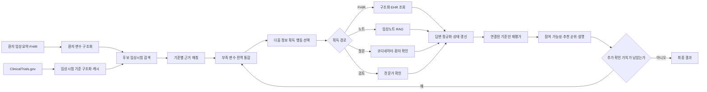

# ClarifyTrial

**임상시험 코디네이터와 임상의를 위한 대화형 임상시험 매칭·추천 멀티에이전트 시스템**


지원서에 옮겨 쓸 문안은 [APPLICATION_KO.md](APPLICATION_KO.md)에 정리되어 있다.
이 문서는 ClarifyTrial이 어떤 문제를 풀고, 어떤 데이터와 알고리즘으로 구현하며,
어떻게 성능을 검증할지를 한곳에 모은 프로젝트 통합 설명서다.

## 1. 해결하려는 문제

기존 임상시험 매칭 시스템은 대체로 이미 주어진 환자 기록과 임상시험 기준을
한 번 비교한다. 그러나 실제 선별 과정에서는 병기, 바이오마커, 최근 검사값,
치료 시점처럼 판정에 필요한 정보가 기록에 빠져 있는 경우가 많다. 정보가 없다는
이유만으로 탈락시키면 안 되고, 모든 부족정보를 한꺼번에 확인하면 코디네이터의
업무가 불필요하게 늘어난다.

ClarifyTrial은 다음 질문을 푼다.

> 지금 가진 정보로 기준별 판단을 먼저 수행한 뒤, 여러 후보 임상시험의 상태를
> 바꿀 수 있는 부족정보를 선택해 확인하면, fixed-order보다 적은 정보 획득
> 행동으로 full-information 기준 상태에 더 빨리 도달할 수 있는가?

시스템은 환자 정보를 임상시험과 직접 비교하는 데서 끝나지 않는다. 부족정보를
찾고, 같은 정보를 요구하는 여러 임상시험 기준을 하나로 묶고, EHR 조회·임상노트
검색·직접 질문 중 알맞은 경로를 선택한다. 새 정보가 들어오면 그 정보와 연결된
기준만 다시 평가하고 추천을 갱신한다.

## 2. 사용자가 받는 최종 결과

최종 화면과 결과 JSON에는 다음 항목이 함께 있어야 한다.

| 결과 | 사용자 표시 | 내부 상태 |
|---|---|---|
| 임상시험 참여 가능성 | 제출용 `eligible`, `ineligible`, `uncertain` | `likely_eligible`, `likely_ineligible`, `uncertain`, `needs_human_review`를 별도 `screening_status`로 유지 |
| 기준별 판단 | `satisfied`, `violated`, `unknown`, `not_applicable` | 기준의 참·거짓인 `criterion_truth`와 참여에 미치는 `eligibility_effect`를 분리 |
| 판단 근거 | 환자 기록 문장과 사용한 변수 | `EvidenceContext`와 `SourceSentence` |
| 부족정보 | 빠진 변수, 영향을 받는 기준과 임상시험 | 전역 missing-variable pool |
| 확인 질문 | 질문, 기대 답변 형식, 답변 | global clarification queue와 answer history |
| 추천 | 환자별 임상시험 순위와 설명 | eligibility block을 우선한 ranking |
| 고지 | 의료적 면책 고지 | 모든 최종 출력에 고정 포함 |

예상 출력 구조는 다음과 같다. 문장 표현이 아니라 ID, 상태, 근거 연결이 채점의
핵심이다.

```json
{
  "patient_id": "SYN-001",
  "recommendations": [
    {
      "trial_id": "NCT00000000",
      "rank": 1,
      "submission_label": "uncertain",
      "screening_status": "uncertain",
      "review_required": false,
      "criterion_judgments": [
        {
          "criterion_id": "NCT00000000-INC-03",
          "criterion_type": "inclusion",
          "status": "unknown",
          "criterion_truth": "unknown",
          "eligibility_effect": "uncertain",
          "evidence_sentence_ids": [],
          "missing_variable_keys": ["ecog_performance_status"],
          "reason": "최근 ECOG 수행능력 정보가 기록에 없음"
        }
      ],
      "explanation": "질환과 치료 단계는 연구 대상과 일치하지만 ECOG 확인이 필요함"
    }
  ],
  "follow_up_questions": [
    {
      "question_id": "Q-001",
      "missing_variable_key": "ecog_performance_status",
      "question": "현재 일상생활 수행능력에 가장 가까운 ECOG 점수는 0~4 중 몇 점입니까?",
      "affected_trial_ids": ["NCT00000000", "NCT00000001"]
    }
  ],
  "medical_disclaimer": "연구 및 사전검토용 결과이며 최종 적격성 판단을 대체하지 않습니다."
}
```

`satisfied`가 항상 참여에 유리한 것은 아니다. 예를 들어 “중증 신부전이 있으면
제외”라는 exclusion criterion이 `satisfied`이면 제외 조건에 해당하므로
`eligibility_effect=blocks_eligibility`다. 따라서 최종 JSON과 화면에는
`criterion_type`, `status`, `eligibility_effect`를 항상 함께 표시한다.
`needs_human_review`는 제출용으로는 `uncertain`에 포함하되 `review_required`와
사유를 삭제하지 않는다.

## 3. 전체 처리 흐름




LLM은 자유문장을 구조화하거나 근거를 설명하는 역할을 맡는다. 상태 갱신,
ID 검증, 부족 변수 중복 제거, 재평가 대상 선택, inclusion/exclusion 효과 변환과
최종 판정 우선순위는 Python controller가 담당한다. 따라서 여러 에이전트가 서로
다른 결론을 말하더라도 하나의 `PatientSession`만 최종 상태가 된다.

## 4. 공유 상태와 핵심 데이터 구조

현재 저장소의 중심 객체는 [models.py](models.py)의 `PatientSession`이다.

| 객체 | 저장 내용 | 상태를 바꾸는 단계 |
|---|---|---|
| `PatientProfile` | 연령, 성별, 질환, 약물, 정규화 변수, 원문 | 환자 이해, 답변 정규화 |
| `TrialProtocol` | NCT ID, 제목, 질환, 중재, 원문 criteria, 출처 | ClinicalTrials.gov adapter |
| `Criterion` | 기준 ID, inclusion/exclusion 구분, 원문, 필요한 변수 | criteria parser |
| `CriterionState` | met/unmet/unknown/conflict, 효과, 근거, 부족 변수 | criterion matcher |
| `GlobalMissingVariablePoolItem` | 동일 부족 변수와 연결된 모든 기준·임상시험 | missing-information controller |
| `FollowUpQuestion` | 질문, 답변 형식, 대상 변수와 기준 | question agent |
| `AnswerUpdate` | 원답, 정규화 값, 갱신 기준, 회차 | answer update agent |
| `TrialRecommendation` | 참여 가능성, 차단 기준, 불확실 기준, 점수와 순위 | recommendation agent |

목표 구현에서는 각 환자 변수에 값만 저장하지 않고 다음 메타데이터를 함께 둔다.

```text
variable_key, value, unit, observed_at, source_type,
source_ref, evidence_sentence_ids, negated, confidence
```

예를 들어 `creatinine=1.4`만 저장하면 단위와 검사 시점을 잃는다. 대신
`value=1.4`, `unit=mg/dL`, `observed_at=2026-07-01`,
`source_type=FHIR.Observation`을 보존해야 “최근 14일 이내 검사” 같은 기준을
판단할 수 있다.

## 5. 단계별 구체적 구현 방법

### 5.1 환자 정보 이해

**입력**은 합성 환자 임상요약, clinical note 또는 Synthea FHIR Bundle이다.

1. 문장을 sentence ID 단위로 나눈다.
2. 연령, 성별, 진단, 병기, 바이오마커, ECOG, 치료 이력, 동반질환, 검사값,
   지역을 표준 변수로 추출한다.
3. 부정 표현과 시간 표현을 값에서 분리한다. “3개월 전 pembrolizumab 중단”은
   치료명, 상태, 종료 시점으로 나눈다.
4. 검사값은 원 단위와 표준 단위를 함께 저장한다.
5. 모든 변수에 원문 sentence ID를 붙인다.
6. 명시되지 않은 값은 음성으로 추정하지 않고 `unknown`으로 남긴다.

FHIR 입력을 사용하는 경우의 초기 매핑은 다음과 같다.

| 환자 변수 | FHIR resource | 선택 규칙 |
|---|---|---|
| 연령·성별 | `Patient` | birthDate와 기준일로 연령 계산 |
| 진단·병기 | `Condition`, 관련 `Observation` | active 또는 최근 상태 우선 |
| 약물·치료 | `MedicationRequest`, `Procedure` | 상태와 기간 보존 |
| 검사값·바이오마커 | `Observation`, `DiagnosticReport` | 코드, 값, 단위, 검사일 보존 |
| 수행능력 | `Observation` 또는 note | 구조화 값이 없으면 note 검색으로 이동 |

**출력 검증**은 필드 타입, 허용 단위, source reference 존재 여부를 확인한다.
LLM 출력이 실패하면 명확한 연령·수치·키워드만 현재의 결정론적 parser로 추출하고
나머지는 unknown으로 유지한다.

### 5.2 ClinicalTrials.gov 수집과 criteria 캐시

[ClinicalTrials.gov API v2](https://clinicaltrials.gov/data-api/about-api)의
`/api/v2/studies`와 `/api/v2/studies/{nctId}`를 사용한다. 검색 시 모집 상태,
질환, 국가·지역, 연령과 성별처럼 API에서 직접 필터링 가능한 필드를 먼저 적용한다.
원문 eligibility criteria는
`protocolSection.eligibilityModule.eligibilityCriteria`에서 읽는다.

수집 결과에는 다음 정보를 남긴다.

```text
nct_id, source_url, api_data_timestamp, study_last_update,
query_parameters, retrieved_at, response_sha256
```

criteria parsing은 매 환자마다 다시 하지 않는다. raw response는 query,
`retrieved_at`과 `response_sha256`으로 freeze하고, parser cache 키는
`nct_id + study_last_update + response_sha256 + parser_version`으로 만든다.
임상시험 원문이나 parser가 바뀐 경우에만 새로 구조화한다. 실행 manifest에는
ClinicalTrials.gov 처리일, 사용 field와 정규화·필터링 변형을 함께 기록한다.

### 5.3 선정·제외 기준 구조화

원문 기준을 먼저 inclusion과 exclusion 구역으로 분리하고, 목록 번호와 원래
순서를 보존한다. 한 bullet을 무조건 criterion 하나로 보거나 마침표마다 자르지
않는다. `A and (B or C)`, 예외 조건, 수치 범위와 시간 창은 Boolean AST로
보존해야 하기 때문이다. 원문 bullet은 `source_item_id`로 유지하고, 실제 판정
단위는 AST의 leaf atom으로 둔다.

각 criterion은 다음 필드를 갖는다.

```json
{
  "criterion_id": "NCT00000000-INC-03",
  "source_item_id": "NCT00000000-INC-BULLET-03",
  "criterion_type": "inclusion",
  "source_text": "ECOG performance status of 0 or 1",
  "source_span": {"start": 184, "end": 218},
  "logic_ast": {
    "op": "atom",
    "atom_id": "NCT00000000-INC-03-A01",
    "variable_key": "ecog_performance_status",
    "normalized_predicate": "ecog_performance_status in [0, 1]",
    "operator": "in",
    "target_value": [0, 1],
    "temporal_constraint": {"anchor": "screening", "window": "current"}
  },
  "source_order": 3
}
```

AST leaf의 predicate는 inclusion이면 “충족해야 하는 조건”, exclusion이면 “해당하면
차단되는 조건”으로 정규화한다. 예를 들어 exclusion 원문이 부정문으로 쓰였으면
부정 범위를 해석해 disqualifying predicate로 canonicalize하되 원문과 span은 그대로
보존한다. 그래야 `exclusion + met = blocks` 규칙이 문장 표현과 무관하게 일관된다.

LLM parser에는 전체 trial 설명을 판단 근거로 주지 않고 criteria 원문과 필요한
메타데이터만 제공한다. 출력 후에는 source item별 span coverage, AST leaf ID 중복,
inclusion/exclusion 구분, 괄호 구조, 숫자·단위·시간 창 보존 여부를 검사한다.
원문 bullet 하나가 여러 atom으로 나뉠 수 있으므로 원문 목록 수와 atom 수의
일치 여부는 검증 조건으로 쓰지 않는다. 실패한 source item만 재요청하고 전체
trial을 다시 호출하지 않는다.

### 5.4 후보 임상시험 검색

검색은 “관련 임상시험을 넓게 찾는 단계”와 “적격성을 엄격하게 판정하는 단계”를
분리한다.

1. 환자 프로파일에서 질환명, 하위 유형, 병기, 핵심 바이오마커, 치료 이력,
   지역 query를 만든다.
2. 모집 상태와 명백한 구조화 조건으로 1차 필터링한다.
3. trial title, condition, summary, intervention, eligibility criteria를 BM25로
   검색한다.
4. 같은 필드를 dense embedding으로 검색한다.
5. 두 순위를 Reciprocal Rank Fusion으로 합친다.

```text
RRF(trial) = sum(1 / (60 + rank_in_retriever))
```

6. 환자 질환과 무관한 trial을 relevance re-ranker로 제거한다.
7. 남은 후보에만 criterion matching을 수행한다.

정확한 후보 수는 미리 고정하지 않는다. 후보 수를 늘리면서 TREC의 eligible
trial Recall과 patient당 matching 비용을 함께 그려, 관련 trial을 충분히 포함한
뒤 추가 이득이 작아지는 범위를 선택한다. retrieval 단계의 관련성 점수는 추천
순위에는 사용할 수 있지만 명시적 exclusion 위반을 뒤집을 수 없다.

### 5.5 criterion-level 근거 매칭

한 patient-trial 쌍에서 inclusion criteria와 exclusion criteria를 구분해 평가한다.
각 criterion에 대해 다음 순서를 강제한다.

1. criterion AST leaf가 요구하는 변수를 확인한다.
2. PatientProfile과 note RAG에서 연결된 근거 문장을 찾는다.
3. 수치, 단위, 시간 창, 부정 여부를 비교한다.
4. leaf마다 `met`, `unmet`, `unknown`, `not_applicable`, 필요 시 `conflict`를 낸다.
5. Boolean AST를 로컬 three-valued logic으로 집계해 criterion truth를 만든다.
6. 근거 sentence ID, 사용 변수, leaf별 이유와 집계 이유를 함께 낸다.

```text
ALL: 하나라도 unmet이면 unmet; unmet 없이 unknown/conflict가 있으면 unknown;
     나머지 적용 leaf가 모두 met이면 met
ANY: 하나라도 met이면 met; met 없이 unknown/conflict가 있으면 unknown;
     적용 leaf가 모두 unmet이면 unmet
NOT: met과 unmet을 뒤집고 unknown/conflict는 유지
```

`not_applicable` leaf는 해당 분기 집계에서 제외하되 모든 leaf가 not applicable이면
criterion 전체도 `not_applicable`이다. conflict 원문은 review flag에 별도 보존한다.

판정 규칙은 다음과 같다.

| 상황 | criterion status |
|---|---|
| 요구 조건을 근거가 충족 | `met` |
| 근거가 요구 조건과 명시적으로 불일치 | `unmet` |
| 필요한 값이 없거나 시점·단위가 불충분 | `unknown` |
| 해당 환자에게 적용할 수 없는 분기 | `not_applicable` |
| 서로 양립하지 않는 두 근거가 존재 | `conflict` |

LLM이 eligibility effect까지 정하지는 않는다. [rules.py](rules.py)가 criterion
유형과 status를 다음과 같이 변환한다.

| criterion | status | eligibility effect |
|---|---|---|
| inclusion | met | supports eligibility |
| inclusion | unmet | blocks eligibility |
| exclusion | met | blocks eligibility |
| exclusion | unmet | supports eligibility |
| 둘 다 | unknown/conflict | uncertain |
| 둘 다 | not_applicable | neutral |

제출용 `satisfied`/`violated`는 criterion 문장의 참·거짓을 나타낸다. 참여에 유리한지
여부는 별도 effect로 표시한다.

| criterion type + truth | 제출 status | eligibility effect | 화면 표현 |
|---|---|---|---|
| inclusion + met | `satisfied` | supports | 선정 기준 충족 |
| inclusion + unmet | `violated` | blocks | 선정 기준 미충족, 참여 차단 |
| exclusion + met | `satisfied` | blocks | 제외 기준 해당, 참여 차단 |
| exclusion + unmet | `violated` | supports | 제외 기준 비해당 |
| unknown | `unknown` | uncertain | 확인 필요 |
| not applicable | `not_applicable` | neutral | 적용되지 않음 |
| conflict | `unknown` | uncertain + review | 근거 상충, 전문가 검토 필요 |

### 5.6 부족정보 탐지와 여러 trial 간 중복 제거

`unknown` criterion마다 판단에 필요한 missing-variable identity를 추출한다.
같은 환자의 여러 임상시험이 의미적으로 같은 정보를 요구할 때만 질문을 하나로
합친다. 변수 이름이 같더라도 검사 시점, 검체, 단위 또는 대상이 다르면 별도
항목이다.

```text
ecog_performance_status
  -> NCT-A-INC-02
  -> NCT-B-INC-04
  -> NCT-C-EXC-01
```

각 항목에는 연결된 criterion ID, trial ID, 기대 타입, 단위, 시간 창, 가능한
정보 획득 경로를 기록한다. 이 dependency index가 답변 뒤 재평가 범위를 정한다.

```text
semantic_missing_key =
  patient_or_subject + concept + value_type + canonical_unit
  + specimen_or_body_site + temporal_anchor + temporal_window
```

예를 들어 “현재 ECOG”와 “치료 시작 전 ECOG”는 같은 concept라도 서로 합치지
않는다. 반대로 표현이 `performance status`, `ECOG PS`, `ECOG score`로 달라도
나머지 identity가 같으면 하나로 통합한다.

### 5.7 Next-Best-Action 선택

질문 수에 고정 상한은 두지 않는다. 대신 매 단계에서 어떤 정보를 먼저 얻을지
계산한다. 연속 수치를 임의로 전 구간에 균등 분포시켜 “기대효용”을 만들지 않는다.
criterion threshold를 이용해 판정이 같은 구간인 decision-equivalence class를 먼저
만든다. 예를 들어 eGFR 기준이 30과 60에서만 바뀌면 `<30`, `30~60`, `>60`의
대표값만 대입한다.

MVP의 주 정책은 아래 tuple을 순서대로 비교하는 결정론적 사전식 정렬이다.

```text
priority_key(v) = (
  flip_capable_trial_count(v),
  affected_trial_count(v),
  affected_decision_critical_criterion_count(v),
  -minimum_feasible_route_cost_tier(v),
  stable_variable_key(v)
)
```

- `flip_capable_trial_count`: 가능한 값에 따라 trial 상태가 바뀔 수 있는 trial 수
- `affected_trial_count`: 이 변수를 요구하는 서로 다른 trial 수
- `affected_decision_critical_criterion_count`: 답에 따라 차단 여부가 달라지는 기준 수
- `minimum_feasible_route_cost_tier`: 구조화 조회, note 검색, 직접 질문 순의 비용 등급
- `stable_variable_key`: 앞 항목이 같을 때 실행을 재현하기 위한 고정 tie-breaker

각 값은 LLM의 중요도 문장이 아니라 typed criterion에 대표값을 임시 적용하고
로컬 rule로 criterion과 trial 상태를 다시 계산해 얻는다. 아직 조회하지 않은
FHIR/note의 실제 값 존재 여부는 우선순위 계산에 사용하지 않고, controller가 이미
볼 수 있는 source metadata와 route mapping만 사용한다.

가중 점수는 주 정책이 아니라 민감도 비교용 보조 정책으로 둔다.

```text
heuristic_priority_score(v) =
  (0.30*C + 0.30*F + 0.20*R + 0.20*A) / (1 + 0.50*B)
```

여기서 `C`는 coverage, `F`는 flip 가능성, `R`은 순위 민감도, `A`는 관찰 가능한
metadata 기반 획득 가능성, `B`는 사전 정의된 route cost tier다. 이 값은 보정된
확률적 expected utility가 아니다. 정규화 범위와 가중치는 development 자료에서
고정하고, fixed-order·coverage-only·flip-only 정책과 별도로 비교한다.

### 5.8 정보 획득 경로와 질문 생성

core experiment에서는 변수 선택 정책과 route 최적화를 섞지 않는다. 다음 변수
하나를 고른 뒤 관찰 가능한 source metadata에 따른 availability-first cascade를
고정해서 사용한다.

1. FHIR mapping이 있고 최신 구조화 값이 있으면 해당 resource를 조회한다.
2. 구조화 값이 없지만 clinical note에 기록될 가능성이 있으면 환자 note index를
   sentence 단위로 검색한다.
3. 두 경로에서 찾지 못하면 코디네이터 또는 환자에게 직접 질문한다.
4. 답변이 서로 충돌하거나 전문 해석이 필요한 경우 전문가 확인 상태로 보낸다.

이 단계는 “여러 route 중 최적 route를 학습한다”는 주장이 아니라 재현 가능한
획득 절차다. route 자체를 비교하려면 동일 환자 사실을 FHIR-only, note-only,
direct-answer-only, 복수 출처 일치·충돌, 획득 불가 상태로 각각 배치한 별도
`SyntheticRouteCase`에서 평가한다. Synthea FHIR 시연 결과는 TrialGPT 기반
interaction 점수와 합산하지 않는다.

질문 생성 agent에는 자유롭게 질문을 만들라고만 하지 않는다. 다음 정보를 준다.

```text
missing_variable_key
plain-language definition
expected answer type and allowed values
required unit and time window
affected criteria and trials
already asked questions
```

core benchmark의 질문 한 번은 missing variable 하나와 intent 하나만 요구한다.
필요한 단위와 기준 시점을 포함하며, 이미 답한 내용을 다시 묻지 않아야 한다.
여러 변수를 묶은 질문은 행동 수의 의미를 바꾸므로 별도 UX 실험에서만 다룬다.
표현 품질은 LLM이 담당하지만 어떤 변수를 묻는지는 controller가 결정한다.

### 5.9 답변 정규화와 표적 재평가

답변은 바로 판정에 넣지 않는다. Answer Normalizer가 원답을
`value + unit + observed_at + source`로 변환하고 schema validator가 검사한다.
“모름” 또는 해석할 수 없는 답은 값을 바꾸지 않고 unresolved로 남긴다. 기존 값과
충돌하면 덮어쓰지 않고 conflict를 기록한다.

정상 답변이 들어오면 다음 순서로 갱신한다.

1. `PatientProfile`의 해당 변수 하나를 갱신한다.
2. global missing-variable pool 항목을 resolved로 바꾼다.
3. 관련 질문을 answered로 바꾼다.
4. dependency index에서 연결된 criterion ID만 가져온다.
5. 해당 criterion만 matcher에 다시 보낸다.
6. 변경된 trial의 추천과 전체 순위를 다시 계산한다.
7. 질문 전 상태, 답변, 질문 후 상태를 interaction history에 남긴다.

이 방식은 답변 하나 때문에 모든 trial과 모든 criterion을 다시 호출하는 것을
막는다. 비교 실험에서는 동일 답변을 넣고 전체 재평가와 표적 재평가의 결과가
같은지 확인한다.

### 5.10 참여 가능성, 추천 순위와 설명

정식 실험과 최종 출력은 다음의 엄격한 우선순위를 사용한다.

1. 한 개라도 `blocks_eligibility`이면 `likely_ineligible`이다.
2. 차단 기준은 없지만 conflict 등 검토 표시가 있으면 `needs_human_review`다.
3. 차단은 없지만 decision-critical criterion 중 하나라도 `unknown`이면
   `uncertain`이다.
4. 적용 가능한 모든 inclusion이 `met`이고 모든 exclusion이 `unmet`일 때만
   `likely_eligible`이다.

`decision-critical`은 가능한 유효 답 중 하나가 해당 criterion을 blocking effect로
바꿀 수 있다는 뜻이다. 따라서 필수 바이오마커 하나가 unknown인데 다른 기준이
많이 충족됐다는 이유로 eligible이 되지 않는다. 현재 [rules.py](rules.py)의
`0.4` unknown 비율은 기존 offline skeleton의 동작을 재현하기 위한 값이며,
공개 benchmark runner에서는 위 엄격 규칙으로 교체한다.

trial category를 먼저 정한 뒤 같은 category 안에서만 관련성과 불확실성을 사용해
순위를 정한다.

```text
uncertainty_ratio = uncertain_criteria / non_neutral_criteria
within_tier_score = trial_relevance_score * (1 - uncertainty_ratio / 2)

category_order =
  likely_eligible
  > unresolved_tier(uncertain or needs_human_review)
  > likely_ineligible
```

uncertainty ratio는 순위와 검토 우선순위에는 사용할 수 있지만 trial-level
eligibility class를 결정하지 않는다. Explanation Agent는 구조화 상태를 자연어로
설명할 뿐 판정을 다시 내리지 않는다. 설명에는 지원 기준, 차단 기준, 남은
unknown, 확인한 답변과 추천 순위 이유를 포함한다.

### 5.11 반복 종료 조건

기본 controller에는 고정 질문 횟수 제한이 없다. 다음 중 하나가 성립할 때 종료한다.

- 해결 가능한 missing variable이 더 없음
- 남은 변수 중 어느 것도 trial 상태를 바꿀 수 없고 route cost만 추가됨
- 보조 `heuristic_priority_score`를 쓰는 실험에서는 development에서 고정한 종료
  임계값 이하임
- 추천 목록과 trial-level 판정이 연속 정보 획득 뒤 변하지 않고, 판정을 바꿀 수
  있는 변수가 남지 않음
- 사용자가 더 이상 정보를 제공할 수 없다고 명시함

실험에서는 각 행동 이후의 성능과 누적 비용을 모두 저장해 질문 횟수별 곡선을
그린다. 이 곡선에서 추가 질문의 이득이 작아지는 구간을 찾는 것이 연구 대상이며,
임의의 고정 횟수를 기본 전제로 삼지 않는다.

### 5.12 한 session의 구체적 예시

아래는 실제 환자가 아닌 합성 예시다. 초기 note에는 “58세 비소세포폐암,
이전 치료 이력 있음, 최근 eGFR 72 mL/min/1.73m2”만 있고 ECOG와 EGFR 결과는 없다.

| trial | criterion | 최초 truth | effect | 원인 |
|---|---|---|---|---|
| Trial A | 성인 비소세포폐암 | met | supports | note sentence 1 |
| Trial A | 현재 ECOG 0~1 | unknown | uncertain | ECOG 누락 |
| Trial A | eGFR 30 미만이면 제외 | unmet | supports | eGFR 72, 제외 기준 비해당 |
| Trial B | 성인 비소세포폐암 | met | supports | note sentence 1 |
| Trial B | 현재 ECOG 0~1 | unknown | uncertain | ECOG 누락 |
| Trial B | EGFR 변이 양성 | unknown | uncertain | EGFR 누락 |

global missing pool은 `ECOG|current`를 Trial A와 B의 두 criterion에 연결하고,
`EGFR_status|current`를 Trial B 하나에 연결한다. `priority_key`에서 ECOG는 두 trial의
상태를 바꿀 수 있으므로 먼저 선택된다. Question Generator는 다음 한 intent만 묻는다.

```text
현재 일상생활 수행능력에 가장 가까운 ECOG 점수는 0~4 중 몇 점입니까?
```

합성 답변이 “현재 ECOG 1”이면 Answer Normalizer는
`{value: 1, observed_at: current, source: direct_answer}`로 저장한다. dependency
index는 ECOG와 연결된 두 criterion만 matcher에 보내고 EGFR criterion은 호출하지
않는다. 갱신 결과는 다음과 같다.

| trial | 질문 전 | 바뀐 criterion | 질문 후 |
|---|---|---|---|
| Trial A | uncertain | ECOG unknown → met | likely_eligible |
| Trial B | uncertain | ECOG unknown → met | EGFR가 남아 uncertain |

Trial A의 exclusion criterion은 문장 자체가 거짓이므로 제출 status는 `violated`지만
effect는 `supports_eligibility`다. 이처럼 status만 보여주지 않고 criterion type과
effect를 함께 표시해야 한다. 다음 행동에서는 EGFR를 확인할 가치가 남아 있는지
다시 계산한다.

## 6. 에이전트와 프롬프트 구성

논리적 역할은 여섯 개이며, 실제 HTTP 요청 수는 batch와 cache 상태에 따라
달라진다.

| 역할 | LLM 입력 | 강제 출력 | 로컬 검증 |
|---|---|---|---|
| Criteria Parser | criteria 원문, NCT ID | source span이 있는 Boolean AST | span coverage, AST ID, 수치·단위·괄호 보존 |
| Patient Understanding | 환자 note/FHIR 요약 | normalized variables + evidence IDs | 타입, 단위, source 존재 |
| Criterion Matcher | trial criteria, patient evidence | 모든 criterion의 status·근거·missing key | ID exact-once, enum, evidence 참조 |
| Question Generator | 선택된 변수와 답변 schema | core 실험에서는 질문 한 개·intent 한 개 | 이미 물은 변수, 단위·시점, 중복 검사 |
| Answer Normalizer | 질문, 원답, 기존 값 | normalized value 또는 unresolved/conflict | schema, 범위, 기존 값 충돌 |
| Explanation Generator | 확정된 structured state | 사용자용 설명 | 상태를 바꾸지 않았는지 검사 |

모든 prompt는 다음 순서를 공통으로 사용한다.

1. 역할과 금지 사항
2. label 정의
3. 입력 데이터와 source ID
4. 판단 절차
5. JSON schema
6. 모든 입력 ID를 정확히 한 번 출력하라는 completeness rule
7. 근거가 없으면 unknown으로 남기라는 evidence rule

temperature는 재현 실험에서 0으로 두고, raw 응답과 parser 결과를 분리 저장한다.
JSON validation이 실패하면 누락 ID와 오류 경로만 포함해 한 번 repair 요청을 하고,
그래도 실패하면 해당 항목을 unknown으로 남겨 retry queue에 보낸다. enum과
eligibility effect는 LLM 텍스트를 믿지 않고 로컬 코드로 다시 계산한다.

## 7. RAG 구성

RAG는 두 개의 서로 다른 검색 문제로 나눈다.

### Trial RAG

- document unit: trial metadata와 criterion chunk
- index field: title, condition, intervention, summary, criterion text,
  recruitment status, location
- sparse retrieval: BM25
- dense retrieval: 의료 텍스트 embedding
- fusion: RRF
- reranking: patient profile과 criterion relevance
- cache: NCT ID, last update, parser version 기준

### Patient Evidence RAG

- document unit: 환자 note의 sentence 또는 FHIR resource
- query: criterion의 required variable, 동의어, 시간 창
- output: source ID가 붙은 근거만 matcher에 전달
- 원칙: 검색되지 않은 환자 사실을 외부 의학 지식으로 만들어내지 않음

trial description은 검색 관련성에만 사용한다. 환자를 탈락시키는 근거는 protocol에
명시된 criterion과 환자 source evidence에서만 나온다.

## 8. 데이터 구성과 정답셋 생성

| 평가 트랙 | 데이터 | 구체적 용도 | 정답 단위 |
|---|---|---|---|
| Trial 입력 | [ClinicalTrials.gov](https://clinicaltrials.gov/data-api/about-api) | 실제 trial과 criteria 입력·live demo | 정답이 아니라 timestamp가 고정된 시스템 입력 |
| Parser component | [Leaf Clinical Trials Corpus](https://www.nature.com/articles/s41597-022-01521-0) | criteria의 세부 concept·span·attribute 추출 평가 | annotated eligibility criterion |
| A. Static criterion | [TrialGPT Criterion Annotations](https://huggingface.co/datasets/ncbi/TrialGPT-Criterion-Annotations) | criterion status와 근거 sentence 평가 | patient-criterion pair |
| B. Interactive policy | TrialGPT에서 파생한 masked set | missing detection, 질문 순서, 답변 반영, 종료 평가 | patient interaction session |
| C. Static retrieval | [TREC Clinical Trials 2021](https://trec.nist.gov/data/trials2021.html)·[2022](https://trec.nist.gov/data/trials2022.html) | historical corpus의 후보 검색과 순위 | topic-trial qrel |
| D. Route | 동기화한 합성 FHIR·note·answer case | 획득 경로 cascade 시연과 별도 평가 | source availability case |

TrialGPT, TREC와 합성 route case는 환자·trial·annotation universe가 다르므로 하나의
임상 정답으로 합치지 않는다. TrialGPT는 criterion과 interaction, TREC는 historical
retrieval/ranking, Synthea는 FHIR 입력 생성에만 사용하고 결과표도 트랙별로
분리한다.

### 8.1 TrialGPT label 변환

| TrialGPT expert label | ClarifyTrial status |
|---|---|
| inclusion `included` | `met` |
| inclusion `not included` | `unmet` |
| exclusion `excluded` | `met` |
| exclusion `not excluded` | `unmet` |
| `not enough information` | `unknown` |
| `not applicable` | `not_applicable` |

TrialGPT에는 conflict 정답이 없으므로 conflict는 별도의 합성 사례로만 검사한다.
TREC qrel은 criterion 정답으로 재사용하지 않는다.

### 8.2 masked incomplete-information benchmark 생성

이 benchmark는 공개 데이터에 바로 존재하지 않으므로 TrialGPT의 환자 note,
expert criterion label과 expert evidence sentence를 이용해 만든다.

1. expert evidence가 있고 필요한 patient variable을 식별할 수 있는 annotation을
   고른다.
2. evidence sentence 전체에서 같은 사실을 표현하는 값, 단위, 시점 span을 모두
   찾고, 의미가 드러나는 key 대신 `egfr_value` 같은 중립 key를 만든다.
3. 같은 환자의 여러 patient-trial pair를 묶고, 질문 순서 평가용 session에는 서로
   다른 missing variable을 복수로 선택한다. 변수 하나만 가린 case는 answer update
   단위 테스트에만 사용한다.
4. 원본 note는 보존하고 평가용 note에서는 모든 동등 근거를 자연스럽게 삭제하거나
   문장을 다시 쓴다. `[MASK]`, `unknown`처럼 빠진 위치를 직접 알려주는 표시는 쓰지
   않는다.
5. 완전한 기록, 답을 얻을 수 없는 자연 unknown, 추가 행동이 필요 없는 negative
   session도 포함해 항상 질문하는 정책을 구분한다.
6. 독립 검토 절차로 full note의 원 label 복원, masked note의 unknown, 비대상
   criterion 불변을 확인한다.
7. `semantic_missing_key`, 원래 typed value, 기대 답변 schema, 연결 criterion을
   evaluator-only oracle에 저장한다.
8. 질문의 variable·unit·time-window intent가 oracle과 맞을 때만 답변을 반환한다.

한 사례에는 세 답변 분기를 만들 수 있다.

| 분기 | 답변 | 기대 결과 |
|---|---|---|
| 복원 | 원본 note에서 가린 실제 값 | 원래 expert label 복원 |
| 반대 조건 | criterion을 반대로 판정하게 하는 유효한 합성 값 | 연결 criterion과 trial 판정 변화 |
| 불명확 | “모름” 또는 질문 문맥으로도 해석할 수 없는 답 | unknown 유지 |

반대 조건 값은 criterion threshold의 decision-equivalence class에서 만든 뒤 환자의
다른 사실과 모순되지 않는지 검사한다. 이 branch는 expert gold가 아니라
`rule_derived_counterfactual_gold`로 표시한다. 모든 case는 다음 계약을 통과해야
한다.

```text
full note
  -> original expert criterion label

masked note
  -> unknown for every intentionally hidden target

masked note + restored typed answers
  -> original expert criterion labels

unrelated criterion states
  -> unchanged
```

정답 레코드는 다음 형태로 저장한다.

```json
{
  "source_annotation_id": 17,
  "patient_id": "P-01",
  "full_note": "...",
  "masked_note": "...",
  "masked_variables": [
    {
      "semantic_missing_key": "ecog_performance_status|current",
      "question_intent": {"variable": "ECOG", "time_window": "current", "unit": null},
      "hidden_typed_answer": {"value": 1, "unit": null},
      "affected_criterion_ids": ["NCT00000000-INC-03", "NCT00000001-INC-02"]
    },
    {
      "semantic_missing_key": "egfr_value|screening_14d",
      "question_intent": {"variable": "eGFR", "time_window": "14d", "unit": "mL/min/1.73m2"},
      "hidden_typed_answer": {"value": 72, "unit": "mL/min/1.73m2"},
      "affected_criterion_ids": ["NCT00000001-EXC-04"]
    }
  ],
  "gold_source": "derived_mask_gold",
  "gold_before": "unknown",
  "gold_after_restore": "original_expert_labels"
}
```

질문 문장은 여러 방식으로 표현될 수 있으므로 exact string으로 채점하지 않는다.
질문이 요구한 variable, 단위, 시간 창이 gold intent와 일치하는지를 채점한다.

### 8.3 평가 자료형과 hidden answer sheet

서로 다른 데이터의 정답을 한 레코드에 억지로 합치지 않고 네 schema로 나눈다.

| schema | 포함 내용 | 포함하지 않는 것 |
|---|---|---|
| `CriterionBenchmarkCase` | TrialGPT 원문, criterion expert label, evidence sentence | 질문 trajectory, TREC qrel |
| `InteractiveAcquisitionSession` | full/masked note, 복수 missing variable, typed answer branch, 전후 criterion과 rule-derived trial state | TREC qrel, live trial claim |
| `TrecRetrievalTopic` | TREC topic, historical corpus revision, pooled qrel | 질문·답변 gold |
| `SyntheticRouteCase` | 같은 사실의 FHIR/note/direct-answer availability와 기대 route | TrialGPT/TREC 점수 |

`InteractiveAcquisitionSession`의 hidden answer sheet에는 원본과 masked note, 질문 전후
criterion gold, 허용 질문 intent, 복원·반대·불명확 답변, 비대상 criterion의 예상
불변 상태와 full-note rule에서 파생한 trial state를 넣는다. trial-level 값은
`derived_trial_state_gold`로 부르며 TREC qrel 또는 임상 gold라고 부르지 않는다.

실행 agent는 visible bundle만 읽고 evaluator는 별도 프로세스에서 oracle bundle을
읽는다. 정답 파일은 prompt, RAG index와 실행 디렉터리에 넣지 않는다.

## 9. 비교 실험

### 9.1 실험 A: 정보 획득 정책

모든 정책은 같은 initial state, candidate trials, parsed criteria, matcher,
missing-variable pool, typed answer oracle와 **같은 재평가 engine**을 사용한다.
달라지는 것은 다음 variable, 순서와 종료 결정뿐이다.

| 정책 | 동작 | 역할 |
|---|---|---|
| No-acquisition | 추가 정보를 얻지 않고 현재 상태로 종료 | single-shot 기준선 |
| Fixed-order | source order 또는 stable variable key 순서 | 우선순위 없는 순차 기준선 |
| Coverage-only | 연결 criterion 수가 많은 변수부터 선택 | 단순 중복 제거 효과 확인 |
| Clarify-priority | decision-sensitive `priority_key` 순서 | 제안 정책 |
| Ask-all | 모든 answerable variable을 확인 | 완전정보에 가까운 information ceiling |

policy 자체를 평가할 때는 gold missing-variable pool을 주는 oracle-pool 모드와,
detector 출력부터 사용하는 end-to-end 모드를 나눈다. 전자는 순서 선택 효과를,
후자는 detector 오류가 포함된 전체 동작을 보여준다.

### 9.2 실험 B: 재평가 범위

두 방식에 동일한 initial state, variable 순서와 typed answer trajectory를 replay한다.

| 방식 | 답변 뒤 계산 범위 |
|---|---|
| Full re-evaluation | 모든 candidate trial의 모든 criterion 재평가 |
| Targeted re-evaluation | dependency index로 연결된 criterion만 재평가 |

여기서는 출력 정확도가 더 좋아졌다고 주장하지 않는다. affected criterion과 최종
trial state가 full run과 얼마나 일치하는지, non-target state가 변하지 않는지,
호출·token·비용·latency가 얼마나 줄어드는지를 측정한다. production workflow는
실험 A에서 선택한 정책과 실험 B에서 검증한 targeted update를 결합한다.

### 9.3 연구 질문

- **RQ1:** masked note에서 실제로 가린 missing variable을 찾을 수 있는가?
- **RQ2:** decision-sensitive ordering이 fixed-order와 coverage-only보다 같은
  정보 획득 비용에서 더 많은 criterion과 trial state를 복원하는가?
- **RQ3:** Clarify-priority가 Ask-all의 full-information gain에 더 적은 행동으로
  접근하고 적절한 시점에 종료하는가?
- **RQ4:** cross-trial 중복 제거가 같은 질문의 반복을 줄이는가?
- **RQ5:** targeted re-evaluation이 전체 재평가와 같은 결과를 유지하면서 API
  호출과 latency를 줄이는가?
- **RQ6:** 별도 합성 route case에서 availability-first cascade가 올바른 출처를
  선택하고 획득 불가·근거 충돌을 올바르게 표시하는가?

### 9.4 단계별 지표

| 단계 | 지표 | 계산 단위 |
|---|---|---|
| criteria parsing | AST structure exact/partial match, source-span coverage, required-variable F1 | 독립 검토 criterion set |
| patient extraction | variable F1, 수치·단위·시점 정확도 | 독립 검토 variable set |
| criterion matching | inclusion/exclusion별 per-class F1, macro-F1, confusion matrix | patient-criterion pair |
| evidence grounding | sentence precision/recall/F1, unsupported assertion rate | sentence ID |
| missing detection | target recall, false-positive variable rate, MRR | missing variable |
| question generation | variable exact, unit match, time-window match, joint intent exact | question action |
| answer update | typed value 정확도, conflict detection, wrong commitment | answer |
| interactive quality | criterion recovery, trial-state exact, non-target mutation | acquisition step |
| policy efficiency | quality-action AUC, quality-cost AUC, cost-to-target-gain | patient session |
| stopping | premature-stop rate, residual flip-capable variables | patient session |
| TREC retrieval | nDCG@10, P@10, RPrec, MRR; eligible Recall@k 보조 | historical topic |
| targeted update | full-run agreement, 호출·token·비용·latency, retry | replay trajectory |

unknown 처리 결과는 하나의 감소율로 합치지 않고 세 값으로 나눈다.

```text
correctly_resolved = gold와 같은 non-unknown으로 바뀐 수
wrongly_committed = gold와 다른 non-unknown으로 바뀐 수
remaining_unknown = 답변 뒤에도 unknown인 수

criterion_recovery(step) =
  full-information gold로 복원된 intentionally masked criterion 수
  / answerable masked criterion 수
```

TREC nDCG는 공식 설정에 맞춰 eligible=2, excluded=1, not relevant=0의 gain을
사용한다. restored, counterfactual, unclear 답변 branch는 실제 발생 확률을 뜻하지
않으므로 먼저 branch별로 보고하고, 합산할 때만 사전에 고정한 가중치를 사용한다.
pooled qrel에서 판단되지 않은 trial은 verified negative로 바꾸지 않는다.

### 9.5 실행 절차

1. source revision과 parser/prompt/model version을 고정한다.
2. TrialGPT 기반 자료는 patient ID 단위로 development와 최종 평가를 나누고, 같은
   환자의 trial·mask variant·answer branch를 같은 partition에 둔다.
3. candidate retrieval, parsed criteria와 initial matcher 결과를 저장해 모든 정책이
   동일한 시작 상태를 사용하게 한다.
4. policy 비교에서는 재평가 engine을 고정하고, targeted/full 비교에서는 action과
   answer trajectory를 고정한다.
5. 정보 획득 행동마다 질문, 경로, 답변, 변경된 criterion, 추천 변화와 비용을
   기록한다.
6. 종료 후 각 트랙의 evaluator로 점수를 계산하며 TrialGPT interaction과 TREC
   ranking 점수를 합산하지 않는다.
7. 환자 단위 paired bootstrap으로 지표 차이의 95% 구간을 계산한다.
8. 행동 수별 성능·비용 곡선, 종료 시점과 branch별 결과를 함께 보고한다.

### 9.6 ablation

ClarifyTrial의 어느 부분이 실제 효과를 내는지 다음 변형을 비교한다.

- cross-trial dedup 제거: trial마다 질문 생성
- priority 제거: fixed-order와 coverage-only로 대체
- decision sensitivity 제거: flip-capable count 없이 coverage만 사용
- targeted re-evaluation 제거: 동일 trajectory에서 전체 후보 재평가
- evidence sentence 강제 제거: 근거 없는 label만 생성
- stop policy 제거: 모든 answerable variable을 확인

route cascade는 core policy ablation과 섞지 않고 `SyntheticRouteCase`에서 구조화
조회, note 검색, 직접 질문, 전문가 이관 상태를 따로 평가한다.

## 10. API 호출과 비용 측정

요청 수와 예산을 임의의 금액으로 고정하지 않는다. 한 patient session의 이론적
호출 수는 다음처럼 분해한다.

```text
calls = patient_extraction
      + uncached_trial_parsing
      + initial_trial_matching_batches
      + sum(question_generation
            + answer_normalization
            + linked_criterion_rematching)
      + final_explanation
```

각 요청에는 다음 필드를 기록한다.

```text
request_id, patient_id, trial_id, agent_name, model,
prompt_version, total_input_tokens, cached_input_tokens,
uncached_input_tokens, output_tokens,
latency_ms, retry_count, estimated_cost, status
```

비용은 provider의 실행 시점 단가를 manifest에 기록한 뒤 다음 식으로 계산한다.
provider가 total input 안에 cached input을 포함해 반환하는 경우를 전제로 중복 계산을
막는다.

```text
uncached_input_tokens = total_input_tokens - cached_input_tokens

cost = uncached_input_tokens * uncached_input_unit_price
     + cached_input_tokens   * cached_input_unit_price
     + output_tokens         * output_unit_price
```

비용을 줄이는 순서는 다음과 같다.

1. trial criteria parsing과 embedding을 버전별 캐시한다.
2. 구조화 필터와 retrieval로 irrelevant trial을 먼저 제거한다.
3. 한 trial의 criteria를 batch로 matching한다.
4. 공통 system prompt와 criteria prefix를 prompt cache 대상으로 둔다.
5. 답변 뒤에는 연결 criterion만 재평가한다.
6. validation·JSON 검사는 로컬 코드로 처리한다.
7. 누락되거나 파싱에 실패한 항목만 retry한다.

첫 실행의 cold-cache 비용과 criteria·prompt cache가 채워진 warm-cache 비용을 따로
보고한다. provider usage field의 의미가 다르면 adapter가 위 공통 필드로 변환하고,
원 provider 응답도 raw ledger에 함께 보존한다.

초기 비용 분석에서는 단계별 token 비중과 latency를 측정하고, 가장 큰 비중을
차지하는 matching batch 크기와 candidate 수를 먼저 조정한다. 모델을 비교할 때는
정확도만이 아니라 criterion 하나와 환자 session 하나를 완료하는 비용을 함께
보고한다.

## 11. 선행연구에서 가져온 방법

ClarifyTrial은 기존의 검증된 구성요소를 다시 발명하지 않는다. 검색, 기준별 판정,
EHR 표현과 질문 선택은 아래 연구에서 타당한 부분을 가져오고, 서로 연결되지 않았던
부분을 하나의 interaction loop로 결합한다.

| 선행연구 | 검증된 핵심 | ClarifyTrial에 반영하는 부분 |
|---|---|---|
| [TrialGPT, Nature Communications 2024](https://www.nature.com/articles/s41467-024-53081-z) | retrieval → criterion matching → ranking, 근거 문장과 4-way criterion label | criterion 단위 JSON, evidence sentence, TrialGPT annotation 평가 |
| [TrialMatchAI, Nature Communications 2026](https://www.nature.com/articles/s41467-026-70509-w) | Phenopackets, BM25+kNN hybrid retrieval, criterion reranking, 구조화 설명 | 정규화 환자 표현, hybrid RAG, relevance와 eligibility 분리 |
| [DeepEnroll, WWW 2020](https://arxiv.org/abs/2001.08179) | longitudinal EHR와 criteria의 cross-modal entailment, 수치 표현 | 검사값·단위·시간 정보를 별도 구조로 보존 |
| [COMPOSE, KDD 2020](https://arxiv.org/abs/2006.08765) | inclusion/exclusion을 다른 의미로 처리, ontology 기반 EHR 표현 | criterion type을 보존하고 effect를 로컬 규칙으로 분리 |
| [Leaf Clinical Trials Corpus, Scientific Data 2022](https://www.nature.com/articles/s41597-022-01521-0) | 1,000개 이상의 eligibility criteria에 세밀한 structured label 제공 | parser의 concept·source span·attribute component 평가 |
| [Trial2Vec, Findings of EMNLP 2022](https://aclanthology.org/2022.findings-emnlp.476/) | trial 문서 구조를 이용한 self-supervised embedding | trial field별 dense retrieval과 cache 설계 |
| [TREC Clinical Trials 2021·2022](https://trec.nist.gov/pubs/trec31/papers/Overview_trials.pdf) | 환자 case에서 trial을 검색하는 공식 ranking benchmark | Recall@k, nDCG@k와 qrel 사용법 |
| [Learning to Ask Medical Questions, MLHC 2020](https://proceedings.mlr.press/v126/shaham20a.html) | masked feature를 순차적으로 열고 충분하면 종료하는 adaptive policy | missing variable을 action으로 보는 문제 정의 |
| [FollowupQ, ACL 2025](https://aclanthology.org/2025.acl-long.1226/) | patient message와 EHR를 함께 본 multi-agent follow-up question generation | EHR 문맥을 반영한 질문과 question-intent 평가 |
| [Diaformer, AAAI 2022](https://ojs.aaai.org/index.php/AAAI/article/view/20365)·[DxFormer 2022](https://arxiv.org/abs/2205.03755) | 증상 질문과 최종 진단을 순차 과정으로 분리, stopping criterion | 질문 단계와 최종 판단 단계를 분리하는 controller |
| [Chen et al., Scientific Reports 2025](https://www.nature.com/articles/s41598-025-11876-0) | eligibility criteria에서 모집 questionnaire 생성, 답변 기반 eligibility 평가, 지식그래프 QA | criterion-question-answer 연결의 직접 선행연구로 비교 |
| [Yang, UTHealth Houston PhD thesis 2026](https://sbmi.uth.edu/research/phd-dissertations/a-patient-centric-chatbot-for-improving-clinical-trial-accessibility.htm) | criteria clustering, 환자용 질문, 답변 판정, dynamic trial elimination | 대화형 임상시험 선별의 직접 선행연구로 비교 기준 설정 |

## 12. 논문별 상세 주석

### 12.1 TrialGPT

TrialGPT는 free-text patient note에서 keyword를 만들고 lexical·semantic retrieval을
결합해 후보 trial을 줄인 뒤, 각 inclusion/exclusion criterion에 설명, 관련 환자
문장 위치, eligibility label을 생성한다. inclusion 전체와 exclusion 전체를 각각
묶어 호출하고, criterion 결과를 선형 또는 LLM 집계해 trial 순위를 만든다.
1,015개 patient-criterion expert annotation이 공개되어 있어 ClarifyTrial의
criterion matcher와 evidence grounding을 검증하기에 가장 직접적이다.

ClarifyTrial은 이 세 단계와 label 체계를 그대로 참고한다. 차이는 TrialGPT가
고정된 patient note를 끝까지 사용하는 반면, ClarifyTrial은 `unknown`의 원인을
구조화하고 새 정보를 얻은 뒤 상태를 다시 계산한다는 점이다. 따라서 TrialGPT는
matcher와 retrieval의 강한 기준선이고, ClarifyTrial의 질문 정책 자체에 대한
기준선은 아니다.

### 12.2 TrialMatchAI

TrialMatchAI는 trial과 patient를 entity normalization·synonym expansion 후
embedding하고, Elasticsearch의 BM25와 kNN vector search를 결합한다. criterion
re-ranker가 환자와 관련된 criteria를 먼저 고르고, 별도 모델이 각 criterion을
Met/Not Met/Unclear/Irrelevant 또는 Violated/Not Violated/Unclear/Irrelevant로
판정한다. 최종 점수는 inclusion과 exclusion 기여를 나눠 집계한다.

이 연구는 ClarifyTrial의 검색·정규화·criterion JSON 설계가 최신 end-to-end
시스템의 방향과 맞는다는 근거다. ClarifyTrial은 그 위에 정보 획득 행동과
targeted re-evaluation을 추가한다. 즉 hybrid retrieval 자체를 독창성으로 주장하지
않는다.

### 12.3 DeepEnroll과 COMPOSE

DeepEnroll은 BERT로 eligibility text를 표현하고 longitudinal EHR를 계층적으로
표현한 뒤 entailment를 학습한다. 특히 수치 정보를 별도 embedding과 entailment
module로 처리했을 때 성능이 좋아졌다고 보고했다. 이 결과는 lab value를 문자열로만
RAG에 넣지 않고 값·단위·시간으로 구조화해야 하는 근거가 된다.

COMPOSE는 criteria 문장과 ontology 기반 EHR memory를 서로 다른 encoder로
처리하고, inclusion에는 유사도를 높이고 exclusion에는 낮추는 composite loss를
사용했다. ClarifyTrial은 이 통찰을 모델 loss로 구현하는 대신 criterion type과
eligibility effect를 명시적인 rule table로 분리한다. 두 연구 모두 완성된 EHR
snapshot을 입력으로 받으므로 어떤 정보를 다음에 얻을지는 다루지 않는다.

### 12.4 Leaf Clinical Trials Corpus

Leaf Clinical Trials Corpus는 1,000개 이상의 eligibility criteria를 사람이
세밀하게 주석한 자료로, 질환·약물·검사·수치·시간 같은 concept와 attribute를
criteria 원문 span에 연결한다. ClarifyTrial은 이를 parser의 required variable,
concept span과 attribute 추출을 평가하는 component 자료로 사용한다.

이 corpus가 patient-criterion eligibility label, 완전한 Boolean AST 또는 후속 질문
정답까지 제공하는 것은 아니다. 따라서 AST 괄호 구조와 source item 분해는 별도의
소규모 독립 검토 set에서 평가하고, Leaf corpus 성능을 전체 parser 정확도로
과장하지 않는다.

### 12.5 Trial2Vec과 TREC Clinical Trials

Trial2Vec은 title, eligibility criteria, target disease처럼 trial 문서의
meta-structure와 UMLS 지식을 이용해 self-supervised contrastive sample을 만들고,
trial 전체와 field별 embedding을 학습했다. ClarifyTrial은 한 문서로 모두 합치기보다
field별 sparse/dense index를 유지하고, 불완전 query에서도 중요한 field가 검색에
기여하도록 설계한다.

TREC Clinical Trials 2021·2022는 admission-note 형태의 환자 topic과 historical
ClinicalTrials.gov snapshot을 제공하고, expert가 trial을 Eligible, Excluded,
Not Relevant로 평가했다. 2022 track도 2021-04-27 registry snapshot을 사용하므로
새 topic에 대한 평가이지 최신 모집 trial 또는 시간 일반화 평가가 아니다. 이
자료에는 criterion 근거와 후속 질문 정답이 없으므로 retrieval/ranking에만 사용하고,
질문 평가는 masked TrialGPT benchmark로 분리한다.

### 12.6 Learning to Ask Medical Questions

Shaham 등은 환자의 feature vector를 가린 상태에서 RL agent가 질문 하나를 골라
feature를 열고, 충분히 확신하면 outcome을 예측하는 action을 선택하도록 했다.
질문 순서가 환자마다 달라지고, 지금까지 얻은 답에 따라 다음 질문이 바뀐다는 점이
ClarifyTrial과 직접 연결된다.

다만 원 연구는 고정 feature vector와 하나의 예측 outcome을 사용한다. ClarifyTrial은
한 변수가 여러 criterion과 여러 trial에 동시에 영향을 주는 graph를 다루며,
action도 질문뿐 아니라 FHIR 조회, note RAG, 전문가 확인을 포함한다. 초기에는 RL을
바로 학습하지 않고, counterfactual trial-label 변화로 계산 가능한 결정론적
priority policy를 만든 뒤 learned policy와 비교한다.

### 12.7 FollowupQ, Diaformer와 DxFormer

FollowupQ는 환자 메시지, 병력과 약물 목록을 서로 다른 reasoning agent에 배분해
질문 후보를 만들고 합친다. 또한 질문 문장이 똑같은지 대신 같은 정보를 요구하는지
평가하는 Requested Information Match를 제안했다. ClarifyTrial도 exact string
match 대신 variable·unit·time-window intent를 평가한다.

Diaformer와 DxFormer는 증상 질문을 순차 생성하고 진단 단계로 넘어가는 문제를
분리했다. ClarifyTrial은 진단을 하지 않지만 “더 물을지, 이제 판단할지”를 별도
controller가 결정한다는 구조를 가져온다. 이 연구들의 목적 함수는 질환 진단이고
ClarifyTrial의 목적 함수는 criterion 판정과 trial ranking이므로 그대로 학습
데이터나 점수를 옮기지는 않는다.

### 12.8 criterion-questionnaire-answer framework

Chen 등은 ClinicalTrials.gov에서 수집한 eligibility criteria를 LLM으로 환자용
questionnaire로 바꾸고, 환자 답변을 기준과 연결해 eligibility를 평가하며,
knowledge graph 기반 보조 QA를 제공하는 pre-recruitment framework를 제안했다.
따라서 criteria에서 질문을 만들고 답변으로 참여 가능성을 판단하는 구성 자체는
ClarifyTrial의 신규 기여가 아니다.

이 연구는 trial별 questionnaire를 먼저 완성해 배포하는 구조다. ClarifyTrial은
여러 candidate trial의 unknown을 공통 semantic variable graph로 묶고, 현재 상태에
따라 다음 variable 하나를 순차 선택하며, 답변과 연결된 criterion만 갱신하는지를
비교한다. 차별성은 질문 생성 유무가 아니라 cross-trial dependency, ordering,
stopping과 incremental update의 공동 평가에 둔다.

### 12.9 가장 가까운 직접 선행연구: Yang 2026

2026년 UTHealth Houston 박사학위 연구는 eligibility criteria의 semantic clustering,
환자 친화적 질문 생성, 답변-criterion 판정과 dynamic trial elimination을 결합했다.
따라서 “임상시험 분야에는 후속 질문 연구가 전혀 없다”는 주장은 현재 기준으로
맞지 않는다. 이 연구는 ClarifyTrial이 반드시 비교해야 할 가장 가까운 직접
선행연구다.

ClarifyTrial의 연구 초점은 다음처럼 더 좁게 잡는다.

- 코디네이터·임상의가 쓰는 patient-centric trial recommendation
- 의미가 같은 여러 trial의 unknown을 semantic missing-variable graph로 통합
- 가능한 답변 구간을 넣어 trial 판정 변화를 계산하는 decision-sensitive ordering
- 한 답변 뒤 연결 criterion만 다시 호출하는 targeted re-evaluation
- ordering 정책과 re-evaluation scope를 분리한 품질·행동·계산비용 평가
- FHIR, note RAG, 직접 질문 route는 별도 합성 case에서 탐색적으로 검증

## 13. 선행연구 대비 연구 기여

검토한 임상시험 매칭 연구에서 retrieval, criterion matching, 설명, ranking,
대화형 criteria 질문은 각각 이미 존재한다. ClarifyTrial이 새롭게 검증하려는 것은
각 기능의 존재가 아니라 다음 결합이다.

1. **semantic cross-trial dependency graph:** concept, 단위와 시간 창이 같은 환자
   정보가 여러 trial 판정에 미치는 영향을 한 번에 계산한다.
2. **decision-sensitive acquisition ordering:** 가능한 답변이 trial state를 바꿀 수
   있는지 계산해 fixed-order·coverage-only보다 나은 품질·비용 곡선을 만드는지
   검증한다.
3. **targeted state transition:** 동일 answer trajectory에서 연결 criterion만
   갱신해 full re-evaluation의 normalized state를 보존하면서 계산량을 줄이는지
   별도 실험한다.
4. **interactive benchmark:** 복수 missing variable, 질문 intent, typed 답변,
   criterion recovery와 non-target 불변을 하나의 evaluator-only answer sheet로
   평가한다.
5. **source-aware extension:** 구조화 EHR, note RAG, 직접 질문과 전문가 이관은
   동기화한 합성 route case에서 core interaction 결과와 분리해 검증한다.

활성 특징 획득과 자동 문진 분야에는 유사한 질문 선택 메커니즘이 있다. 그러나
검토한 임상시험 매칭 문헌에서는 cross-trial semantic dependency, decision-sensitive
ordering과 targeted update를 같은 interactive protocol에서 각각 분리해 평가한
형태를 확인하지 못했다. 이는 scoped literature review에서 세운 연구 가설이며
“최초” 또는 “유일”이라는 주장으로 바꾸지 않는다.

## 14. 기대 산출물

- ClinicalTrials.gov adapter와 versioned trial cache
- TrialGPT·TREC·Synthea data adapter
- `CriterionBenchmarkCase`, `InteractiveAcquisitionSession`, `TrecRetrievalTopic`,
  `SyntheticRouteCase` schema와 각 evaluator
- multi-mask benchmark 생성기, visible bundle과 evaluator-only hidden answer sheet
- criterion evidence, 부족정보, 질문·답변, 전후 상태가 포함된 실행 결과
- No-acquisition, Fixed-order, Coverage-only, Clarify-priority, Ask-all policy runner
- 동일 answer trajectory의 Full/Targeted re-evaluation replay runner
- 단계별 metric, 행동 수별 품질·비용 곡선과 TREC 별도 결과표
- 재현 가능한 prompt/model/data manifest
- CLI 또는 demo UI와 의료적 면책 고지

## 15. 현재 구현 상태와 다음 구현

| 영역 | 현재 저장소 | 다음 구현 |
|---|---|---|
| 상태 계약 | Pydantic `PatientSession`, criterion, question, recommendation 모델 구현 | provenance·단위·시간 필드 확장 |
| 규칙 | inclusion/exclusion effect, hard block, unknown-ratio MVP ranking 구현 | decision-critical unknown을 반영한 엄격 aggregation 추가 |
| 환자 이해 | 합성 문장용 offline heuristic | LLM/FHIR adapter와 evidence grounding |
| criteria parser | 합성 criteria용 deterministic parser | ClinicalTrials.gov Boolean AST parser와 source-span validator |
| criterion matching | 제한된 deterministic fallback | batched LLM matcher와 evidence RAG |
| 부족정보 | 전역 dedup과 단순 priority 구현 | semantic key, decision-equivalence class와 priority policy |
| 질문 | 공통 변수 template과 무제한 회차 기본값 | criterion-aware phrasing과 intent validator |
| 답변 반영 | 변수 하나의 normalize/update 구현 | queue 통합과 targeted re-evaluation |
| 추천 | pure-rule recommendation/ranking 구현 | strict screening status, 질문 전후 derived state 비교 |
| 설명 | 출력 schema 존재 | 실제 explanation agent 구현 |
| 검증 | 합성 offline demo, 자동 테스트, GitHub CI | 분리된 네 평가 트랙과 리포트 |

현재 [agents/answer_update_reevaluation.py](agents/answer_update_reevaluation.py)의
session 반영·targeted re-evaluation과
[agents/result_explanation.py](agents/result_explanation.py)의 최종 설명은 아직
구현 대상이다. 공개 데이터 adapter와 실제 LLM client도 같은 상태다. 위 표는
완료된 MVP 골격과 연구 구현 범위를 구분하기 위한 것이다.

## 16. 구현 파일 설계와 완료 조건

아래는 새 구현에서 사용할 목표 모듈 구조다. 현재 없는 파일은 계획 항목이며,
기존 `agents`와 `models.py`를 한 번에 재작성하지 않고 adapter와 evaluator부터
경계를 고정한다.

| 목표 모듈 | 핵심 함수 | 입력 → 출력 | 완료 조건 |
|---|---|---|---|
| `adapters/clinicaltrials.py` | `search_studies`, `fetch_study`, `freeze_response` | query/NCT ID → hash가 있는 raw study cache | 같은 manifest에서 byte-identical cache 재사용 |
| `adapters/trialgpt.py` | `load_criterion_cases` | source revision → `CriterionBenchmarkCase` | label mapping과 evidence ID 검증 통과 |
| `adapters/trec.py` | `load_topics`, `load_qrels` | historical corpus → `TrecRetrievalTopic` | official topic·qrel 수와 ID 검증 통과 |
| `adapters/synthea_fhir.py` | `load_bundle`, `map_resource` | FHIR Bundle → provenance가 있는 patient variables | resource ID·단위·시점 보존 |
| `retrieval/trial_index.py` | `build_index`, `retrieve_rrf` | cached trials + profile → ranked candidates | BM25/dense 개별 순위와 fused score 저장 |
| `retrieval/patient_evidence.py` | `index_sources`, `retrieve_evidence` | note/FHIR + criterion AST → source IDs | 반환 근거가 원 source에 실제 존재 |
| `orchestration/controller.py` | `run_session`, `apply_action`, `should_stop` | `PatientSession` → state transition log | 모든 전이가 ID와 전후 hash를 남김 |
| `orchestration/priority.py` | `equivalence_classes`, `priority_key` | missing pool → stable action order | 같은 입력에서 순서 재현, fixed/coverage 정책 교체 가능 |
| `benchmarks/build_interactive.py` | `build_session`, `validate_contract` | TrialGPT case → visible/oracle bundles | full·masked·restore·non-target 계약 통과 |
| `evaluation/run_policy.py` | `run_policy_matrix` | 동일 initial state → policy trajectories | 정책별 차이는 action order/stop뿐임 |
| `evaluation/run_reevaluation.py` | `replay_full_and_targeted` | 동일 trajectory → 두 state logs | normalized state agreement와 비용 동시 출력 |
| `evaluation/score.py` | `score_track`, `build_report` | track outputs + gold → JSON/Markdown report | 네 트랙 점수를 합산하지 않고 각각 출력 |

구현 순서는 날짜가 아니라 의존성으로 관리한다.

1. enum, Boolean AST, semantic missing key와 최종 output schema를 먼저 고정한다.
2. source manifest와 ClinicalTrials.gov·TrialGPT·TREC adapter를 구현한다.
3. patient/criteria 구조화와 근거 연결을 component gold에서 검증한다.
4. initial criterion matching과 strict trial aggregation을 완성한다.
5. multi-mask builder와 visible/oracle 분리 evaluator를 만든다.
6. 다섯 acquisition policy를 같은 runner에서 실행한다.
7. 같은 trajectory를 Full/Targeted로 replay하는 별도 runner를 만든다.
8. 단계별 metric, 품질·비용 곡선, TREC 표와 route demo를 최종 report로 묶는다.
9. CLI/demo는 위 artifact를 읽어 질문 전 상태, 획득 행동, 질문 후 상태와 최종
   설명을 한 session에서 보여준다.

## 17. 실행 방법

Python 3.10 이상에서 현재 offline skeleton을 실행한다.

```powershell
pip install -r requirements.txt
pytest -q
python scripts/run_end_to_end_demo.py
```

추가 offline demo:

```powershell
python scripts/run_patient_profile_extraction_demo.py
python scripts/run_criteria_parser_demo.py
python scripts/run_criterion_matching_demo.py
python scripts/run_missing_info_clarification_demo.py
python scripts/validate_synthetic_data.py
```

## 18. 문서 구조

- `README.md`: 거시 계획, 상세 구현법, 데이터·실험·선행연구를 합친 통합 설명서
- `APPLICATION_KO.md`: 지원서 제출용 문안
- `docs/assets`: GitHub에서 보이는 순서도와 SVG 원본
- `docs/internal`: 개발 계약, 세부 상태 전이, 데이터 출처와 내부 검증 문서

## 의료적 면책

모든 환자 예시는 합성 데이터만 사용한다. ClarifyTrial의 결과는 연구 및
사전검토를 위한 보조 정보이며 의료적 자문, 임상시험 적격성 확정 또는 등록 결정을
대체하지 않는다. 최종 판단은 자격을 갖춘 임상 전문가가 수행해야 한다.

전문은 [docs/internal/MEDICAL_DISCLAIMER.md](docs/internal/MEDICAL_DISCLAIMER.md)에
정리한다.
