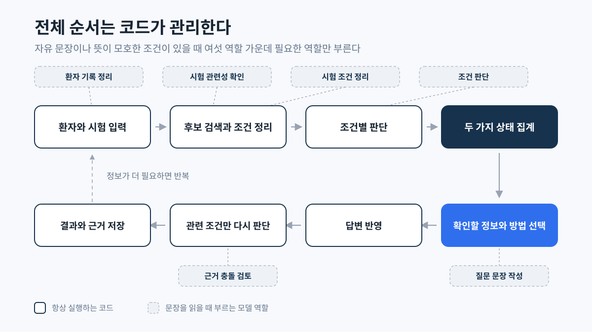

# ClarifyTrial

환자 기록이 모자라면 임상시험 후보가 `정보 부족`에 머문다. ClarifyTrial은 이런 시험을
곧바로 버리지 않는다. 계속 확인할 후보인지 먼저 판단하고, 확인이 끝나려면 어떤 정보가
필요한지 찾는다. 답을 받으면 그 정보와 연결된 시험만 다시 계산한다.

가령 여러 시험이 최근 혈액검사를 요구하는데 환자 기록에는 오래된 결과만 있다고 하자.
프로그램은 최근 결과가 필요한 시험을 한꺼번에 찾고, 기록 조회나 환자 질문, 기존 검사
결과 확인, 새 검사 가운데 알맞은 방법을 제안한다. 새 결과가 들어오면 시험마다 다른
기준을 적용해 결과를 갱신한다.



## 작동 방식

```text
환자 자료와 임상시험 원문을 읽는다
→ 모집 중인 관련 시험을 찾는다
→ 선정 조건과 제외 조건을 현재 자료로 확인한다
→ 참가 가능성이 남은 시험과 이번 사전 검토 범위에서 확인이 끝난 시험을 따로 기록한다
→ 아직 필요한 환자 정보를 찾는다
→ 답을 얻을 수 있는 방법과 환자의 제한을 살핀다
→ 한 가지 정보를 확인한다
→ 그 정보가 쓰인 조건만 다시 계산한다
→ 시험별 결과와 근거, 남은 확인 사항을 저장한다
```

같은 환자 정보가 여러 시험에 쓰이면 한 번 받은 답을 함께 사용한다. 새 검사나 추가
방문을 원하지 않는 환자에게는 해당 방법을 제안하지 않는다. 이동과 비용이 부담되면
기존 자료를 우선하고, 시간이 급하면 더 빠른 방법을 찾는다. 이용할 수 있는 방법이
없으면 억지로 결론을 내리지 않고 확인 대기로 남긴다.

## 현재 구현된 범위

| 구간 | 동작 |
|---|---|
| 시험 검색 | ClinicalTrials.gov에서 모집 중인 시험을 찾고 환자의 질환과 관련된 후보를 남긴다. |
| 조건 계산 | 선정·제외 조건의 수치, 날짜, 예·아니오와 논리 관계는 모델을 부르지 않고 계산한다. |
| 시험 상태 | 계속 확인할 후보인지, 현재 자료로 확인을 마쳤는지 따로 기록한다. |
| 다음 확인 | 아직 필요한 환자 정보와 그 정보가 연결된 시험을 계산한다. |
| 확인 방법 | 기존 기록, 환자 답변, 이미 받은 공식 결과, 새 검사와 의료진 확인을 구분한다. |
| 환자 제한 | 새 검사·추가 방문 허용 여부와 시간·이동·비용 부담을 먼저 적용한다. |
| 답변 반영 | 새 답과 연결된 조건만 다시 계산하고 중단된 실행도 이어서 진행한다. |
| 결과 저장 | 판단 근거, 질문 전후 변화, 남은 정보, 확인 방법과 실행 기록을 남긴다. |

모델 호출이나 응답 형식에서 오류가 나면 정상 결과 파일을 만들지 않는다. 그때까지의 실행
기록과 오류 종류는 `trace.jsonl`과 `execution-error.json`에 남긴다. 같은 출력 폴더를
다시 쓰더라도 지난 성공 결과와 이번 실패 기록이 섞이지 않는다.

수치, 날짜와 예·아니오가 정리된 JSON은 코드가 판정 결과를 바로 만들며 조건 판단
모델에 보내지 않는다. 자유 문장이나 계산하기 어려운 조건이 남았을 때만 언어모델을
부른다. 언어모델은 환자가 허용한 확인 횟수나 방법을 바꿀 수 없다. 내부 역할과 종료
조건은 [프로그램 설계](docs/internal/CLARIFYTRIAL_AGENT_ARCHITECTURE_REDESIGN.md)에
정리돼 있다.

합성 환자 한 명의 전체 흐름에서 이 배치를 점검했다. 조건 판단 호출은 3회에서 0회,
전체 모델 호출은 5회에서 2회, 사용량은 72,659토큰에서 23,707토큰으로 줄었다. 최종
시험 다섯 건의 상태와 확인한 정보 순서는 같았다. 한 사례에서 역할 연결과 사용량을
확인한 결과다.

## 공개 시험 50건으로 확인한 결과

공개 임상시험 50건에서 조건 202개를 구조화했다. 10개 질환의 합성 환자 50명을 만들고,
그중 20명은 자료와 규칙을 다듬는 데 썼다. 최종 평가는 나머지 30명에게 시험 5건씩을
연결해 진행했다. 나이, 임신·수유 여부, 활동성 중증 감염처럼 기본 문진에서 확인할
정보는 처음부터 제공했다.

환자-시험 조합 150개 가운데 28개는 처음 환자 자료만으로 이미 상태가 정리돼 있었다. 세 기본 정보를
더하자 명확히 제외할 수 있던 68건과 참가 가능 후보 32건이 추가로 정리됐다. 질문 전
상태가 정해진 조합은 모두 128개였고, 나머지 22개가 추가 정보를 기다렸다. 따라서
아래의 63.6%는 이 22건 안에서 질문이 만든 변화다.

환자마다 한 번까지 확인하도록 하자 실제 질문은 14번 나왔고, 질문을 받은 14명 모두
시험을 한 건 이상 정리했다. 모두 14건이 확인 완료로 바뀌어 시작 당시 미확정 시험의 63.6%를 정리했고
8건은 확인 대기로 남았다. 이미 입력된 나이를 다시 묻는 질문은 없었다.

어떤 정보를 먼저 물었는지에 따른 차이는 작았다. 가능한 질문 순서를 모두 실행한 평균은
94.22%, 현재 규칙은 94.67%의 시험 상태가 합성 정답과 같았다. 환자 30명 가운데 1명만
좋아졌고 29명은 같았다. 처음 실험에서 나온 36.5%포인트 차이는 기본 문진에 들어갈
나이·임신·감염 정보까지 가렸을 때의 값이다. 현재 결과에는 질문으로 정리된 14건과
계속 기다린 8건을 함께 제시한다.

질문 순서가 언제 도움이 되는지도 따로 살폈다. 정보 연결 모양 9종을 각각 200개씩 만든
1,800개 구조에서 한 번만 확인했다. 합성 답이 나오는 비율을 개발 때와 같게 둔 평가에서 모든 시험이 하나의
정보에 묶인 구조는 매 단계에서 남은 정보 중 하나를 고르는 무작위 선택보다 43.28%포인트 높았고, 시험마다 필요한 정보가
따로인 구조에서는 차이가 없었다. 이웃 시험끼리 사슬처럼 이어진 구조는 0.75%포인트
낮았다. 확인을 두세 번 허용하고 앞으로 확인할 정보 조합을 계산하자 현재 규칙보다
전체 평균은 1.2~2.0%포인트, 사슬형 구조는 3.2~4.3%포인트 높았다. 여러 후보가 같은
정보에 직접 묶이면 현재 규칙이 잘 맞았고, 한 답에 따라 다음 질문의 필요성이 달라지는
경우에는 앞으로 확인할 정보 조합을 계산한 방법이 나았다.

이 수치는 합성 환자와 선별한 구조화 조건에서 프로그램의 상태 변화를 확인한 결과다.
실제 환자의 참가 판정 정확도나 TrialGPT와의 우열을 나타내지 않는다.

## 환자 상황을 반영한 결과

같은 답을 얻는 방법이 둘일 때 환자 상황에 따라 확인 방법이 바뀌는지 점검했다. 부담과
이동·비용을 줄이는 설정에서는 기존 공식 결과를 85번 모두 골랐고, 시간이 급한
설정에서는 빠른 새 검사를 85번 모두 골랐다. 어떤 정보를 확인할지와 최종 시험 상태는
40개 사례에서 그대로 유지됐다.

새 검사와 추가 방문을 허용하지 않은 합성 상황에서는 새 검사 제안이 21회에서 0회,
추가 방문 제안이 56회에서 0회로 줄었다. 대신 설정 하나에 남은 확인 대기 시험은 평균
0.88건에서 1.24건으로 늘었다. 시험 다섯 건을 모두 정리한 설정도 80개 중 42개에서
32개로 줄었다. 환자의 제한을 지키면 일부 시험의 결론을 더 기다려야 한다는 점까지
결과에 남는다.

시간과 부담은 선택 규칙을 점검하려고 정한 합성 값이다. 실제 병원의 대기시간이나
환자가 얻을 편익을 추정한 값으로 사용하지 않는다.

## 실행

Python 3.11 이상이 필요하다.

```powershell
python -m venv .venv
.\.venv\Scripts\python.exe -m pip install -c constraints\research.txt -e ".[dev,retrieval-bm25,codex-subscription]"
.\.venv\Scripts\python.exe -m nltk.downloader punkt
.\.venv\Scripts\python.exe -m pytest -q
```

준비된 합성 사례에서 검색, 질문, 답변과 재판정을 한 번에 실행한다. 이 예제는 외부
언어모델을 부르지 않는다.

```powershell
.\.venv\Scripts\clarifytrial.exe run-full-ui --auto
```

터미널에서 직접 답하려면 `--auto`를 뺀다. 별도 환자·시험 JSON과 공식 대회 형식의
입력은 [실행과 실험 안내](docs/internal/CLARIFYTRIAL_V5_DEVELOPED_EXPERIMENT_GUIDE.md)에
예시가 있다.

## 문서

- [발표 구성과 말하기 대본](docs/internal/CLARIFYTRIAL_REPORT_PRESENTATION_PACKET.md)
- [현재 상태](docs/internal/CURRENT_STATUS.md)
- [검증 결과](docs/internal/CLARIFYTRIAL_VALIDATION_RESULTS.md)
- [연구계획 v5](docs/internal/CLARIFYTRIAL_RESEARCH_PLAN_V5.md)
- [실험자료 구성](docs/internal/CLARIFYTRIAL_DATASETS.md)
- [전체 문서 목록](docs/internal/README.md)
