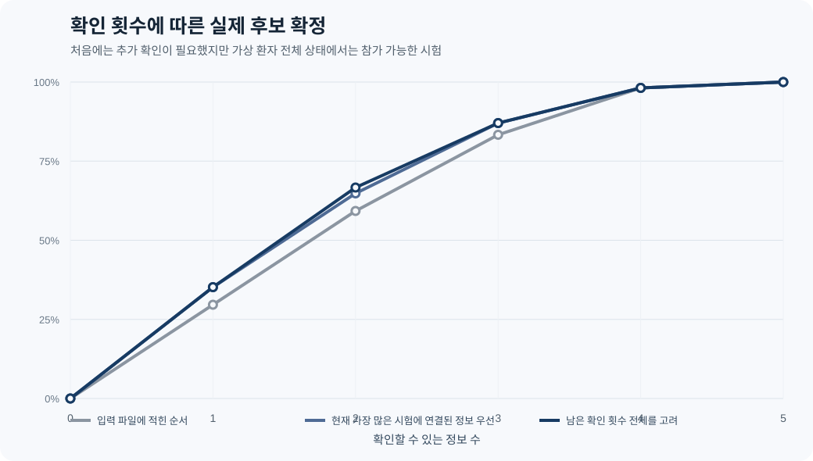
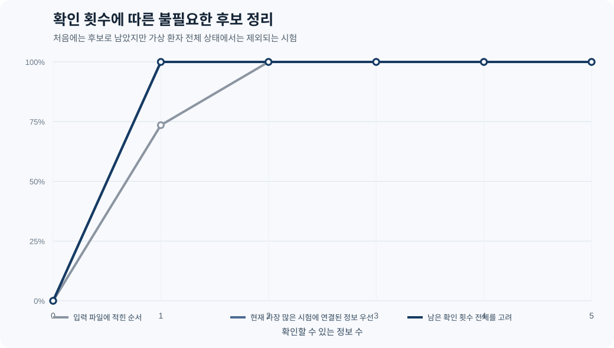

# ClarifyTrial

환자 정보가 부족할 때 임상시험을 바로 없애거나 성급하게 참가 가능으로 확정하지 않고,
`현재 확인된 시험`과 `추가 확인 후보`를 나누어 보여 주는 연구 프로그램이다.

## 한 시험에 두 가지 결과를 낸다

1. 참가 가능성이 남아 있어 계속 확인할 후보인가?
2. 지금 확보한 자료만으로 참가 조건을 확인할 수 있는가?

예를 들어 최근 14일 이내 혈액검사가 필요한데 3개월 전 결과만 있다면 시험을 바로
제외하지 않는다. 추가 확인 후보로 남기고 최근 결과가 필요한 이유와 확인 방법을 함께
표시한다. 새 결과가 들어오면 그 검사와 연결된 시험만 다시 판단한다.

```text
환자 상태 읽기
→ 모집 중인 시험에서 관련 후보 검색
→ 시험 조건별 판단과 사용 근거 저장
→ 현재 확인 완료·추가 확인 후보·조건 불충족으로 분리
→ 여러 시험의 판단을 바꿀 수 있는 정보를 먼저 선택
→ 병원 기록·환자 답변·기존 공식 결과·새 검사 중 확인 방법 선택
→ 답을 반영해 관련 시험만 다시 판단
→ 질문 전후 변화와 남은 정보를 함께 출력
```


## 여러 정보가 동시에 부족할 때

후보 시험 5개에 부족한 정보가 5개이고 확인 기회가 세 번이라면 전부 확인할 수 없다.
최근 혈액검사 하나로 시험 4개의 판단을 끝낼 수 있고 과거 수술 여부는 시험 1개에만
영향을 준다면 혈액검사를 먼저 확인한다.

프로그램은 한 번 확인할 때마다 남은 시험과 정보를 다시 계산한다. 현재 구현에는 다음
두 방법이 함께 들어 있어 같은 사례에서 비교할 수 있다.

- 지금 가장 많은 시험에 연결된 정보를 하나씩 고르는 방법
- 남은 확인 횟수 안에서 선택할 정보 조합을 계산하는 방법

공개 시험 조건 기반 평가에서는 두 방법의 결과가 같았다. 복잡한 계산의 우월성을
주장하지 않고 앞의 단순한 방법을 강한 비교 기준으로 둔다.

## 같은 정보도 확인 방법이 다르다

| 확인 방법 | 예시 |
|---|---|
| 병원 기록 확인 | 현재 병원에 있는 검사 결과와 진료 기록 |
| 환자 답변 | 복용약, 과거 수술과 생활 정보 |
| 기존 공식 결과 확인 | 다른 기관 결과나 이미 시행한 검사 확인 |
| 새 검사 또는 평가 | 현재 자료가 없어 새로 받아야 하는 검사 |

이동, 비용, 시간, 새 검사 허용 여부가 입력되면 이용할 수 없는 방법을 고르지 않는다.
환자 상황은 참가 조건 자체를 바꾸지 않고 확인 순서와 방법만 바꾼다.

## 결과에 남는 내용

- 현재 자료로 조건 확인이 끝난 시험
- 참가 가능성이 남아 있지만 추가 정보가 필요한 시험
- 분명한 조건 위반으로 제외된 시험
- 조건별 판단과 환자·시험 근거
- 아직 필요한 정보와 선택한 확인 방법
- 질문 전후에 상태가 바뀐 시험
- 새 검사, 추가 방문, 환자 선택과 예상 대기
- 처음 검색 순위와 현재 목록에 놓인 이유

## 사용한 자료

| 자료 | 사용한 부분 | 현재 범위 |
|---|---|---:|
| 팀 공개 ClinicalTrials.gov 시험 모음 | 넓은 후보 검색과 공개 조건 선별 | 전체 1,931건·검색 589건 |
| 공개 시험 조건 기반 평가자료 | 질문·답변·재판정 전체 흐름 | 10개 질환·50개 시험·202조건 |
| 합성 환자 | 일부 정보를 가린 시작 상태와 질문 뒤 답 | 50명 |
| 새 시험 최종 평가자료 | 기존 평가와 겹치지 않는 시험에서 최종 확인 | 5개 질환·30개 시험·116조건 |
| TREC Clinical Trials 2021·2022 | 수만 건에서 관련 시험 검색을 따로 평가 | 공개 평가자료 2개 |
| TrialGPT 조건 판단 자료 | 질문 전 한 번의 조건 판단 경계 확인 | 조건 1,015개 |
| 환자 부담 합성 상황 | 이동·비용·시간에 따른 확인 방법 | 360개 상황 |

공개 시험 50건의 전체 참가 조건을 구조화한 것은 아니다. 나이, 단일 수치 비교, 명확한
상태 조건, 짧은 원문 조건과 원문에서 개수 관계가 분명한 네 묶음만 옮겼다. 합성 환자
답은 질문을 고르는 과정에서 볼 수 없고 실제 확인 행동 뒤에만 공개된다.

## 정해진 규칙이 처음부터 끝까지 이어지는지 확인한 결과

개발에 사용하지 않은 합성 환자 30명에게 시험 5개씩 연결해 150개 시험 판단을 만들었다.
모집 중·모집 예정 시험 589건 검색부터 조건 판단, 최대 세 번의 추가 확인과 재판정까지
같은 환자 사례로 실행했다.

이 표의 기대 결과도 프로그램과 같은 구조화 규칙으로 만들었다. 따라서 95.3%는
언어모델이나 임상 판단의 정확도가 아니라, 질문 횟수가 세 번일 때 정해진 상태까지
프로그램이 얼마나 회복했는지를 보여 주는 연결 검사다.

| 정보를 고른 방법 | 최종 상태를 맞힌 시험 | 실제 참가 가능 후보 확정 | 결국 제외될 후보 정리 |
|---|---:|---:|---:|
| 추가 확인 없음 | 28/150개, 18.7% | 0/54개 | 0/68개 |
| 입력 파일에 적힌 순서 | 141/150개, 94.0% | 45/54개 | 68/68개 |
| 환자 선택을 보지 않고 지금 가장 많은 시험에 연결된 정보 우선 | 143/150개, 95.3% | 47/54개 | 68/68개 |
| 남은 확인 횟수 전체를 계산 | 143/150개, 95.3% | 47/54개 | 68/68개 |

처음 화면에서 확인이 끝난 시험만 보여 주면 실제 참가 가능 후보 54개가 보이지 않는다.
ClarifyTrial은 54개를 모두 추가 확인 후보로 남겼고 세 번 안에 47개를 실제 후보로
확정했다. 반대로 가상 환자 전체 상태에서 제외되는 후보 68개는 모두 정리했다. 남겨야 할 시험을
잘못 제외하거나 정보가 부족한데 참가 가능으로 확정한 사례는 없었다.

입력 순서보다 좋았던 환자는 1명, 같았던 환자는 29명, 낮았던 환자는 0명이었다. 강한
단순 비교 방법과는 30명 모두 같았다.

589건 검색에서 미리 정한 서로 다른 시험 50건을 환자별로 반복한 150개 연결은 모두
상위 200개 안에 들어왔다. 평균 순위는 37.3위, 가장 낮은 순위는 123위였다. 검색된
다른 시험은 조건 판정에 넣지 않았으므로 이 수치는 검색 연결 검사다. TREC 공개자료의
별도 검색 평가는 [검증 결과](docs/internal/CLARIFYTRIAL_VALIDATION_RESULTS.md)에 있다.

## 확인 횟수가 늘어날 때

| 확인 가능 횟수 | 실제 참가 가능 후보 확정 | 결국 제외될 후보 정리 | 전체 시험 판단 일치 |
|---:|---:|---:|---:|
| 0회 | 0.0% | 0.0% | 18.7% |
| 1회 | 35.2% | 100.0% | 76.7% |
| 2회 | 66.7% | 100.0% | 88.0% |
| 3회 | 87.0% | 100.0% | 95.3% |
| 4회 | 98.1% | 100.0% | 99.3% |
| 5회 | 100.0% | 100.0% | 100.0% |

후보 확정과 제외 정리는 서로 다른 목적이다. 후보 확정만 높이면 제외될 시험이 오래
남을 수 있고, 제외 정리만 높이면 참가 가능한 후보 확인이 늦어질 수 있어 한 점수로
합치지 않는다.





## 답을 얻지 못하거나 새 검사를 원하지 않을 때

| 상황 | 실제 참가 가능 후보 확정 | 결국 제외될 후보 정리 | 새 검사·추가 방문 | 같은 정보 반복 |
|---|---:|---:|---:|---:|
| 시스템이 선택한 확인에 답을 받을 수 있음 | 47/54개 | 68/68개 | 2회·2회 | 0회 |
| 환자마다 답 하나를 얻지 못함 | 41/54개 | 68/68개 | 2회·2회 | 0회 |
| 새 검사와 추가 방문을 원하지 않음 | 43/54개 | 68/68개 | 0회·0회 | 0회 |

## 기존 평가와 겹치지 않는 새 시험에서 확인한 결과

공개 시험 30건을 새로 골라 15건은 개발용, 15건은 최종 평가용으로 나눴다. 기존
50건과 겹치는 시험은 없다. 최종 평가에는 합성 환자 25명과 환자–시험 판단 75개를
사용했다. 기대 결과는 현재 판정 코드를 부르지 않는 별도 계산표로 먼저 고정했다.

| 모델을 부르는 방법 | 최종 상태 일치 | 실제 후보 확정 | 결국 제외될 후보 정리 | 외부 모델 호출 | 전체 토큰 |
|---|---:|---:|---:|---:|---:|
| 구조화 규칙만 사용 | 75/75개, 100.0% | 36/36개 | 23/23개 | 0회 | 0 |
| 조건 판단만 GPT-5.6 Sol `medium` 사용 | 75/75개, 100.0% | 36/36개 | 23/23개 | 65회 | 1,033,320 |
| 조건 판단과 질문 문장 작성에 같은 모델 사용 | 75/75개, 100.0% | 36/36개 | 23/23개 | 105회 | 1,565,829 |

이 자료의 조건은 모두 수치·날짜·참거짓으로 구조화돼 코드가 직접 계산할 수 있다.
외부 모델을 더 불러도 결과가 좋아지지 않았으므로 구조화된 JSON 입력의 기본 평가는
코드로 실행한다. 조건의 뜻을 코드로 정할 수 없을 때만 조건 판단 모델을 쓰고, 실제
근거 충돌이 있을 때만 별도 검토를 부른다. 이 결과는 여러 에이전트가 정확도를
높였다는 근거가 아니다.

상세 비교는 [모델 호출 방식 비교](docs/internal/results/independent-new-trial-agent-evaluation-v1/report.md)에 있다.

## 모델과 코드가 나누어 맡는 일

정해진 형식의 JSON만 입력하면 외부 모델을 부르지 않는다. 자유 형식 기록이나 코드로
뜻을 정할 수 없는 조건이 있을 때만 필요한 모델 역할을 부른다. 모델 역할은 환자 기록
정리, 시험 조건 정리, 조건 판단, 질문 문장 작성과 실제 근거 충돌 검토의 최대 다섯
가지다. 코드가 다음 일을 맡는다.

- 후보 시험 검색과 검색 순위 저장
- 수치·단위·날짜·자료 출처 검사
- `모두`, `하나 이상`, `일정 개수 이상` 조건 계산
- 후보 유지와 현재 확인 상태 집계
- 다음에 확인할 정보와 허용되는 확인 방법 선택
- 새 정보와 연결된 시험만 재판정
- 질문 수, 검사·방문, 호출·토큰과 결과 통계 생성

모델 역할 사이의 자유 토론으로 결론을 정하지 않는다. 환자 상태, 조건, 근거와 남은
정보는 정해진 JSON에 저장해 다른 연구자가 실행 과정을 다시 확인할 수 있다.

## 연구 기여의 범위

질문 생성, 답변 반영, 여러 모델 역할, 비용을 고려한 행동 선택은 이미 선행연구에 있다.
현재 결과로 설명할 수 있는 기여는 다음과 같다.

- 현재 확인된 시험과 추가 확인 후보를 분리하는 결과 형식
- 처음 화면에서 사라질 실제 후보, 추가 확인 후보로 남긴 수와 실제 확정한 수를 따로 세는 평가
- 결국 제외될 후보의 정리율을 함께 보여 후보를 많이 남기는 방법에 유리한 통계를 막는 평가
- 질문 수뿐 아니라 새 검사·추가 방문과 환자 선택을 같은 실행에서 기록하는 구조
- 공개 시험 검색부터 복합 조건 판정과 질문 뒤 재판정까지 이어지는 재현 가능한 프로그램

TrialGPT보다 전체 추천 성능이 높다는 결론과 새 질문 알고리즘의 우월성은 현재 결과에
포함하지 않는다. 95.3%는 프로그램 규칙과 자료 연결을 확인한 통합 점검이고, 새 시험
75/75개 결과는 객관적으로 구조화한 일부 조건에 한정된 최종 평가다.

## 문서

| 문서 | 내용 |
|---|---|
| [연구 요약](docs/internal/CLARIFYTRIAL_REPORT_PRESENTATION_PACKET.md) | 핵심 아이디어와 발표용 결과 |
| [현재 상태](docs/internal/CURRENT_STATUS.md) | 완성된 범위, 활성 요구사항과 남은 작업 |
| [검증 결과](docs/internal/CLARIFYTRIAL_VALIDATION_RESULTS.md) | 각 숫자의 실행 조건과 해석 범위 |
| [현행 연구계획 v5](docs/internal/CLARIFYTRIAL_RESEARCH_PLAN_V5.md) | 연구 질문과 비교 기준 |
| [실험자료 구성](docs/internal/CLARIFYTRIAL_DATASETS.md) | 공개자료와 합성자료 구성 |
| [에이전트 실행 구조](docs/internal/CLARIFYTRIAL_AGENT_ARCHITECTURE_REDESIGN.md) | 모델 호출과 코드 실행 순서 |

## 실행

Python 3.11 이상이 필요하다.

```powershell
py -3.12 -m venv .venv
.\.venv\Scripts\python.exe -m pip install -c constraints\research.txt -e ".[dev,retrieval-bm25,codex-subscription]"
.\.venv\Scripts\python.exe -m nltk.downloader punkt
.\.venv\Scripts\python.exe -m pytest -q
```

### 준비된 예제

공개 시험 50건에서 관련 시험 5건을 찾고, 조건 판단·추가 확인·재판정 과정을 한 화면에
보려면 다음 명령을 실행한다. 기본값은 외부 모델을 부르지 않아 비용이 들지 않는다.

```powershell
.\.venv\Scripts\clarifytrial.exe run-full-ui --auto
```

`prepare-team-trials`로 공개 시험 모음을 받은 뒤에는 모집 중·모집 예정 시험 589건 검색부터
같은 화면에서 볼 수 있다.

```powershell
.\.venv\Scripts\clarifytrial.exe run-full-ui `
  --broad-corpus .research-cache\team-trials\trials.jsonl `
  --broad-search-top-k 200 `
  --auto
```

새 환자와 별도 시험 파일을 넣는 일반 실행은 다음과 같다.

```powershell
.\.venv\Scripts\clarifytrial.exe run-screening `
  --patient examples\general_screening\patient.json `
  --trials examples\general_screening\trials.jsonl `
  --answers examples\general_screening\answers.json `
  --provider deterministic `
  --output runs\general-screening
```

### 공개 시험 조건 기반 평가자료 다시 만들기

```powershell
.\.venv\Scripts\clarifytrial.exe prepare-team-trials
.\.venv\Scripts\clarifytrial.exe select-team-evaluation-trials `
  --trials .research-cache\team-trials\trials.jsonl `
  --output runs\team-trial-expansion\selection.json
.\.venv\Scripts\clarifytrial.exe build-public-protocol-benchmark `
  --output runs\public-protocol-benchmark-rebuild
.\.venv\Scripts\clarifytrial.exe audit-public-protocol-benchmark
```

### 검색부터 질문 뒤 재판정까지 평가

```powershell
.\.venv\Scripts\clarifytrial.exe run-workflow-evaluation `
  --trial-set data\public_protocol_benchmark_v1\trial_set.json `
  --patient-pairs data\public_protocol_benchmark_v1\patient_pairs.json `
  --generation-config configs\natural_evaluation_patient_generation_v2.json `
  --broad-corpus .research-cache\team-trials\trials.jsonl `
  --broad-search-top-k 200 `
  --provider deterministic `
  --split heldout `
  --budget-sweep `
  --concurrency 4 `
  --include-unavailable-scenario `
  --include-patient-choice-scenario `
  --approve-synthetic-actions `
  --output runs\public-protocol-budget-sweep
```

### 보고서 만들기

```powershell
.\.venv\Scripts\clarifytrial.exe build-report `
  --workflow runs\public-protocol-budget-sweep\budget-3\summary.json `
  --budget-frontier runs\public-protocol-budget-sweep\frontier `
  --output runs\public-protocol-report
```

중단된 일괄 평가는 입력 자료와 설정이 같을 때 `--resume`으로 이어서 실행할 수 있다.

### 코드 위치

| 위치 | 내용 |
|---|---|
| `src/clarifytrial/agents/` | 역할별 모델 호출과 출력 형식 |
| `src/clarifytrial/preparation/` | 환자 기록과 시험 문서 준비 |
| `src/clarifytrial/retrieval/` | 관련 시험 검색 |
| `src/clarifytrial/interactive/` | 정보 선택과 환자 부담 규칙 |
| `src/clarifytrial/workflow/` | 조건 판단, 답변 반영과 재판정 |
| `src/clarifytrial/reporting/` | 최종 목록과 연구 보고서 생성 |
| `tests/` | 조건 계산, 전체 흐름과 보고서 검사 |
