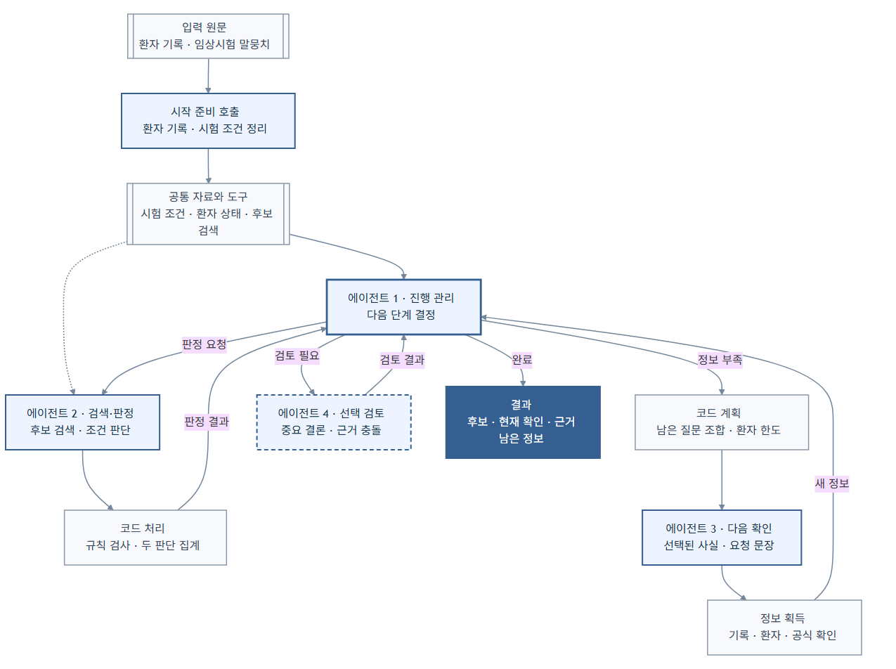
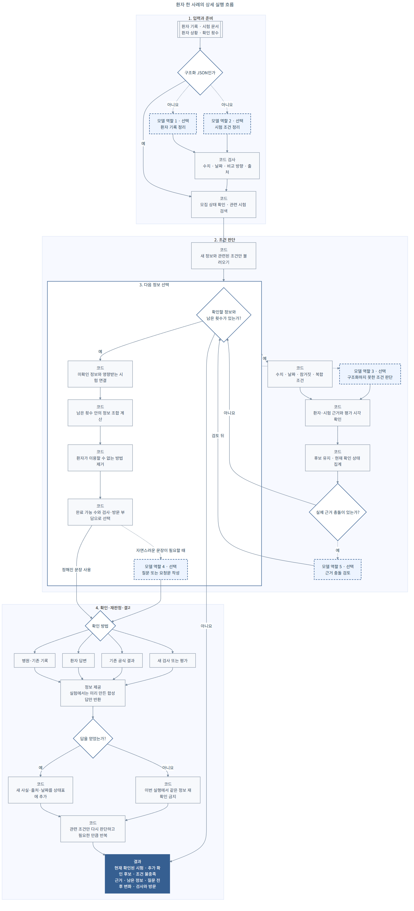

# ClarifyTrial

ClarifyTrial은 환자 정보가 아직 완전하지 않은 단계에서 임상시험 후보를 검토하는
연구 프로젝트다. 시스템은 다음 두 질문에 따로 답한다.

1. **이 환자를 후보로 계속 검토할 가치가 있는가?**
2. **현재 확보한 자료만으로 참가 조건을 확인할 수 있는가?**

가능성은 보이지만 최근 검사나 공식 확인이 남아 있다면 후보는 유지하고, 현재
상태는 `확인 대기`로 표시한다. 이어서 기존 기록 조회, 환자 질문, 공식 검사·의료진
확인, 보류 가운데 알맞은 경로를 고른다.

## 현재 상태

| 항목 | 상태 |
|---|---|
| 연구 질문과 실험 원칙 | 확정 |
| 에이전트 워크플로우와 근거문헌 | 설계 완료 |
| TrialGPT 검색을 최소 기준으로 한 후보 RAG | TREC 2021·2022 재현 완료, 결합 검색 채택 |
| 공통 자료형·조건별 환자 문장 BM25·합성 답변 환경 | 첫 구현 완료 |
| 역할별 에이전트·상태 흐름·공통 평가기 | 첫 구현 완료 |
| Claude API와 TrialGPT 조건 주석 연결 | 20명 개발·33명 평가 실행 완료 |
| GPT 구독형 단일·멀티에이전트 구조 비교 | Sol medium 개발 완료, 두 정적 검토 방식 기각 |
| v5 대화형 자료 | 12명 코드·Sol 작동 확인 완료, 30명 주 벤치마크 작성 전 |
| v5 성능 | 12명 반복 구조에서 작동 확인, 주 성능은 아직 미측정 |

저장소에는 합성 환자 사례만 둔다. 과거 Solar 합성 데모 수치와 84% 결과는 v5의
성능이나 기준선에 포함하지 않는다.

현재 코드는 외부 모델 없이 합성 흐름을 재현할 수 있고, Claude API와 ChatGPT
구독으로 TrialGPT 조건 자료를 실행할 수 있다. TrialGPT 실험은 v5 에이전트 성능이나
의료 현장 성능을 보여 주는 결과가 아니다.

## 로컬 실행

Python 3.11 이상이 필요하다. Windows PowerShell에서는 다음 순서로 설치하고 검사한다.

```powershell
py -3.12 -m venv .venv
.\.venv\Scripts\python.exe -m pip install -e ".[dev]"
.\.venv\Scripts\python.exe -m pytest -q
.\.venv\Scripts\clarifytrial.exe run-example --case examples\stale_lab --output runs\stale_lab
.\.venv\Scripts\clarifytrial.exe run-interactive-pilot --output runs\interactive-pilot
```

마지막 명령은 오래된 혈액검사만 있는 상태에서 후보를 유지하고, 최근 공식 결과를
받은 뒤 현재 조건 확인을 끝내는 합성 사례를 실행한다. 결과는 `result.json`, 역할별
호출과 상태 변화는 `trace.jsonl`에 저장된다. 이 실행에는 API 키가 필요하지 않다.

### TrialGPT와 Claude 조건 실험

공개 주석을 로컬 캐시에 받은 뒤 Claude Sonnet 5로 실행한다. API 키 파일은 저장소
밖에 둔다. `development`는 20명 조정용, `heldout`은 이들과 겹치지 않는 33명
평가용이다.

```powershell
.\.venv\Scripts\clarifytrial.exe prepare-trialgpt --cache .research-cache\trialgpt
.\.venv\Scripts\clarifytrial.exe run-trialgpt-experiment `
  --raw-jsonl .research-cache\trialgpt\criterion_annotations.jsonl `
  --sigir-corpus <TrialGPT 저장소>\dataset\sigir\corpus.jsonl `
  --output runs\trialgpt-balanced-heldout `
  --api-key-env-file <로컬 키 파일> `
  --api-key-name API_KEY `
  --variant balanced `
  --split heldout `
  --confirm-live-api
```

2026-08-20 미관측 환자 평가는 33명, 64개 환자-시험 조합, 654개 조건을 사용했다.
선정·제외 비대칭 지시문은 79.1%, 기존 지시문은 52.0%, 공개 TrialGPT 고정 출력은
88.8%였다. 비대칭 방식은 제외 조건의 과도한 정보 부족을 줄였지만 전문가가 정보
부족으로 둔 조건의 회수도 83.2%에서 74.8%로 낮췄다. 자세한 내용은
[검증 결과](docs/internal/CLARIFYTRIAL_VALIDATION_RESULTS.md)에 있다.

### GPT-5.6 Sol 구조 비교

ChatGPT 구독 연결은 공식 Codex Python SDK를 사용한다. 각 호출은 빈 임시
작업공간과 새 대화에서 실행하며 웹·셸·파일 도구를 차단한다.

```powershell
.\.venv\Scripts\clarifytrial.exe run-trialgpt-architecture `
  --raw-jsonl .research-cache\trialgpt\criterion_annotations.jsonl `
  --sigir-corpus <TrialGPT 저장소>\dataset\sigir\corpus.jsonl `
  --output runs\trialgpt-architecture-dev `
  --stage dev `
  --case-concurrency 3 `
  --confirm-subscription-run
```

개발 20조합에서 `S1` 68.7%, `M1` 65.9%, `M2` 65.4%였다. `M2`는 131개
정보 부족 조건을 다시 봤지만 라벨 변경이 없었고 토큰만 늘어 정적 조건 판단에서는
기각했다. 전체 멀티에이전트 흐름은 추가 정보와 다음 행동 정답이 있는 v5 합성
자료에서 따로 평가한다.

이후 선정·제외 규칙을 보강하고 두 조건 종류를 나눈 `S1-R`은 75.8%였다. 그 실제
출력의 경계 사례만 다시 본 검색 없는 검토도 75.8%, 일반 의학 검색 12회를 사용한
검토는 74.9%였다. 검색 없는 검토는 정답 1개와 오답 1개를 맞바꿨고, 인터넷 검토는
정답을 추가하지 못한 채 맞던 답 2개를 틀려 두 방식 모두 기각했다.

```powershell
.\.venv\Scripts\clarifytrial.exe run-trialgpt-strong-review `
  --raw-jsonl .research-cache\trialgpt\criterion_annotations.jsonl `
  --sigir-corpus <TrialGPT 저장소>\dataset\sigir\corpus.jsonl `
  --output runs\trialgpt-strong-review-focused-dev20 `
  --stage development `
  --case-concurrency 3 `
  --confirm-subscription-run
```

### TrialGPT 후보 검색 재현

후보 검색에는 별도 선택 의존성이 필요하다. GPU용 PyTorch는 사용하는 그래픽카드와
CUDA에 맞는 공식 설치 명령을 따른다. 이번 Windows RTX 5060 실행은 CUDA 13.0용
PyTorch를 사용했다.

```powershell
.\.venv\Scripts\python.exe -m pip install -e ".[dev,retrieval]"
.\.venv\Scripts\clarifytrial.exe run-trialgpt-retrieval `
  --dataset <TrialGPT 저장소>\dataset `
  --cache .research-cache\trialgpt-retrieval `
  --output runs\trialgpt-retrieval\trec-2021-hybrid `
  --corpus trec_2021 `
  --device cuda
```

같은 명령의 `--corpus`와 출력 경로를 `trec_2022`로 바꾸면 고정 설정 평가를
실행한다. 결합 검색의 가중 Recall@500은 TREC 2021 83.59%, TREC 2022
81.55%였으며 TrialGPT 공개 Source Data와의 최대 차이는 0.1%p보다 작았다.

### 코드 위치

| 위치 | 내용 |
|---|---|
| `src/clarifytrial/contracts.py` | 시험 조건, 환자 사실, 조건 판단, 두 결과와 다섯 행동 |
| `src/clarifytrial/agents/` | 진행 관리, 검색·판정, 다음 확인, 선택 검토의 분리된 호출 경계 |
| `src/clarifytrial/decision_rules.py` | 조건 결과를 후보 유지와 현재 확인으로 집계하는 규칙 |
| `src/clarifytrial/mechanical_checks.py` | 구조화된 수치·날짜·출처·확인 상태를 검사하는 규칙 |
| `src/clarifytrial/workflow/` | 행동 한도와 재판정 순서를 관리하는 상태 흐름 |
| `src/clarifytrial/environment/` | 공개 질문 목록과 숨은 합성 답변을 분리한 실행 환경 |
| `src/clarifytrial/retrieval/` | 환자 문장 안내와 TrialGPT식 BM25·MedCPT 후보 검색 |
| `src/clarifytrial/evaluation.py` | 조건, 두 결과와 다음 행동을 따로 채점하는 공통 평가기 |
| `src/clarifytrial/datasets/` | TrialGPT 원본 검사와 환자 단위 개발·평가 분리 |
| `src/clarifytrial/pilots/` | 조건 묶음 실행, 비용·오류 지표와 지시문 비교 |
| `prompts/` | 에이전트별 역할, 입력, 허용 도구와 출력 형식 |
| `examples/stale_lab/` | 시스템 입력, 숨은 답변과 평가 정답을 나눈 합성 사례 |

## 에이전트 구조

아래 그림은 공개자료 검색까지 연결한 목표 구조다. 현재 첫 구현은 후보 시험 한 건과
관련 조건을 입력으로 받아, 네 에이전트의 호출과 추가 정보 반영·재판정 흐름을
실행한다. 재현한 후보 검색은 아직 이 전체 실행 흐름에 연결하지 않았다.

### 에이전트 전체 구성



[수정 가능한 Mermaid 원본](docs/internal/diagrams/clarifytrial-performance-agent-architecture.mmd) ·
[SVG](docs/internal/diagrams/clarifytrial-workflow.svg)

### 상세한 실행 흐름



[수정 가능한 Mermaid 원본](docs/internal/diagrams/clarifytrial-detailed-workflow.mmd) ·
[SVG](docs/internal/diagrams/clarifytrial-detailed-workflow.svg)

### 에이전트별 역할

| 에이전트 | 맡은 일 | 호출 시점 |
|---|---|---|
| 진행 관리 | 환자별 맥락을 유지하고 다음 실행과 종료를 결정 | 매 진행 주기 |
| 검색·판정 | RAG로 후보를 찾고 조건별 임상 상태와 자료 충분성을 판단 | 초기 판단과 관련 정보 변경 시 |
| 다음 확인 | 부족한 사실과 기록 조회·환자 질문·공식 확인·보류 중 경로를 선택 | 정보가 부족할 때 |
| 선택적 검토 | 중요한 제거·확정과 근거 충돌을 독립적으로 재검사 | 정해진 검토 조건에 걸릴 때만 |

고정 에이전트는 세 개다. 선택적 검토까지 실행되는 사례에서만 네 개가 작동한다.
같은 기본 모델을 쓰더라도 역할별 지시문, 대화 기록, 도구와 출력 형식을 분리한다.

### 공통 자료와 도구

| 단계 | 하는 일 | 주로 참고한 연구 |
|---|---|---|
| 시험 조건 준비 | 조건, 수치, 기간, 논리와 원문 위치를 미리 정리 | TrialMatchAI, EXACT |
| 환자 상태표 | 여러 기록을 날짜와 출처가 붙은 한 상태표로 정리 | PRomop |
| 후보 검색 | 명확한 규칙 필터와 글자·의미 검색을 함께 사용 | TrialMatchAI |
| 기계적 검사 | 날짜, 수치, 단위, 부정과 논리를 코드로 확인 | TrialMatchAI, EXACT |
| 두 판단 집계 | 조건 결과에서 후보 유지와 현재 확인을 따로 계산 | ClarifyTrial v5 |
| 정보 획득 환경 | 기록 조회, 환자 답변과 공식 확인 결과를 시스템 밖에서 제공 | MediQ, ClarifyTrial v5 |
| 결과 보고 | 양쪽 원문 근거, 남은 정보, 다음 단계와 의료 면책 문구를 표시 | ClarifyTrial v5 |

검색 색인, 환자 상태표, 코드 검사와 합성 답변 환경은 에이전트가 아니다. 여러
에이전트가 함께 사용하는 자료와 도구다. 한 진행 주기의 호출 수는 진행 관리 1회,
검색·판정 묶음 수, 필요시 다음 확인 1회와 선택적 검토 1회를 합쳐 계산한다.

상세한 역할, 입력과 출력은
[에이전트 워크플로우](docs/internal/CLARIFYTRIAL_AGENT_ARCHITECTURE_REDESIGN.md)에
정리했다. 논문과 공개 코드 링크는
[근거문헌 색인](docs/internal/CLARIFYTRIAL_AGENT_SOURCE_INDEX.md)에서 확인할 수 있다.

## 주요 근거문헌

| 연구 | ClarifyTrial에서 참고하는 부분 | 공개 자료 |
|---|---|---|
| PRomop | 여러 기록을 하나의 환자 상태표로 정리 | [논문](https://arxiv.org/abs/2607.13947), [코드](https://github.com/healthkey-ai/PRomop) |
| TrialMatchAI | 규칙 필터, 글자·의미 검색, 조건 재정렬과 조건별 판정 | [논문](https://www.nature.com/articles/s41467-026-70509-w), [코드](https://github.com/cbib/TrialMatchAI) |
| CLEAR-MATCH | 대화 단계와 답변 뒤 후보 갱신 | [공식 발표](https://amia.secure-platform.com/symposium/gallery/rounds/82021/details/20567) |
| TRIAGE | 환자 원문·시험 원문·기준일을 이용한 판정 확인 | [논문](https://doi.org/10.1200/OP-26-00076) |
| Yang, 2026 | 질문, 답변 판정과 동적 후보 제거를 잇는 전체 대화 흐름 | [학위 연구 소개](https://sbmi.uth.edu/research/phd-dissertations/a-patient-centric-chatbot-for-improving-clinical-trial-accessibility.htm) |
| MediQ | 현재 정보로 답할지 먼저 판단한 뒤 부족할 때 질문 | [논문](https://proceedings.neurips.cc/paper_files/paper/2024/file/32b80425554e081204e5988ab1c97e9a-Paper-Conference.pdf), [코드](https://github.com/stellalisy/mediQ) |
| DQueST | 여러 남은 시험에 공통으로 필요한 질문을 우선 | [논문](https://academic.oup.com/jamia/article/26/11/1333/5544734), [코드](https://github.com/stormliucong/dquest-flask) |
| Fink 계열 | 검사·질문의 비용과 여러 시험에 미치는 범위를 함께 고려 | [논문](https://www.cs.cmu.edu/~eugene/research/full/trial-selection.pdf) |
| TrialGPT | 공통 검색 구조와 전문가가 검토한 조건별 평가자료 | [논문](https://www.nature.com/articles/s41467-024-53081-z), [코드](https://github.com/ncbi-nlp/TrialGPT), [주석 자료](https://huggingface.co/datasets/ncbi/TrialGPT-Criterion-Annotations) |

위 기능은 이미 선행연구에 존재한다. ClarifyTrial v5는 같은 환자 사실에서도
자료의 날짜·출처·확인 절차에 따라 **후보 유지**와 **현재 확인**이 달라지는지를
별도 정답으로 평가한다.

## RAG와 모델

후보 시험 RAG는 TrialGPT 공개 구조를 최소 기준으로 삼는다.

1. 환자 기록에서 검색어 생성
2. BM25 글자 검색과 MedCPT 의미 검색
3. 두 검색 순위 결합
4. 후보 시험의 조건 원문과 위치 반환

작은 BM25는 이미 정해진 조건과 관련 있는 환자 기록 문장을 표시하는 기능이다.
후보 시험 검색은 별도로 TrialGPT식 BM25·MedCPT 결합을 TREC 2021·2022에서
재현했다. 결합 검색의 가중 Recall@500은 각각 83.59%, 81.55%였고 앞으로 모든
구조에 공통으로 제공한다. 조건 판단에서는 전체 환자 기록과 전체 시험 조건도 함께
제공한다.

환자 기록 확인은 통제된 기록 조회 기능으로 처리한다. 합성 환자의 숨은 정보와
평가 정답은 검색 색인에서 분리한다.

개발 구조 비교는 ChatGPT 구독으로 연결한 GPT-5.6 Sol `medium`을 단일 구조와
멀티에이전트 구조에 똑같이 사용했다. Claude Sonnet 5는 제공자 민감도 확인,
Solar Pro 4는 저비용 작동 확인에 사용한다. 현재 구현에는 Claude 구조화
출력과 공식 Codex Python SDK 기반 ChatGPT 구독 연결이 들어 있다. 합성 상태 흐름과
TrialGPT 조건 판단은 서로 다른 실행으로 유지한다.

## 평가

목적이 다른 세 평가를 따로 보고한다.

| 평가 | 자료 | 확인할 내용 |
|---|---|---|
| 조건별 판단 | TrialGPT Criterion Annotations 1,015건 | 조건 상태와 환자 근거 선택 |
| 후보 검색 | TREC Clinical Trials 2021·2022 | 관련 시험 회수와 순위 |
| 대화와 다음 행동 | 새 v5 합성 흐름 자료 | 후보 유지, 현재 확인, 확인 경로와 재판정 |

논문 수치는 각 논문의 모델, 자료와 평가 방식 안에서 참고한다. 구조 비교는 같은
모델, 같은 검색 결과, 같은 행동 한도와 같은 합성 답변 환경에서 다시 실행한다.

## 구현 순서

| 순서 | 작업 | 현재 상태 |
|---:|---|---|
| 1 | 시험·조건·환자 사실·두 판단·다음 행동의 공통 자료형 | 첫 구현 완료 |
| 2 | 작은 조건 저장소와 환자 문장 BM25 안내 | 첫 구현 완료 |
| 3 | 숨은 합성 환자 상태와 행동 결과를 가진 통제 환경 | 첫 사례 완료 |
| 4 | 조건 판단, 두 결과와 다음 행동을 따로 채점하는 평가기 | 첫 구현 완료 |
| 5 | 수치·기간·출처 검사와 네 에이전트를 잇는 전체 상태 흐름 | 합성 실행 완료 |
| 6 | 외부 모델 어댑터와 합성 사례 실행 | Claude·GPT 구독 어댑터 완료, 대화형 자료 확장 전 |
| 7 | 단일 모델과 공개 연구 구조를 옮긴 비교 시스템 | Sol 개발 구조 비교 완료, 정적 `M2` 기각, 다른 비교군 미구현 |
| 8 | TrialGPT 후보 검색과 TREC 연결 | 전체 실행과 논문 수치 대조 완료, 결합 검색 채택 |
| 9 | 강한 단일 판단과 검색 유무를 나눈 선택 검토 | 개발 20조합 실행 완료, 두 검토 기각 |
| 10 | 고정 후보 5개와 확인 후보 5개 중 3개를 고르는 v5 대화 비교 | 12명 구현·Sol 실행 완료, 주 자료 작성 전 |
| 11 | 같은 후보 RAG에서 TrialGPT식 흐름과 ClarifyTrial 비교 | 공개 조건으로 30명 자료를 고정한 뒤 실행 |

구현 세부는
[RAG·평가 구현계획](docs/internal/CLARIFYTRIAL_RAG_EVALUATION_IMPLEMENTATION_PLAN.md)을
따른다.

## 문서 안내

| 문서 | 용도 |
|---|---|
| [현재 상태](docs/internal/CURRENT_STATUS.md) | 완료한 일과 다음 구현 순서 |
| [에이전트 워크플로우](docs/internal/CLARIFYTRIAL_AGENT_ARCHITECTURE_REDESIGN.md) | 확정한 전체 구조와 단계별 역할 |
| [근거문헌 색인](docs/internal/CLARIFYTRIAL_AGENT_SOURCE_INDEX.md) | 원 논문, 공개 코드와 재현 범위 |
| [RAG·평가 구현계획](docs/internal/CLARIFYTRIAL_RAG_EVALUATION_IMPLEMENTATION_PLAN.md) | 자료 확보, 검색, 모델 교체와 공통 평가 |
| [검증 결과](docs/internal/CLARIFYTRIAL_VALIDATION_RESULTS.md) | 실행 범위, 실제 결과, 비용과 채택·기각 결정 |
| [현행 연구계획 v5](docs/internal/CLARIFYTRIAL_RESEARCH_PLAN_V5.md) | 연구 질문, 가설과 실험 원칙 |
| [데이터셋 정리](docs/internal/CLARIFYTRIAL_DATASETS.md) | 공개 자료의 라벨과 새 합성 자료 계획 |
| [연구 지식 정리](docs/internal/RESEARCH_KNOWLEDGE_BASE.md) | 선행연구와 평가 지식 |

임상시험 추천 결과는 연구용 사전 검토 자료다. 실제 참가 가능 여부와 등록 결정은
해당 임상시험 연구진과 의료진이 확인한다. 자세한 내용은
[의료 면책 안내](MEDICAL_DISCLAIMER.md)를 따른다.
