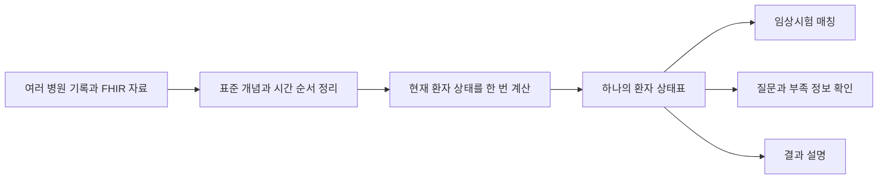
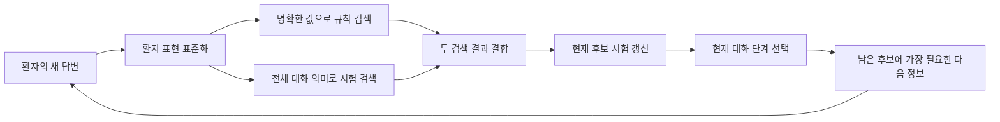
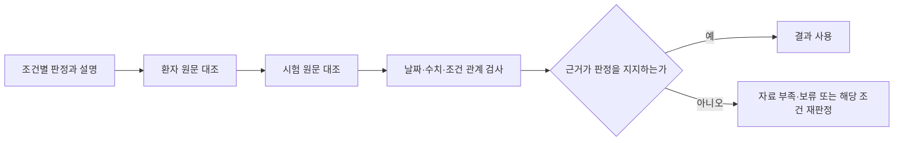
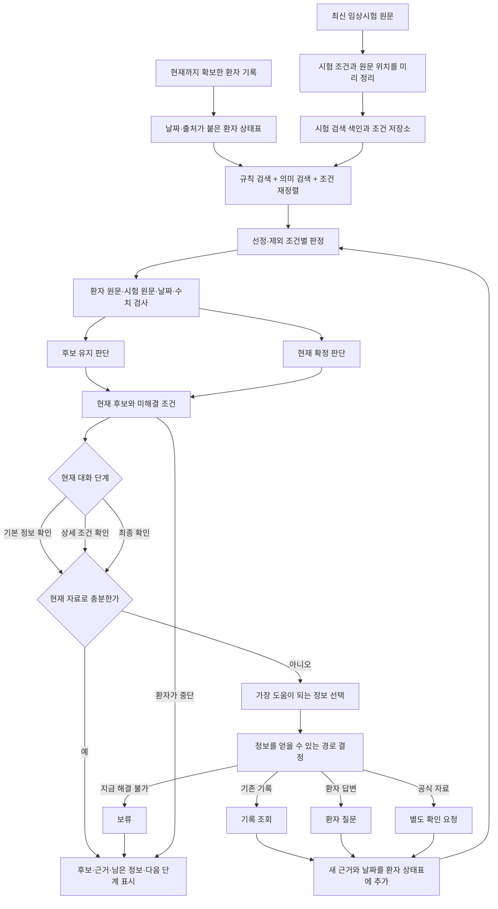

# ClarifyTrial v5 에이전트 구조 조사와 최종 재설계

문서 상태: v5 구현 구조 기준

조사 기준일: 2026-08-20

현행 연구 계획: [CLARIFYTRIAL_RESEARCH_PLAN_V5.md](CLARIFYTRIAL_RESEARCH_PLAN_V5.md)

원 논문·공개 코드 색인: [CLARIFYTRIAL_AGENT_SOURCE_INDEX.md](CLARIFYTRIAL_AGENT_SOURCE_INDEX.md)

공통 RAG·평가 틀 상세 구현계획:
[CLARIFYTRIAL_RAG_EVALUATION_IMPLEMENTATION_PLAN.md](CLARIFYTRIAL_RAG_EVALUATION_IMPLEMENTATION_PLAN.md)

전체 설계 그림: [diagrams/clarifytrial-performance-agent-architecture.mmd](diagrams/clarifytrial-performance-agent-architecture.mmd)

이 문서는 v5 연구 질문을 바꾸지 않는다. 실제 시스템을 어떤 순서와 역할로
구현할지 정한다. v5 구조의 실험은 아직 실행하지 않았고 현재 성능은 미측정이다.

## 1. 최종 선택

논문 수나 에이전트 수를 먼저 정하지 않았다. 실제 성능에 필요한 일을 기준으로
다음 일곱 부분을 한 흐름으로 연결한다.

1. **시험 조건을 미리 정확하게 정리**
   - 시험 원문을 선정·제외 조건, 수치, 기간, 논리와 예외로 나누고 원문 위치를
     붙인다. TrialMatchAI와 EXACT의 구조를 사용한다.
2. **날짜와 출처가 붙은 환자 상태표**
   - 여러 기록에서 현재 환자 상태를 한 번 정리하고 모든 이후 작업이 같은 값을
     사용한다. PRomop의 방식을 작게 구현한다.
3. **후보 검색과 조건별 판정**
   - 후보를 넓게 찾고, 관련 조건을 다시 정렬한 뒤 선정 조건과 제외 조건을 따로
     판정한다. TrialMatchAI를 주 엔진으로 삼는다.
4. **대화와 후보 갱신**
   - 현재 후보와 대화 단계에 맞춰 다음에 필요한 정보를 정하고, 새 정보가 들어오면
     후보를 다시 계산한다. CLEAR-MATCH를 대화 흐름의 주축으로 삼는다.
5. **한 번의 근거 검사**
   - 조건 판정과 설명이 환자 원문·시험 원문·기준일에 실제로 맞는지 확인한다.
     TRIAGE의 감사 구조를 사용한다.
6. **지금 더 알아봐야 하는지 판단**
   - 현재 자료로 중요한 후보를 결정할 수 있는지 먼저 판단하고, 부족할 때만 다음
     확인을 고른다. MediQ의 보류 판단 분리를 사용한다.
7. **가장 도움이 되는 확인 하나를 선택**
   - 여러 시험에 미치는 범위, 중요한 조건을 해결할 가능성, 환자 부담·위험·시간과
     잘못된 후보 제거 위험을 함께 본다. DQueST와 Fink의 장점을 가져오되, 환자
     질문만 강제하지 않고 기록 조회·공식 확인·보류도 선택할 수 있게 한다.

여기에 ClarifyTrial v5의 핵심을 추가한다.

- 이 환자를 후보로 계속 남길 것인가
- 현재 확보한 자료로 참가 조건을 확정할 수 있는가
- 부족한 정보는 기록, 환자, 공식 확인 중 어디서 얻어야 하는가

```text
정확하게 정리된 시험 조건 + 같은 환자 상태표
        ↓
후보 시험 검색과 조건별 판정
        ↓
근거·날짜·수치 검사와 두 판단
        ↓
현재 자료로 충분한지 확인
        ↓
부족할 때만 가장 적절한 확인 경로 선택
        ↓
새 정보가 들어오면 관련 조건만 다시 판단
```

Yang의 환자 중심 챗봇은 이 전체 흐름과 가장 가까운 독립 연구다. 전체 학위논문,
프롬프트와 코드가 공개되지 않아 그대로 복제하지는 못하지만, 대화형 비교군과
구조 점검 기준으로 사용한다.

EXACT는 TrialMatchAI 대신 사용할 수 있는 구조화 규칙 엔진이다. 첫 구현에서 두
엔진을 동시에 섞지 않고 같은 입력에서 비교한다.

## 2. 구조가 충족해야 할 요구사항

| 식별자 | 요구사항 |
|---|---|
| `AR-01` | 환자 입력부터 후보 시험, 다음 확인과 최종 결과까지 한 흐름으로 이어진다. |
| `AR-02` | 환자 답변이나 새 기록이 들어올 때마다 후보 시험이 갱신된다. |
| `AR-03` | 모든 조건 판정에 환자 근거와 시험 원문이 연결된다. |
| `AR-04` | 후보 유지와 현재 확정 판단을 분리한다. |
| `AR-05` | 환자에게 물을 수 없는 검사값과 의료진 판단은 다른 확인 경로로 보낸다. |
| `AR-06` | 질문을 만드는 시스템과 합성 답변을 제공하는 환경을 분리한다. |
| `AR-07` | 날짜, 수치, 단위와 명확한 논리는 코드로 다시 확인한다. |
| `AR-08` | 자료가 부족하면 답을 강제로 확정하지 않는다. |
| `AR-09` | 과거 Solar 데모 수치를 현재 성능으로 사용하지 않는다. |
| `AR-10` | 다음 확인은 효과뿐 아니라 환자 부담·위험·시간과 성급한 후보 제거 위험을 함께 고려한다. |
| `AR-11` | 시험 조건 정리 오류와 환자 판정 오류를 분리해 측정할 수 있다. |

## 3. 주축으로 채택한 선행 구조

### 3.1 PRomop: 모든 작업이 공유하는 환자 상태표

원문: [PRomop 공개 코드](https://github.com/healthkey-ai/PRomop),
[연구 원문](https://arxiv.org/abs/2607.13947)

PRomop은 OMOP 기반의 긴 환자 기록을 매칭에 바로 사용할 수 있는 하나의 넓은
환자 상태표로 바꾼다. 진단, 검사, 치료선, 유전자 정보와 현재 상태를 작업마다
다시 추론하지 않고 한 번 계산해 여러 시스템이 함께 사용한다.



#### 가져올 부분

- 환자 상태를 매 조건마다 다시 해석하지 않는 것
- 여러 기록에서 파생한 현재 상태를 한 곳에서 관리하는 것
- 새 기록이 들어오면 환자 상태표를 갱신하고 모든 후속 기능이 같은 값을 쓰는 것
- 구조화 값의 계산 규칙을 추적할 수 있게 하는 것

#### ClarifyTrial에 맞게 줄일 부분

첫 구현에서 전체 OMOP 데이터베이스와 수백 개 필드를 만들 필요는 없다. v5 합성
사례에 필요한 진단, 치료, 검사, 날짜, 출처와 확인 상태만 가진 작은 환자 상태표를
먼저 만든다.

각 사실에는 값뿐 아니라 다음 정보를 보존한다.

- 환자 원문 위치
- 자료 종류
- 실제 사건 날짜
- 기록 작성 날짜
- 직접 확인한 사실인지 추정인지
- 다른 기록과 충돌하는지

### 3.2 CLEAR-MATCH: 대화와 후보 갱신의 주축

원문: [AMIA 2025 공식 발표 자료](https://amia.secure-platform.com/symposium/gallery/rounds/82021/details/20567)

CLEAR-MATCH는 환자와 대화하는 동안 후보 시험 목록을 계속 갱신한다. 환자는 현재
후보를 보면서 대화를 이어가거나 원하는 시점에 멈출 수 있다.



#### 실제 구성

| 구성 | 하는 일 |
|---|---|
| `StandardizationService` | 진단, 병기, 수술, 치료, 약물, 나이와 성별을 표준 표현으로 정리 |
| `StructuredTrialMatcher` | 명확하게 구조화된 환자 값으로 시험 검색 |
| `EmbeddingTrialMatcher` | 전체 대화의 의미와 가까운 시험 검색 |
| `EligibilityPrioritizer` | 현재 대화와 남은 시험을 보고 다음 질문 선택 |
| `PromptManager` | 대화 단계를 정하고 단계에 맞는 질문 방식 선택 |
| `TrialMatcher` | 위 결과를 합쳐 후보 목록과 다음 질문 반환 |

#### 세 대화 단계

1. **기본 정보 확인**

   진단, 나이, 성별과 치료 이력처럼 후보를 넓게 찾는 데 필요한 정보를 모은다.

2. **상세 조건 확인**

   여러 남은 시험을 효율적으로 구분할 수 있는 조건과 중요한 제외 조건을
   확인한다.

3. **최종 확인**

   후보가 5개 이하가 되면 유력한 시험의 엄격한 선정·제외 조건, 서로 모순되는
   답변과 경계에 있는 정보를 다시 확인한다.

#### 그대로 가져올 부분

- 답변마다 후보와 다음 확인을 함께 갱신하는 구조
- 규칙 검색과 의미 검색을 결합하는 구조
- 남은 시험에 따라 다음 질문을 바꾸는 역할
- 기본 정보, 상세 조건, 최종 확인으로 대화 목적을 바꾸는 구조
- 환자가 현재 후보를 보면서 멈출 수 있는 흐름

#### 보완할 부분

공개 자료는 몇 가지 예비 사례만 보여준다. 다음 질문이 후보를 안전하게 줄이는지,
잘못된 후보 제거가 얼마나 발생하는지는 강하게 평가되지 않았다.

또한 부족한 정보가 모두 환자 질문으로 해결되는 것은 아니다. ClarifyTrial은 먼저
기록 조회, 환자 질문, 공식 확인과 보류 가운데 경로를 고른다.

### 3.3 TrialMatchAI: 검색과 조건 판정 엔진

원문: [Nature Communications 논문](https://www.nature.com/articles/s41467-026-70509-w),
[공식 코드](https://github.com/cbib/TrialMatchAI)

TrialMatchAI는 대화형 시스템이 아니다. CLEAR-MATCH의 `TrialMatcher` 안에서
후보를 찾고 조건별로 판정하는 엔진의 원형으로 사용한다.


#### 실제 구성

- 시험과 환자 양쪽에서 질병, 약물, 유전자, 검사와 증상을 정리한다.
- 나이, 성별, 지역과 모집 상태는 규칙으로 먼저 거른다.
- BM25 글자 일치 검색과 벡터 의미 검색을 결합한다.
- 작은 재정렬 모델이 환자와 관련 있는 시험 조건을 먼저 찾는다.
- 최종 모델은 상위 시험만 조건별로 판정한다.
- 선정 조건은 `충족 / 불충족 / 자료 부족 / 해당 없음`으로 나눈다.
- 제외 조건은 `위반 / 위반하지 않음 / 자료 부족 / 해당 없음`으로 나눈다.
- 조건마다 설명을 구조화해 저장한다.

#### 보고된 근거

- TREC 2021·2022에서 약 26,000개 시험 가운데 상위 500개 검색으로 관련 시험의
  약 90%를 찾았다.
- 전문가가 검토한 환자-조건 950쌍에서 결과 종류별 정확도는 88.8%에서 98.2%로
  보고됐다.
- 구성요소 제거 실험에서는 의료 이름 정리와 조건 재정렬이 정밀도에 큰 영향을
  줬다.

#### ClarifyTrial에서 바꿀 부분

- 검색용으로 확장한 문장을 실제 환자 근거로 사용하지 않는다.
- `자료 부족` 조건을 순위 계산에서 지우지 않고 미해결 부담으로 표시한다.
- 조건의 임상적 충족과 현재 자료의 확정 가능성을 따로 판정한다.
- 새 답변이나 기록이 들어오면 관련 조건만 다시 판정한다.

### 3.4 TRIAGE: 판정 뒤 한 번 수행하는 근거 검사

원문: [JCO Oncology Practice 논문](https://ascopubs.org/doi/10.1200/OP-26-00076)

TRIAGE는 조건 판정과 설명을 만든 뒤 다음 문제를 별도로 검사한다.

- 판단과 설명이 서로 모순되는가
- 근거 없이 환자 사실을 추가했는가
- 원래 기록이 설명을 반박하는가
- 기준일 이후의 정보가 섞였는가
- 서로 연결된 조건을 따로 보아 잘못 판단했는가



ClarifyTrial은 TRIAGE의 시험별 예측 모델 전체를 복제하지 않는다. 조건 판정 뒤
한 번 수행하는 근거 검사만 주 구조에 넣는다. 이 검사는 여러 역할의 토론이 아니라
원문 식별자와 코드 계산을 확인하는 단일 단계다.

### 3.5 Yang 2026: 가장 가까운 독립 전체 연구

원문: [UTHealth Houston 공식 학위 소개](https://sbmi.uth.edu/research/phd-dissertations/a-patient-centric-chatbot-for-improving-clinical-trial-accessibility.htm)

Yang의 시스템은 다음 기능을 한 환자 중심 챗봇에 연결한다.


#### 확인된 구성과 결과

- ClinicalTrials.gov의 조건 구역 442,370개로 ClinicalTrialBERT를 추가 학습했다.
- 조건 의미 묶기, 환자용 질문, 환자 답변 판정을 위한 사람 주석 자료 세 종류를
  만들었다.
- 여섯 암종의 합성 환자와 사람 상호작용으로 전체 챗봇을 평가했다.
- 보고된 전체 정밀도는 0.82, 재현율은 0.74, F1은 0.78이다.

#### ClarifyTrial에서의 역할

- 여러 시험의 중복 조건을 묶어 같은 사실을 반복 질문하지 않는 방법을 참고한다.
- 질문 생성과 환자 답변 판정을 별도 단계로 평가한다.
- 답변을 받을 때마다 후보를 갱신하는 대화형 비교군으로 사용한다.

공식 페이지에는 전체 학위논문, 코드, 질문 선택 계산식과 정확한 종료 조건이
공개돼 있지 않다. 따라서 CLEAR-MATCH처럼 모듈을 그대로 복제하지는 않는다.

### 3.6 EXACT: 대체 가능한 구조화 규칙 엔진

원문: [AMIA 2026 시스템 시연](https://amia.secure-platform.com/amplify/gallery/rounds/82026/details/26163),
[공식 코드](https://github.com/healthkey-ai/exact)

EXACT는 구조화한 환자 정보와 시험 조건을 조건별로 비교한다.

```text
환자 값과 시험 기준값 비교
→ 조건별 통과·실패·자료 부족
→ 사용한 환자 값과 기준값 설명
→ 시험별 eligible·potential·ineligible
```

`potential`은 필요한 자료가 부족하여 아직 결론을 내리지 못한 시험을 나타낸다.
v5의 현재 미확정 상태와 가깝다. 공개 코드가 있어 실제 규칙과 출력 형식을 확인할
수 있다는 장점도 있다.

다만 환자 대화와 다음 정보 선택을 관리하는 시스템은 아니다. 첫 구현에서는
TrialMatchAI식 판정과 EXACT를 동시에 합치지 않는다. 같은 구조화 입력에서 두
엔진을 비교한 뒤, 구조화 규칙이 많은 좁은 질환에서는 EXACT를 대안으로 선택한다.

### 3.7 MediQ·DQueST·Fink: 다음 확인을 잘 고르는 방법

이 세 연구는 전체 임상시험 매칭기를 제공하지는 않지만, 대화 성능을 좌우하는
`다음에 무엇을 확인할 것인가`를 서로 다른 각도에서 다룬다.

| 연구 | 실제로 가져올 부분 | 그대로 쓰지 않을 부분 |
|---|---|---|
| MediQ | 지금 답할 만큼 정보가 충분한지 먼저 판단하고, 부족할 때만 질문을 만드는 분리 구조 | 질문 횟수 한도에 도달하면 최종 답을 강제로 내는 방식 |
| DQueST | 한 번 확인했을 때 여러 남은 시험에 공통으로 영향을 주는 정보를 우선 | 한 답으로 시험을 곧바로 제거하는 방식, 실제 계산을 완전한 정보이득이라고 부르는 것 |
| Fink 계열 | 검사·질문의 비용과 여러 시험·조건에 미치는 범위를 함께 고려 | 공개되지 않은 가중치를 임의로 재현하거나 모든 확인을 검사로 다루는 것 |

ClarifyTrial의 첫 선택 규칙은 복잡한 학습 점수가 아니라 다음 순서로 시작한다.

1. 현재 자료만으로 중요한 후보의 두 판단을 끝낼 수 있으면 추가 확인을 만들지 않는다.
2. 환자가 답할 수 없는 검사값 질문처럼 사용할 수 없는 행동을 먼저 제거한다.
3. 명확한 제외 조건이나 현재 확정을 실제로 바꿀 수 있는 정보를 먼저 본다.
4. 그 정보가 해결하는 중요 조건 수와 후보 시험 수가 많은 행동을 우선한다.
5. 효과가 비슷하면 부담, 위험, 대기 시간과 비용이 낮은 행동을 고른다.
6. 불확실한 한 답으로 유력 후보를 제거할 위험이 크면 보류하거나 더 믿을 만한
   확인 경로를 선택한다.

이 순서는 구현 가능한 첫 기준선이다. 이후 자료가 쌓이면 각 항목의 중요도를
학습하거나 조정할 수 있지만, 실험 전에는 임의의 숫자 가중치를 성능 근거처럼
사용하지 않는다.

## 4. ClarifyTrial 최종 구조

### 4.1 한 흐름으로 본 전체 구조



### 4.2 시험 조건 준비

시험 조건은 환자마다 다시 해석하지 않는다. 시험 버전마다 한 번 다음 정보를
정리해 저장한다.

- 선정 또는 제외 조건
- 대상 질환, 치료, 검사와 환자 특성
- 수치, 단위와 비교 방법
- 요구 기간과 기준일
- AND, OR, 부정과 예외
- 환자 진술로 확인할 수 있는지
- 기존 기록이나 공식 검사 결과가 필요한지
- 원문 위치

LLM이 조건을 정리한 뒤 코드가 수치, 단위, 날짜와 논리 구조를 검사한다. 원문과
구조가 맞지 않으면 자동 판정에 사용하지 않고 검토 필요로 남긴다.

### 4.3 환자 상태표

환자 상태표에는 값만 저장하지 않는다.

| 항목 | 예시 |
|---|---|
| 환자 사실 | 절대 호중구 수 1,700/µL |
| 원문 위치 | 합성 기록의 문장 식별자 |
| 자료 종류 | 검사 결과, 진료 기록, 환자 답변, 별도 확인 |
| 실제 사건 날짜 | 검사가 실제 시행된 날짜 |
| 기록 작성 날짜 | 문서가 작성되거나 입력된 날짜 |
| 직접 확인 또는 추정 | 원문에 직접 있음, 의학적으로 추정함 |
| 충돌 상태 | 다른 기록과 일치, 충돌, 확인 불가 |

검색용 요약과 동의어는 후보를 찾는 데만 사용한다. 모델이 만든 요약을 새로운
환자 사실로 취급하지 않는다.

### 4.4 후보 검색과 조건 판정

CLEAR-MATCH의 `TrialMatcher` 안에서 TrialMatchAI식 엔진을 실행한다.

1. 모집 상태, 명확한 나이·성별·지역을 규칙으로 거른다.
2. BM25와 의미 검색으로 후보를 넓게 찾는다.
3. 환자와 관련 있는 시험 조건을 재정렬한다.
4. 상위 시험의 선정 조건과 제외 조건을 각각 판정한다.
5. 조건마다 환자 근거와 시험 원문을 연결한다.
6. TRIAGE식 근거 검사가 판정과 원문을 대조한다.

검색 단계에서는 후보를 너무 일찍 잃지 않는 것이 우선이다. 명확한 제외 근거가
없는 `자료 부족` 사례는 후보 목록에서 제거하지 않는다.

### 4.5 대화 단계와 다음 정보 선택

#### 기본 정보 확인

진단, 나이, 성별, 치료 이력과 위치처럼 넓은 후보 검색에 필요한 정보부터
확인한다. 이미 기록에 있으면 다시 묻지 않는다.

#### 상세 조건 확인

여러 남은 시험에 공통으로 영향을 주는 부족 정보를 우선한다. 한 답으로 많은
시험을 정리할 수 있어도 잘못된 후보 제거 위험이 크면 뒤로 미룬다.

#### 최종 확인

유력한 소수 시험의 필수 조건을 확인한다. 오래된 자료, 허용되지 않은 자료 출처,
날짜·수치 경계와 서로 충돌하는 기록을 확인한다.

CLEAR-MATCH처럼 후보가 5개 이하일 때 최종 확인으로 바꾸는 규칙을 첫 기준선으로
사용한다. 이후 v5 합성 자료에서 후보 수보다 미해결 필수 조건 수가 더 적절한지
비교한다.

### 4.6 정보 충분성 판단과 확인 경로 선택

먼저 현재 자료만으로 중요한 후보의 두 판단을 끝낼 수 있는지 확인한다. 끝낼 수
있으면 질문 수를 채우기 위해 새 질문을 만들지 않는다. 끝낼 수 없을 때만 판정을
바꿀 가능성이 있는 부족 정보를 모으고, 사용할 수 있는 확인 경로를 고른다.

| 행동 | 사용하는 경우 |
|---|---|
| `LOOKUP_RECORD` | 이미 존재할 가능성이 높은 검사 결과, 치료일과 진료 기록 |
| `ASK_PATIENT` | 환자가 직접 알고 답할 수 있는 복용, 과거 수술과 생활 정보 |
| `REQUEST_VERIFICATION` | 공식 검사 결과, 수행 상태나 의료진 판단이 필요한 경우 |
| `DEFER` | 현재 안전한 확인 경로가 없거나 사람 해석이 필요한 경우 |
| `NONE` | 이미 확정됐거나 명확한 부적합이어서 추가 확인이 불필요한 경우 |

환자 질문은 `ASK_PATIENT`가 선택된 경우에만 생성한다. 공식 검사 결과를
환자에게 기억으로 답하게 하거나 실제 검사를 시스템이 자동 주문하지 않는다.

사용 가능한 행동이 여러 개면 다음 순서로 우선한다.

1. 명확한 제외 또는 현재 확정을 결정할 가능성이 큰가
2. 중요한 미해결 조건과 후보 시험을 많이 다루는가
3. 믿을 만한 답을 얻을 수 있는 경로인가
4. 환자 부담, 위험, 대기 시간과 비용이 낮은가
5. 틀린 답으로 유력 후보를 성급하게 제거할 위험이 낮은가

첫 구현은 이 순서를 그대로 사용한다. 고정된 숫자 가중치는 정답 자료로 조정한 뒤
별도 실험에서만 사용한다.

### 4.7 두 판단

#### 후보 유지 판단

- `retain`: 추가 확인 가치가 있고 명확한 제외 근거가 없음
- `remove`: 되돌리기 어려운 명확한 제외 근거가 있음
- `uncertain`: 조건 또는 환자 근거 충돌로 후보 판단도 어려움

#### 현재 확정 판단

- `confirmed`: 현재 단계에서 요구된 근거가 충분함
- `not_confirmed`: 임상 사실은 가능하지만 출처·날짜·절차가 부족함
- `ineligible`: 명확한 조건 위반 근거가 있음
- `uncertain`: 자료가 있어도 조건 또는 의학적 해석이 모호함

오래된 정상 검사처럼 참가 가능성을 보여주는 자료는 후보 유지에 사용할 수 있다.
시험이 요구한 최근 공식 검사 결과가 없다면 현재 조건은 확정하지 않는다.

### 4.8 답변 반영과 재판정

합성 실험에서는 질문 시스템이 답을 만들지 않는다.

- 기록 조회기는 미리 정한 합성 EHR에서만 값을 반환한다.
- 환자 답변기는 숨긴 합성 사실 카드에서 직접 관련된 사실만 반환한다.
- 별도 확인기는 미리 정한 공식 결과와 이용 가능 시점을 반환한다.
- 사실이 없으면 모름 또는 확인 불가라고 답한다.

새 정보에는 자료 종류와 사건 날짜를 붙인다. 그 정보가 필요한 조건만 다시
판정하며, 이전 결과와 변화 이유를 함께 보관한다.

### 4.9 종료와 결과

다음 중 하나면 대화를 멈춘다.

- 중요 후보의 현재 상태가 결정됨
- 남은 정보가 후보나 현재 확정을 바꾸지 않음
- 허용된 다음 행동이 없음
- 실험의 행동 한도에 도달함
- 사람 검토 없이는 조건을 해석할 수 없음
- 환자가 현재 후보를 확인하고 중단함

최종 결과에는 다음을 보여준다.

1. 후보로 계속 검토할 시험
2. 현재 자료로 확정된 범위
3. 환자 근거와 시험 원문
4. 남은 정보와 올바른 확인 경로
5. 새 정보 전후에 달라진 조건

## 5. 실제 역할과 실행 단위

`에이전트`라는 이름을 많이 붙이지 않는다. 독립된 판단이 필요한 단위만 역할로
분리한다.

| 실행 단위 | 주 역할 | 근거 구조 |
|---|---|---|
| 환자 상태표 | 날짜·출처가 붙은 현재 환자 상태를 한 번 계산 | PRomop |
| 시험 조건 준비 | 시험 원문을 계산 가능한 조건과 원문 위치로 정리 | TrialMatchAI, EXACT |
| 후보 시험 검색 | 규칙 검색과 의미 검색을 결합 | CLEAR-MATCH, TrialMatchAI |
| 조건 판정 | 선정·제외 조건별 상태와 근거 생성 | TrialMatchAI |
| 근거 검사 | 판정·설명·환자 원문·시험 원문 대조 | TRIAGE |
| 대화 단계 관리 | 기본 정보·상세 조건·최종 확인 전환 | CLEAR-MATCH |
| 정보 충분성 판단 | 지금 멈출지, 정보를 더 알아볼지 먼저 결정 | MediQ |
| 다음 정보 선택 | 중요한 조건과 여러 후보에 도움이 되는 확인 대상 선택 | CLEAR-MATCH, DQueST, Fink |
| 확인 경로 선택 | 기록·환자·공식 확인·보류 중 허용 행동 선택 | ClarifyTrial v5 |
| 결과 집계 | 후보 유지와 현재 확정을 따로 계산 | ClarifyTrial v5 |

첫 구현에는 여러 역할의 토론을 넣지 않는다. 날짜·수치 검사나 원문 근거가
충돌하면 결과를 `uncertain` 또는 `DEFER`로 남긴다. 실제 오답 분석에서 반복
검토가 필요한 유형과 정답이 확보된 뒤에만 별도 추가 실험으로 검토한다.

## 6. 실무 구현 순서

이 절은 큰 순서만 설명한다. 사용할 자료, 공통 RAG, 공식 코드와 재구현의 구분,
입출력 형식과 평가 프로그램은
[공통 RAG·평가 틀 구현계획](CLARIFYTRIAL_RAG_EVALUATION_IMPLEMENTATION_PLAN.md)을
따른다.

### 1단계: 환자 상태와 v5 결과 형식

- 작은 PRomop식 환자 상태표
- 두 판단과 다섯 행동의 JSON 형식
- 환자 근거와 시험 원문 식별자
- 자료 종류, 사건 날짜와 기록 작성 날짜
- 날짜·수치·단위·논리 계산 테스트

### 2단계: 고정 후보의 조건 판정

- TrialGPT 공개 1,015건과 작은 v5 합성 사례 사용
- TrialMatchAI식 선정·제외 조건별 판정
- TRIAGE식 근거 검사
- 후보 유지와 현재 확정을 별도 집계
- 현재 Solar 여섯 호출 구조와 비교

### 3단계: CLEAR-MATCH식 대화 흐름

- 현재 후보와 미해결 조건 상태
- 세 대화 단계
- MediQ식 정보 충분성 판단
- DQueST·Fink식 영향 범위와 부담을 반영한 다음 정보 선택
- 후보 갱신
- 분리된 합성 답변 환경

### 4단계: 확인 경로와 v5 짝 사례

- 기록 조회, 환자 질문, 공식 확인과 보류
- 같은 임상 사실에서 출처·날짜만 다른 짝 사례
- 잘못된 후보 제거와 너무 이른 확정 측정

### 5단계: 실제 후보 검색

- TREC에서 규칙 필터, BM25와 의미 검색
- 조건 단위 재정렬
- 검색 실패와 조건 판정 실패 분리

### 6단계: 대체 엔진과 선택적 추가 기능

- 같은 구조화 입력에서 TrialMatchAI식 판정과 EXACT식 규칙 판정 비교
- 오답 자료가 확보된 뒤에만 반복 검토나 추가 역할 실험

## 7. 비교 실험

### 7.1 전체 구조 비교

1. 강한 단일 모델의 한 번 판정
2. 현재 Solar 여섯 단계 구조
3. TrialMatchAI식 고정 입력 검색·조건 판정
4. CLEAR-MATCH식 대화와 후보 갱신
5. 시험 조건 준비·PRomop식 상태표·TrialMatchAI·CLEAR-MATCH·TRIAGE 검사·
   MediQ식 충분성 판단·DQueST와 Fink식 다음 확인 선택에 v5 두 판단을 추가한
   최종 구조

같은 환자, 같은 후보, 같은 모델과 같은 합성 답변 환경을 사용한다.

### 7.2 다음 정보 정책 비교

- 모든 부족 정보를 확인
- DQueST식으로 많은 후보를 줄이는 질문 우선
- Fink식으로 비용과 여러 시험에 미치는 영향을 함께 고려
- CLEAR-MATCH식 대화 단계와 다음 질문 선택
- ClarifyTrial식 두 판단과 허용 확인 경로 사용

### 7.3 분리해서 볼 결과

- 후보 검색 회수율과 순위
- 조건별 상태와 근거 선택 정확도
- 실제 유지해야 할 후보의 성급한 제거율
- 확인이 남은 사례의 너무 이른 확정률
- 올바른 확인 경로 선택률
- 질문·조회·공식 확인 수
- 호출, 토큰, 시간과 비용

## 8. 기타 선행연구

아래 연구는 주 구조를 정하는 중심 뼈대가 아니라, 특정 구현이나 비교 실험이 이미
존재함을 확인하는 참고 근거다. 상세 원문과 코드 링크는
[출처·코드 색인](CLARIFYTRIAL_AGENT_SOURCE_INDEX.md)에 정리한다.

| 연구 | 참고할 내용 | 주 구조로 사용하지 않는 이유 |
|---|---|---|
| Chen 2025 | 시험 조건 전체를 환자 설문으로 바꾸고 답변 판정 | 정적 전체 설문이며 동적 다음 정보 선택이 중심이 아님 |
| TrialGPT | 넓은 검색, 조건별 근거 문장과 시험 순위 | 대화와 새 정보 선택이 없음 |
| OncoAgents | 시간·부정·단위 규칙, 새 기록 뒤 재선별 | 공개 코드와 전체 프롬프트가 없고 종양 지식 그래프 유지 부담이 큼 |
| MAKAR | 조건 설명을 보충한 뒤 원문 보존 검사 | 정보 부족을 불충족으로 처리하며 공개 코드가 없음 |
| AIDS2 | 직접 확인한 사실과 의학적으로 추정한 상태의 분리 | 사람이 만든 오래된 확률 지식망을 그대로 구현하지 않음 |
| CliniCARE-Bench | 환자 근거·정책 근거와 보류 평가 | 임상시험 매칭 시스템이 아니라 평가 하네스 |
| MDAgents·MedAgents·MCC | 어려운 의료 문제의 반복 검토 방식 | 추가 호출 효과가 섞이며 현재 핵심 흐름에 필수적이지 않음 |
| Should we be going MAD? | 반복 토론이 항상 단일 모델보다 낫지 않다는 결과 | 구현 요소가 아니라 과도한 다중 역할 사용을 막는 근거 |

## 9. 아직 말할 수 없는 것

실험 전에는 다음을 주장하지 않는다.

- 이 구조가 TrialMatchAI, CLEAR-MATCH 또는 EXACT보다 정확하다.
- 두 판단을 추가하면 전체 추천 성능이 오른다.
- 질문 수나 검토 시간이 줄어든다.
- 실제 임상 업무에서 사용할 수 있다.
- 반복 검토나 여러 모델이 성능을 높인다.

현재 말할 수 있는 것은 다음이다.

- 최신 대화형 전체 구조와 강한 검색·판정 엔진을 중심으로 구현 순서를 정했다.
- ClarifyTrial의 차이는 새 에이전트 수가 아니라 후보 유지와 현재 확정의 분리다.
- 다음 정보는 환자 질문 하나가 아니라 허용된 확인 경로로 선택한다.
- 이 선택의 효과는 v5 정답 자료와 같은 조건의 비교 실험으로 측정해야 한다.

과거 Solar 합성 데모 수치, 특히 84%는 현재 성능이나 기준선이 아니다.
