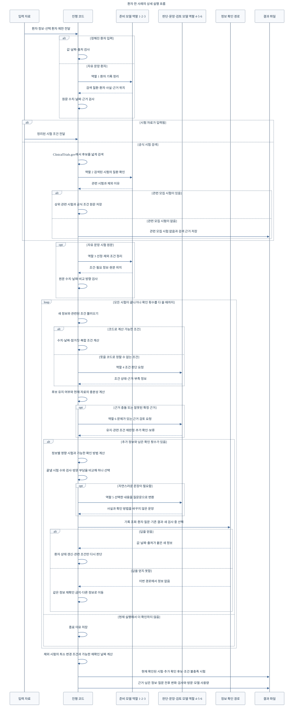

# ClarifyTrial v5 모델 호출과 코드 실행 구조

상태: 범용 JSON 실행, 질문·답변·재개, 전체 흐름 평가와 보고서 생성 완료
정리일: 2026-08-24

기본 입력은 환자 사실, 시험 조건, 부족한 정보와 확인 방법을 정해진 칸에 넣은 JSON
파일이다. 코드는 여러 후보 시험을 한꺼번에 보고, 남은 확인 횟수 안에 가장 많은 시험의
판단을 끝낼 수 있는 정보 조합을 계산한다. 그다음 환자의 이동·비용·시간 부담과 사람
승인 규칙에 맞는 확인 방법을 고른다.

여기서 `에이전트`는 독립적인 인공지능 한 명을 뜻하지 않는다. 같은 언어모델을 서로
다른 지시문과 입력으로 부르는 역할 단위다. 언어모델은 복잡한 참가 조건을 해석하고
판단 이유와 질문 문장을 쓴다. 코드가 고른 정보, 확인 방법과 다시 판단할 조건은 바꿀
수 없다.

자유롭게 작성된 기록을 받을 때만, 실행 전에 환자 기록과 시험 조건을 JSON으로 옮기는
준비 호출을 사용한다. 코드는 모델이 옮긴 수치·단위·날짜·비교 방향·자료 출처가 실제
문서와 맞는지 확인한다. 띄어쓰기와 줄바꿈은 검사하지 않는다.

- 연구 기준: [CLARIFYTRIAL_RESEARCH_PLAN_V5.md](CLARIFYTRIAL_RESEARCH_PLAN_V5.md)
- 근거문헌과 공개 코드: [CLARIFYTRIAL_AGENT_SOURCE_INDEX.md](CLARIFYTRIAL_AGENT_SOURCE_INDEX.md)
- 관련 시험 검색과 평가 구현: [CLARIFYTRIAL_RAG_EVALUATION_IMPLEMENTATION_PLAN.md](CLARIFYTRIAL_RAG_EVALUATION_IMPLEMENTATION_PLAN.md)
- 전체 구조: [PNG](diagrams/clarifytrial-workflow.png) · [SVG](diagrams/clarifytrial-workflow.svg) · [Mermaid](diagrams/clarifytrial-performance-agent-architecture.mmd)
- 상세 실행 흐름: [PNG](diagrams/clarifytrial-detailed-workflow.png) · [SVG](diagrams/clarifytrial-detailed-workflow.svg) · [Mermaid](diagrams/clarifytrial-detailed-workflow.mmd)

## 1. 결정된 구조

ClarifyTrial은 **항상 쓰는 모델 역할 2개, 코드 진행 관리와 필요할 때만 쓰는 검토
역할 1개**로 구성한다. 검색·판단과 다음 확인 문장 작성은 같은 모델을 쓸 수 있지만,
지시문·입력·대화 기록과 출력 형식은 분리한다. 진행 관리는 기본적으로 코드가 맡고,
비교가 필요할 때만 같은 출력 계약의 모델 역할로 바꾼다.

자유 형식 입력을 사용할 때는 반복 흐름에 들어가기 전에 다음 두 역할을 호출한다.

| 준비 역할 | 호출 횟수 | 맡은 일 |
|---|---:|---|
| 환자 기록 정리 | 환자 기록당 1회 | 검색 질환, 환자 사실과 이를 뒷받침하는 근거 문구 추출 |
| 시험 조건 정리 | 검색된 시험당 1회 | 선정·제외 조건, 부족 사실과 이를 뒷받침하는 근거 문구 추출 |

두 준비 역할은 대화를 이어 가거나 다음 행동을 고르지 않는다. 입력을 모든 역할이
함께 읽을 수 있는 JSON 형식으로 옮긴다. 근거가 문서의 어느 부분에 있는지는 코드가
찾는다. 근거 문구가 없거나 중요한 수치가 실제 문서와 다르면 실행을 중단한다.

| 실행 역할 | 맡은 일 | 언제 부르는가 |
|---|---|---|
| 진행 관리 | 환자별 상태를 읽어 다음 모델·도구와 종료 시점을 정함 | 항상 코드, 비교할 때만 모델 |
| 검색·판단 | 후보 시험을 찾고 조건별 임상 상태와 근거 충분성을 판단 | 처음과 관련 정보 변경 뒤 |
| 다음 확인 | 코드가 고른 사실과 경로를 질문 또는 확인 요청문으로 작성 | 정보가 부족할 때 |
| 선택적 검토 | 중요한 결론의 근거 충돌, 날짜·출처 문제와 성급한 확정을 독립적으로 재검사 | 정해진 조건에 걸릴 때 |

핵심 결과는 두 가지다.

| 질문 | 결과 |
|---|---|
| 이 환자를 후보로 계속 검토할 것인가? | 후보 유지 / 후보 제거 / 판단 어려움 |
| 현재 자료로 참가 조건을 확인할 수 있는가? | 현재 확인 / 확인 대기 / 부적합 / 판단 어려움 |

확인 대기 상태에서는 판정을 억지로 끝내지 않는다. 결과를 바꿀 수 있는 부족 정보
하나를 고르고, 그 정보를 기존 기록, 환자 답변, 공식 검사·의료진 확인 중 어디에서
얻을지 정한다.

검색할 시험 모음, 환자 상태표, 날짜·수치 계산, 결과 합치기, 평가용 답변과 결과
서식은 모델 역할이 아니다. 여러 역할이 함께 사용하는 자료와 코드다. 임상시험 조건을
미리 정리하는 일도 환자 대화가 시작되기 전의 준비 작업이다.

## 2. 전체 구조

### 2.1 에이전트 구성



[수정 가능한 Mermaid 원본](diagrams/clarifytrial-performance-agent-architecture.mmd)

코드 진행 관리는 현재 상태에 따라 판정, 다음 확인, 선택 검토 또는 종료를 고른다.
새로 얻은 정보와 검토 결과는 상태표로 돌아가 필요한 부분만 다시 처리한다.

### 2.2 환자 한 사례의 상세 실행 흐름



[수정 가능한 Mermaid 원본](diagrams/clarifytrial-detailed-workflow.mmd) ·
[SVG](diagrams/clarifytrial-detailed-workflow.svg)

연한 남색 상자는 모델 역할, 회색 상자와 마름모는 공통 자료·코드·도구, 진한 남색
상자는 결과다. 코드 진행 관리는 주기의 시작과 판정 뒤 같은 환자 상태표를 다시 읽는다.
평가 중 기록 조회, 환자 질문 또는 공식 확인을 선택하면 사례에 미리 정한 합성 사실을
반환하므로 시스템이 원하는 답을 새로 만들 수 없다.

## 3. 에이전트 사이의 전달 규칙

모델 호출끼리 긴 자유 대화를 주고받지 않는다. 코드 진행 관리가 현재 상태에서 필요한
정보만 골라 정해진 형식으로 다음 역할에 전달한다.

| 보내는 쪽 | 받는 쪽 | 전달 내용 |
|---|---|---|
| 코드 진행 관리 | 검색·판단 | 현재 환자 사실, 검색을 바꾸는 값, 후보 시험, 관련 조건과 이전 판단 |
| 검색·판단 | 코드 진행 관리 | 조건별 임상 상태, 현재 자료의 충분성, 양쪽 원문 ID와 부족 사실 ID |
| 코드 진행 관리 | 다음 확인 | 현재 후보, 선택한 부족 사실, 확인 경로와 남은 행동 수 |
| 다음 확인 | 코드 진행 관리 | 확인할 사실 ID, 선택한 경로, 선택 이유와 환자 질문 또는 확인 요청문 |
| 코드 진행 관리 | 선택적 검토 | 문제가 된 조건과 결론, 사용한 환자·시험 원문, 날짜·수치 검사 결과 |
| 선택적 검토 | 코드 진행 관리 | 그대로 승인, 관련 조건 다시 판단 또는 추가 확인 중 하나 |

같은 모델을 여러 역할에 사용하더라도 역할별 대화 기록은 분리한다. 환자 상태는 모델의
대화 기억에 맡기지 않고 환자 상태표, 후보 목록, 아직 확인하지 못한 조건과 실행 기록에
보관한다.

## 4. 단계별 설계

### 4.1 임상시험 조건 준비

임상시험 원문은 프로토콜 버전마다 한 번 정리한다.

- 선정 조건과 제외 조건
- 수치, 단위와 비교 방법
- 요구 기간과 판단 기준일
- AND, OR, 부정과 예외
- 환자 답변으로 확인 가능한지 여부
- 기존 기록이나 공식 확인이 필요한지 여부
- 원문 위치

LLM이 조건을 나눈 뒤 코드가 원문에 있는 수치, 단위, 비교 방향, 기간과 자료 출처를
확인한다. `%`와 `percent`처럼 표기만 다른 단위는 같게 보지만 단위 환산은 하지 않는다.
`HbA1c`와 `hba1c`처럼 검사명 표기만 다른 경우도 같은 항목으로 연결한다. 의학적
동의어와 약어 확장은 용어표 없이 추측하지 않는다.
부정, AND·OR와 예외가 섞인 비수치 조건은 모델이 해석하며 외부 모델 정확도 평가에
남긴다. 이 단계는 TrialMatchAI와 EXACT의 조건 구조화를 참고한다.

### 4.2 환자 상태표

여러 기록에서 같은 환자 정보를 반복해서 해석하면 단계마다 값이 달라질 수 있다.
따라서 모든 단계가 같은 상태표를 읽는다.

| 저장 항목 | 예시 |
|---|---|
| 환자 사실 | 절대 호중구 수 1,700/µL |
| 원문 위치 | 합성 기록의 문장 ID |
| 자료 종류 | 검사 결과, 진료 기록, 환자 답변, 공식 확인 |
| 사건 날짜 | 검사가 시행된 날짜 |
| 기록 날짜 | 문서가 작성된 날짜 |
| 확인 상태 | 원문에 직접 있음 / 추정 / 충돌 / 확인 대기 |

검색용 요약과 동의어는 후보 검색에만 쓴다. 환자 상태를 새로 확정하는 근거에는
원문과 연결된 사실만 사용한다. 상태표 구조는 PRomop에서 가져왔다.

### 4.3 후보 시험 검색

검색은 다음 순서로 진행한다.

1. TrialGPT 방식으로 환자 기록에서 검색어 생성
2. 같은 단어가 직접 겹치는 시험 검색(BM25)
3. 표현이 달라도 의학적 뜻이 가까운 시험 검색(MedCPT)
4. TrialGPT 공개 기본값으로 두 검색 순위 결합
5. 모집 상태, 나이, 성별과 지역을 후보 정보로 표시
6. 후보 시험 안에서 환자와 관련 있는 조건을 위로 재정렬

관련 시험 검색 단계는 놓치는 시험을 줄이는 데 초점을 둔다. 조건을 판단할 때는 검색용
요약 대신 시험 원문을 사용한다. 명확한 값도 첫 검색에서 후보를 바로 지우는 데
쓰지 않는다. TrialGPT 공개 검색을 최소 기준으로 먼저 재현하고, TrialMatchAI식
순서 조정은 같은 공개 평가자료에서 전문가가 환자와 관련 있다고 표시한 시험을 놓치는
비율이 늘지 않을 때만 추가한다.

### 4.4 조건별 판단

선정 조건과 제외 조건을 따로 처리한다.

| 조건 종류 | 상태 |
|---|---|
| 선정 조건 | 충족 / 불충족 / 자료 부족 / 해당 없음 |
| 제외 조건 | 위반 / 위반하지 않음 / 자료 부족 / 해당 없음 |

각 결과에는 환자 근거 ID, 시험 조건 ID, 판단 이유와 부족 정보 ID가 붙는다. 한
모델 호출에서 한 후보 시험의 관련 조건을 묶어 처리해 호출 수와 문맥 차이를 줄인다.

### 4.5 선택적 근거 검토

구조화된 날짜, 수치, 단위와 출처는 코드가 계산 가능한 범위에서 최종값을 적용한다.
모델이 이 계산과 다르게 답해도 검토자에게 결정을 넘기지 않고 코드값으로 바로잡아
실행 기록에 남긴다. 별도 검토 에이전트는 다음 중 하나에 해당할 때만 부른다.

- 중요한 후보를 제거하거나 현재 참가 조건을 확정하려는데 근거가 약함
- 환자 기록끼리 충돌하거나 시험 조건의 뜻이 하나로 정리되지 않음
- 판정 이유가 인용한 환자 원문 또는 시험 원문과 맞지 않음

검토 에이전트는 다음 항목을 독립적으로 확인한다.

- 판단과 설명이 서로 맞는가
- 환자 기록에 없는 사실을 덧붙였는가
- 시험 원문의 수치, 기간, 부정과 예외를 지켰는가
- 판단 기준일 뒤의 정보를 사용했는가
- 서로 연결된 조건을 따로 보아 의미가 달라졌는가

검토 결과는 `그대로 승인`, `관련 조건 다시 판단`, `추가 확인`, `사람 검토` 중 하나다. 공개
자료로 정확한 TRIAGE 내부 검토기를 재현할 수 없으므로, TRIAGE의 원문 인용과
코디네이터 재검토 원칙을 참고한 ClarifyTrial의 선택적 검토로 표시한다.

검토자의 인터넷 검색은 별도 실험에서만 연다. 의학 용어의 관계와 통상적인 기록
관행을 확인할 수 있지만, 환자 원문·사례 번호·공개 정답을 찾거나 환자에게 없는
사실을 채울 수 없다. 검색을 쓰지 않은 검토와 검색을 쓴 검토를 따로 실행해 역할
분리 효과와 외부 자료 효과를 구분한다.

### 4.6 두 판단

#### 후보 유지

- `retain`: 참가 가능성이 남아 있고 추가 확인 가치가 있음
- `remove`: 되돌리기 어려운 명확한 제외 근거가 있음
- `uncertain`: 환자 근거 또는 시험 조건이 서로 충돌함

#### 현재 확인

- `confirmed`: 현재 단계에서 요구하는 근거가 충분함
- `not_confirmed`: 가능성은 있으나 날짜·출처·절차 확인이 남음
- `ineligible`: 명확한 조건 위반 근거가 있음
- `uncertain`: 자료가 있어도 의학적 해석이나 조건 뜻이 모호함

예를 들어 3개월 전 혈액검사가 정상이라면 후보 유지에는 도움이 된다. 시험에서
최근 14일 이내 결과를 요구할 경우 현재 상태는 `not_confirmed`로 두고 새 결과를
기다린다.

### 4.7 지금 더 확인할지 결정

현재 정보로 중요한 후보의 두 판단을 끝낼 수 있는지 먼저 본다. 결론이 충분하면
추가 질문을 만들지 않는다. 정보가 부족하면 결과를 바꿀 수 있는 사실만 후보로
올린다. MediQ의 정보 충분성 판단을 이 위치에 사용한다.

### 4.8 다음 정보와 확인 경로 선택

다음 확인은 고정된 질문 순서가 아니라 현재 남아 있는 후보와 조건을 보고 다시 고른다.

1. 더 많은 미해결 후보 시험을 바꿀 수 있는 사실을 먼저 확인한다.
2. 후보 수가 같으면 더 많은 미해결 조건에 연결된 사실을 고른다.
3. 환자에게 허용된 부담 범위 안에서 추가 부담이 낮은 경로를 고른다.

가능한 환자 답까지 가지처럼 펼쳐 계산하는 평균 우선과 최악 우선 방식도 비교했다.
개발에 사용하지 않은 환자 30명과 공개 조건 값 77,792개 조합에서 단순 규칙보다
안정적으로 높지 않았고 확인 비용도 더 컸다.
따라서 복잡한 계산은 연구용 비교 코드로만 남기고 실제 다음 확인에는 쓰지 않는다.
DQueST식 영향 범위와 Fink식 비용 고려를 결합한 단순 규칙이 현행 선택 방식이다.

#### 첫 질문 정책의 한계와 후속 구현

현재 대화형 평가 코드는 `환자 질문=1`, `기록 조회=2`, `공식 확인=3`의 고정값을
사용한다. 첫 질문 정책을 비교하기 위한 간이값이며 실제 환자 부담을 뜻하지 않는다.
특히 이미 받은 검사 결과를 확인하는 일과 새 검사를 시행하는 일이 모두 `공식 확인`에
들어 있어 현실적인 비용 비교에 사용할 수 없다.

후속 환자의 이동·비용·시간 제한을 반영하는 모듈은 `LOOKUP_RECORD`, `ASK_PATIENT`, `REQUEST_VERIFICATION`이라는
상위 행동을 유지하되, 각 행동 아래의 구체적인 획득 방법을 별도로 기록한다.

| 획득 방법 | 뜻 |
|---|---|
| 내부 기록 확인 | 현재 기관 기록에 있는 자료를 바로 확인 |
| 외부 기록 요청 | 다른 기관의 기존 자료를 받아 확인 |
| 환자 답변 | 환자가 직접 알고 답할 수 있는 정보 확인 |
| 기존 공식 결과 확인 | 이미 시행된 검사·평가 결과의 진위와 날짜 확인 |
| 새 비침습 검사·평가 | 새 혈액검사, 설문, 수행 상태 평가 등이 필요 |
| 새 침습 절차·치료 변경 | 조직검사, 약물 감량·중단처럼 위험이나 치료 방해가 생김 |
| 의료진 판단 | 수치만으로 끝낼 수 없어 담당자의 해석이나 승인이 필요 |

#### 행동마다 저장할 추가 부담

부담을 하나의 비용 숫자로 저장하지 않는다.

| 항목 | 저장 내용 |
|---|---|
| 자료 존재 여부 | 이미 있음 / 외부에 있음 / 새로 만들어야 함 |
| 예상 대기 | 즉시, 시간 또는 일 단위 |
| 방문·이동 | 방문 필요 여부와 이동 부담 단계 |
| 직접 비용 | 없음 / 낮음 / 중간 / 높음 또는 확인되지 않음 |
| 신체 부담 | 없음부터 큰 부담까지 0~3단계 |
| 심리 부담 | 민감한 질문, 불안과 절차 부담 0~3단계 |
| 의료 위험 | 부작용·합병증 가능성 0~3단계 |
| 치료 방해 | 기존 약물이나 치료 일정을 바꿔야 하는지 |
| 추가 시행 여부 | 원래 진료에 예정된 일인지 시험 검토 때문에 새로 하는 일인지 |
| 사람 승인 | 환자·의료진 승인 없이 진행할 수 없는지 |

같은 혈액검사라도 오늘 진료에서 이미 시행할 예정이면 추가 부담이 거의 없고, 별도
방문이 필요하면 부담이 커진다. 따라서 절대 검사비가 아니라 이 환자에게 새로 생기는
부담을 계산한다.

#### 환자 상황표

질환 이름만 보고 부담을 추측하지 않는다. 환자가 밝힌 내용이나 합성 사례에 미리
정한 값만 사용한다.

- 시간 긴급성: 시험 모집 종료나 치료 일정 때문에 얼마나 빨리 알아야 하는가
- 피로와 이동 제한: 방문과 장시간 대기가 얼마나 어려운가
- 경제 부담: 본인 비용에 어느 정도 제약이 있는가
- 절차 선호: 채혈, 영상, 침습 절차와 민감한 질문을 피하고 싶은가
- 기존 진료 일정: 필요한 검사·방문이 이미 예정되어 있는가
- 선택 방식: 가장 빠른 확인 / 추가 부담 최소 / 두 요소의 균형

#### 선택 순서

1. 결과를 바꿀 수 없는 정보는 제외한다.
2. 허용되지 않거나 현재 얻을 수 없는 경로는 제외한다.
3. 같은 사실을 여러 경로로 얻을 수 있으면 새 검사보다 기존 자료를 먼저 사용한다.
4. 안전에 직접 관련되거나 시간이 급한 사실은 별도로 표시한다.
5. 환자가 허용한 부담 범위 안에서 더 많은 중요한 후보와 조건을 해결하는 행동을 고른다.
6. 비슷한 영향을 주는 행동 중 새로 생기는 부담이 낮은 쪽을 고른다.
7. 새 검사, 침습 절차와 치료 변경은 자동 실행하지 않고 예상 이득과 부담을 함께
   보여 준 뒤 환자·의료진 선택 또는 `DEFER`로 보낸다.

| 행동 | 선택하는 상황 | 추가 표시 |
|---|---|---|
| `LOOKUP_RECORD` | 이미 존재하는 검사 결과, 치료일, 진료 기록 | 내부·외부 기록과 예상 대기 구분 |
| `ASK_PATIENT` | 환자가 직접 알고 답할 수 있는 복용, 과거 수술, 생활 정보 | 민감도와 심리 부담 표시 |
| `REQUEST_VERIFICATION` | 기존 공식 결과 확인, 새 검사·평가 또는 의료진 판단 | 새 시행 여부, 위험과 사람 승인 표시 |
| `DEFER` | 현재 안전한 경로가 없거나 환자·의료진 선택이 필요 | 보류 이유 표시 |
| `NONE` | 추가 확인이 현재 결과를 바꾸지 않음 | 종료 이유 표시 |

환자 질문은 코드가 `ASK_PATIENT`를 선택한 경우에만 LLM이 자연스러운 문장으로 만든다. 질문
우선순위, 민감도, 부담과 종료 판단은 LLM에 맡기지 않는다. LLM은 원문에 적힌 획득
방법과 환자 선호를 구조화할 수 있지만, 코드가 환자가 이용할 수 있는 확인 방법인지와
사람 승인이 필요한지를 검사한다.
검사값을 환자 기억에 맡기거나 시스템이 검사를 자동 주문하는 흐름은 사용하지 않는다.

일반 실행기에서는 사실과 경로를 위 단순 규칙으로 고른다. 다음 확인 역할은 코드가
고른 사실·경로·관련 조건을 그대로 돌려주면서 자연어 질문과 확인 요청문만 작성한다.
다른 식별자나 경로를 반환하면 상태 흐름이 실행을 중단한다.

### 4.9 새 정보 반영과 종료

합성 평가 환경이 미리 정한 답을 반환한다.

- 기록 조회: 합성 EHR에서 해당 사실 반환
- 환자 질문: 환자가 직접 알 수 있는 숨은 사실 카드에서 반환
- 공식 확인: 미리 정한 결과와 이용 가능 시점 반환

새 정보에는 출처와 사건 날짜를 붙인다. 진단, 치료, 연령, 지역처럼 후보 검색을
바꿀 수 있는 값이면 검색부터 다시 실행한다. 특정 조건의 근거만 바뀌면 그 조건과
연결된 후보만 다시 판단한다. 바뀐 이유와 재실행 범위를 실행 기록에 남긴다.

다음 중 하나에 해당하면 흐름을 끝낸다.

- 중요한 후보의 현재 상태가 결정됨
- 남은 정보가 결과를 바꾸지 않음
- 허용된 확인 경로가 없음
- 행동 한도에 도달함
- 사람 검토가 필요한 조건이 남음
- 환자가 현재 후보를 확인하고 중단함

## 5. 실제 실행 단위

반복 계산은 코드에 맡기고, 문장의 뜻을 판단해야 하는 부분에만 언어모델을 사용한다.
한 역할이 언제나 모델 한 번 호출을 뜻하지는 않는다.

| 실행 단위 | 구분 | 실행 시점 | 결과 |
|---|---|---|---|
| 시험 조건 정리 | 준비 작업: 언어모델 + 코드 | 시험 문서 버전마다 한 번 | 정해진 형식의 조건과 문서 위치 |
| 환자 상태표 | 공통 자료: 언어모델 + 코드 | 자유롭게 작성된 새 기록이 들어올 때 | 날짜·출처가 붙은 환자 사실 |
| 관련 시험 검색 | 공통 도구: 검색 코드 | 처음과 검색 조건이 바뀔 때 | 후보 시험과 관련 조건 |
| 진행 관리 | 기본 코드 규칙, 선택 모델 역할 | 환자 흐름의 매 주기 | 다음 호출, 종료 또는 환자 표시 상태 |
| 검색·판단 | 고정 모델 역할 | 처음과 검색 조건·환자 사실이 바뀔 때 | 바뀐 모든 시험을 한 묶음으로 판단한 조건 상태와 근거 번호 |
| 날짜·수치 검사 | 공통 코드 | 조건 판단마다 | 규칙 위반 표시 |
| 두 판단 집계 | 공통 코드 | 조건 결과 변경 시 | 후보 유지와 현재 확인 |
| 다음 확인 | 환자의 이동·비용·시간 제한을 반영하는 규칙 + 문장 작성 모델 | 아직 판단을 끝내지 못한 시험이 있을 때 | 정보·확인 방법·추가 부담은 코드가, 질문 문장은 모델이 작성 |
| 근거 검토 | 필요할 때만 쓰는 모델 역할 | 정해진 검토 조건이 성립할 때 | 그대로 승인, 다시 판단, 추가 확인 또는 사람 검토 |
| 합성 답변 환경 | 공통 도구 | 행동 실행 시 | 미리 정한 새 사실 |
| 결과 보고 | 공통 코드 | 종료 시 | 근거, 남은 정보와 학생 과제 표시 |

모델 역할들은 서로 결론을 설득하기 위한 자유 토론을 하지 않는다. 기본 실행에서는
코드가 정해진 형식의 결과를 모으고 다음 단계를 정한다. 진행 관리 모델은 같은 일을
모델에게 맡겼을 때의 차이를 볼 때만 켠다. 검토 역할은 필요한 경우 한 번만 독립적으로
확인한다.

### 5.1 통합 터미널 화면

`run-screening`은 새 환자 JSON과 시험 JSON·JSONL을 받아 위 실행 단위를 처리하는
일반 명령이다. 질문 답은 터미널에서 직접 입력하거나 파일로 줄 수 있고, 중단한 실행은
저장된 `session.json`에서 이어갈 수 있다. `run-full-ui`는 연구의 고정 합성 환자와
저장된 시험 조건으로 같은 흐름을 화면에 재현하는 명령이다. 자유롭게 작성된 기록을
JSON으로 바꾸는 준비 호출은 선택 기능으로 분리한다.

일반 명령의 후보 검색은 두 가지를 같은 연결점에서 바꿔 쓴다. 작은 파일은 그 안에서
바로 검색하고, 준비된 TrialGPT 자료가 있으면 BM25·MedCPT 결합 검색을 사용한다.
어느 검색기를 쓰든 실제 조건 판단에는 사용자가 준 구조화 시험 조건만 들어간다. 첫
후보 목록과 검색 방법은 세션에 저장하므로 재개할 때 후보가 갑자기 바뀌지 않는다.

직접 받은 답은 요청 방법과 실제 자료의 종류를 구분해 저장한다. 예를 들어 시스템이
공식 결과를 요청했더라도 사용자가 문장만 입력하면 `환자 답변·확인 전`으로 남는다.
JSON에 공식 자료라는 표시, 자료 위치, 확인 상태와 날짜가 들어왔을 때만 그 구분을
사용한다. 정보가 없다는 답은 세션에 남겨 같은 실행에서 반복 질문하지 않되, 다른
정보는 계속 확인한다. 이후 `다시 확인`을 명시하면 해당 항목을 새로 시도한다.

새 검사나 치료 변경처럼 큰 부담이 있는 방법은 환자 선택과 담당자 승인을 별도 단계로
저장한다. 두 단계가 모두 필요한 경우 환자 선택을 먼저 받고, 담당자 승인까지 기록된
뒤에만 정보 확인 도구를 실행한다.

```text
표준 JSON 환자 상태 읽기
→ 공개 시험 15개에서 질환이 같은 시험을 먼저 고르고 문구가 가까운 순서로 정렬
→ 후보 5개의 저장된 조건 불러오기
→ 코드가 다음 단계를 정하고 검색·판단 역할 호출
→ 코드가 확인할 정보와 경로 선택
→ 다음 확인 역할이 질문 또는 요청문 작성
→ 합성 답을 행동 뒤에만 공개하고 관련 조건 재판정
→ 최종 상태, 남은 정보, 종료 이유와 역할별 호출량 표시
```

화면은 실행 상태를 표시할 뿐 후보, 질문 순서나 결론을 바꾸지 않는다. 합성 답은
확인 행동이 정해진 뒤에만 열리며, 기본 실행은 답을 적용하기 전에 Enter를 기다린다.
자유문 입력부터 연결하는 기존 `run-natural-screening`은 별도 선택 명령으로 유지한다.
`run-full-ui` 화면의 검색은 저장된 시험 15개 안에서 연결을 보여 주는 기능이다. 수만
건 검색은 `run-screening`의 TrialGPT 검색 선택지로 실제 흐름에 붙일 수 있고, 검색
단계 자체의 성능 수치는 TREC 평가 명령에서 별도로 확인한다.

팀의 대회 입력은 `topics` 배열 안에 환자 번호 `num`과 합성 환자 기록 `title`이 들어
있다. `run-challenge`는 `title`을 환자 JSON으로 오해하지 않고, 준비 역할이 문장에서
질환과 환자 사실을 먼저 찾게 한다. 그 결과를 기존 `run-screening` 입력 파일로 저장한
뒤 같은 검색·판정·질문·재판정·세션 코드를 실행한다. 여러 실행 경로가 서로 다른 판정
규칙을 갖지 않도록 대회 입력 처리는 변환 단계에만 둔다.

```text
topics[num, title]
→ title에서 질환과 환자 사실 정리
→ 관련 시험 검색과 처음 후보 순위 저장
→ 시험 조건 정리
→ 공통 여러 시험 실행기
→ 직접 답변 또는 기존 자료 파일 입력
→ 관련 조건만 다시 판단
→ 설명이 붙은 최종 목록과 세션 저장
```

시험 조건은 환자마다 달라지지 않으므로 처음 정리한 결과를
`runs/trial-protocol-cache`에 저장한다. 다음 환자에게 같은 시험이 다시 포함되면 저장된
조건과 부족 정보 정의를 바로 사용한다. 캐시는 시험 원문 전체, 조건 정리 지시문,
출처 검사 방식과 모델 설정으로 구분한다. 이 가운데 하나라도 바뀌면 이전 결과 대신
새 항목을 만든다. 캐시 파일을 읽거나 쓸 수 없어도 실행은 계속하며 해당 상태를 실행
기록에 남긴다.

코드에서는 다음 경계를 사용한다.

| 파일 | 맡은 일 |
|---|---|
| `challenge_contracts.py` | topics 입력과 실행 옵션 검사 |
| `challenge_input.py` | 환자 문장 변환, 직접 답변 경로와 공통 JSON 저장 |
| `challenge_runner.py` | 캐시, 후보 검색, 판정과 세션 실행 순서 |
| `challenge_cli.py` | 명령줄 옵션, 모델 제공자와 검색기 선택 |
| `challenge.py` | 기존 import가 깨지지 않도록 위 기능을 한곳에서 다시 공개 |

각 파일은 바로 다음 단계의 공개 자료형만 넘긴다. 입력 파일 형식 변경은 계약과 변환
모듈에서, 실행 순서 변경은 실행 관리 모듈에서, 명령 옵션 변경은 CLI 모듈에서 처리한다.

### 5.2 최종 추천 순서

추천 순서는 판단과 검색의 의미를 섞은 하나의 점수로 만들지 않는다. 먼저 시험을 현재
자료로 조건 확인이 끝난 시험과 추가 정보가 필요한 시험으로 나눈다. 각 묶음 안에서는
다음 순서만 사용한다.

1. 현재 자료로 조건 확인이 끝난 시험은 처음 검색 순위대로 표시한다.
2. 추가 정보가 필요한 시험은 확인할 정보가 적은 순서로 표시한다.
3. 확인할 정보 수가 같으면 처음 검색 순위를 따른다.
4. 위 값도 같거나 없으면 시험 번호로 순서를 고정한다.

출력에는 최종 목록 순위, 처음 검색 순위와 그 위치에 놓인 이유를 함께 넣는다. 처음
후보 순위는 세션에 저장하므로 실행을 중단했다가 이어도 바뀌지 않는다. 질문 답변 뒤
`추가 확인 필요`에서 `현재 자료로 조건 확인 완료`로 바뀌면 같은 규칙으로 목록을 다시
만든다. 검색 점수 자체로 참가 가능성을 올리거나 서로 다른 조건의 차이를 합산하지 않는다.

### 5.3 복잡한 시험 조건과 시험군의 후속 설계

현재 실행 조건은 각 조건이 필수인 단순 구조다. 숫자·기간 조건의 판단과 질문 정책을
먼저 검증하기 위해 복잡한 `AND`·`OR`, 예외 조항과 시험군별 조건을 임의로 평평하게
풀지 않는다. 이 확장은 다음 자료가 준비됐을 때 구현한다.

```text
시험
├─ 공통 조건: 모든 참가자에게 적용
├─ 시험군 A 조건
└─ 시험군 B 조건

조건식
├─ 모두 충족
├─ 하나 이상 충족
├─ N개 이상 충족
└─ 예외 조건
```

각 끝 조건은 지금 쓰는 근거·부족 정보·수치·기간 검사와 연결한다. 상위 조건식은 코드가
끝 조건의 결과를 묶고, 어느 가지 때문에 후보 유지·확정·제외가 됐는지 남긴다. 현재
구현한 추천 순위는 이 조건 구조를 추측하지 않는다. 실제 원문에서 조건식과 시험군
정답을 만들 방법이 정해지기 전까지는 이 부분만 연구 구상으로 둔다.

## 6. 모델과 실행 조건

| 용도 | 모델 | 설정 |
|---|---|---|
| 주 구조 비교 | GPT-5.6 Sol | ChatGPT 구독 연결, `medium` effort |
| 생각량 민감도 확인 | GPT-5.6 Sol | `high` effort, 엇갈린 사례만 실행 |
| 제공자 민감도 확인 | Claude Sonnet 5 | `medium` effort, 대표 사례만 실행 |
| 저비용 작동 확인 | Solar Pro 4 | 제공자가 지원하는 중간 추론 설정 |

모든 주 비교는 같은 GPT-5.6 Sol `medium` 설정을 사용한다. 사례에 따라 모델을 바꾸는 자동
전환은 사용하지 않는다. 모델 제공자별 차이는 공통 어댑터가 처리하며, 에이전트
코드와 평가기는 그대로 둔다.

ChatGPT 구독 연결은 공식 Codex Python SDK와 App Server를 사용한다. 역할별 출력
자료형을 JSON Schema로 전달하고 읽기 전용·네트워크 차단 상태에서 실행한다. 단일
구조와 멀티에이전트 구조에는 같은 모델, 생각량, 원문과 검색 결과를 제공한다. 전체
자료는 한 번 실행하고 개발 20조합과 주 결과가 엇갈린 일부 사례만 반복해 흔들림을
확인한다. 상세 실행계획은
[RAG·평가 구현계획](CLARIFYTRIAL_RAG_EVALUATION_IMPLEMENTATION_PLAN.md)에 둔다.

## 7. 호출 규칙과 출력 형식

시험 조건과 환자 상태표는 공통으로 미리 계산해 구조 비교에 제공한다. 한 번의
진행 주기에서 호출 수는 다음처럼 계산한다.

```text
검색·판단 묶음 1회
+ 정보가 부족하면 다음 확인 1회
+ 검토 조건에 걸리면 선택적 검토 1회
+ 형식 오류가 있으면 수정 1회
```

기본 실행에서는 다음 단계가 하나뿐이면 코드가 진행하므로 진행 관리 모델을 부르지
않는다. 처음 판단하거나 새 정보가 들어오면 그때 바뀐 시험과 조건을 한 요청으로
묶는다. 제공자 입력 한도를 넘는 경우에만 여러 묶음으로 나눈다. 비교가 필요하면
`--use-model-coordinator`로 진행 관리 모델을 켜고, `--no-batch-judgments`로 시험별
호출 방식도 다시 실행할 수 있다. 전체 호출 수는 후보 수와 조건 수, 확인 횟수에 따라
달라지므로 하나의 숫자로 고정하지 않는다. 대신 다음 실행 제한을 사용한다.

- 외부 확인 행동 최대 3회
- 같은 환자 상태에서 같은 조건 묶음의 중복 판정 금지
- 선택적 검토 최대 1회
- 검토 뒤 관련 조건 다시 판단 최대 1회
- JSON 형식 수정 최대 1회

실제 호출 수, 에이전트별 호출 수, 후보·조건 묶음 크기, 토큰, 시간과 비용을 모두
남긴다. 비교 시스템에는 같은 행동 한도를 적용하고, 호출 수 차이는 성능과 함께
비용 결과로 보고한다. 호출 예산을 맞춘 비교는 별도 보조 실험으로 둔다.

모든 시스템의 결과는 다음 공통 형식으로 바꾼다.

```text
조건별 상태와 환자·시험 근거 ID
후보 유지: retain / remove / uncertain
현재 확인: confirmed / not_confirmed / ineligible / uncertain
다음 행동: LOOKUP_RECORD / ASK_PATIENT / REQUEST_VERIFICATION / DEFER / NONE
확인하려는 사실 ID와 조건 ID
참가 조건 불충족을 만든 숫자·기간 조건의 현재 값, 기준값과 차이
종료 이유
```

사용자 화면은 내부 라벨을 그대로 나열하지 않고 세 묶음으로 집계한다.

1. 현재 자료로 확인된 후보
2. 후보는 유지하지만 추가 확인이 필요한 시험
3. 현재 자료에서 제외되는 시험

좁은 추천은 1번, 넓은 추천은 1번과 2번을 함께 보여준다. `not excluded`와 정보
부족의 라벨 차이가 후보 유지 행동을 바꾸지 않으면 완전한 오답으로 취급하지 않는다.
대신 남은 확인 사항과 현재 확정 여부를 따로 채점한다.

실제 출력에는 두 목록의 포함 규칙을 문장으로 밝히고 시험 ID별 설명을 붙인다.

- `현재 자료만 기준으로 확인된 임상시험`: 현재 확인 상태인 시험만 포함
- `가능성을 넓게 보아 계속 검토할 임상시험`: 현재 확인 시험과 추가 확인 후보를 포함
- 추가 확인 후보: 아직 필요한 사실의 설명, 사실 ID와 허용된 확인 경로를 함께 표시
- 숫자·기간 조건으로 제외된 시험: 현재 값이 해당 기준보다 얼마나 높거나 낮은지 표시

두 번째 목록에 들어갔다는 이유로 참가 가능 상태를 확정하지 않는다. 목록은 모델의
자유 문장이 아니라 검증된 후보 유지·현재 확인 상태에서 코드로 만든다.

환자 입력은 선택 사항이다. 입력이 없으면 `balanced`를 쓰되 비용·이동·절차 부담을
낮다고 추정하지 않고 `미확인`으로 남긴다. 새 검사, 침습 절차와 치료 변경은 입력
여부와 관계없이 자동 실행하지 않는다. 결과에는 환자가 입력한 항목, 기본값을 사용한
항목과 설정 변경 방법을 표시한다.

환자용 화면은 다음 순서로 보여 준다.

1. 현재 확인된 후보, 추가 확인 후보와 현재 제외 시험
2. 다음에 확인할 정보와 그 이유
3. 기존 자료 확인인지 새 검사인지
4. 예상 대기·방문·비용·신체·심리 부담과 의료 위험
5. 지금 가능한 행동, 다른 낮은 부담 경로와 사람 선택이 필요한 행동
6. 새 정보가 조건을 충족·위반하거나 들어오지 않을 때의 예상 변화
7. 숫자·기간 조건으로 제외됐다면 현재 값과 기준의 차이
8. 학생 과제 표시

연구자·의료진용 상세 기록에는 사실·조건·시험 ID, 적용한 환자 입력과 기본값,
선택 경로, 제외한 대안과 이유, 부담 항목, 사람 승인 여부와 근거 ID를 남긴다.
환자 화면의 쉬운 설명과 상세 기록은 같은 사실 ID와 경로를 가리켜야 한다. 상세
자료형은 [RAG·평가 구현계획](CLARIFYTRIAL_RAG_EVALUATION_IMPLEMENTATION_PLAN.md)
13절에 둔다.

다음 확인 에이전트는 숨은 답을 추측하지 않는다. 먼저 남은 확인 횟수 안에서 가능한
사실 조합을 모두 살펴, 가장 많은 시험의 판단을 끝낼 수 있는 묶음을 고른다. 여러
묶음이 같으면 영향을 받는 시험과 조건이 많은 쪽을 택한다. 후보 사실이 5개일 때는
최대 32개 조합이라 근사 규칙을 쓸 이유가 없다. 환자의 이동·비용·시간 제한을 반영하는 모듈은 사용할 수 없는 경로와
환자 한도 위반을 먼저 제거하고, 기존 자료를 새 검사·별도 평가보다 우선한 뒤 환자가
밝힌 선택 방식에 따라 대기와 추가 부담을 비교한다. 시간이 급해도 후보 영향을 먼저
지키고 영향이 같을 때 대기 시간을 줄인다. 같은 우선순위에서는 사실 ID로 순서를
고정한다.

구조화 공개 조건 실행기에서 360개 환자·자료 상황과 다섯 선택 방식을 실행했다.
환자의 이동·비용·시간 제한을 반영해 확인 방법을 고르는 방식은 무승인 결과 공개와 명시한 한도 위반 없이 통제 채택 기준을 통과했다.
합성 부담값을 사용했으므로 실제 환자 편익이나 임상 성능을 뜻하지 않는다.

새 자연어 예비평가에서는 현재 `판단 대기`인 시험과 가장 많이 연결된 정보를 먼저
고르는 규칙이 추가 확인을 한 번만 허용할 때 입력 목록 순서대로 확인하는 방법보다
낮았다. 그래서 남은 확인 횟수 안에서 가장 많은 시험 판단을 끝낼 수 있는 정보 조합을
매번 계산하도록 바꿨다. 개선에 쓰지 않은 새 합성 환자 30명에게 추가 확인을 세 번
허용했을 때, 모든 환자 정보를 알 때와 같은 판단에 도달한 시험 비율은 새 방법 89%,
이전 영향 우선 규칙 87%, 입력 목록 순서대로 확인한 방법 75%였다. 이 결과는 새 방법을 일반 실행기에 연결할 근거지만,
AI 검토 조건과 정해진 문장 틀을 쓴 합성 예비평가라는 한계는 남는다.

형식 오류, 시간 초과와 빈 결과는 각각 오류로 기록한다. 평가 정답으로 모델 출력을
채우지 않는다.

## 8. 선행연구와 구조의 연결

| 구조 | 참고한 연구 | 가져온 부분 |
|---|---|---|
| 환자 상태표 | PRomop | 여러 기록에서 현재 상태를 한 번 계산해 공유 |
| 조건 준비 | TrialMatchAI, EXACT | 기준을 계산 가능한 항목으로 나누고 원문 위치 보존 |
| 검색과 조건 판단 | TrialMatchAI, TrialGPT | 규칙 필터, 글자·의미 검색, 재정렬, 조건별 근거 |
| 대화와 후보 갱신 | CLEAR-MATCH, Yang | 답변마다 후보와 대화 목적 갱신 |
| 선택적 근거 검토 | TRIAGE | 원문 인용과 사람 재검토에 연결되는 판정 구조 |
| 정보 충분성 판단 | MediQ | 답할지 더 확인할지 먼저 결정 |
| 다음 정보 우선순위 | DQueST, Fink | 여러 후보에 미치는 영향과 확인 비용 고려 |
| 환자별 추가 부담 | Thomas et al. 2022, ADPKD 참여자 경험 연구 | 시간·이동·비용·절차 부담과 환자별 차이 반영 |
| 두 판단과 확인 경로 | ClarifyTrial v5 | 후보 유지와 현재 확인을 분리하고 허용 행동 선택 |

EXACT는 구조화 규칙이 많은 좁은 질환에서 TrialMatchAI식 LLM 판정을 바꿔 끼우는
대안이다. Yang의 연구는 가장 가까운 전체 대화형 비교 대상으로 사용한다. 공개된
세부가 부족한 부분은 공통 환경에서 재구성한 구조 비교로 표시한다.

## 9. 구현 순서

1. **공통 자료형**
   - 시험, 조건, 환자 사실, 두 판단, 다섯 행동과 근거 ID
2. **환자 기록 문장 안내**
   - 조건 저장소, BM25 문장 검색과 원문 위치 반환
3. **공통 평가기**
   - 숨은 합성 상태, 행동 결과, 조건·두 판단·다음 행동 채점
4. **고정 후보 조건 판단**
   - TrialGPT 1,015건 변환기, 단일 모델, TrialGPT식 구조
5. **TrialGPT 후보 검색 최소 기준**
   - 검색어 생성, BM25, MedCPT, 순위 결합과 TREC 재현 완료
   - 두 해 모두 단독 검색보다 높은 결합 검색을 공통 최소 기준으로 고정
6. **강한 조건 판단과 선택 검토**
   - 비대칭 부재 규칙, 선정·제외 분리, 검색 없는 검토와 제한 검색 검토
7. **후보 검색을 포함한 전체 추천**
   - 같은 관련 시험 검색 결과에서 TrialGPT식 흐름과 ClarifyTrial 흐름 비교
8. **대화와 행동 정책**
   - 모두 확인, CLEAR-MATCH식, DQueST식, Fink식, MediQ식
9. **환자의 이동·비용·시간 제한을 반영한 확인 방법 선택**
   - 여러 확인 방법, 기존 자료 우선, 환자 상황표와 사람 승인 경계
   - 고정 비용·부담 최소·환자의 이동·비용·시간 제한을 반영해 확인 방법을 고르는 방식의 360개 상황·1,800개 정책 실행 완료
10. **ClarifyTrial v5**
   - 코드 진행 관리, 검색·판단, 다음 확인, 선택적 검토 역할
   - 환자 상태표, 두 판단, 확인 방법과 필요한 조건만 다시 판단
11. **추가 공식 코드**
   - TrialMatchAI와 EXACT 연결

## 10. 비교 실험

첫 구조 비교에는 다음 세 시스템만 넣는다.

1. `S1`: 강한 단일 모델의 한 번 판단
2. `M1`: 정해진 전달은 코드로 처리하고 검색·판단 결과를 코드로 정리하는 구조
3. `M2`: `M1` 뒤에 정보 부족 조건만 다시 보는 검토 역할을 추가한 구조

세 시스템은 GPT-5.6 Sol `medium`과 같은 원문·검색 결과를 사용한다. 단일 구조도
지금까지 가장 강했던 판정 규칙을 사용해 일부러 약한 비교 방식을 만들지 않는다. 공개
TrialGPT 출력은 참고값으로만 둔다.

TrialGPT 자료에 새로 확인할 숨은 사실이 없으므로 이 실험은 다음 확인 에이전트의
성능을 평가하지 않는다. 확인할 경로가 없으면 진행 관리가 종료한다. 다음 확인
에이전트까지 포함한 전체 대화 능력은 v5 합성 답변 환경에서 별도로 평가한다.

모두 확인 정책, 기존 여섯 단계 흐름, CLEAR-MATCH식, DQueST식, Fink식, MediQ식은
첫 세 구조의 결과가 나온 뒤 연결한다.

같은 환자, 후보 시험, 검색 결과, 모델, 행동 한도와 합성 답변 환경을 사용한다.
과거 Solar 실행값은 가져오지 않고 구조만 같은 조건에서 다시 실행한다.

결과는 다음 항목으로 나눠 본다.

- 전문가가 환자와 관련 있다고 표시한 시험을 검색 후보 안에 남긴 비율과 검색 순위
- 조건 상태와 근거 선택 정확도
- 유지해야 할 후보를 너무 일찍 제거한 비율
- 확인이 남았는데 참가 조건을 확정한 비율
- 알맞은 확인 경로 선택률
- 질문·조회·공식 확인 수
- 모델 호출, 토큰, 시간과 비용

이 비교로 추가 호출의 효과, 역할을 분리한 효과와 선택적 검토의 효과를 나눠 본다.
멀티 에이전트라는 이름 자체를 성능 향상 근거로 사용하지 않는다.

개발 20조합 결과는 `S1` 68.7%, `M1` 65.9%, `M2` 65.4%였다. `M2`는 정보
부족 131개를 다시 봤지만 라벨을 바꾸지 않았고 `S1`보다 토큰을 84.6% 더 썼다.
질문 없이 한 번 판단하는 TrialGPT 조건 실험에서는 `M2`를 사용하지 않기로 했다. 이 결과는 전체 구조의 다음 확인,
새 정보 반영과 중단 판단을 포함하지 않으므로, 전체 멀티에이전트 흐름은 v5 합성
답변 환경에서 따로 평가한다.

선정·제외 비대칭 규칙과 두 종류 분리 호출로 만든 강한 단일 판단은 75.8%였다.
그 실제 출력의 경계 사례만 다시 본 검색 없는 검토도 75.8%였고, 일반 의학 검색을
12회 사용한 검토는 74.9%였다. 검색 없는 검토는 정답과 오답을 하나씩 만들었고,
인터넷 검토는 정답 추가 없이 맞던 답 두 개를 틀렸다. 두 검토 방식은 질문 없이 한 번 판단하는 조건
판단에서 기각하고 개발 자료에 맞춰 더 조정하지 않는다.

후보 검색을 포함한 전체 비교에는 TREC 2021·2022에서 재현한 TrialGPT 결합 검색을
공통으로 제공한다. 모든 구조에 같은 후보 목록을 주고 판단 구조만 비교한다. 별도
검색 실험은 이 결과와 추가 순서 조정을 비교하며, 전문가가 환자와 관련 있다고 표시한
시험을 놓치는 비율을 높인 기능은
최종 구조에 넣지 않는다. 현재 조건별 BM25 결과는 관련 시험 검색이 아니라 환자
기록을 읽기 위한 문장 안내로 분류한다.

## 11. 현재 주장 범위

현재 구현에는 공통 자료형, 작은 BM25, 숨은 합성 답변 환경, 구조화된 수치·기간·출처
검사, 역할별 에이전트 호출, 결정 규칙, 상태 흐름과 공통 채점기가 들어 있다. 여러
구조화 시험을 한 환자 흐름에서 판단하고, 기존 자료를 확인해 관련 조건만 다시 판단한
뒤 두 추천 목록을 만드는 실행도 연결했다. 새 검사·침습 절차는 결과를 자동으로 만들지
않고 승인 대기에서 멈춘다. 이 실행은 구조와 경계를 확인하는 코드 검사이며 성능
실험이 아니다. 후보 전체 검색과 TREC 평가, TrialGPT 조건 판단과 GPT-5.6 Sol 개발
구조 비교는 별도로 연결했다. 환자 기록 정리, 후보 검색, 후보 시험 조건 정리와 기존
여러 시험 실행기를 한 명령으로 잇는 코드도 구현했다. 합성 스크립트 모델로 원문 인용,
여러 시험에 공통인 부족 정보를 합치고, 자료를 한 번 확인한 뒤 두 시험을 다시 판단하는 데까지 검사했다. Sol `medium`
합성 사례 한 건에서도 같은 상태 전이를 확인했다. 외부 모델의 자연어 구조화 정확도와
이 전체 흐름의 추천 성능은 아직 측정하지 않았다.

따라서 TrialMatchAI, CLEAR-MATCH, EXACT보다 정확하다는 주장, 질문 수와 검토 시간이
줄었다는 주장, 실제 임상 업무에 사용할 수 있다는 주장은 하지 않는다. 이 판단은
같은 자료와 모델을 사용한 비교 실험 뒤에 내린다.

ClarifyTrial은 같은 환자 사실에서 후보를 남기는 판단과 현재 자료로 조건을
확인하는 판단을 분리한다. 연구는 이 구분이 성급한 후보 제거와 너무 이른 확정을
줄이는지 측정하는 데 초점을 둔다.
