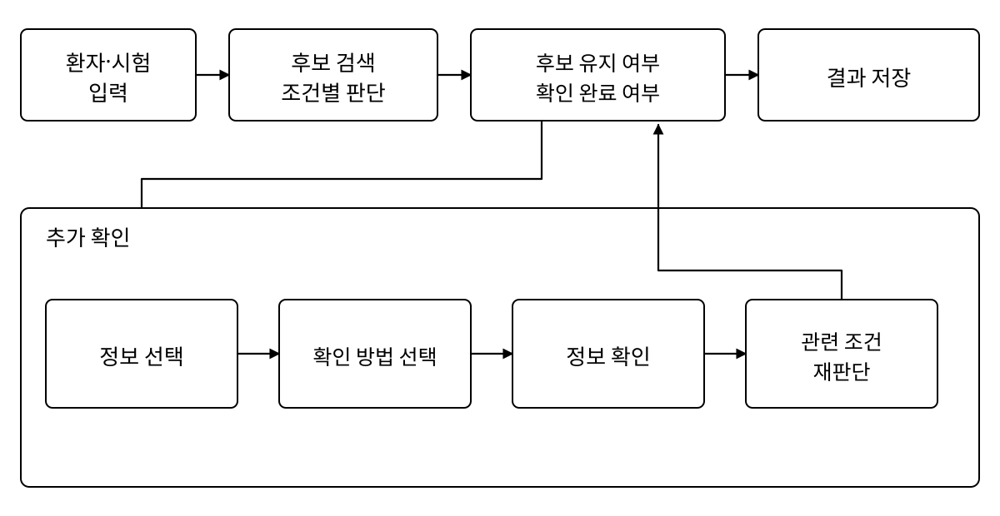

# 제한된 확인 횟수와 환자 제약을 고려한 상호작용형 임상시험 사전선별: ClarifyTrial

> **현행 기준:** `KOSMI_Abstract_hw_clarity_revised_v2.hwp` 
> **확인 시점:** 2026-09-03 
> **HWP 본문·표 수정 시각:** 2026-09-03 01:47 
> 아래 내용은 최신 HWP의 초록, 본문, 표, 그림 문구와 참고문헌을 옮긴 내부 기준 원고다.
> 2026-09-02 23:57에 만든 PDF는 표 수정 전 조판 참고본이다. 현재 PDF는 3쪽이며
> 참고문헌 4~6번이 3쪽으로 넘어가 있어 최종 2쪽 조판은 아직 남아 있다.

<u>김군협</u>¹, 정승진¹, 오상준¹, 채인영¹, 김서환¹, 신민영¹, 이수지¹\* 
¹성균관대학교, 수원시, 대한민국

## Abstract

임상시험 사전선별에서 미확인 정보를 곧바로 충족 또는 불충족으로 처리하면 참가 가능성이
남은 후보를 버리거나 근거가 부족한 시험을 적격으로 확정할 수 있다. ClarifyTrial은
정보가 부족한 시험을 후보로 남기고, 제한된 횟수 안에서 가장 많은 미정 시험과 연결된
정보를 먼저 확인한다. 환자에게 가능한 방법으로 답을 얻으면 그 정보가 쓰인 조건만 다시
판단한다. 공개 임상시험 15건에서 구조화한 객관적 조건 80개와 사전 고정 합성 평가 환자
20명을 이용해 영향 우선 방식을 가능한 모든 확인 순서의 평균, 별도의 개발용 합성
환자에서 얻은 답 분포로 다음 확인의 기대효과를 계산하는 방법, 남은 질문의 조합을 함께
계산하는 방법 등과 비교하였다. 이어 시험과 정보의 연결 구조 1,800개에서 질문 순서가
결과에 영향을 주는 조건을 찾고, 별도의 짝지은 설정에서 환자 제약 적용 전후를
비교하였다. 영향 우선 방식의 전체 200건 기준 상태 일치율은 가능한 모든 확인 순서의
평균보다 5.73%p 높았다. 답 분포로 다음 확인의 기대효과를 계산한 방법은 상태 일치율이
86.0%로 가장 높았지만, 영향 우선 방식과의 차이는 뚜렷하지 않았다. 하나의 정보가 여러
시험에 바로 연결된 구조에서는 영향 우선 방식이, 여러 단계가 이어진 사슬형 구조에서는
조합 탐색이 유리했다. 환자에게 허용되지 않은 검사와 방문을 제외하자 해당 제안은
사라졌지만 설정당 미정 시험은 평균 0.36건 늘었다.

**Keywords:** 임상시험 사전선별, 순차 정보 선택, 환자 제약

## Ⅰ. 서론

임상시험 사전선별에서는 필요한 시점과 출처의 환자 정보가 빠져 있는 경우가 많다. 미확인
값을 불충족으로 처리하면 참가 가능성이 남은 후보를 조기에 제외하고, 부족한 근거로
충족을 확정하면 확인이 끝나지 않은 시험을 적격처럼 제시할 수 있다. 부분 정보의 미정
상태[1], 동적 문진[2], 확인 비용을 고려한 순서 결정[3], 대규모 검색과 조건 판단[4],
추가 질의와 재분류[5], 참여 부담에 따른 선호 차이[6]는 선행연구에서 다루어졌다.

본 연구는 확인 횟수가 제한된 상황에서 어떤 정보를 먼저 확인하고, 환자에게 가능한 방법
가운데 어떤 경로를 사용할지를 함께 다룬다. ClarifyTrial은 정보가 부족한 시험을 후보로
남겨 두고, 새 답과 근거가 들어오면 그 정보가 쓰인 조건만 다시 판단한다. 제한된 확인으로
미정 시험을 얼마나 적격·부적격으로 정리할 수 있는지, 그 효과가 어떤 시험과 정보의 연결
구조에서 커지는지, 환자에게 허용된 경로만 사용하면 미정 시험이 얼마나 늘어나는지를
차례로 평가하였다.

## Ⅱ. 연구 방법

평가는 미정 시험 정리, 연결 구조, 환자 제약의 세 부분으로 구성하였다.

### 1. 시스템 흐름

ClarifyTrial은 참가 가능성이 남아 후보로 유지할지와 현재 근거로 확인을 마칠 수 있는지를
따로 기록한다. 미정 시험이 남으면 각 정보가 몇 개의 미정 시험·조건에 연결되는지와 확인
부담을 함께 따져 다음 정보를 고르고, 환자가 이용할 수 있는 확인 방법을 선택한다. 답과
출처가 들어오면 그 정보가 쓰인 조건만 다시 판단한다. 모든 후보가 정리되거나, 허용한
확인 횟수를 다 쓰거나, 더 이상 가능한 확인 방법이 없으면 멈춘다. 수치·날짜·명시적
논리와 상태 전이는 코드가 처리하고, 자유문장 구조화·조건 해석·질문 작성에만 언어모델을
사용하도록 설계하였다. 정량평가는 구조화 조건과 상태 전이를 코드로 실행했고, 별도 전체
흐름 점검에서는 GPT-5.6 Sol(중간 추론)을 질문 문장 작성에 사용했다.

**그림 1. 상호작용형 임상시험 사전선별 흐름**

### 2. 평가 설계

전체 정보를 제공했을 때의 후보 유지 여부와 확인 상태를 기준으로 삼고, 두 상태가 모두
같을 때 시험 상태가 일치한 것으로 보았다. 구체적인 평가 구성은 표 1과 같다.

**표 1. 평가 구성**

| 평가 | 자료 | 비교 조건 |
|---|---|---|
| 미정 시험 정리 | 공개 시험 15건·조건 80개·합성 환자 20명 | 정보 선택 방법(확인 0~3회) |
| 연결 구조 | 9종×200개(1,800개) | 직접 공유·완전 분리·사슬형 |
| 환자 제약 | 합성 환자 20명·짝지은 설정 80개 | 모든 경로 허용·환자 제약 적용 |

환자마다 서로 다른 정보 가림 2개를 만들고, 각 가림에 시험 5건을 연결하였다. 숨긴 정보
5개 중 무엇을 먼저 확인할지 확인 0~3회에서 비교하고, 3회를 주 평가로 삼았다. 영향 우선
방식은 가장 많은 미정 시험과 연결된 정보를 골랐다. 답 분포 기반 방식은 개발용 합성
환자 10명에서 얻은 분포로 다음 확인의 기대효과를 계산했고, 조합 탐색은 남은 질문의
순서를 함께 계산했다. 무작위 기준은 숨긴 정보 5개의 순서를 120가지로 바꿔 모두 실행한
평균으로 삼았다.

## Ⅲ. 연구 결과

확인 3회 후 초기 미정 120건 중 88건이 적격 또는 부적격으로 정리됐다. 영향 우선 방식의
상태 일치율은 무작위 순서 평균보다 5.73%p 높았다.

**표 2. 주요 평가 결과**

| 구분 | 지표 | 결과 |
|---|---|---:|
| 미정 시험 정리 (확인 3회) | 적격 | 13/30건 |
|  | 부적격 | 75/90건 |
|  | 전체 | 88/120건 (73.3%) |
| 정보 선택 (전체 200건) | 무작위 순서 평균 | 78.27% |
|  | 영향 우선 | 84.0% |
|  | 답 분포 기반 | 86.0% |
| 연결 구조 (1,800개) | 직접 공유¹ | +43.28%p |
|  | 완전 분리¹ | 0.00%p |
|  | 사슬형² | +3.22~4.27%p |
| 환자 제약 (80개 설정) | 새 검사 제안 | 21→0회 |
|  | 추가 방문 제안 | 56→0회 |
|  | 미정 시험 평균 | 0.88→1.24건 |

¹ 영향 우선−무작위 선택. ² 조합 탐색−영향 우선.

## Ⅳ. 고찰

질문 순서의 효과는 정보가 시험과 연결된 모양에 따라 달랐다. 하나의 정보가 여러 미정
시험에 직접 연결된 구조에서는 영향 우선 방식이 무작위 선택보다 크게 앞섰다. 반면 한
답이 다음 질문의 필요성을 바꾸는 사슬형 구조에서는 남은 정보 조합을 함께 계산하는
방식이 더 나았다.

환자가 허용하지 않은 검사와 방문을 제외하면 해당 제안은 사라지는 대신 일부 시험이
미정으로 남았다. ClarifyTrial은 이를 억지로 확정하지 않고 확인 대기로 남긴다. 실제 환자
자료에서 이 선택이 선별 결과와 모집 과정에 미치는 영향은 추가 검증이 필요하다.

## Ⅴ. 결론

ClarifyTrial은 정보가 부족한 시험을 후보로 남기고, 제한된 횟수 안에서 여러 미정 시험에
영향을 주는 정보를 환자에게 가능한 경로로 확인한다. 정보가 여러 시험에 직접 연결될
때는 영향 우선 방식이, 여러 단계가 이어진 사슬형 구조에서는 조합 탐색이 유리했다. 환자
제약을 적용하면 허용되지 않은 검사와 방문을 피하는 대신 일부 시험이 미정으로 남았다.

## 참고문헌

1. Dameron O, Besana P, Zekri O, Bourdé A, Burgun A, Cuggia M. OWL model of clinical trial eligibility criteria compatible with partially-known information. *J Biomed Semantics.* 2013;4:17. doi:10.1186/2041-1480-4-17.
2. Liu C, Yuan C, Butler AM, Carvajal RD, Li ZR, Ta CN, Weng C. DQueST: dynamic questionnaire for search of clinical trials. *J Am Med Inform Assoc.* 2019;26(11):1333-1343. doi:10.1093/jamia/ocz121.
3. Kokku PK, Hall LO, Goldgof DB, Fink E, Krischer JP. A cost-effective agent for clinical trial assignment. In: *Proceedings of the 2002 IEEE International Conference on Systems, Man and Cybernetics.* 2002:60-65. doi:10.1109/ICSMC.2002.1167948.
4. Jin Q, Wang Z, Floudas CS, et al. Matching patients to clinical trials with large language models. *Nat Commun.* 2024;15:9074. doi:10.1038/s41467-024-53081-z.
5. Kern KA. TrialTriage, a semiautonomous prescreening workflow for resolving ambiguity in phase I oncology trial eligibility: development and proof-of-concept study using synthetic cases. *JMIR Form Res.* 2026;10:e100779. doi:10.2196/100779.
6. Thomas C, Mulnick S, Krucien N, Marsh K. How do study design features and participant characteristics influence willingness to participate in clinical trials? Results from a choice experiment. *BMC Med Res Methodol.* 2022;22:323. doi:10.1186/s12874-022-01803-6.
