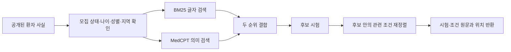

# ClarifyTrial RAG·평가 구현계획

상태: 설계 완료, 구현·실험 전
정리일: 2026-08-20

- 전체 구조: [CLARIFYTRIAL_AGENT_ARCHITECTURE_REDESIGN.md](CLARIFYTRIAL_AGENT_ARCHITECTURE_REDESIGN.md)
- 데이터셋: [CLARIFYTRIAL_DATASETS.md](CLARIFYTRIAL_DATASETS.md)
- 근거문헌과 코드: [CLARIFYTRIAL_AGENT_SOURCE_INDEX.md](CLARIFYTRIAL_AGENT_SOURCE_INDEX.md)
- 연구 기준: [CLARIFYTRIAL_RESEARCH_PLAN_V5.md](CLARIFYTRIAL_RESEARCH_PLAN_V5.md)

## 1. 구현 범위

첫 RAG는 두 가지 검색을 담당한다.

1. 환자에게 관련 있는 임상시험 찾기
2. 후보 시험에서 판단에 필요한 조건 원문 찾기

환자 기록 조회는 별도 기능으로 둔다. 합성 EHR에 있는 사실은 `LOOKUP_RECORD`로
가져오며, 환자에게 아직 공개하지 않은 숨은 정보와 평가 정답은 RAG 색인에서
분리한다.

자료는 두 층으로 준비한다.

| 용도 | 범위 |
|---|---|
| 넓은 후보 검색 | TREC 2021·2022 임상시험 말뭉치의 제목, 질환, 요약과 참가 조건 |
| 정확한 조건 판단 | v5 예비실험에 쓰는 6~10개 시험의 상세 조건과 공개 프로토콜 |

웹 화면을 시험별로 긁는 방식보다 공개 JSONL, ClinicalTrials.gov API와 공식
프로토콜 문서를 사용한다.

## 2. 자료 확보와 후처리

### 2.1 원자료 위치

| 자료 | 공식 위치 | 용도 |
|---|---|---|
| TrialGPT | [공식 저장소](https://github.com/ncbi-nlp/TrialGPT) | 검색 구조, 전처리 코드와 조건 판단 기준선 |
| TREC 2021 | [공식 자료 안내](https://trec.nist.gov/data/trials2021.html) | 검색 설정 개발 |
| TREC 2022 | [공식 자료 안내](https://trec.nist.gov/data/trials2022.html) | 고정 설정 평가 |
| TrialGPT 조건 주석 | [Hugging Face](https://huggingface.co/datasets/ncbi/TrialGPT-Criterion-Annotations) | 조건 상태와 근거 선택 평가 |
| ClinicalTrials.gov | [공식 API](https://clinicaltrials.gov/data-api/api) | v5 상세 시험과 최신 모집 정보 |

원자료와 외부 코드는 Git에서 제외한 `.research-cache/`에 둔다.

```text
.research-cache/
  raw/
    trialgpt/
    trec-2021/
    trec-2022/
    clinicaltrials-gov/
  processed/
    trials/
    criteria/
    topics/
    qrels/
  indexes/
    bm25/
    medcpt/
  retrieval-runs/
```

자료를 처음 받을 때 [DATA_SOURCES.md](../../DATA_SOURCES.md)에 다음 내용을 남긴다.

- 자료 이름과 공식 주소
- 내려받은 날짜
- 이용 조건과 라이선스
- API 사용 조건
- 저장한 파일과 사용한 범위

### 2.2 넓은 검색 자료 후처리

TREC와 TrialGPT 말뭉치를 공통 시험 형식으로 바꾼다.

```text
trial_id
source
protocol_version
title
conditions
summary
eligibility_text
recruitment_status
minimum_age
maximum_age
sex
locations
retrieved_at
```

후처리 순서는 다음과 같다.

1. UTF-8과 줄바꿈 형식을 통일한다.
2. NCT ID를 기준으로 중복 시험을 합친다.
3. 모집 상태, 나이, 성별과 지역을 별도 필드로 분리한다.
4. 선정 조건과 제외 조건 제목을 보존한다.
5. 원문 순서와 줄 위치를 기록한다.
6. 비어 있거나 파싱에 실패한 항목을 별도 목록으로 남긴다.

검색용 텍스트와 판정용 원문을 따로 저장한다. 검색용 텍스트에는 제목, 질환,
동의어와 요약을 쓸 수 있다. 조건 판단은 원래 참가 조건 문장을 사용한다.

### 2.3 v5 상세 시험 후처리

ClinicalTrials.gov에서 6~10개 시험을 고르고, 다음 정보를 저장한다.

- NCT ID, 제목, 모집 상태와 수집일
- 선정·제외 조건 원문
- 조건 원문 위치
- 공개 프로토콜의 문서 버전, 쪽 또는 절
- 검사 유효기간
- 자료 출처와 검사 기관 요구
- 중앙검사, 의료진 판정과 공식 확인 절차

예비실험에는 12~20개 조건 묶음을 사용한다. 조건 묶음마다 날짜, 출처, 확인 절차
또는 선별 단계만 바꾼 2~4개 짝 사례를 만든다.

## 3. 조건 저장소

문장을 일정 글자 수로 자르지 않고, 임상시험 조건 한 항목을 기본 검색 단위로 쓴다.
긴 조건 안에 독립된 여러 절이 있을 때만 하위 항목으로 나누고 원래 조건 ID를
함께 저장한다.

```text
criterion_id
trial_id
protocol_version
criterion_type: inclusion / exclusion
parent_criterion_id
raw_text
section_name
source_location
condition
intervention
recruitment_status
```

`criterion_id`는 자료를 다시 처리해도 바뀌지 않아야 한다. 시험 ID, 프로토콜
버전, 선정·제외 구분과 원문 순서를 조합해 만든다. 원문이 바뀌면 새 버전의 ID를
발급하고 이전 버전을 덮어쓰지 않는다.

## 4. 검색 순서

첫 공통 검색기는 TrialGPT 구조를 기준으로 구현한다.



### 4.1 BM25

- 영어 소문자와 유니코드 표현을 통일한다.
- 질환명, 약물명, 유전자명, 수치와 의학 코드는 보존한다.
- 제목, 질환, 요약과 참가 조건을 필드별로 저장한다.
- 첫 구현은 제목·질환과 조건 원문에 더 높은 가중치를 둔다.

### 4.2 MedCPT

- 환자 질의와 시험 문서를 MedCPT query/article encoder로 각각 변환한다.
- 임베딩은 시험 자료 버전과 모델 이름을 함께 기록해 다시 사용한다.
- 큰 말뭉치는 배치로 처리하고 중단된 지점부터 이어갈 수 있게 한다.

### 4.3 순위 결합

첫 설정은 TrialGPT의 공개 기본값을 따른다.

- BM25 가중치: 1
- MedCPT 가중치: 1
- 결합 상수: 20

설정 조정은 TREC 2021에서 끝낸다. TREC 2022 결과를 확인한 뒤 같은 값을 바꾸지
않는다.

### 4.4 공통 검색 결과

구조 비교에서는 검색 결과를 사례마다 한 번 계산해 모든 시스템에 똑같이 준다.

```text
case_id
query
rank
trial_id
retrieval_score
criterion_id
criterion_rank
raw_text
source_location
```

이렇게 하면 필요한 시험을 찾지 못한 오류와, 찾은 시험을 잘못 판단한 오류를
따로 측정할 수 있다.

## 5. 공통 평가 환경

### 5.1 세 평가

| 평가 | 자료 | 측정 내용 |
|---|---|---|
| 조건 판단 | TrialGPT 1,015건 | 조건 상태, 환자 근거 선택 |
| 후보 검색 | TREC 2021·2022 | Recall@k, nDCG와 순위 |
| 대화와 다음 행동 | v5 합성 짝 사례 | 후보 유지, 현재 확인, 확인 경로와 재판정 |

세 결과는 하나의 총점으로 합치지 않는다.

### 5.2 공통 입력

```text
case_id
as_of_date
screening_stage
observed_patient_facts
candidate_trials
structured_criteria
action_history
remaining_actions
```

환자 사실에는 출처, 사건 날짜, 기록 날짜와 원문 위치가 붙는다. 숨은 전체 환자
상태와 정답은 시스템 입력 파일과 분리한다.

### 5.3 공통 출력

```text
조건별 상태와 환자·시험 근거 ID
후보 유지: retain / remove / uncertain
현재 확인: confirmed / not_confirmed / ineligible / uncertain
다음 행동: LOOKUP_RECORD / ASK_PATIENT / REQUEST_VERIFICATION / DEFER / NONE
확인하려는 사실 ID와 조건 ID
종료 이유
```

논문 시스템이 원래 제공하지 않는 결과는 고정 변환 규칙으로 옮길 수 있는 범위까지만
채운다. 변환할 근거가 없는 항목은 `unsupported`로 기록한다.

### 5.4 합성 답변 환경

질문을 고르는 시스템과 답을 주는 환경을 분리한다.

| 행동 | 환경이 반환하는 내용 |
|---|---|
| `LOOKUP_RECORD` | 미리 만든 합성 EHR의 해당 사실 |
| `ASK_PATIENT` | 환자가 직접 알 수 있는 숨은 사실 카드의 해당 값 |
| `REQUEST_VERIFICATION` | 미리 정한 공식 결과와 이용 가능 시점 |
| `DEFER` | 현재 상태로 종료 |
| `NONE` | 추가 확인 없이 종료 |

주 평가에서는 자연어 질문과 함께 확인할 사실 ID를 선택한다. 무엇을 확인했는지를
주 지표로 쓰고, 문장의 친절함과 이해하기 쉬운 정도는 보조 평가로 둔다.

## 6. 모델 설정과 교체

| 용도 | 모델 | 설정 | 보고 위치 |
|---|---|---|---|
| 주 비교 | Claude Sonnet 5 | `medium` effort, 상황에 따라 생각량 조절 | 주 성능표 |
| 성능 상한 확인 | Claude Opus 4.8 | `high` effort | 대표 사례 보조표 |
| 저비용 작동 확인 | Solar Pro 4 | 제공자가 지원하는 중간 추론 설정 | 개발·비용 보조표 |
| 공식 코드 원형 | 저자 코드가 요구하는 모델 | 논문 설정을 가능한 범위에서 유지 | 원형 실행 기록 |

Sonnet 5는 비기본 `temperature`, `top_p`, `top_k` 값을 받지 않는다. 샘플링 값은
API 기본값을 사용하고, 같은 역할 지시문, 입력 순서와 구조화 출력 형식을 고정한다.
공식 사양은 [Sonnet 5 변경사항](https://platform.claude.com/docs/en/about-claude/models/whats-new-sonnet-5)과
[effort 설정](https://platform.claude.com/docs/en/build-with-claude/effort)을 따른다.

LLM을 사용하는 주 비교는 사례마다 세 번 실행한다. 평균 성능과 함께 세 결과가
달랐던 사례 비율을 보고한다. 모델을 바꾸면 새 실행 묶음으로 기록하며, 서로 다른
모델 결과를 같은 주 성능표에 섞지 않는다.

에이전트 코드는 공통 모델 인터페이스만 사용한다.

```text
ModelRequest
  messages
  response_schema
  reasoning_level
  max_output_tokens
  timeout_seconds

ModelResponse
  parsed_output
  raw_output
  provider
  model_id
  input_tokens
  output_tokens
  latency
  stop_reason
  error
```

각 제공자 어댑터가 공통 `reasoning_level`을 `effort` 또는 대응 설정으로 바꾼다.
지원하지 않는 설정은 실행 전에 오류로 알린다. API 키와 원문 환자 자료는 호출
기록에서 제외한다.

## 7. 한 환자 흐름의 실행 한도

- 외부 확인 행동 최대 3회
- 같은 환자 상태에서 같은 조건 묶음의 중복 판정 금지
- 선택적 검토 최대 1회
- JSON 형식 수정 최대 1회
- 근거 검토 뒤 조건 재판정 최대 1회

한 진행 주기의 모델 호출 수는 `진행 관리 1 + 검색·판정 묶음 B + 다음 확인 0/1 +
선택적 검토 0/1 + 형식 수정 0/1`로 계산한다. 후보 수와 조건 수에 따라 `B`가
달라지므로 전체 호출 수를 하나의 고정값으로 두지 않는다. 조건 묶음 크기와 실제
호출 수를 함께 기록하고, 한도에 도달하거나 안전한 행동이 없으면 `not_confirmed`,
`uncertain` 또는 `DEFER`로 끝낸다.

형식 오류, 시간 초과, 빈 결과와 제공자 오류는 각각 기록한다. 형식 수정은 의미를
바꾸지 않고 JSON 구조만 한 번 고치며 호출 수와 비용에 포함한다.

## 8. 비교 시스템

첫 비교에는 다음 시스템을 넣는다.

1. 강한 단일 모델의 한 번 판단
2. 같은 모델과 같은 정보를 한 대화 맥락에서 여러 번 호출
3. 진행 관리·검색/판정·다음 확인을 분리한 세 에이전트 구조
4. 세 에이전트에 선택적 검토를 추가한 ClarifyTrial v5 전체 구조
5. 기존 여섯 단계 흐름을 Sonnet 5로 다시 실행한 비교군
6. 모든 부족 정보를 정해진 순서로 확인하는 단순 정책
7. TrialGPT식 조건별 판단
8. CLEAR-MATCH식 세 단계 대화와 후보 갱신
9. DQueST식 영향 후보 수 우선 정책
10. Fink식 영향 범위와 부담 우선 정책
11. MediQ식 정보 충분성 판단

1~4번 비교로 추가 호출의 효과, 역할을 나눈 효과와 선택적 검토의 효과를 따로
확인한다.

TrialMatchAI 공식 실행, EXACT와 PRomop 전체 연결은 공통 평가기가 작동한 뒤
추가한다. 공식 코드 위치를 확인하지 못한 구조에는 `논문 기반 재구현`이라고
표시한다.

비교 결과는 세 종류로 구분한다.

| 구분 | 실행 방법 | 해석 |
|---|---|---|
| 공식 코드 원형 | 저자 코드를 가능한 범위에서 실행 | 공개 코드의 작동 범위 |
| 논문 기반 재구현 | 공개된 구조를 공통 입출력으로 구현 | 공개 구조의 참고 결과 |
| 공통 환경 비교 | 같은 모델·검색·행동 환경에서 실행 | 구조 차이를 보는 주 결과 |

## 9. 코드 경계

```text
Clarifytrial/
  src/clarifytrial/
    contracts.py
    llm/
      base.py
      settings.py
      anthropic_client.py
      upstage_client.py
      structured_output.py
    data/
      trial_corpus.py
      eval_cases.py
    retrieval/
      criterion_store.py
      bm25_retriever.py
      dense_retriever.py
      rank_fusion.py
      criterion_reranker.py
    environment/
      hidden_patient.py
      tools.py
      episode.py
    agents/
      coordinator.py
      matcher_judge.py
      next_evidence.py
      selective_reviewer.py
      prompts.py
    systems/
      base.py
      single_llm.py
      legacy_six_stage.py
      trialgpt_controlled.py
      clear_match_reimplementation.py
      dquest_policy.py
      fink_policy.py
      mediq_policy.py
      clarifytrial_v5.py
    evaluation/
      runner.py
      retrieval_metrics.py
      criterion_metrics.py
      episode_metrics.py
      trace.py
  baselines/
    official/
    reimplemented/
  tests/
```

공식 외부 코드는 프로젝트 본문에 복사해 섞지 않는다. 별도 환경에서 실행하고
JSONL 입력·출력 변환기만 연결한다. 모델 제공자 SDK는 `llm/` 안에서만 사용한다.

## 10. 구현 순서

### 1단계: 작은 공통 RAG

- 시험·조건·원문 위치 자료형
- 작은 시험 말뭉치 읽기
- 조건 단위 저장소
- BM25 검색과 원문 위치 반환

### 2단계: 공통 평가기

- 공통 입력과 출력 자료형
- 숨은 환자 상태와 행동 결과
- 결정 규칙만 있는 3~5개 작은 사례
- 가짜 시스템을 이용한 실행과 채점 확인

### 3단계: 조건 판단

- TrialGPT 1,015건 변환기
- 단일 모델과 TrialGPT식 구조
- 조건 상태와 근거 ID 평가

### 4단계: 대화와 행동

- 합성 답변 환경
- 모두 확인, CLEAR-MATCH식, DQueST식, Fink식, MediQ식 정책
- 새 정보 뒤 후보와 관련 조건 갱신

### 5단계: ClarifyTrial v5

- 날짜와 출처가 있는 환자 상태표
- 진행 관리·검색/판정·다음 확인의 세 고정 에이전트
- 후보 유지와 현재 확인 분리
- 확인 경로 선택
- 검색을 바꾸는 정보면 재검색하고 특정 조건 근거만 바뀌면 관련 조건만 재판정
- 중요한 제거·확정과 근거 충돌에서만 선택적 검토 에이전트 호출

### 6단계: 넓은 검색

- TREC 2021·2022 전체 말뭉치
- MedCPT 임베딩
- BM25와 의미 검색 순위 결합
- TREC 2021에서 설정 결정, TREC 2022에서 평가

### 7단계: 무거운 공식 시스템

- TrialMatchAI 공식 실행
- EXACT 연결
- 필요한 공식 코드 원형 실행

## 11. 첫 RAG 완료 기준

- 시험 말뭉치를 읽을 수 있음
- 시험과 조건에 안정된 ID가 붙음
- 환자 질의로 상위 시험과 관련 조건을 찾을 수 있음
- 결과에 조건 원문과 위치가 포함됨
- 같은 입력과 같은 색인에서 같은 검색 결과를 반환함
- 합성 환자의 숨은 사실이 색인에서 분리됨
- 검색 실패와 조건 판단 실패를 따로 기록함
- 단위 테스트와 작은 검색 점검이 통과함

이 시점에는 RAG의 첫 단위만 완성된다. TREC 전체 검색과 v5 성능은 다음 단계에서
측정한다.

## 12. 안전과 결과 표현

- 실제 환자 자료, PHI, API 키와 비공개 시험 자료를 저장소에 넣지 않는다.
- 환자가 답할 수 없는 검사 결과는 공식 확인 경로로 보낸다.
- 시스템은 검사를 자동 주문하거나 실제 등록 결정을 내리지 않는다.
- 임상 출력에는 [MEDICAL_DISCLAIMER.md](../../MEDICAL_DISCLAIMER.md)의 면책 문구를 붙인다.
- v5 성능은 실제 실험 전까지 `미측정`으로 표시한다.
- 과거 Solar 합성 데모와 84% 결과는 현재 기준선과 성능표에서 제외한다.
