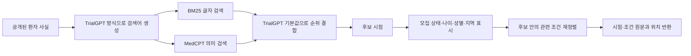

# ClarifyTrial RAG·평가 구현계획

상태: 첫 구현·Claude 조건 평가·GPT-5.6 Sol 개발 구조 비교 완료
정리일: 2026-08-21

- 전체 구조: [CLARIFYTRIAL_AGENT_ARCHITECTURE_REDESIGN.md](CLARIFYTRIAL_AGENT_ARCHITECTURE_REDESIGN.md)
- 데이터셋: [CLARIFYTRIAL_DATASETS.md](CLARIFYTRIAL_DATASETS.md)
- 근거문헌과 코드: [CLARIFYTRIAL_AGENT_SOURCE_INDEX.md](CLARIFYTRIAL_AGENT_SOURCE_INDEX.md)
- 연구 기준: [CLARIFYTRIAL_RESEARCH_PLAN_V5.md](CLARIFYTRIAL_RESEARCH_PLAN_V5.md)
- 검증 결과: [CLARIFYTRIAL_VALIDATION_RESULTS.md](CLARIFYTRIAL_VALIDATION_RESULTS.md)

## 1. 구현 범위

이 문서에서는 세 기능을 구분한다.

1. **후보 시험 RAG**: 전체 시험 말뭉치에서 환자와 관련 있는 시험을 찾는다.
2. **환자 기록 문장 안내**: 이미 정해진 조건과 관련 있는 환자 기록 문장을 표시한다.
3. **외부 의학 자료 확인**: 검토자가 의학 용어와 기록 관행을 확인한다.

`RAG`라는 이름은 첫 번째 기능에만 쓴다. 현재 구현된 작은 BM25는 두 번째 기능의
첫 버전이며, 후보 시험 RAG가 완성됐다는 뜻이 아니다. 후보 시험 RAG의 최소 구조는
TrialGPT 공개 구현의 검색어 생성, BM25, MedCPT와 순위 결합으로 고정한다.

환자 기록 조회는 별도 기능으로 둔다. 합성 EHR에 있는 사실은 `LOOKUP_RECORD`로
가져오며, 환자에게 아직 공개하지 않은 숨은 정보와 평가 정답은 RAG 색인에서
분리한다.

자료는 두 층으로 준비한다.

| 용도 | 범위 |
|---|---|
| 넓은 후보 검색 | TREC 2021·2022 임상시험 말뭉치의 제목, 질환, 요약과 참가 조건 |
| 정확한 조건 판단 | v5 예비실험에 쓰는 6~10개 시험의 상세 조건, 전체 환자 기록과 공개 프로토콜 |

웹 화면을 시험별로 긁는 방식보다 공개 JSONL, ClinicalTrials.gov API와 공식
프로토콜 문서를 사용한다.

## 2. 자료 확보와 후처리

### 2.1 원자료 위치

| 자료 | 공식 위치 | 용도 |
|---|---|---|
| TrialGPT | [공식 저장소](https://github.com/ncbi-nlp/TrialGPT) | 검색 구조, 전처리 코드와 조건 판단 기준선 |
| TREC 2021 | [공식 자료 안내](https://trec.nist.gov/data/trials2021.html) | 검색 설정 개발 |
| TREC 2022 | [공식 자료 안내](https://trec.nist.gov/data/trials2022.html) | 고정 설정 평가 |
| TrialGPT 조건 주석 | [Hugging Face](https://huggingface.co/datasets/ncbi/TrialGPT-Criterion-Annotations) | 조건 상태와 근거 선택 평가 |
| ClinicalTrials.gov | [공식 API](https://clinicaltrials.gov/data-api/api) | v5 상세 시험과 최신 모집 정보 |

원자료와 외부 코드는 Git에서 제외한 `.research-cache/`에 둔다.

```text
.research-cache/
  raw/
    trialgpt/
    trec-2021/
    trec-2022/
    clinicaltrials-gov/
  processed/
    trials/
    criteria/
    topics/
    qrels/
  indexes/
    bm25/
    medcpt/
  retrieval-runs/
```

자료를 처음 받을 때 [DATA_SOURCES.md](../../DATA_SOURCES.md)에 다음 내용을 남긴다.

- 자료 이름과 공식 주소
- 내려받은 날짜
- 이용 조건과 라이선스
- API 사용 조건
- 저장한 파일과 사용한 범위

### 2.2 넓은 검색 자료 후처리

TREC와 TrialGPT 말뭉치를 공통 시험 형식으로 바꾼다.

```text
trial_id
source
protocol_version
title
conditions
summary
eligibility_text
recruitment_status
minimum_age
maximum_age
sex
locations
retrieved_at
```

후처리 순서는 다음과 같다.

1. UTF-8과 줄바꿈 형식을 통일한다.
2. NCT ID를 기준으로 중복 시험을 합친다.
3. 모집 상태, 나이, 성별과 지역을 별도 필드로 분리한다.
4. 선정 조건과 제외 조건 제목을 보존한다.
5. 원문 순서와 줄 위치를 기록한다.
6. 비어 있거나 파싱에 실패한 항목을 별도 목록으로 남긴다.

검색용 텍스트와 판정용 원문을 따로 저장한다. 검색용 텍스트에는 제목, 질환,
동의어와 요약을 쓸 수 있다. 조건 판단은 원래 참가 조건 문장을 사용한다.

### 2.3 v5 상세 시험 후처리

ClinicalTrials.gov에서 6~10개 시험을 고르고, 다음 정보를 저장한다.

- NCT ID, 제목, 모집 상태와 수집일
- 선정·제외 조건 원문
- 조건 원문 위치
- 공개 프로토콜의 문서 버전, 쪽 또는 절
- 검사 유효기간
- 자료 출처와 검사 기관 요구
- 중앙검사, 의료진 판정과 공식 확인 절차

예비실험에는 12~20개 조건 묶음을 사용한다. 조건 묶음마다 날짜, 출처, 확인 절차
또는 선별 단계만 바꾼 2~4개 짝 사례를 만든다.

## 3. 조건 저장소

문장을 일정 글자 수로 자르지 않고, 임상시험 조건 한 항목을 기본 검색 단위로 쓴다.
긴 조건 안에 독립된 여러 절이 있을 때만 하위 항목으로 나누고 원래 조건 ID를
함께 저장한다.

```text
criterion_id
trial_id
protocol_version
criterion_type: inclusion / exclusion
parent_criterion_id
raw_text
section_name
source_location
condition
intervention
recruitment_status
```

`criterion_id`는 자료를 다시 처리해도 바뀌지 않아야 한다. 시험 ID, 프로토콜
버전, 선정·제외 구분과 원문 순서를 조합해 만든다. 원문이 바뀌면 새 버전의 ID를
발급하고 이전 버전을 덮어쓰지 않는다.

## 4. 검색 순서

후보 시험 RAG는 TrialGPT 공개 구조를 그대로 최소 기준으로 삼는다. 모집 상태, 나이,
성별과 지역은 첫 검색에서 후보를 지우는 필터로 쓰지 않고, 검색 뒤에 표시하거나
순위를 조정하는 정보로 쓴다. 명확한 값 하나 때문에 가능성 있는 후보를 일찍 잃지
않기 위해서다.



### 공개 재현과 공통 실행

| 실행 | 구성 | 용도 |
|---|---|---|
| TrialGPT 공식 재현 | 저자 코드, 공개 전처리, 공개 검색어와 기본값 | 우리가 최소 기준을 정확히 옮겼는지 확인 |
| 공통 환경 실행 | 같은 말뭉치와 검색 결과를 ClarifyTrial 평가 형식으로 변환 | 에이전트 구조를 같은 입력에서 비교 |

공식 재현 결과와 공통 환경 결과가 다르면 원인을 해결하기 전까지 ClarifyTrial RAG
성능을 보고하지 않는다. 공식 논문 숫자를 그대로 가져오지 않고 로컬에서 다시
실행한 값을 기준으로 쓴다.

### 4.1 BM25

- 영어 소문자와 유니코드 표현을 통일한다.
- 질환명, 약물명, 유전자명, 수치와 의학 코드는 보존한다.
- 제목, 질환, 요약과 참가 조건을 필드별로 저장한다.
- 첫 구현은 제목·질환과 조건 원문에 더 높은 가중치를 둔다.

### 4.2 MedCPT

- 환자 질의와 시험 문서를 MedCPT query/article encoder로 각각 변환한다.
- 임베딩은 시험 자료 버전과 모델 이름을 함께 기록해 다시 사용한다.
- 큰 말뭉치는 배치로 처리하고 중단된 지점부터 이어갈 수 있게 한다.

### 4.3 순위 결합

첫 설정은 TrialGPT의 공개 기본값을 따른다.

- BM25 가중치: 1
- MedCPT 가중치: 1
- 결합 상수: 20

설정 조정은 TREC 2021에서 끝낸다. TREC 2022 결과를 확인한 뒤 같은 값을 바꾸지
않는다.

### 4.4 공통 검색 결과

후보 검색을 포함한 구조 비교에서는 TrialGPT 공식 재현 이상으로 확인된 검색 결과를
사례마다 한 번 계산해 모든 시스템에 똑같이 준다. 추가 재정렬은 별도 실험에서 먼저
검증하고, 관련 시험 회수를 낮추지 않은 경우에만 공통 검색에 포함한다.

```text
case_id
query
rank
trial_id
retrieval_score
criterion_id
criterion_rank
raw_text
source_location
```

이렇게 하면 필요한 시험을 찾지 못한 오류와, 찾은 시험을 잘못 판단한 오류를
따로 측정할 수 있다.

이미 환자-시험 조합이 정해진 TrialGPT 조건 주석 실험은 후보 시험 RAG 평가가
아니다. 이 실험에서는 전체 환자 기록과 전체 시험 조건을 모델에게 제공하고, BM25
문장 안내는 읽을 위치를 돕는 보조 정보로만 쓴다. 문장 안내가 원문을 잘라내거나
대신하지 않는다.

## 5. 공통 평가 환경

### 5.1 세 평가

| 평가 | 자료 | 측정 내용 |
|---|---|---|
| 조건 판단 | TrialGPT 1,015건 | 조건 상태, 환자 근거 선택 |
| 후보 검색 | TREC 2021·2022 | Recall@k, nDCG와 순위 |
| 대화와 다음 행동 | v5 합성 짝 사례 | 후보 유지, 현재 확인, 확인 경로와 재판정 |

세 결과는 하나의 총점으로 합치지 않는다.

후보 검색은 TREC 2021에서 구현과 설정을 확인하고 TREC 2022에서는 설정을 바꾸지
않는다. 공식 TrialGPT 재현, 같은 구조를 공통 평가기로 옮긴 결과, ClarifyTrial의
추가 재정렬 결과를 나란히 기록한다. 주 지표는 관련 시험을 놓치지 않는 비율이며,
상위 결과의 순위는 nDCG@10과 P@10으로 함께 본다.

### 5.2 공통 입력

```text
case_id
as_of_date
screening_stage
observed_patient_facts
candidate_trials
structured_criteria
action_history
remaining_actions
```

환자 사실에는 출처, 사건 날짜, 기록 날짜와 원문 위치가 붙는다. 숨은 전체 환자
상태와 정답은 시스템 입력 파일과 분리한다.

### 5.3 공통 출력

```text
조건별 상태와 환자·시험 근거 ID
후보 유지: retain / remove / uncertain
현재 확인: confirmed / not_confirmed / ineligible / uncertain
다음 행동: LOOKUP_RECORD / ASK_PATIENT / REQUEST_VERIFICATION / DEFER / NONE
확인하려는 사실 ID와 조건 ID
종료 이유
```

논문 시스템이 원래 제공하지 않는 결과는 고정 변환 규칙으로 옮길 수 있는 범위까지만
채운다. 변환할 근거가 없는 항목은 `unsupported`로 기록한다.

### 5.4 합성 답변 환경

질문을 고르는 시스템과 답을 주는 환경을 분리한다.

| 행동 | 환경이 반환하는 내용 |
|---|---|
| `LOOKUP_RECORD` | 미리 만든 합성 EHR의 해당 사실 |
| `ASK_PATIENT` | 환자가 직접 알 수 있는 숨은 사실 카드의 해당 값 |
| `REQUEST_VERIFICATION` | 미리 정한 공식 결과와 이용 가능 시점 |
| `DEFER` | 현재 상태로 종료 |
| `NONE` | 추가 확인 없이 종료 |

주 평가에서는 자연어 질문과 함께 확인할 사실 ID를 선택한다. 무엇을 확인했는지를
주 지표로 쓰고, 문장의 친절함과 이해하기 쉬운 정도는 보조 평가로 둔다.

### 5.5 다음 구현 단위: 여러 사실을 가린 대화형 사례

```text
InteractiveCase
  base_patient_id
  fixed_candidate_trial_ids[5]
  full_patient_state
  initially_visible_fact_ids
  hidden_fact_ids[5]
  fact_to_criterion_links
  acceptable_actions_by_fact
  reveal_results_by_fact
  full_information_decision
  acceptable_minimal_fact_sets
  action_budget = 3
```

첫 구현은 기본 환자 12명이다. 후보 검색 결과는 각 사례에 고정해 질문 정책만
비교한다. 숨은 사실 다섯 개의 모든 부분집합을 평가기에 넣어, 전체 정보와 같은 후보
유지·제외 결과를 만드는 최소 사실 묶음을 구한다. 질문 순서를 하나의 정답으로
강제하지 않는다.

팀 `masked-eval`의 후보 고정, 문장 마스크 검사와 질문 후 재판정 로그는 기준선
설계로 참고한다. 현재 공개 브랜치에는 라이선스가 없으므로 직접 복사하지 않고,
허락 또는 라이선스 확인 전에는 입출력 호환 독립 구현으로 둔다. 다음 세 부분은
바꾼다.

- LLM이 늘린 환자 문장을 정답으로 사용하지 않고 구조화 상태를 먼저 작성
- 사실 하나씩 따로 가리지 않고 다섯 사실을 동시에 가려 선택 정책 평가
- 완전 기록의 LLM 출력 대신 코드가 계산한 전체 정보 결과를 oracle로 사용

자연어 환자 설명은 구조화 사실을 표현하는 보기 자료다. 정답에 없는 사실이 추가되면
입력 검사를 통과하지 못한다.

## 6. 모델 설정과 교체

| 용도 | 모델 | 설정 | 보고 위치 |
|---|---|---|---|
| 주 구조 비교 | GPT-5.6 Sol | ChatGPT 구독 연결, `medium` effort | 주 성능표 |
| 생각량 민감도 확인 | GPT-5.6 Sol | `high` effort, 주 결과가 엇갈린 20~30개 조건 | 보조표 |
| 제공자 민감도 확인 | Claude Sonnet 5 | `medium` effort, 대표 표본 | 보조표 |
| 저비용 작동 확인 | Solar Pro 4 | 제공자가 지원하는 중간 추론 설정 | 개발·비용 보조표 |
| 공식 코드 원형 | 저자 코드가 요구하는 모델 | 논문 설정을 가능한 범위에서 유지 | 원형 실행 기록 |

주 비교는 단일 구조와 멀티에이전트 구조 모두 `gpt-5.6-sol`, `medium`을 사용한다.
같은 환자 기록, 시험 조건, 공통 검색 결과, 입력 순서와 구조화 출력 형식을 준다.
모델과 생각량을 구조별로 다르게 배정하지 않는다. Sol과 Luna의 입력 한도는
1,050,000토큰, 최대 출력은 128,000토큰으로 같으며, 현재 조건 실험의 호출당 평균은
입력 약 2,400토큰, 출력 약 500토큰이다. 이번 선택은 입력 용량이 아니라 판단
성능을 기준으로 한다. 공식 사양은 [모델 목록](https://developers.openai.com/api/docs/models)과
[GPT-5.6 사용 지침](https://developers.openai.com/api/docs/guides/latest-model)을 따른다.

ChatGPT 구독 연결은 공식 `openai-codex` Python SDK와 Codex App Server를 사용한다.
App Server가 관리하는 ChatGPT 로그인을 이용하며 OAuth 토큰을 파일로 꺼내거나 일반
API 키처럼 사용하지 않는다. 각 호출에는 Pydantic 자료형에서 만든 JSON Schema를
전달하고, 읽기 전용·네트워크 차단 상태로 실행한다. 시작할 때 실제 모델 ID와 현재
구독 한도를 읽고, 사용량 창의 80%에 이르면 저장한 지점에서 멈춘 뒤 한도 초기화
후 이어서 실행한다. 구현 근거는 [Codex Python SDK](https://learn.chatgpt.com/docs/codex-sdk)와
[App Server](https://learn.chatgpt.com/docs/app-server)에 둔다.

전체 자료는 주 설정으로 한 번 실행한다. 연결과 안정성 확인용 20조합만 두 번
실행해 출력 흔들림을 확인한다. 전체 결과를 본 뒤 지시문을 바꾸지 않으며, 주 결과가
엇갈린 20~30개 조건만 Sol `high`로 다시 실행해 생각량에 따른 변화를 보조 분석한다.
모델을 바꾸면 새 실행 묶음으로 기록하고 서로 다른 모델 결과를 같은 주 성능표에
섞지 않는다.

에이전트 코드는 공통 모델 인터페이스만 사용한다.

```text
ModelRequest
  messages
  response_schema
  reasoning_level
  max_output_tokens
  timeout_seconds

ModelResponse
  parsed_output
  raw_output
  provider
  model_id
  input_tokens
  output_tokens
  latency
  stop_reason
  error
```

각 제공자 어댑터가 공통 `reasoning_level`을 `effort` 또는 대응 설정으로 바꾼다.
지원하지 않는 설정은 실행 전에 오류로 알린다. API 키와 원문 환자 자료는 호출
기록에서 제외한다.

## 7. 한 환자 흐름의 실행 한도

- 외부 확인 행동 최대 3회
- 같은 환자 상태에서 같은 조건 묶음의 중복 판정 금지
- 선택적 검토 최대 1회
- JSON 형식 수정 최대 1회
- 근거 검토 뒤 조건 재판정 최대 1회

현재 일반 실행기의 한 진행 주기 모델 호출 수는 `진행 관리 1 + 검색·판정 묶음 B +
다음 확인 0/1 + 선택적 검토 0/1 + 형식 수정 0/1`로 계산한다. 대화형 평가기의 전수
정책은 다음 확인 순서를 코드로 계산하므로 선택을 위한 모델 호출이 0회이며, 환자에게 보여 줄
질문이나 요청문이 필요할 때만 문장 생성 호출을 기록한다. 후보 수와 조건 수에 따라 `B`가
달라지므로 전체 호출 수를 하나의 고정값으로 두지 않는다. 조건 묶음 크기와 실제
호출 수를 함께 기록하고, 한도에 도달하거나 안전한 행동이 없으면 `not_confirmed`,
`uncertain` 또는 `DEFER`로 끝낸다.

형식 오류, 시간 초과, 빈 결과와 제공자 오류는 각각 기록한다. 형식 수정은 의미를
바꾸지 않고 JSON 구조만 한 번 고치며 호출 수와 비용에 포함한다.

## 8. 비교 시스템

### 8.1 바로 실행할 구조 비교

| 이름 | 구조 | 확인할 차이 |
|---|---|---|
| `S1` 강한 단일 구조 | 한 호출에서 근거, 조건 상태와 최종 시험 상태 판단 | 가장 강한 한 번 판단 기준선 |
| `M1` 역할 분리 | 코드 전달 → 검색·판정 → 코드 집계 | 역할 분리의 효과 |
| `M2` 전체 구조 | `M1` + 정보 부족 조건 재검토 | 검토의 순효과 |

세 구조 모두 GPT-5.6 Sol `medium`을 쓰고, 선정·제외 조건의 뜻과 기록 부재 처리
규칙도 같게 둔다. `S1`을 일부러 약한 TrialGPT 원문 지시문으로 두지 않고, 지금까지
가장 강했던 단일 호출 규칙을 사용한다. 공개 TrialGPT 고정 출력은 외부 참고값으로만
표시하며 구조 차이의 주 비교군으로 사용하지 않는다.

TrialGPT 자료에는 질문 뒤 새로 나타나는 사실이 없다. 따라서 이 비교에서는 다음
확인 에이전트의 성능을 억지로 시험하지 않는다. 현재 자료 안에서 더 확인할 내용이
없으면 진행 관리가 종료한다. 이 실험이 직접 비교하는 범위는 근거 검색, 조건 판단,
역할 분리, 코드 집계와 선택 검토다. 기록 조회·환자 질문·공식 확인의 효과는 v5
합성 답변 환경에서 따로 평가한다.

### 8.2 공통 RAG와 입력

완료된 개발 구조 비교는 환자-시험 조합이 이미 정해진 자료를 사용했다. 당시 고정한
BM25 결과는 후보 시험 RAG가 아니라 조건별 환자 문장 안내다. 전체 환자 기록과 시험
조건도 함께 제공했으므로 이 결과를 TrialGPT 후보 검색과 비교하지 않는다.

후보 검색을 포함한 비교에 앞서 TrialGPT 공개 검색을 재현했고 결합 검색을 최소
기준으로 고정했다.
BM25와 MedCPT를 결합한 결과가 최소 기준이다. 모든 구조에는 같은 후보 목록, 같은
시험 원문과 같은 문장 안내를 제공한다. 검색 구조 자체를 비교할 때만 후보 목록을
달리하며, 그 결과와 에이전트 구조 결과를 한 표에 섞지 않는다.

### 8.3 자료 분리와 실행 순서

완전한 조건 원문이 있는 자료는 104개 환자-시험 조합, 1,011개 조건이다.

| 단계 | 자료 | 목적 | 결과 사용 |
|---|---:|---|---|
| 연결 확인 | 2조합 | 로그인, JSON Schema, 기록과 종료 확인 | 점수 보고 안 함 |
| 개발 | 20조합·211조건 | 세 구조가 끝까지 실행되는지 확인 | 형식·프로토콜 오류만 수정 |
| 주 비교 | 개발 환자와 겹치지 않는 64조합·654조건 | `S1`, `M1`, `M2` 짝 비교 | 주 결과 |
| 환자 중복 민감도 | 20조합·146조건 | 같은 개발 환자의 다른 시험에서 방향 확인 | 보조 결과 |
| 생각량 민감도 | 엇갈린 20~30조건 | Sol `medium`과 `high` 비교 | 보조 결과 |

주 비교가 시작된 뒤에는 역할 지시문, 검색 결과, 출력 변환 규칙과 집계 규칙을
바꾸지 않는다. 이 64조합은 이전 조건 지시문 평가에 이미 사용됐으므로 완전히 새
외부 검증자료라고 부르지 않는다. 구조를 고정한 뒤 같은 사례에서 짝으로 비교하는
내부 구조 실험으로 보고한다.

### 8.4 판정 지표

주 결과는 전문가 조건 라벨 일치율이다. 함께 기록할 항목은 다음과 같다.

- 환자 근거 문장 micro-F1과 완전 일치율
- 환자-시험 단위 최종 상태 일치율
- 전문가가 정보 부족으로 둔 조건을 정보 부족으로 유지한 비율
- 전문가가 판단한 조건을 불필요하게 정보 부족으로 남긴 비율
- 단일 구조와 멀티에이전트가 각각 고친 조건과 새로 틀린 조건 수
- 에이전트별 호출 수, 형식 오류, 중단, 지연시간과 구독 한도 사용량

같은 조건의 두 결과를 짝으로 비교하고 환자 단위로 묶은 차이 범위를 함께 계산한다.
멀티에이전트가 단일 구조보다 3%p 이상 높으면 구조상 성능 이점으로 본다. 차이가
-3%p보다 크고 +3%p보다 작으면서 근거 또는 정보 부족 판단이 뚜렷하게 좋아지면
거의 동등한 성능과 보조 이점으로 본다. 멀티에이전트가 3%p 이상 낮거나, 정확도
차이 없이 호출만 크게 늘면 현재 구조의 실질적인 이점을 확인하지 못한 것으로
판정한다.

### 8.5 개발 실행 결과와 결정

개발 20조합·211조건에서 v2 `S1`은 68.7%, `M1`은 65.9%, `M2`는 65.4%였다.
시험 상태 정확도는 세 구조 모두 80.0%였다. 정해진 전달은 모델 대신 코드로 처리해
`M1`의 토큰을 `S1`과 비슷한 수준으로 줄였다.

`M2`는 최초 답이 정보 부족인 131개 조건을 20회 추가 호출로 검토했지만 라벨을
하나도 바꾸지 않았다. 정확도·근거·정보 부족 지표의 이점 없이 `S1`보다 84.6%
많은 토큰을 사용했다. 위 중단 기준에 따라 정적 `M2`를 기각하고 64조합 주 비교는
실행하지 않는다. 다음 멀티에이전트 비교는 숨은 추가 정보와 다음 행동 정답이 있는
v5 합성 자료에서 진행한다.

### 8.6 다음 조건 판단 비교

직전 개발 비교의 `S1`은 앞선 Claude 실험에서 가장 좋았던 선정·제외 비대칭 규칙을
충분히 옮기지 못했고 두 조건 종류도 한 호출에 섞었다. 이 상태에서는 검토 역할의
효과를 판단하기 어렵다. 다음 비교는 아래 순서로 고정한다.

| 이름 | 실행 | 확인할 차이 |
|---|---|---|
| `S1-R` | 비대칭 부재 규칙, 선정·제외 분리 호출 | 강한 단일 판단 기준선 |
| `S1-RV` | `S1-R`의 실제 정보 부족 결과만 자료 검색 없이 재검토 | 다시 생각하는 효과 |
| `S1-RW` | 같은 결과를 검토하되 필요한 경우 일반 의학 자료 검색 | 외부 지식 확인의 추가 효과 |

세 방식은 같은 모델, 환자 기록, 시험 조건과 공통 검색 결과를 쓴다. 검토자는 최초
답을 다시 생성하지 않고 `S1-R` 결과를 그대로 받는다. 변경 전후 라벨을 모두 남겨
틀린 답을 고친 수와 맞은 답을 망친 수를 직접 센다.

`S1-RW`의 자료 검색은 다음 경계를 지킨다.

- 의학 용어의 동의 관계, 질환·치료 관계와 통상적인 기록 관행만 확인한다.
- 환자 원문, 사례 번호, 주석 번호와 TrialGPT 정답 문구는 검색하지 않는다.
- 일반 자료로 환자에게 없는 검사, 진단, 치료와 기간을 채우지 않는다.
- 검색어, 출처, 확인 날짜와 사용한 문장을 기록하고 같은 검색 결과를 고정해 쓴다.

`S1-RV`와 `S1-RW`를 따로 두는 이유는 멀티에이전트의 효과와 인터넷 자료를 더 준
효과를 섞지 않기 위해서다. 개발 자료에서 정보 부족 보존과 전체 정확도가 함께
개선될 때만 미관측 환자 자료로 넘어간다.

### 8.7 뒤에 연결할 비교군

구조 비교가 끝난 뒤 모두 확인 정책, CLEAR-MATCH식, DQueST식, Fink식, MediQ식과
공식 코드 원형을 차례로 연결한다. 첫 구조 비교에 이들을 한꺼번에 넣지 않는다.

TrialMatchAI 공식 실행, EXACT와 PRomop 전체 연결은 공통 평가기가 작동한 뒤
추가한다. 공식 코드 위치를 확인하지 못한 구조에는 `논문 기반 재구현`이라고
표시한다.

비교 결과는 세 종류로 구분한다.

| 구분 | 실행 방법 | 해석 |
|---|---|---|
| 공식 코드 원형 | 저자 코드를 가능한 범위에서 실행 | 공개 코드의 작동 범위 |
| 논문 기반 재구현 | 공개된 구조를 공통 입출력으로 구현 | 공개 구조의 참고 결과 |
| 공통 환경 비교 | 같은 모델·검색·행동 환경에서 실행 | 구조 차이를 보는 주 결과 |

### 8.8 다시 정한 전체 실험 순서

| 단계 | 비교 | 통과 조건 |
|---|---|---|
| 1. 후보 검색 재현 | TrialGPT 공식 코드와 공통 평가기 | **완료** — 공개 Source Data와 최대 0.1%p 이내 |
| 2. 후보 검색 확장 | TrialGPT 검색 대 추가 재정렬 | 관련 시험 회수를 낮추지 않고 상위 순위가 같거나 좋아짐 |
| 3. 조건 판단 | `S1-R`, `S1-RV`, `S1-RW` | 정보 부족 보존과 전체 정확도의 변화를 함께 확인 |
| 4. 전체 추천 | TrialGPT식 흐름과 ClarifyTrial 흐름 | 같은 후보 RAG·모델에서 최종 추천과 비용 비교 |
| 5. v5 대화 | 강한 단일 흐름과 ClarifyTrial 전체 흐름 | 숨은 정보 확인 뒤 후보·확정·다음 행동 변화 비교 |

1단계와 2단계는 TREC 2021에서 개발하고 TREC 2022에서 고정 평가한다. 3단계의
TrialGPT 조건 주석은 이미 모두 살펴본 내부 개발 자료로 표시하며 새 외부 검증처럼
부르지 않는다. 4단계에서는 후보 검색 실패, 조건 판단 실패와 최종 순위 실패를 따로
센다. 5단계만 질문, 기록 조회, 공식 확인과 중단 판단을 평가한다.

검토자 인터넷 검색은 3단계의 `S1-RW`와 5단계의 선택 검토에서만 허용한다. 후보
시험 RAG는 고정된 ClinicalTrials.gov·TREC 말뭉치만 사용한다. 이렇게 해야 검색
말뭉치가 실행 중 바뀌지 않고 결과를 다시 만들 수 있다.

## 9. 코드 경계

```text
Clarifytrial/
  src/clarifytrial/
    contracts.py
    decision_rules.py
    evaluation.py
    mechanical_checks.py
    settings.py
    trace.py
    usage.py
    llm/
      base.py
      anthropic.py
      codex_subscription.py
      prompts.py
      scripted.py
    datasets/
      trialgpt.py
    pilots/
      trialgpt_sonnet.py
      trialgpt_architecture.py
      trialgpt_architecture_run.py
      trialgpt_review_benchmark.py
      trialgpt_review_run.py
    experiment_tracking.py
    retrieval/
      models.py
      store.py
      bm25.py
      trialgpt.py
    environment/
      hidden_patient.py
      tools.py
    workflow/
      episode.py
    agents/
      coordinator.py
      matcher_judge.py
      next_evidence.py
      selective_reviewer.py
  prompts/
  examples/
  baselines/
    official/       # 뒤에 연결
    reimplemented/  # 뒤에 연결
  tests/
```

공식 외부 코드는 프로젝트 본문에 복사해 섞지 않는다. 별도 환경에서 실행하고
JSONL 입력·출력 변환기만 연결한다. 모델 제공자 HTTP 처리는 `llm/` 안에서만
수행하며 에이전트와 채점 코드는 제공자 API를 직접 호출하지 않는다.

## 10. 구현 순서

### 1단계: 환자 기록 문장 안내

- 시험·조건·원문 위치 자료형
- 작은 시험 말뭉치 읽기
- 조건 단위 저장소
- BM25 검색과 원문 위치 반환

### 2단계: 공통 평가기

- 공통 입력과 출력 자료형
- 숨은 환자 상태와 행동 결과
- 결정 규칙만 있는 3~5개 작은 사례
- 가짜 시스템을 이용한 실행과 채점 확인

### 3단계: 조건 판단

- TrialGPT 1,015건 변환기: 완료
- Claude 구조화 출력과 실제 토큰·비용 기록: 완료
- 환자-시험 20조합, 조건 211개 개발 실행: 완료
- 개발 환자와 겹치지 않는 33명·64조합·654조건 첫 평가: 완료
- 선정·제외 비대칭 방식 79.1%, 기존 지시문 52.0%, 공개 TrialGPT 고정 출력 88.8%
- 33명 평가 반복과 개발 환자의 다른 시험 민감도 확인: 남음
- 조건 상태와 근거 ID 최종값: 반복 전이므로 미측정
- ChatGPT 구독형 GPT-5.6 Sol 어댑터: 완료
- 완전한 104조합·1,011조건을 `S1`, `M1`, `M2` 공통 입력으로 변환: 완료
- 2조합 연결 확인과 20조합 개발 구조 비교: 완료
- 64조합 주 비교와 20조합 민감도 실행: 개발 중단 기준에 따라 보류

### 4단계: TrialGPT 후보 검색 최소 기준

- 저자 코드와 공개 검색어로 TREC 검색 재현: 완료
- BM25와 MedCPT 색인: 완료
- 가중치 1:1, 결합 상수 20의 공개 기본값: 완료
- 공식 Source Data와 공통 평가기 결과 대조: 최대 차이 0.0932%p
- TREC 2021 개발, TREC 2022 고정 평가: 완료
- 채택 결과: 두 해 모두 단독 검색보다 높은 BM25·MedCPT 결합 검색

### 5단계: 강한 조건 판단과 검토

- 선정·제외 비대칭 규칙과 조건 종류 분리 호출: 완료
- 단일 판단의 실제 정보 부족 결과를 넘겨받는 검토: 완료
- 검색 없는 검토와 제한된 인터넷 검색 검토 분리: 완료
- 개발 20조합 결과: 단일 75.8%, 검색 없는 검토 75.8%, 인터넷 검토 74.9%
- 결정: 두 검토 방식 기각. 맞은 답을 망친 수와 토큰까지 검증 결과에 기록

### 6단계: 후보 검색을 포함한 전체 추천

- 모든 구조에 같은 TrialGPT 수준 후보 RAG 제공
- TrialGPT식 조건 판단·순위와 ClarifyTrial 판단·순위 비교
- 후보 누락, 조건 오판과 최종 순위 오류 분리
- 추가 재정렬은 관련 시험 회수를 낮추지 않을 때만 채택

### 7단계: 대화와 행동

- 기본 환자 12명, 고정 후보 5개, 확인 후보 5개와 행동 한도 3회의 합성 답변 환경
- 사례당 32개 정보 공개 조합을 전수 계산한 최소 충분 사실과 정보별 실제 민감도
- 전체 정보 결과와 여러 최소 충분 사실 묶음 계산
- 질문 없음, 공개 목록 순서, 무작위, 영향 범위, 영향 대비 비용 기준선
- 평균 우선·최악 우선 전수 질문 나무와 분포 변화 검사
- 사실 ID와 확인 경로를 먼저 고르고 자연어 질문은 뒤에 생성
- 새 정보 뒤 관련 조건과 후보·확정 상태 갱신
- 후보 회복, 잘못된 제거·확정, 불필요한 행동과 토큰 기록

### 8단계: ClarifyTrial v5

- 날짜와 출처가 있는 환자 상태표
- 진행 관리·검색/판정·다음 확인의 세 고정 에이전트
- 후보 유지와 현재 확인 분리
- 확인 경로 선택
- 검색을 바꾸는 정보면 재검색하고 특정 조건 근거만 바뀌면 관련 조건만 재판정
- 중요한 제거·확정과 근거 충돌에서만 선택적 검토 에이전트 호출

전수 정책은 현재 대화형 평가기에만 있다. 30명 고정 평가의 채택 기준을 통과한 뒤에만
일반 실행기의 다음 확인 에이전트를 교체한다.

### 9단계: 무거운 공식 시스템

- TrialMatchAI 공식 실행
- EXACT 연결
- 필요한 공식 코드 원형 실행

## 11. 후보 시험 RAG 완료 기준

- 시험 말뭉치를 읽을 수 있음
- 시험과 조건에 안정된 ID가 붙음
- TrialGPT 방식의 검색어 생성, BM25, MedCPT와 순위 결합이 모두 연결됨
- 같은 TREC 자료에서 공식 코드 결과와 공통 평가기 결과의 차이를 설명할 수 있음
- 환자 질의로 상위 시험과 관련 조건을 찾을 수 있음
- 결과에 조건 원문과 위치가 포함됨
- 같은 입력과 같은 색인에서 같은 검색 결과를 반환함
- 합성 환자의 숨은 사실이 색인에서 분리됨
- 검색 실패와 조건 판단 실패를 따로 기록함
- TREC 2021 개발 뒤 고정한 설정으로 TREC 2022를 실행함
- 단위 테스트와 전체 후보 검색 점검이 통과함

TrialGPT 공개 검색 최소 기준은 완료했다. 결합 검색의 가중 Recall@500은 TREC
2021 83.59%, TREC 2022 81.55%였고, 같은 깊이의 BM25 단독보다 각각 4.52%p,
2.79%p 높았다. 추가 재정렬은 이 결과보다 회수를 낮추지 않는 경우에만 확장으로
채택한다.

## 12. 안전과 결과 표현

- 실제 환자 자료, PHI, API 키와 비공개 시험 자료를 저장소에 넣지 않는다.
- 환자가 답할 수 없는 검사 결과는 공식 확인 경로로 보낸다.
- 시스템은 검사를 자동 주문하거나 실제 등록 결정을 내리지 않는다.
- 임상 출력에는 [MEDICAL_DISCLAIMER.md](../../MEDICAL_DISCLAIMER.md)의 면책 문구를 붙인다.
- v5 성능은 실제 실험 전까지 `미측정`으로 표시한다.
- 과거 Solar 합성 데모와 84% 결과는 현재 기준선과 성능표에서 제외한다.
