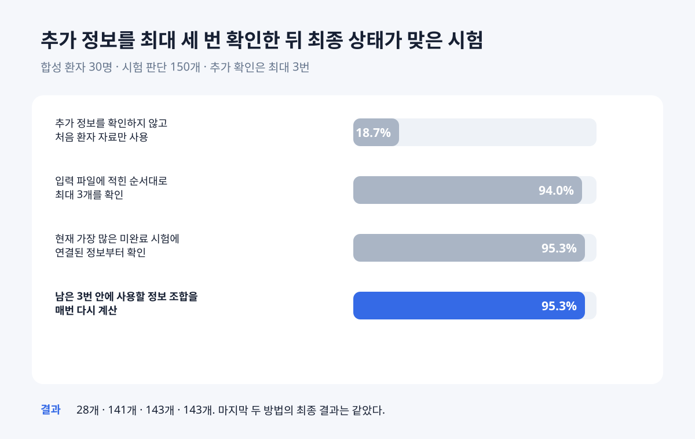
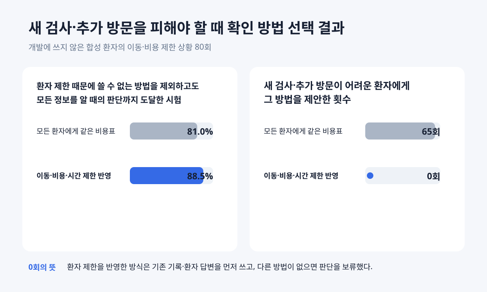
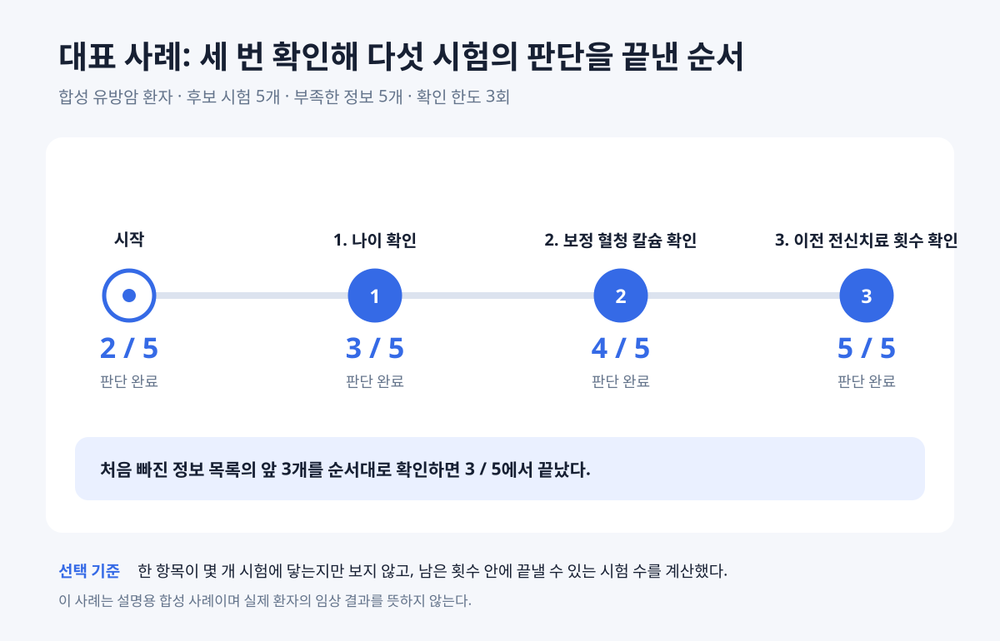

# ClarifyTrial 보고서·발표 정리본

이 문서는 현재 구현과 예비평가를 팀원에게 설명하거나 보고서·발표 자료를 만들 때
바로 꺼내 쓰는 요약본이다. 세부 구현과 긴 실험 기록은 연결된 현행 문서에서 확인한다.

## 한 문장으로 설명

부족한 환자 정보가 여러 개일 때, 같은 확인 횟수 안에서 더 많은 임상시험의 판단을
끝낼 수 있는 정보를 먼저 확인하고 환자가 이용하기 어려운 방법은 피하는 시스템이다.

## 핵심 아이디어

한 시험에 대해 두 가지를 따로 보여 준다.

1. 현재 자료로 참가 조건을 확인한 시험
2. 참가 가능성은 남아 있지만 추가 확인이 필요한 시험

따라서 최근 검사 결과가 없다는 이유만으로 후보를 버리지 않는다. 반대로 오래된 검사
결과가 조건에 맞았다는 이유만으로 현재 참가 가능하다고 확정하지도 않는다.

부족한 정보가 여럿이면 단순히 시험 문서에 먼저 나온 항목부터 묻지 않는다. 남은 확인
횟수 안에서 가장 많은 시험의 판단을 끝낼 수 있는 사실 묶음을 계산하고, 그중 지금
확인할 한 항목을 고른다. 같은 사실을 기존 기록이나 환자 답변으로 알 수 있다면 새
검사보다 먼저 사용한다.

## 입력과 출력

기본 입력은 다음 내용을 정해진 칸에 넣은 JSON 파일이다.

- 현재 확인된 환자 사실
- 후보 임상시험과 참가 조건
- 아직 부족한 환자 정보
- 각 정보를 확인할 수 있는 방법
- 입력된 경우에만 적용하는 시간·이동·비용·검사 부담

자유롭게 작성된 진료기록을 JSON으로 정리하는 기능도 연결돼 있지만, 그 변환 성능은
현재 주 평가에서 제외했다.

출력은 다음 세 목록으로 나뉜다.

- 현재 자료로 참가 조건을 확인한 시험
- 추가 확인 뒤 참가 가능성이 남아 있는 시험
- 명확한 조건 위반이 확인된 시험

각 시험에는 판단에 사용한 환자 사실, 시험 조건, 아직 필요한 정보와 가능한 확인
방법을 함께 적는다. 의료진이나 환자의 승인이 필요한 새 검사·절차는 자동으로
실행하지 않는다. 숫자나 기간 조건으로 참가 조건 불충족이 확인되면 현재 값이 해당
기준보다 얼마나 높거나 낮은지도 표시한다.

## 전체 흐름

```text
정해진 형식으로 환자 상태와 시험 조건 입력
→ 관련 시험 검색
→ 조건별 판단과 근거 확인
→ 현재 확인된 시험과 추가 확인 후보 분리
→ 부족한 정보 가운데 먼저 확인할 항목 계산
→ 환자가 이용할 수 있는 확인 방법 선택
→ 새 정보가 들어온 조건만 다시 판단
→ 세 목록과 다음 확인 방법 설명
```


[모델 호출까지 표시한 상세 구조](diagrams/clarifytrial-detailed-workflow.svg)와
[수정 가능한 Mermaid 원본](diagrams/clarifytrial-performance-agent-architecture.mmd)도
함께 제공한다.

## 사용한 자료

| 자료 | 사용한 목적 | 현재 규모 |
|---|---|---:|
| TREC Clinical Trials 2021·2022 | 수만 건 중 관련 시험을 찾는 검색 기능 검사 | 정답이 붙은 공개 평가자료 두 개 |
| TrialGPT 조건 판단 자료 | 환자 기록과 참가 조건 하나를 보고 내린 판단 검사 | 전문가 답이 붙은 1,015개 조건 |
| ClinicalTrials.gov API v2 | 공개 임상시험 문서에서 계산 가능한 조건 준비 | 15개 시험·92조건 |
| ClarifyTrial 합성 환자 | 여러 정보가 부족한 상태에서 질문하고 다시 판단 | 개발 30명·새 평가 30명 |
| 환자 부담 합성 상황 | 이동·비용·시간에 따라 확인 방법을 바꾸는지 검사 | 전체 360개 상황·1,800회 실행 |

실제 환자 기록과 개인식별정보는 사용하지 않았다. 92개 조건은 공개 문서에서 뽑아
AI가 먼저 검토했다. 현재는 연구진 작성 초기 정답이며, 사람 두 명의 독립 확인과
의사 검토가 남아 있다.

## 지금까지 확인한 결과

### 관련 시험을 찾아오는 검색

수만 건의 임상시험 중 관련 시험을 후보 500개 안에 남기는 기능을 검사했다. TrialGPT가
사용한 검색 절차를 같은 공개 평가자료에서 다시 실행했다.

| 공개 평가자료 | 관련 시험을 후보 500개 안에 남긴 비율 |
|---|---:|
| 2021년 공개 평가자료(TREC) | 83.59% |
| 2022년 공개 평가자료(TREC) | 81.55% |

두 해 모두 TrialGPT 논문에 실린 수치와 소수점 첫째 자리까지 같았다. 즉, 관련
시험을 후보로 가져오는 검색 능력은 사실상 같은 수준으로 재현됐다. 참가 조건 판단과
최종 추천은 이 비교에 포함하지 않았다.

### 한 번의 조건 판단

지시문을 만들 때 사용하지 않은 환자 33명과 참가 조건 654개에서 현재 시스템은
전문가 정답과 79.1% 일치했다. 같은 자료에 들어 있는 TrialGPT의 공개 답은 전문가
정답과 88.8% 일치했다. 숫자만 보면 현재 시스템이 낮다. 그러나 별도 개발 실험에서
틀린 51개 중 47개는 실제 추천 오류가 아니라 `판단 가능`과 `정보 부족` 중 어느 답을
붙일지의 차이였다. 두 답은 ClarifyTrial에서 모두 후보 유지로 이어진다. 실제로 후보를
남길지 뺄지로 채점하면 개발 표본 211개 중 207개인 98.1%가 전문가와 같았다. 이
범위에서는 거의 모두 맞춘 셈이다. 따라서 TrialGPT의 답 이름을 따라 점수만 높이는
조정은 하지 않았다. 답을 어떻게 묶느냐에 따라 통계가 크게 달라지기 때문이다.
98.1%는 개발 표본을 사후에 다시 계산한 값이므로 최종 성능으로 발표하지 않는다.

### 세 번 확인한 뒤 최종 답에 도달한 시험

합성 환자의 전체 사실로 시험별 최종 상태를 먼저 계산해 채점 정답으로 사용했다.
실제 검사나 절차를 시행한 실험은 없다. 새 합성 환자 30명과 시험 판단 150건에서
각 방식에 같은 확인 기회 세 번을 줬다.



| 방식 | 최종 상태와 같아진 시험 판단 |
|---|---:|
| 질문하지 않음 | 42% |
| 정해진 순서대로 확인 | 75% |
| 영향받는 시험 수만 고려 | 87% |
| 남은 확인 횟수까지 고려한 현재 방식 | 89% |

현재 방식은 환자 30명 중 15명에서 고정 순서보다 더 많은 시험을 끝냈고, 나머지
15명에서는 같았다. 더 적게 끝낸 환자는 없었다. 다섯 번까지 확인하면 두 방식 모두
최종 답에 도달했지만 평균 확인 횟수는 현재 방식 3.63회, 고정 순서 4.53회였다.

같은 30명에서 핵심 값 다섯 개를 처음 입력에서 완전히 지워도 세 번 확인한 뒤 현재
방식 88.7%, 고정 순서 75.3%였다. 현재 방식은 같은 질문 한도에서 필요한 정보 묶음을
모두 포함했다. 총 88번 확인 가운데 실제 합성 답을 놓고 보니 결과를 더 바꾸지 않은
확인은 9번이었다. 이 필요 여부는 실행이 끝난 뒤에만 계산했다.

### 환자가 이용할 수 있는 방법 선택

개발에 사용하지 않은 합성 환자 20명에서 부담 조건을 바꾼 상황 240개를 만들었다.
이 가운데 이동·비용 부담을 입력한 상황 80회를 따로 확인했다.



| 확인 내용 | 고정 방식 | 환자 맞춤 방식 |
|---|---:|---:|
| 실제로 이용할 수 있는 방법만 써서 최종 판단까지 맞게 끝낸 시험 | 81.0% | 88.5% |
| 새 검사나 추가 방문이 어렵다고 입력된 환자에게 그 방법을 제안한 횟수 | 65회 | 0회 |

0회는 기존 기록이나 환자 답변으로 확인하거나, 더 확인할 수 없으면 대기 상태로
남긴 경우다. 현재 결과는 연구진이 정한 합성 부담 상황에서 확인 방법이 바뀐 정도를
보여 준다.

## 대표 사례

합성 유방암 환자 한 명에게 후보 시험 5개와 부족한 정보 5개를 배정하고 확인 횟수를
3회로 제한했다.



처음에는 시험 2개의 최종 상태만 맞게 판단했다. 고정 순서는 나이, 절대호중구수,
혈소판수를 차례로 확인해 3개에서 끝났다. 현재 방식은 나이, 보정 혈청 칼슘,
이전 전신치료 횟수를 확인해 다음처럼 바뀌었다.

```text
확인 전: 현재 확인 완료 0개 · 추가 확인 후보 3개 · 제외 2개
나이 확인 뒤: 시험 상태 3/5 일치
보정 혈청 칼슘 확인 뒤: 시험 상태 4/5 일치
이전 전신치료 횟수 확인 뒤: 시험 상태 5/5 일치
최종 출력: 현재 확인 완료 3개 · 추가 확인 후보 0개 · 제외 2개
```

이 사례는 질문 순서를 설명하기 위해 만든 환자다. 결과의 적용 범위도 이 합성 사례
안으로 제한한다.

### 사례 재현

개발 환경을 설치한 뒤 다음 명령을 실행한다. 처음 판정, 확인 이유, 합성 답변과 바뀐
판정을 터미널에서 순서대로 보여 준다. 외부 모델과 인터넷 검색은 사용하지 않는다.

```powershell
.\.venv\Scripts\clarifytrial.exe run-text-demo `
  --patient-id natural-breast_cancer-11 `
  --input-state fully-missing `
  --action-budget 3 `
  --auto `
  --output runs\text-ui-demo.json
```

결과 파일에는 같은 환자에 대한 질문 방식별 선택 순서와 단계별 시험 상태가 함께
저장된다.

## 보고서에 바로 쓸 문안

### 방법

후보 시험별 참가 조건과 합성 환자 사실을 정해진 형식의 JSON으로 입력했다. 환자마다
다섯 정보의 값을 먼저 고정한 뒤 일부의 확인 상태만 숨겼다. 각 방식에는 같은 후보
시험, 미리 정한 같은 환자 답과 같은 확인 횟수를 제공했다. 현재 방식은 남은 확인 횟수 안에서
판단을 끝낼 수 있는 시험 수가 가장 큰 정보 조합을 모두 계산했다. 정보를 고른 뒤에는
환자가 이용할 수 없는 방법을 제외하고 기존 기록과 환자 답변을 새 검사보다 우선했다.

### 결과

새 합성 환자 30명·시험 판단 150건에서 확인 기회가 세 번일 때 현재 방식은 시험
상태의 89%를 미리 계산한 최종 상태와 같게 만들었다. 고정 순서는 75%였다. 이동·비용
부담이 큰 합성 환자의 고정 평가에서는 이용 가능한 방법만 사용해 최종 판단까지 맞게
끝낸 시험이 81.0%에서 88.5%로 늘었다. 새 검사나 추가 방문이 어렵다고 입력된
환자에게 이를 제안한 횟수는 65회에서 0회로 줄었다.

### 해석

현재 결과는 강한 언어모델 자체의 조건 판정 성능보다, 부족한 정보가 여러 개일 때
무엇을 먼저 확인하고 어떤 방법을 피할지를 코드로 정한 기능의 예비 근거다. 공개
조건과 합성 환자를 사용한 결과다. 임상 성능과 실제 환자 편익은 별도의 사람 검토와
실제 자료 평가가 필요하다.

## 5분 발표 순서

1. **문제:** 정보가 부족한 시험을 모두 “모름”으로 두면 어떤 정보를 먼저 확인해야
   하는지 알 수 없다.
2. **핵심 아이디어:** 후보 유지와 현재 확인을 나누고, 같은 횟수 안에 더 많은 시험을
   끝내는 정보를 먼저 확인한다.
3. **실행 구조:** 모델은 복잡한 조건과 설명을 맡고, 코드는 수치·날짜·질문 순서·환자
   부담과 승인 규칙을 맡는다.
4. **결과:** 세 번 확인에서 75% 대 89%, 어려운 새 검사·방문 제안 65회 대 0회.
5. **대표 사례와 한계:** 2/5에서 5/5로 바뀐 순서를 보여 주고, 합성 예비평가이며
   의사 검토 전이라는 범위를 밝힌다.

## 주장할 수 있는 것과 없는 것

| 현재 말할 수 있는 것 | 현재 말하면 안 되는 것 |
|---|---|
| 정해진 형식의 JSON 입력에서 전체 흐름이 작동한다 | 실제 진료기록을 항상 정확히 해석한다 |
| 같은 합성 환자에게 질문 순서만 바꿔 직접 비교했다 | TrialGPT보다 전체 추천 성능이 높다 |
| 세 번 확인에서 고정 순서 75%, 현재 방식 89%였다 | 의사와 같은 수준으로 판단한다 |
| 입력된 환자 부담에 따라 확인 방법을 바꿨다 | 실제 환자의 비용과 시간을 줄였다 |
| 관련 시험 검색 결과가 TrialGPT 공개값과 거의 같았다 | 검색부터 최종 추천까지 임상 검증을 마쳤다 |

## 남은 검증

현재 코드의 주요 기능과 합성 예비평가는 끝났다. 다음 작업은 기능 완성에 필요한
코딩이 아니라 외부 근거를 보강하는 일이다.

- 92개 시험 조건을 두 사람이 독립적으로 확인하고 불일치를 합의
- 의사 또는 임상시험 담당자가 대표 출력의 안전성과 이해 가능성을 검토
- 다른 질환과 더 큰 시험 모음에서 질문 순서 결과 재확인
- 숫자·기간 조건의 차이 설명이 의료진에게 오해 없이 전달되는지 검토

팀 일정상 사람 검토를 바로 할 수 없다면 현재 결과를 “합성 예비평가”로만 보고하고,
사람 확인을 마친 뒤 같은 평가를 다시 실행하면 된다.

## 연결 문서

- [현재 상태와 요구사항](CURRENT_STATUS.md)
- [현행 연구계획 v5](CLARIFYTRIAL_RESEARCH_PLAN_V5.md)
- [에이전트 워크플로우](CLARIFYTRIAL_AGENT_ARCHITECTURE_REDESIGN.md)
- [검증 결과](CLARIFYTRIAL_VALIDATION_RESULTS.md)
- [실험자료와 정답](CLARIFYTRIAL_DATASETS.md)
- [실험 재현 순서](CLARIFYTRIAL_V5_DEVELOPED_EXPERIMENT_GUIDE.md)
