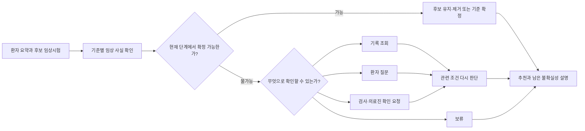

# ClarifyTrial 연구계획 v5

## 정보가 부족할 때 후보 유지, 현재 확인과 다음 행동을 따로 판단하는 시스템

기준일: 2026-08-24

---

## 0. 결론

환자 정보가 부족한 시험마다 다음 세 답을 따로 낸다.

1. 참가 가능성이 남아 있으므로 후보로 계속 볼 것인가?
2. 지금 가진 자료만으로 참가 조건을 확인할 수 있는가?
3. 아직 확인할 수 없다면 어떤 정보를 어떤 방법으로 먼저 확인할 것인가?

같은 환자라도 3개월 전 검사만 있는 경우와 최근 검사가 확인된 경우의 답은 달라야
한다. 오래된 검사로 가능성이 보이면 후보는 남기되, 최근 검사가 필요하면 현재 확인은
끝내지 않는다. 부족한 정보가 여러 개면 같은 확인 횟수 안에 더 많은 시험의 판단을
끝낼 수 있는 정보를 먼저 확인한다.

질문 생성, 관련 문서 검색, 여러 모델 역할과 답변 뒤 재판단은 이미 여러 연구에서
사용됐다. 따라서 이런 기능을 넣었다는 사실을 새 기여로 주장하지 않는다. 이 연구의
핵심은 후보 유지와 현재 확인을 따로 표시하고, 그 구분이 너무 이른 후보 제거·확정을
줄이는지 평가하는 것이다.

### 현재 실험 상태

| 항목 | 상태 |
|---|---|
| 질문하고 다시 판단하는 실험 | 공개 시험 조건과 합성 환자 30명에서 평가 완료 |
| 부족한 정보를 고르는 방법 비교 | 정보 선택 규칙만 계산: 입력 목록 순서대로 확인 75.3%, 가장 많은 시험 판단을 끝낼 정보를 계산 88.7%. 검색부터 재판정까지 전체 프로그램 연결: 66%, 77% |
| 환자 부담 반영 | 360개 상황에서 이동·비용·시간에 맞는 확인 방법 선택 검사 완료 |
| 기본 입력 | 환자 사실·시험 조건·부족 정보·확인 방법을 정해진 칸에 넣은 JSON |
| 일반 실행 | 새 환자·시험 JSON, 직접 답변·파일 답변, 중단·재개까지 구현 |
| 일괄 평가와 보고서 | 세 질문 방식을 같은 전체 흐름에서 실행하고 표·그림·Markdown 자동 생성 |
| 자유롭게 작성된 기록 | JSON으로 바꾸는 선택 기능만 합성 사례에서 작동 확인 |
| 새 평가자료 | 공개 시험 15건·조건 92개, 개발 환자 30명과 새 평가 환자 30명 |
| 실제 진료기록과 임상 성능 | 측정하지 않음 |
| 관련 시험 검색과 조건 하나의 판단 | 별도로 평가했으며 질문 순서 결과와 한 점수로 합치지 않음 |

현재 결과는 AI가 먼저 검토한 공개 시험 조건과 연구진이 만든 환자를 사용한 초기
평가다. 실제 환자, 의료진이 확정한 정답이나 실제 병원 성능으로 넓혀 해석하지 않는다.

### 연구 수준에 대한 판정

| 목표 | 판정 |
|---|---|
| 대회 데모 | 충분히 강함 |
| 대한의료정보학회 학부생 포스터 | 적절함 |
| 소규모 예비 논문 | 전문가 정답과 사람 비교 실험을 붙이면 가능 |
| 새로운 최적화 알고리즘 논문 | 해당하지 않음 |
| 대규모 임상 성능 주장 | 현재 자료로 불가능 |

새 알고리즘처럼 포장하지 않는다. **평가 대상의 잘못된 정의를 바로잡고, 그 차이가 실제 오류와 업무량에 미치는 영향을 보여주는 연구**로 둔다.

---

## 1. 실제 문제

임상시험 선별에는 서로 다른 두 판단이 있다.

1. **사전 선별**: 이 환자를 후보에서 남겨 추가 확인할 가치가 있는가?
2. **정식 선별**: 현재 확보한 자료로 해당 기준 충족을 확정할 수 있는가?

두 판단을 하나의 `eligible / ineligible / unknown`으로 합치면 다음 오류를 구분하기 어렵다.

- 오래된 검사 결과가 기준을 만족하므로 바로 `eligible`로 확정
- 중앙검사 확인이 남았다는 이유로 가능성 있는 환자를 `ineligible`로 제거
- 기록에 이미 있는 사실을 환자에게 다시 질문
- 아직 시행하지 않은 검사의 결과를 환자 질문으로 해결하려 시도
- 환자 진술만으로 확정할 수 없는 객관적 검사 기준을 확정

### 예시

임상시험 기준이 `EGFR 변이 양성`이고, 환자의 과거 지역검사 결과가 양성이라고 하자.

- 사전 선별: 후보 유지에 충분할 수 있음
- 정식 선별: 프로토콜이 중앙검사 재확인을 요구하면 아직 확정 불가
- 다음 행동: 중앙검사 또는 지정된 확인 절차 안내

중요한 질문은 “EGFR 양성인가?” 하나가 아니다.

1. 현재 보이는 사실은 기준을 지지하는가?
2. 그 사실은 지금 단계의 확정 근거로 충분한가?
3. 충분하지 않다면 다음에 무엇을 확인해야 하는가?

이 세 항목을 분리하는 것이 본 연구의 중심이다.

---

## 2. 연구 질문

### 연구 질문 1. 후보 유지와 현재 확인을 구분할 수 있는가?

모델은 불완전한 자료에서 가능성 있는 환자를 후보로 남기는 판단과, 정식 적합성을 확정하는 판단을 구분하는가?

### 연구 질문 2. 어떤 정보를 다음에 확인해야 하는가?

모델은 같은 임상 사실이라도 자료 출처, 검사 시점, 확인 방법, 선별 단계가 달라지면 근거가 충분한지 다시 판단하고 올바른 확인 행동을 선택하는가?

### 연구 질문 3. 실제 업무에 도움이 되는가?

이 구분을 사용하는 시스템이 한 모델에게 한 번에 판단시키는 방식이나 모든 정보를
무조건 확인하는 방식보다, 가능성 있는 환자를 덜 놓치면서 담당자의 확인 시간과
불필요한 질문을 줄이는가?

RQ3은 작은 사람 비교 실험이 있을 때만 주장한다. 모델끼리만 비교한 결과를 실제 업무 개선으로 표현하지 않는다.

---

## 3. 연구 기여

### 중심 기여

> **환자 사실이 조건에 맞는지와 그 사실만으로 지금 확인을 끝낼 수 있는지를 서로
> 다른 정답으로 표시한 평가자료.**

환자의 실제 상태는 같게 두고 다음 한 요소만 바꾼 두 사례를 만든다.

- 자료가 최신인지 오래됐는지
- 환자 진술인지 의무기록인지
- 지역검사인지 프로토콜이 요구한 확인검사인지
- 사전 선별인지 정식 선별인지

각 사례에는 다음 정답을 둔다.

1. 기준을 임상적으로 지지하는지
2. 현재 단계에서 확정 가능한지
3. 후보를 유지할지 제거할지
4. 다음 확인 행동이 무엇인지
5. 어떤 근거 때문에 그렇게 판단했는지

### 결과가 있어야 성립하는 기여

- 기존 조건 정확도만으로는 드러나지 않는 `너무 이른 확정`과 `너무 이른 후보 제거`의 실제 횟수
- 현재 확인에 충분한 자료인지 따로 표시했을 때 같은 모델의 오류가 줄어드는지 비교한 결과
- 코디네이터가 결과를 검토하는 시간 또는 불필요한 확인 행동 감소

### 기여로 주장하지 않을 내용

- 키워드·의미 검색을 결합한 후보 검색
- 질환명, 약물명, 바이오마커의 표준화
- 선정·제외 기준의 구조화
- 수치, 날짜와 시간 조건의 규칙 판정
- 질문을 생성했다는 사실
- 여러 에이전트를 사용했다는 사실
- 외부 문서를 찾아오는 검색 기능을 붙였다는 사실
- 답변 뒤 판정을 다시 계산했다는 사실
- 답의 불확실성을 계산해 질문 순서를 정했다는 사실
- 기록·질문·검사 중 하나를 고른다는 사실
- 프로토콜의 흩어진 문장을 연결했다는 사실
- 계산 결과를 저장해 다시 쓰고 모델 호출 수를 줄인 일

이들은 모두 선행연구에서 이미 사용된 성능 개선 방법이므로 구현 요소 또는
비교 대상으로만 둔다. 이들을 잘 결합해 성능을 높이는 것은 대회 시스템의
필수 조건이지만, 그 자체를 새 논문 기여로 주장하지 않는다.

---

## 4. 이전 구현(v3)에서 유지하고 바꿀 부분

### 유지

- 고정 규칙으로 만든 불완전 환자 입력
- 숨은 정보와 행동 결과를 모델에서 분리한 재생 환경
- 환자 ID 기준 개발·평가 분리
- 기록 조회, 환자 질문, 보류
- `acceptable_actions`: 정답 행동이 하나가 아닐 수 있음을 인정
- 이용 가능한 가장 완전한 공개 자료를 비교 기준으로 사용하되, 실제 환자의 모든 상태를 안다고 표현하지 않음

### 수정

이전 구현(v3)의 `DECIDE / LOOKUP_RECORD / ASK_PATIENT / DEFER`는 현재 판단과 다음
행동을 한 칸에 섞는다. 두 출력을 분리한다.

#### 현재 판단

| 항목 | 값 |
|---|---|
| 사전 선별 상태 | `retain`, `remove`, `uncertain` |
| 정식 선별 상태 | `confirmed`, `not_confirmed`, `ineligible`, `uncertain` |

`confirmed`는 해당 기준 또는 시험 전체 중 출력에서 명시한 범위에만 사용한다. 기준 하나가 확인됐다고 환자 전체 등록을 허용해서는 안 된다.

사용자에게는 한 개의 `eligible / ineligible` 목록 대신 다음 세 묶음으로 보여준다.

| 표시 | 포함 기준 |
|---|---|
| 현재 자료로 확인된 후보 | 후보를 유지하고 현재 확인도 끝난 시험 |
| 추가 확인이 필요한 후보 | 후보는 유지하지만 아직 필요한 사실이나 공식 확인이 남은 시험 |
| 현재 제외되는 시험 | 현재 자료에 명확한 위반 근거가 있는 시험 |

좁게 보는 목록은 첫 번째 묶음, 넓게 보는 목록은 첫 번째와 두 번째 묶음의 합이다.
`not excluded`와 `정보 부족`의 라벨 차이보다 실제 후보 유지·제외와 남은 확인 사항을
우선 평가한다.

#### 다음 행동

| 행동 | 의미 |
|---|---|
| `NONE` | 현재 범위의 판단에 추가 정보 불필요 |
| `LOOKUP_RECORD` | 기존 기록에서 확인 |
| `ASK_PATIENT` | 환자가 답할 수 있고 그 답이 현재 판단에 적절함 |
| `REQUEST_VERIFICATION` | 검사, 병리, 영상, 의료진 평가 등 별도 확인 필요 |
| `DEFER` | 현재 이용 가능한 경로로 해결 불가 또는 사람 판단 필요 |

`REQUEST_VERIFICATION`은 에이전트가 검사를 처방한다는 뜻이 아니다. 코디네이터에게 프로토콜상 확인이 남았음을 알리는 출력이다.

### v4에서 내릴 부분

- 행동 전 모든 결과 가지를 표로 제출: 설명 자료로만 선택 사용
- 선택적 갱신: 구현 검사로 유지, 논문 기여에서 제외
- 결정 영향 짝: 보조 분석으로 유지
- 새 이름의 최소 행동 지표: 만들지 않음
- 다중 에이전트와 단일 에이전트 비교: 시스템 분석으로만 사용

---

## 5. 자료 구성

### 5.1 TrialGPT Criterion Annotations

현재 공개 자료 재확인 결과:

- 기준 주석 1,015건
- 환자 53명
- 환자-임상시험 조합 105개
- 시험 단위 상태: `eligible` 10개, `ineligible` 26개, `uncertain` 69개
- 두 시험 모두 확정 상태인 환자: 6명

따라서 TrialGPT 자료는 다음에 적합하다.

- 기준 문장과 환자 근거의 대응
- 일부 근거를 가린 기준 단위 실험
- 입력에 근거가 있는데 모델이 놓친 경우와 실제로 근거가 없는 경우 비교

다음 주장의 주 자료로는 부족하다.

- 여러 시험의 정답 추천 순위
- 정보 출처의 공식 충분성
- 사전 선별과 정식 선별의 차이
- 실제 검사·질문 경로의 정답

TrialGPT를 억지로 전체 실험의 정답으로 만들지 않는다.

### 5.2 실제 프로토콜 기반 짝 자료

공개 전체 프로토콜을 확인할 수 있는 임상시험에서 다음 유형을 고른다.

- 검사값과 유효 기간
- 지역검사와 중앙검사 재확인
- 병리 또는 영상 확인
- 기록으로 확인할 치료 이력
- 환자에게 직접 확인 가능한 증상·복약·생활 정보
- 현재 시행되지 않아 바로 확정할 수 없는 검사

권장 예비 규모:

- 기본 기준 묶음 12~20개
- 임상시험 6~10개
- 기본 묶음마다 2~4개의 단일요인 변형
- 변형 수를 독립 사례 수처럼 부풀리지 않음

한 기본 묶음의 예:

| 변형 | 임상 사실 | 근거 상태 | 사전 선별 | 정식 선별 | 다음 행동 |
|---|---|---|---|---|---|
| A | 기준 지지 | 현재 단계에 충분 | 유지 | 해당 기준 확정 | 없음 |
| B | 기준 지지 | 확인 절차 부족 | 유지 | 미확정 | 확인 요청 |
| C | 기준 위반 | 현재 단계에 충분 | 제거 | 부적합 | 없음 |
| D | 기준 위반처럼 보임 | 자료가 오래됐거나 불충분 | 성급한 제거 금지 | 미확정 | 기록 또는 확인 요청 |

### 5.3 정답 작성

최소 두 명이 독립 검토하고 불일치를 합의한다.

- 임상시험 코디네이터 또는 임상의 1명 이상 포함 권장
- 근거 문장과 프로토콜 위치 기록
- 각 사례의 판단 범위 명시
- 복수의 타당한 다음 행동 허용
- 전문가 합의가 안 되는 사례는 최종 평가에서 제외하거나 `uncertain`으로 유지

전문가 검토가 없으면 결과는 연구자 작성 예비자료로만 보고한다.

### 5.4 추천 순위 자료의 분리

TREC Clinical Trials와 ClinicalTrials.gov 후보 검색은 추천 성능 평가에 사용한다. 그러나 TREC의 관련성 정답과 프로토콜 기반 행동 정답을 하나의 정답처럼 합치지 않는다.

- 관련 시험 검색: 전문가가 환자와 관련 있다고 표시한 시험을 검색 후보 안에 남긴 비율과 그 시험을 앞쪽에 둔 정도
- 참가 조건 판단: 전문가 답과 같은 비율
- 확인 행동: 다음 행동 정확도와 과잉 행동 수
- 후보 보존: 잘못된 제거율

서로 다른 자료가 답하는 질문을 분리한다.

### 5.5 첫 대화형 벤치마크 확정안

첫 실험은 후보 검색 성능과 질문 정책을 섞지 않는다. 각 환자에게 후보 시험 5개를
미리 고정하고, 여러 시험에 공통으로 필요한 사실 가운데 무엇을 먼저 확인하는지만
비교한다. 후보 검색은 이미 재현한 TrialGPT 결합 검색으로 별도 평가한다.

| 항목 | 확정 값 |
|---|---|
| 작동 확인 자료 | 기본 환자 12명, 환자당 후보 시험 5개, 확인 후보 5개 |
| 첫 벤치마크 | 기본 환자 30명, 방법을 만드는 데 쓰는 환자 10명·그 과정에 쓰지 않는 평가 환자 20명 |
| 정보 가림 | 기본 환자마다 서로 다른 정보 조합을 가린 버전 2개, 총 60회 실행 |
| 환자 수 계산 | 정보를 가린 버전이 아니라 기본 환자 30명을 환자 수로 봄 |
| 행동 한도 | 확인 후보 5개 중 최대 3회 |
| 첫 질환 범위 | 제2형 당뇨병, 유방암, 주요우울장애 |
| 조건 범위 | 수치·기간, 약물·치료 이력, 병리·검사 확인, 환자 답변 가능 정보 |

각 후보 묶음에는 현재 자료로 확인 가능한 후보, 추가 확인이 필요한 후보, 명확한
제외 시험과 숫자·기간상 가까운 시험이 함께 있어야 한다. 같은 숨은 사실이 두 개
이상의 시험에 영향을 주는 사례를 포함해야 질문 우선순위를 평가할 수 있다.

한 사례의 원본 정답은 자연어 문장이 아니라 구조화된 전체 환자 상태다.

1. 공개 임상시험 조건에서 계산 가능한 사실과 출처 위치를 고른다.
2. 각 조건을 만족·위반하도록 전체 환자 사실을 먼저 정한다.
3. 전체 사실로 후보 유지, 현재 확인과 시험 순위를 코드가 계산한다.
4. 판단에 영향을 줄 수 있는 사실 5개를 감추고 처음 보이는 기록을 만든다.
5. 숨은 사실마다 `환자 질문`, `기록 조회`, `공식 확인` 중 이용할 수 있는 확인 방법을 붙인다.
6. 언어모델은 정해진 사실을 자연스러운 문장으로 바꿀 수 있지만 새 사실을 만들 수 없다.

언어모델이 비만에서 식습관을 추측하는 식으로 환자 사실을 늘린 결과는 정답으로 쓰지
않는다. 자연어에 구조화된 정답에 없는 사실이 추가되면 사례 검사를 통과하지 못한다.

### 5.6 질문 정답과 기준 차이

다음 질문을 하나의 문장으로 고정하지 않는다. 시스템은 자연어 질문과 함께 확인할
`사실 ID`와 `행동`을 출력한다. 숨은 사실 5개의 32개 공개 조합을 모두
계산해, 전체 정보를 봤을 때와 같은 후보 결과를 만드는 최소 사실 묶음을 정답으로
구한다. 여러 최소 묶음에 포함된 질문은 모두 허용한다.

각 사실의 민감도도 같은 32개 조합에서 계산한다. 사실 하나를 추가했을 때
가려 둔 정보까지 모두 넣었을 때와 같은 후보 판단이 평균적으로 얼마나 늘어나는지
측정한다. 시스템은 이 비교 답을 보지 못하고, 실험이 끝난 뒤에만 선택한 정보 때문에
그 판단과 같아진 시험이 얼마나 늘었는지 계산한다.

현행 질문 정책은 평가 환자의 실제 답이나 답의 확률을 보지 않는다. 대신 현재 부족한
사실의 모든 작은 조합을 살펴, 남은 질문 횟수 안에서 판단을 끝낼 수 있는 시험이 가장
많은 묶음을 고른다. 동률이면 영향을 받는 시험 수와 조건 수를 차례로 본다. 사실이
5개면 최대 32개 조합이라 근사 점수보다 정확한 계산이 단순하다.

답의 분포를 두고 모든 질문·답변 가지를 계산하는 평균 우선·최악 우선 나무는 진단용
비교로 남긴다. 공개 조건과 값 전수 검사에서 안정적인 이득이 없었으므로 주 실행에
사용하지 않는다. 실제 환자의 답을 보고 질문 확률이나 우선순위를 사후 변경하지 않는다.

`INELIGIBLE`로 끝난 시험에는 기준과 현재 값의 차이를 보조 정보로 붙인다.

- 현재 충분한 근거로 참가 조건 불충족이 확정된 시험에만 계산
- 숫자 역치와 날짜·기간 조건만 사용
- 현재 값, 기준값, 차이와 근거 원문을 코드로 출력
- 진단, 임상적 중증도와 복합 조건에는 임의의 거리를 만들지 않음
- 환자에게 치료나 검사를 권하는 표현으로 바꾸지 않음
- 서로 다른 검사, 점수와 기간의 차이를 하나의 순위로 합치지 않음

### 5.7 환자의 이동·비용·시간 제한을 반영한 확인 방법 선택

현재 코드의 `환자 질문=1`, `기록 조회=2`, `공식 확인=3`은 첫 정책 비교용
간이값이다. 실제 비용이나 환자 부담으로 해석하지 않는다. 새 설계는 같은 사실을
기존 기록, 외부 기록, 환자 답변, 기존 검사 결과 확인과 새 검사 중 여러 경로로
얻을 수 있게 한다.

행동마다 돈, 대기 시간, 방문, 신체·심리 부담, 의료 위험, 기존 치료 방해와 사람
승인 필요 여부를 따로 기록한다. 이미 진료에 예정된 검사라면 시험 검토 때문에 새로
생기는 부담만 계산한다. 환자의 피로, 이동 제한, 경제 상황, 시간 긴급성과 명시한
선호도 별도 환자 상황표에서 읽는다. 이 입력은 선택 사항이다. 입력이 없으면 균형
방식을 기본으로 쓰되 미확인 부담을 0으로 채우지 않는다. 경제력이나 소득을 추정하지
않고 추가 비용이 걱정되는 정도처럼 확인 순서에 필요한 선호만 받는다. 환자 입력은
후보 유지나 참가 조건 판정을 바꾸지 않는다.

선택 순서는 다음과 같다.

1. 결과를 바꿀 수 없거나 안전하게 실행할 수 없는 행동 제거
2. 같은 사실이면 새 검사보다 기존 자료 우선
3. 시간 긴급성과 안전 관련 정보 표시
4. 환자가 허용한 부담 안에서 더 많은 중요한 후보·조건을 해결하는 행동 선택
5. 새 검사·침습 절차·치료 변경은 자동 실행하지 않고 환자·의료진 선택 또는 보류

시간이 급해도 영향이 작은 정보부터 고르면 모든 정보를 알 때와 같은 후보 판단에
도달하는 시험 수가 줄어드는 구현 검사가 나왔다.
따라서 시간 긴급 상황도 영향을 받는 후보·조건 수를 먼저 지키고, 영향이 같을 때
대기 시간이 짧은 경로를 고른다.

결과는 두 형식으로 만든다. 환자에게는 현재 후보, 필요한 정보, 기존 자료인지 새
검사인지, 예상 부담, 다른 경로와 확인 뒤 가능한 변화를 쉬운 말로 보여 준다. 연구자와
의료진에게는 같은 사실·조건·시험 ID, 적용한 입력과 기본값, 선택하지 않은 경로와
이유, 사람 승인 여부와 근거를 남긴다. 두 결과가 서로 다른 사실을 말해서는 안 된다.

비용을 고려한 검사 순서와 환자 부담 연구는 이미 존재한다. 이 확장을 새로운 정보
획득 알고리즘이라고 주장하지 않는다. ClarifyTrial의 중심 기여는 계속 후보 보존과
현재 확정을 분리하는 평가이며, 환자의 이동·비용·시간 제한을 반영한 확인 방법 선택은 실제 사용 가능성과 추가 행동의
질을 평가하는 보조 연구다.

### 5.8 다음 자료 범위 확장

현재 3개 질환·15개 시험·별도 합성 환자 30명은 질문과 확인 방법을 정밀하게 검사하는
첫 자료로 유지한다. 다음 평가는 검색 범위와 조건별 정답 범위를 분리해 넓힌다.

- 넓은 검색 자료: 팀이 공개한 ClinicalTrials.gov 시험 1,931건
- 정밀 평가: 약 10개 질환, 약 50개 시험
- 새 합성 환자: 현재 없는 7개 질환에서 약 35명
- 정보 부족 상태: 환자마다 두 가지, 약 70회 추가 실행

1,931개 시험 전체에 조건별 정답을 붙이지 않는다. 전체 자료에서는 관련 시험을
찾고, 정밀 평가 대상으로 고른 시험에만 환자 사실, 참가 조건, 부족한 정보, 가능한
확인 방법과 질문 뒤 달라질 판단을 만든다. 모집이 끝난 시험은 현재 추천 대상에서
제외한다.

질환은 단순히 수를 맞춰 고르지 않는다. 수치, 기간, 복약, 과거 치료, 임신·피임,
환자 답변, 기록 조회와 새 검사가 고르게 나타나는지를 먼저 확인한다. 이 확장 자료를
고정한 뒤 현재 전체 프로그램을 다시 실행해 질문 효과, 환자 부담, 모델 호출과 토큰을
한 보고서에 모은다.

---

## 6. 실험 조건

모든 방식에 같은 환자 정보, 같은 후보 시험, 같은 행동 결과를 제공한다.

| 방식 | 설명 | 역할 |
|---|---|---|
| 추가 정보를 확인하지 않고 처음 환자 자료만 사용하는 방법 | 처음 받은 자료로만 추천 | 질문의 전체 효과 확인 |
| 공개 목록 순서 | 공개된 목록 순서대로 3개만 확인 | 우선순위를 판단하지 않는 비교 방식 |
| 무작위 확인 | 남은 사실 중 하나를 무작위 선택 | 선택 규칙이 없는 최소 비교 방식 |
| 영향 범위 우선 | 가장 많은 후보·조건에 연결된 사실 선택 | DQueST 연구를 따른 비교 방식 |
| 영향 대비 비용 우선 | 영향 범위를 확인 비용으로 나눠 선택 | Fink 연구를 따른 비교 방식 |
| 고정 확인 비용 | 모든 환자에게 질문 1·기록 2·공식 확인 3을 적용 | 환자 차이를 보지 않는 비교 방식 |
| 환자의 이동·비용·시간 제한을 반영한 확인 방법 선택 | 기존 자료 여부와 환자의 시간·이동·경제·절차 선호를 반영 | 새 보조 비교 방식 |
| 불확실성 우선 | 답을 예측하기 어려운 사실 선택 | 정보량을 이용한 비교 방식 |
| 한 단계 평균 우선 계산 | 정보 하나를 확인한 뒤 모든 정보를 알 때와 같은 판단에 도달하는 시험이 평균적으로 가장 많이 늘어나는 항목 선택 | 비교용 진단, 기본 구조로 기각 |
| 한 단계 최악 우선 계산 | 가장 불리한 답에서도 모든 정보를 알 때와 같은 판단에 도달하는 시험 수를 먼저 지키고, 동률이면 평균 증가가 큰 항목 선택 | 비교용 진단, 기본 구조로 기각 |
| 한 모델에 모두 맡김 | 한 언어모델이 확인할 정보, 방법과 다시 판단하는 일까지 수행 | 역할 분리 효과를 보는 비교 방식 |
| ClarifyTrial v5 | 코드가 정보·확인 방법을 고르고 언어모델은 조건 해석과 문장 작성을 담당 | 현행 기본 구조 |

답의 불확실성을 계산하는 방식은 비교 방법 하나로만 둔다. 이 공식을 썼다는 사실은
새 기여가 아니다.

모델 역할을 나눈 방식과 한 모델에 모두 맡긴 방식에는 같은 정보와 같은 출력 형식을
준다. 역할이 많고 구조가 복잡하다는 이유만으로 더 좋다고 해석하지 않는다.

실행 코드는 숨은 답을 보지 않고 현재 상태, 조건 연결, 고정된 가능 답 분포와 확인 비용만
사용한다. 언어모델은 선택된 정보에 대한 환자 질문이나 확인 요청문을 작성한다. 문장
표현보다 어떤 정보를 어떤 방법으로 확인했는지를 먼저 채점한다. 실행 중인 프로그램은
평가용 정답을 볼 수 없으며, 실행이 끝난 뒤에만 정답과 비교한다.

복잡한 계산은 개발에 사용하지 않은 합성 환자 30명에서 가장 강한 단순 방법보다 모든
정보를 알 때와 같은 시험 판단에 도달한 비율을 5퍼센트포인트 이상 높이거나, 같은
비율에서 확인 부담을 20% 이상 줄여야 채택하기로 했다. 실제
평가와 가능한 환자 값 77,792개를 넣은 검사에서 이 기준을 통과하지 못했다. 따라서
가능한 질문과 답을 끝까지 펼쳐 계산하는 복잡한 방식은 비교 코드로만 보존한다. 현재는
더 많은 시험의 판단을 끝내는 정보를 먼저 고르고, 결과가 같으면 부담이 낮은 확인
방법을 고르는 단순한 규칙을 사용한다.

---

## 7. 평가 지표

### 주 지표

1. **미리 계산한 최종 답과 같아진 시험의 비율**
2. **잘못된 후보 제거율**
3. **너무 이른 적합 확정률**
4. **필요한 정보 확인률**: 시험 판단을 끝내는 데 필요한 정보 가운데 실제로 확인한 비율
5. **불필요한 행동 수**: 어떤 시험의 판단을 끝내는 데도 도움이 되지 않은 확인
6. **정보 부족 해소량**: 질문 전후 실제 판단으로 바뀐 조건 수
7. **확인 방법 선택률**: 환자 질문, 기록 조회와 공식 확인을 올바르게 구분했는지
8. **선택한 정보의 실제 도움**: 가능한 정보 조합 32개에서 끝낼 수 있었던 시험 가운데 실제로 끝낸 비율
9. **불필요한 새 검사율**: 기존 자료나 더 쉬운 방법으로 알 수 있는데 새 검사를 선택했는지
10. **환자 부담 한도 위반률**: 환자가 허용하지 않은 방문·비용·절차를 선택했는지

### 업무량 지표

- 환자 질문 수
- 기록 조회 수
- 별도 확인 요청 수
- 새 검사·평가 제안 수와 침습 절차 제안 수
- 누적 대기 시간과 추가 방문 수
- 신체·심리 부담, 의료 위험과 치료 방해를 항목별로 합산한 값
- 해결되지 않은 기준 수
- 미리 계산한 최종 답에 도달할 때까지의 확인 횟수
- 환자 한 명을 처리할 때 모델을 부른 횟수와 비용

### 기준 판정과 추천 지표

- 개별 참가 조건의 정답률은 TrialGPT 비교용 보조 결과로만 유지
- 후보 유지·제외의 조건 단위와 시험 단위 일치율
- 질문을 하나씩 추가할 때 최종 답과 같아지는 시험 비율의 변화
- 관련 시험을 후보 안에 남긴 비율과 앞쪽에 둔 정도

정확도와 부담을 임의 가중치 하나로 합치지 않는다. 먼저 잘못된 후보 제거와 너무
이른 확정을 비교한다. 비슷한 오류 수준에서 새 검사, 대기, 방문, 비용, 신체·심리
부담과 선호 위반을 각각 비교한다.

### 같은 환자에서 직접 비교

같은 환자 사실에서 자료 충분성 또는 선별 단계만 바꿨을 때 필요한 출력만 바뀌는지 본다.

- 충분한 자료에서 확정하고 불충분한 자료에서 보류하는가?
- 사전 선별에서는 후보를 남기고 정식 선별에서는 확정을 보류하는가?
- 임상 내용이 같다는 이유로 두 변형에 같은 결론을 내리지 않는가?

---

## 8. 사람 비교 실험

이 부분이 붙으면 연구의 실제 가치가 크게 높아진다.

### 설계

- 코디네이터 또는 임상의가 같은 기본 묶음을 검토
- 일부는 일반 환자 요약과 프로토콜만 사용
- 일부는 ClarifyTrial의 근거, 현재 단계 판단, 다음 행동을 함께 사용
- 묶음 순서와 지원 조건을 교차 배치

### 측정

- 판단 시간
- 잘못된 후보 제거
- 너무 이른 확정
- 프로토콜 근거 확인 횟수
- 수정한 에이전트 출력 비율
- 결과가 실제로 도움이 됐는지에 대한 짧은 평가

작은 표본이면 유의확률보다 사례별 오류 유형과 시간 분포를 중심으로 보고한다.

실제 환자에게 질문하거나 검사를 시행하지 않는다. 공개 프로토콜과 합성 환자 사례를 검토하는 예비실험으로 제한한다.

---

## 9. 가장 가까운 선행연구와 남는 범위

| 연구 | 이미 한 일 | 본 연구가 반복하지 않을 주장 | 남는 비교 범위 |
|---|---|---|---|
| [Fink et al., 2004](https://www.cs.cmu.edu/~eugene/research/full/trial-selection.pdf) | 여러 시험에 필요한 검사·질문을 비용과 영향 범위로 정렬하고 결과 뒤 다시 계산 | 비용 효율적 검사 선택 | 언어모델이 현재 단계에서 자료가 충분한지 구분하는 평가 |
| [DQueST, 2019](https://academic.oup.com/jamia/article/26/11/1333/5544734) | 다음 질문을 동적으로 선택하고 후보 시험 제거 | 적응형 질문과 후보 축소 | 잘못된 후보 제거와 확정 범위의 분리 |
| [Chen et al., 2025](https://www.nature.com/articles/s41598-025-11876-0) | 기준을 문진으로 바꾸고 답변으로 적합성 판정 | 언어모델 질문형 임상시험 선별 | 질문으로 확인할 수 없는 자료와 단계별 확정 |
| [Yang, 2026](https://sbmi.uth.edu/research/phd-dissertations/a-patient-centric-chatbot-for-improving-clinical-trial-accessibility.htm) | 환자 질문, 답변 판정, 동적 시험 제거 | 대화형 임상시험 선별 | 근거 충분성과 선별 단계가 바뀌는 짝 평가 |
| [TrialSim-10k, 2026](https://www.sciencedirect.com/science/article/pii/S2352648326000504) | 9,864개 다회 선별 대화와 논리·의사소통 평가 | 대화형 자료 구축 자체 | 동일 임상 사실에서 자료 적합성과 단계만 바꾼 평가 |
| [TRIAGE, 2026](https://ascopubs.org/doi/10.1200/OP-26-00076) | 실제 EHR, 기준별 판정, 원문 인용, 코디네이터 검증 | 근거 인용과 실제 EHR 검증 | 불충분 근거로 인한 양방향 오류의 통제 비교 |
| [RECTIFIER 무작위 비교, 2025](https://pmc.ncbi.nlm.nih.gov/articles/PMC11833652/) | AI 보조 사전 선별의 실제 효율 비교 | 사람-AI 업무 비교 자체 | 선택적 확인 정책이 어떤 오류를 줄였는지 세부 분해 |
| [CliniCARE-Bench, 2026](https://arxiv.org/abs/2608.07796) | EHR 도구, 정책 근거, 보류, 과정과 효율 평가 | 의료 에이전트의 과정 평가 | 임상시험 단계와 기준별 확정 범위에 특화된 정답 |
| Tempus 공개 특허 | 검사 기관·최신 자료·새 정보가 들어올 때마다 다시 판단·사전/정식 선별 흐름 | 단계 인식 기능의 최초성 | 공개 전문가 정답과 비교 실험 |

### 비중복 판단

확인된 선행연구가 뒷받침하는 범위는 다음과 같다.

- 질문, 기록 조회, 검사 선택, 동적 재평가, 비용 절감은 새 개념이 아님
- 사전 선별과 정식 선별의 구분도 새 개념이 아님
- 근거 출처와 정책 준수 평가도 일반 의료 에이전트 연구에 존재

현재 남는 좁은 범위:

> **임상시험 기준의 임상적 만족 여부와 현재 단계의 확정 가능 여부를 같은 임상 사실의 짝 사례에서 독립 정답으로 두고, 잘못된 후보 제거와 너무 이른 확정을 동시에 측정하는 공개 평가.**

이는 검색 범위에서 확인하지 못한 부분이지 절대적인 최초성 증명이 아니다. 같은 공개 평가자료가 발견되면 기여 표현을 낮춘다.

---

## 10. 과잉 설계를 막는 규칙

1. 새 에이전트 하나를 추가하는 일을 연구 기여로 쓰지 않음
2. 새 지표 이름을 만들지 않고 기존 오류율과 행동 수 사용
3. 한 사례에 여러 요소를 동시에 바꾸지 않음
4. TrialGPT에 없는 정답을 자동 생성해 전문가 정답처럼 사용하지 않음
5. 프로토콜 문장 연결 자체를 중심 기여로 삼지 않음
6. 모델 출력만으로 임상 업무 개선을 주장하지 않음
7. 추천 순위, 기준 판정, 다음 행동을 서로 다른 정답 자료로 평가
8. 최종 그림은 입력, 현재 판단, 다음 확인, 다시 판단의 네 단계로 제한

---

## 11. 전체 실험 흐름

에이전트 내부 구성은 이 흐름을 구현하는 수단이다. 논문 그림에는 여섯 에이전트의 이름보다 판단의 변화가 보이게 한다.

---

## 12. 실행 순서

1. 완료 — 전체 환자 상태, 처음 공개할 사실, 숨은 사실과 행동 결과 자료형 구현
2. 완료 — 조건과 사실의 연결표에서 전체 정보 정답과 최소 충분 사실 묶음 계산
3. 완료 — 세 질환 기본 환자 12명의 작동 확인 자료와 외부 모델 실행
4. 완료 — 추가 정보를 확인하지 않고 처음 환자 자료만 사용하는 방법, 무작위, 영향, 비용, 엔트로피와 전수 계산 비교군 구현
5. 완료 — 공개 시험 15건, 조건 80개, 기본 환자 30명과 정보를 가린 버전 60회 고정
6. 완료 — 개발 환자 10명과 방법을 만드는 데 사용하지 않은 환자 20명에서 추가 확인 1·2·3회 결과 비교
7. 완료 — 700개 연결 구조와 공개 조건 값 77,792조합의 분포 민감도 검사
8. 완료 — 채택 기준에 따라 복잡한 계산을 기각하고 단순 동적 규칙 유지
9. 완료 — 정보별 여러 확인 방법, 환자 상황표와 방법별 추가 부담 구현
10. 완료 — 입력 없음·일부 입력의 기본 규칙과 두 결과 형식 구현
11. 완료 — 새 검사·침습 절차·치료 변경의 사람 승인 경계와 보류 검사
12. 완료 — 기존 30명에 부담 조건을 짝으로 붙인 360개 상황·1,800개 정책 실행
13. 완료 — 여러 시험의 모델 판단, 환자의 이동·비용·시간 제한을 반영한 확인 방법, 다시 판단과 두 추천 목록 연결
14. 보류(연결 구현 완료) — 자유 형식 원문 구조화와 대회 `topics` 입력 연결은 구현했지만, 구조화 성능 평가는 표준 JSON 연구와 분리
15. 완료(코드) — 관련 시험 검색부터 질문·답변·다시 판단까지 자연어 전체 실행 연결
    - 합성 스크립트 모델로 자료 경계와 상태 전이만 검사
    - Sol `medium` 합성 사례 한 건의 끝까지 연결 확인 완료
    - 외부 모델의 구조화 정확도와 전체 성능 측정은 14번 평가에서 진행
16. 완료(연구용 평가자료) — 새 공개 시험 15건·조건 92개와 새 합성 환자 30명의 근거 상태 짝 60회 제작
    - 본 시험 6건을 고정된 예비 시험 순서로 교체
    - 임상값과 후보 결과가 같은지, 가린 답을 확인한 뒤 모든 정보를 알 때의 판단과 같아지는지 60회 재계산
    - 공개 원문과 미리 정한 합성 사실을 사용하는 연구용 평가자료로 범위를 제한
17. 완료(코드) — 숫자·기간 조건의 현재 값과 기준 차이 보조 출력
    - 참가 조건 불충족을 만든 충분한 근거가 있을 때만 계산
    - 예·아니오 조건과 근거 부족 조건은 제외
    - 같은 조건 안의 차이만 설명하고 서로 다른 조건의 가까운 정도는 비교하지 않음
18. 보류 — 외부 비교는 현재 프로그램 완성 범위에 포함하지 않음
19. 완료 — 새 환자·시험 JSON을 받는 `run-screening`과 직접 답변·파일 답변 구현
20. 완료 — `session.json` 저장과 중단한 대화 재개 구현
21. 완료 — 추가 정보를 확인하지 않는 방법·입력 목록 순서대로 확인하는 방법·가장 많은 시험 판단을 끝낼 정보를 계산하는 방법의 전체 흐름 일괄 평가와 병렬 실행 구현
22. 완료 — 질문 정책·환자 부담·전체 흐름·검색 결과의 표·그림·Markdown 보고서 생성
23. 완료 — 직접 답변의 입력 방식·자료 종류·확인 상태·날짜를 구분하고 요청 경로만으로 공식 자료로 올리지 않음
24. 완료 — 정보 없음 뒤 다른 질문 진행, 명시적 재시도와 환자 선택·담당자 승인 세션 재개
25. 완료 — 일반 실행에 TrialGPT BM25·MedCPT 후보 검색 선택지 연결
26. 완료 — 자동 보고서에 두 판단의 정확도, 위험 오류, 질문 뒤 판단 완료와 환자별 비교 추가
27. 보류 — 외부 모델 성능 재측정은 구조와 지시문을 더 고칠 필요가 없는 시점에 실행
28. 부분 완료 — 검색 순위 보존과 설명 가능한 추천 순서는 구현. 복잡한 조건식·시험군은 실제 정답 자료를 정한 뒤 구현
29. 완료 — `topics[num, title]` 합성 환자 입력을 공통 검색·판정·질문·재판정·세션 경로에 연결
30. 완료 — 같은 시험 원문·조건 정리 지시문·모델 설정의 조건 구조를 환자 사이에서 재사용하는 영구 캐시 연결

### 12.1 자연어 전체 평가 순서

평가는 다음 세 단계를 섞지 않는다.

1. **원문 정리 평가**: 환자 기록과 시험 조건에서 수치, 날짜, 비교 방향, 기간과
   자료 출처를 정확히 옮기는지 확인한다.
2. **고정 후보 평가**: 정답 후보 시험을 미리 주고, 후보 유지와 현재 확인, 다음
   질문과 새 정보 뒤 다시 판단한 결과만 비교한다.
3. **후보 검색 포함 평가**: 마지막에 고정 임상시험 문서 모음 검색을 붙여 목표 시험 누락과
   뒤 단계의 판단 오류를 따로 계산한다. 검색 성능 주 결과는 TREC에서 별도로 유지한다.

현재 15개 시험·80개 조건은 이미 구현과 규칙 점검에 사용했으므로 개발자료로 둔다.
새 공개 시험 15건·조건 92개와 새 합성 기본 환자 30명의 예비자료를 만들었다. 기본
환자마다 임상값은 같지만 근거가 충분한 경우와 확인되지 않은 경우를 하나씩 두어 총
60회다. 후보 유지 정답은 모두 같았고, 현재 확인은 150개 시험 판단 중 105건에서
달라졌다. 이 자료는 공개 원문과 합성 사실을 사용하는 연구용 평가자료다.

비교 대상은 미리 작성한 환자 사실을 코드에 바로 넣은 방식, 같은 모델이 한 번만 판단한
방식, 정해진 순서대로 질문하는 방식과 ClarifyTrial이다. 같은 환자에게 적용한 결과를
직접 비교한다. 조건 개수만 늘려 환자 수가 많아 보이게 계산하지 않는다. 세부 환자 수,
채점 방법과 중단 기준은
[관련 시험 검색·평가 구현계획](CLARIFYTRIAL_RAG_EVALUATION_IMPLEMENTATION_PLAN.md) 14절에 둔다.

팀이 만든 정보 가림 평가에서 후보 고정, 문장 안의 정보 가림과 질문 뒤 다시 판단하는
방식을 비교 대상으로 참고한다. 공개 저장소에 이용 조건이 없으므로 코드를 직접
복사하려면 작성자의 명시적
허락이나 라이선스 추가가 필요하다. 그 전에는 입출력만 맞춘 독립 구현으로 비교한다.
언어모델이 생성한 추가 사실과 언어모델이 완전한 기록을 읽고 다시 만든 판정은 정답으로 가져오지 않는다.
한 사실씩 따로 가리는 기존 실행은 작동 확인용으로 두고, 주 실험은 여러 사실을
동시에 감춰 질문 선택 차이가 나타나게 한다.

---

## 13. 성공과 폐기 조건

### 성공

- 12개 작동 확인 사례가 숨은 사실 누출 없이 전체 정보 정답을 재현
- 여러 정답 질문이 있는 사례에서 사실 ID 기준 채점이 일관되게 작동
- 전문가가 사전 선별과 정식 선별 정답에 합의
- 같은 임상 사실의 짝에서 기존 방식의 오류가 반복 관찰
- v5가 잘못된 후보 제거 또는 너무 이른 확정을 줄임
- 같은 오류 수준에서 불필요한 행동 또는 검토 시간이 감소

### 중심 기여 하향

- 같은 공개 임상시험 평가자료가 확인됨
- 전문가가 자료 충분성과 허용 행동에 합의하지 못함
- 단순한 한 줄 지시만으로 모든 모델이 거의 완벽하게 해결
- 기존 기준별 정확도와 새 평가가 사실상 같은 모델 순위를 냄
- 사람 검토에서 시간·오류 차이가 없음

이 경우 대회용 시스템 데모와 재현 가능한 예비평가로 남기고 논문 수준의 새로운 방법이라고 표현하지 않는다.

---

## 14. 논문 주장 문장

결과 전:

> ClarifyTrial은 불완전한 환자 자료에서 임상시험 기준을 지지하는 사실과 현재 선별 단계에서 확정에 사용할 수 있는 근거를 분리하여 평가한다. 같은 임상 사실에서 자료 충분성과 선별 단계만 바꾼 사례를 이용해 후보의 성급한 제거, 너무 이른 적합 확정, 다음 확인 행동을 함께 측정한다.

좋은 결과가 나온 뒤에만 추가:

> 단계와 근거 충분성을 명시한 ClarifyTrial은 기존 단일 판정 및 일률적 확인 방식보다 참여 가능 후보의 잘못된 제거와 너무 이른 적합 확정을 줄였고, 비슷한 판단 정확도에서 확인 행동 또는 전문가 검토 시간을 줄였다.

---

## 15. 최종 권고

**이전 구현에서 사용한 같은 환자·같은 시험·같은 확인 횟수의 비교 조건을 실험 기반으로
사용하고, 이후 추가한 기능은 보조 분석으로 둔다.** 중심에는 다음 한 문장만 남긴다.

> **가능해 보이는 환자를 남기는 일과, 지금 가진 자료로 적합성을 확정하는 일은 다르다. ClarifyTrial은 그 차이를 지키면서 다음 확인 행동을 고르는가를 평가한다.**

더 강한 기여를 원한다면 새 에이전트나 새 지표를 추가할 것이 아니라, 공개 프로토콜 기반 전문가 정답과 작은 코디네이터 비교 실험을 붙이는 것이 우선이다.
