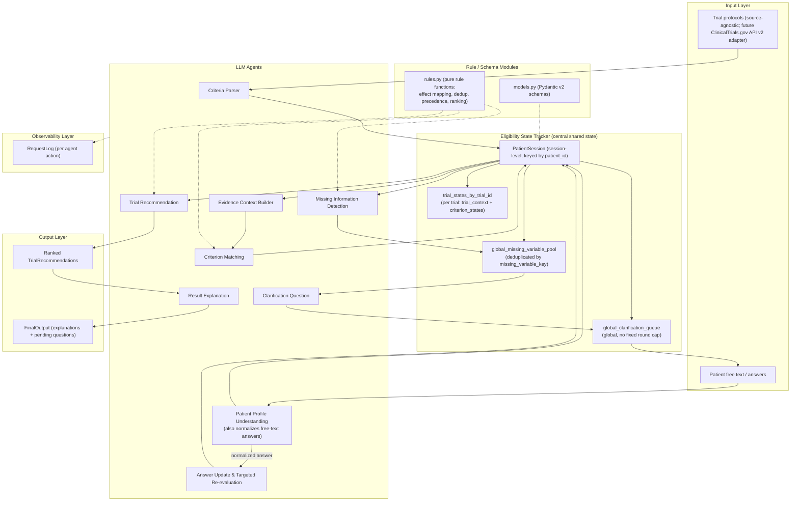

# ClarifyTrial Agent v1.2-final — Architecture (locked)

ClarifyTrial Agent is a **shared-state multi-agent system** for Interactive
Clinical Trial Recommendation. The **Eligibility State Tracker** owns the
central shared state (`PatientSession`), which is session-level and keyed by
`patient_id`. Multiple trials are stored under `trial_states_by_trial_id`;
each trial has its own `trial_context` and `criterion_states`. Missing
variables are deduplicated **globally** by `missing_variable_key`, and
clarification questions live in a single **global clarification queue**
(never per trial). `clarification_round_count` is session-level and has no
fixed upper bound. `trial_relevance_score` affects ranking only, never hard
eligibility.

Notes on locked invariants:

- Free-text clarification answers always pass through the Patient Profile
  Understanding Agent for normalization **before** any rule update.
- Trial descriptions (`trial_context`) support context/relevance only; they
  must not create new blocking eligibility criteria unless explicitly stated
  in the protocol.
- The recommendation precedence and rule mappings are pure functions in
  `rules.py`; LLM agents never decide eligibility effects directly.
