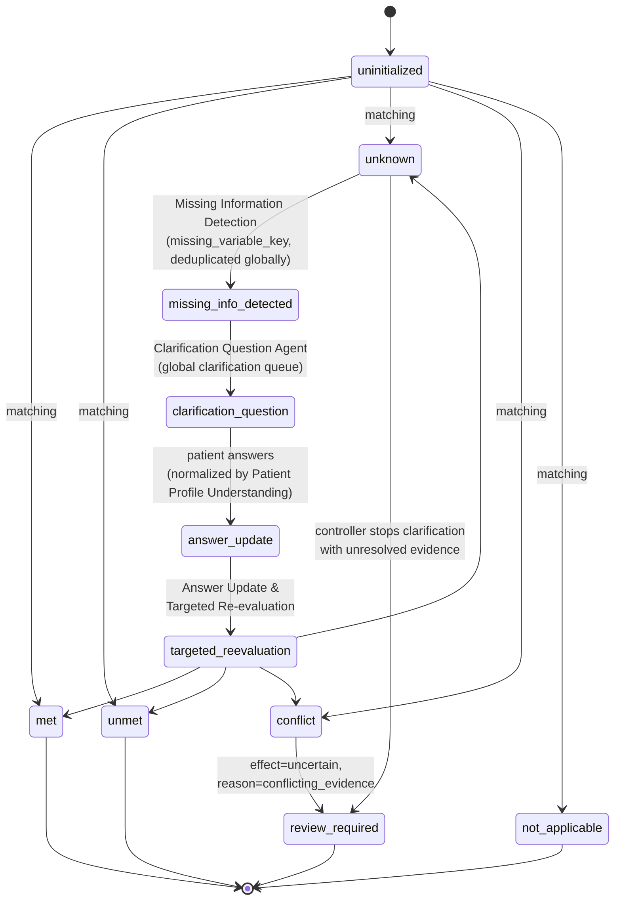

# ClarifyTrial Agent v1.2-final — Criterion State Transitions (locked)

Each criterion state starts uninitialized and is driven by the Criterion
Matching Agent, the global clarification loop, and the pure rules in
`rules.py`. The loop has no fixed round cap by default.

## Effect mapping (per criterion)

| criterion_type | match status   | eligibility_effect   | review |
|----------------|----------------|----------------------|--------|
| inclusion      | met            | supports_eligibility | no     |
| inclusion      | unmet          | blocks_eligibility   | no     |
| inclusion      | unknown        | uncertain            | no*    |
| exclusion      | met            | blocks_eligibility   | no     |
| exclusion      | unmet          | supports_eligibility | no     |
| exclusion      | unknown        | uncertain            | no*    |
| any            | conflict       | uncertain            | yes (conflicting_evidence) |
| any            | not_applicable | neutral              | no     |

\* unknown remains uncertain during clarification. A configured stopping
policy may route unresolved criteria to review.

## Recommendation precedence (per trial, applied exactly in order)

1. any `eligibility_effect == blocks_eligibility` → **likely_ineligible**
2. else any `review_required == true` → **needs_human_review**
3. else uncertainty ratio above threshold → **uncertain**
4. else → **likely_eligible**

`trial_relevance_score` influences `ranking_score` only; it can never
override a hard eligibility block.
