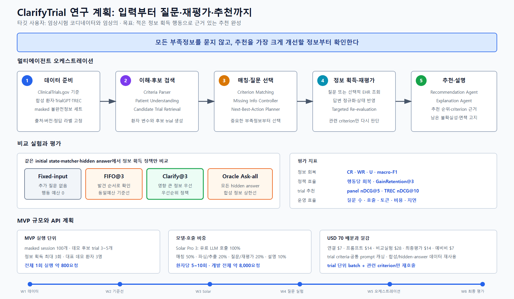

# ClarifyTrial 제안 요약

## 프로젝트명

**ClarifyTrial Agent: 공유 상태 기반 대화형 임상시험 추천 멀티에이전트 시스템**

## 해결하려는 문제

환자 임상요약에는 임상시험 적격성 판단에 필요한 정보가 자주 빠져 있다.
ClarifyTrial은 여러 trial의 부족정보를 통합하고, 추천 결과를 가장 크게 개선할
정보부터 최대 3회 확인한 뒤 관련 criterion만 다시 평가한다.

TrialGPT와 TREC의 정적 환자–임상시험 매칭·순위화 설정을 확장해, ClarifyTrial은
불완전한 합성 환자 정보에서 교차-trial 누락변수를 제한된 예산 안에서 우선
확인하고 영향받은 criterion만 증분 재평가하는 연구용 프로토타입이다.

## 핵심 설계

- `PatientSession`에 환자, trial, criterion, 질문과 답변 상태를 통합한다.
- criterion을 근거와 함께 `met / unmet / unknown / conflict`로 판단한다.
- 여러 trial이 요구하는 같은 정보를 하나의 missing variable로 합친다.
- Next-Best-Action이 질문 또는 EHR 조회의 순서를 결정한다.
- 답변과 관련된 criterion만 표적 재평가한다.
- LLM은 문장 이해와 생성을 맡고 Python 규칙은 상태와 추천 결정을 관리한다.

## 에이전트 흐름

| 단계 | 역할 |
|---|---|
| 이해·검색 | 환자와 criteria 구조화, 후보 trial 3~5개 검색 |
| 근거 매칭 | criterion별 상태와 근거 생성 |
| 부족정보 제어 | 공통 missing variable과 다음 행동 선택 |
| 정보 반영 | 질문·EHR 조회, 답변 정규화, 표적 재평가 |
| 추천·설명 | 추천 순위, 근거, 불확실성, 설명 출력 |

## 실험과 평가

핵심 실험은 세 질문에 답한다.

1. `Clarify@3`가 Fixed-input보다 올바른 criterion 정보를 더 많이 회복하는가?
2. 동일예산 `FIFO@3`보다 우선순위 정책의 추가 가치가 있는가?
3. targeted re-evaluation이 full rerun과 결과를 유지하며 계산을 줄이는가?

Fixed-input, FIFO@3, Clarify@3와 Oracle Ask-all은 같은 immutable initial state,
후보, matcher와 hidden answer에서 paired replay한다. correct/wrong resolution,
행동당 회복량, criterion macro-F1, non-target mutation과 API 비용을 측정한다.
작은 candidate panel은 nDCG@5, 별도 TREC historical ranking은 nDCG@10을 쓴다.

## MVP 규모

- patient 단위 분할에서 파생한 masked session specification 100개
- 환자당 후보 trial 3~5개
- 정보 획득 최대 3회
- 환자당 API 5~10회, 전체 1회 실행 약 800요청
- 대표 환자 3명의 최종 데모

## 현재 준비 상태와 산출물

공유 상태, 결정 규칙, agent contract, 합성 데이터, 오프라인 데모와 102개
테스트가 준비되어 있다. 공개 데이터 adapter, Solar, masked benchmark와 본 평가는
계획 단계다. 최종 산출물은 실행 가능한 CLI, 100-session 결과 JSON, criterion
근거와 질문·재평가 이력, 환자별 추천, 네 정책과 targeted/full 비교표, 재현
문서와 의료적 면책 고지다. 상세 실험 계약은
[`research-design-ko.md`](research-design-ko.md)에 정리한다.
