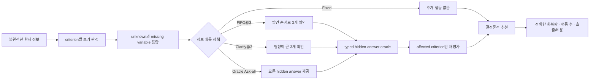

# ClarifyTrial 연구설계: 거시 가설과 세부 구현의 연결

_2026-07-13 외부 ChatGPT Pro 설계 검토와 저장소 근거 대조를 반영했다._

## 한 문장 연구 질문

불완전한 합성 환자 정보에서 모든 누락정보를 확인하지 않고, 추천에 영향을
줄 수 있는 정보부터 제한된 횟수로 확인하면, 더 적은 행동으로 올바른
criterion 상태를 회복할 수 있는가?

ClarifyTrial의 차별점은 에이전트 수가 아니라 다음 두 메커니즘이다.

1. 여러 trial의 누락변수를 전역으로 합치고 제한된 예산 안에서 순서를 정한다.
2. 답변을 받은 뒤 연결된 criterion만 다시 평가하고 결정론적 추천을 갱신한다.

## 현재 상태 표기

| 표기 | 의미 |
|---|---|
| **Implemented** | Pydantic schema, 결정 규칙과 테스트가 저장소에 있음 |
| **Heuristic demo** | 합성 입력으로 실행되는 결정론적 데모가 있음 |
| **Planned** | 공개 데이터, 유료 LLM 또는 본 평가를 연결해야 함 |

현재 공개 데이터 adapter, Solar matching, masked benchmark, 네 정책 실행기,
LangGraph와 Synthea FHIR route는 **Planned**다. 기존 102개 테스트는 schema와
rule semantics의 구현 일관성을 확인하며 임상적 정확성을 입증하지 않는다.

## 외부 설계 검토 결론

2026-07-13 ChatGPT Pro 검토의 결론은 **GO WITH AMENDMENTS(수정 조건부 타당)**다.
제한된 정보 획득 예산에서 질문 순서를 최적화하고 관련 criterion만 다시
평가한다는 연구 질문은 타당하다. 다만 결과를 해석할 수 있으려면 다음 조건을
먼저 고정해야 한다.

1. 100개를 독립 환자가 아니라 patient split 뒤 파생한 masked session으로 정의한다.
2. Fixed-input과 Ask-all 사이에 동일예산 비우선 기준선 `FIFO@3`를 둔다.
3. 질문 우선순위 효과와 targeted re-evaluation 효과를 별도 실험으로 분리한다.
4. TrialGPT, TREC, Synthea와 live ClinicalTrials.gov의 평가 역할을 섞지 않는다.
5. visible input과 hidden answer를 물리적으로 분리하고 다중 mask 누출 감사를 한다.

이 문서는 위 수정 조건을 연구가설, 데이터 계약, 비교군, 지표와 실행 전
통과 조건에 연결한 canonical 설계 문서다.

## 거시 가설과 미시 설계



| 거시 목표 | 세부 구현 | 검증 방법 |
|---|---|---|
| 불완전 정보에서 근거 보존 | unknown과 missing variable을 criterion에 연결 | TrialGPT 기반 masked session |
| 적은 질문으로 정보 회복 | 최대 3회 예산과 전역 중복 제거 | FIFO@3·Clarify@3·Ask-all 비교 |
| 결과에 영향 있는 정보 우선 | potential flip, affected trial·criterion 기반 정렬 | 동일예산 FIFO@3 대비 개선량 |
| 답변 후 효율적인 갱신 | affected criterion만 targeted re-evaluation | 같은 answer sequence의 full rerun 비교 |
| 근거 있는 최종 추천 | criterion evidence, 남은 unknown, 질문 이력 | trace completeness와 결정 규칙 검사 |
| 재현 가능한 실행 | immutable initial state, typed answer, 고정 tie-break | paired replay와 상태 전이 테스트 |

## 검증할 세 가설

### H1. 제한예산 정보 효율

missing variable이 4개 이상인 session에서 `Clarify@3`는 `Fixed-input`보다
올바른 criterion 회복량이 높고, `Oracle Ask-all`이 얻는 개선량의 상당 부분을
세 번의 행동으로 유지한다.

### H2. 우선순위 정책의 추가 가치

같은 3회 예산, 같은 initial state와 hidden answer에서 `Clarify@3`는
`FIFO@3`보다 행동당 올바른 회복량과 captured decision impact가 높다.

### H3. 표적 재평가의 계산 효율

같은 answer sequence에서 targeted re-evaluation은 full rerun과 criterion 상태와
최종 추천이 높은 비율로 일치하면서 호출·토큰·지연을 줄인다.

초기 engineering acceptance 기준은 affected criterion exact agreement와 최종
recommendation agreement 각각 95% 이상이다. 이는 임상 기준이 아니라 구현
검증 기준이다.

## 데이터별 평가 역할

서로 다른 데이터의 점수를 하나의 end-to-end gold로 합치지 않는다.

| 트랙 | 데이터 | 검증 대상 | 주장 범위 |
|---|---|---|---|
| A0 정적 매칭 | TrialGPT Criterion Annotations 원본 | criterion label과 evidence | 공개 criterion reference와의 일치 |
| A1 주 실험 | TrialGPT 기반 multi-mask session | missing detection, 우선순위, 답변 반영, 재평가 | 통제된 hidden-answer 환경의 정보 효율 |
| B 정적 순위 | TREC Clinical Trials 2021·2022 | retrieval과 trial ranking | historical TREC task의 ranking |
| C 선택 데모 | Synthea FHIR | 구조화 조회와 상태 반영 | 합성 정보 획득 route가 작동함 |
| 운영 데모 | frozen ClinicalTrials.gov run cache | 현재 trial 입력과 criteria parsing | 실제 형식의 end-to-end 실행 |

TREC는 질문 전후 hidden answer나 criterion gold가 없으므로 A1의 질문 정책
점수로 사용하지 않는다. Synthea는 eligibility gold가 아니며 core 성능표에
합산하지 않는다.

## 라벨 계약

세 층을 분리해 저장한다.

| 층 | 값 |
|---|---|
| `source_label` | 원본 데이터셋 라벨 |
| `criterion_status` | `met / unmet / unknown / not_applicable / conflict` |
| `eligibility_effect` | `supports_eligibility / blocks_eligibility / uncertain / neutral` |

- inclusion의 `met`은 참여를 지지하고 `unmet`은 차단한다.
- exclusion의 `met`은 참여를 차단하고 `unmet`은 지지한다.
- `not_applicable`은 `unknown`과 합치지 않고 `neutral`로 처리한다.
- TrialGPT에 없는 `conflict`는 별도 검토된 합성 사례에서만 평가한다.
- `review_required`와 이유는 eligibility effect와 별도 필드로 유지한다.

## 100개 masked session 정의

`100 sessions`는 100명의 독립 환자를 뜻하지 않는다. patient 단위로 먼저
development/holdout을 분리한 뒤 만든 **100개의 masked session specification**을
의미한다. 같은 환자의 다른 mask variant는 같은 split에 둔다.

권고 구성:

- development 약 70개, locked holdout 약 30개
- session당 독립 missing variable 2~5개
- 우선순위 평가를 위해 missing count가 3개를 넘는 session 포함
- 가능한 경우 하나의 변수가 두 trial 이상의 criterion에 연결
- 실제 TrialGPT의 patient별 annotated trial 분포를 먼저 측정
- 결과 신뢰구간은 patient-clustered paired bootstrap으로 계산

demo에서는 live candidate 3~5개를 사용할 수 있지만, confirmatory A1 평가는
실제 annotation 분포를 따른다.

## masked benchmark 안전 계약

1. **Split first:** patient 단위 분리 후 masking과 template을 만든다.
2. **Explicit evidence:** 원문에서 명시적 met/unmet 근거가 있는 항목만 회복
   실험에 사용한다.
3. **Equivalent evidence removal:** 같은 사실이 반복되면 모든 등가 span을
   제거하고 남은 문맥으로 답을 추론할 수 있는 사례는 제외한다.
4. **Neutral key:** `egfr_value`처럼 개념·시간창·단위만 표현하고 정답의
   polarity나 기준 충족 여부를 variable key에 넣지 않는다.
5. **Typed answer:** 제거 문장을 그대로 답으로 쓰지 않고 value, unit, time과
   negation을 갖는 hidden object로 정규화한다.
6. **Physical separation:** visible note와 oracle answer를 별도 저장하고 원문,
   제거 span과 hidden value는 evaluator만 읽는다.
7. **No hidden RAG:** 원본 note와 제거 evidence를 검색 index, cache key, log와
   prompt metadata에 넣지 않는다.
8. **Question validation:** 질문이 정확히 하나의 intended variable을 묻는지
   독립 validator로 확인하고 불일치하면 `no_answer`로 처리한다.
9. **Counterfactual contract:** `full note → expert label`, `masked note → unknown`,
   `masked note + answer → expert label`을 모두 만족해야 한다.
10. **No collateral mutation:** 답변과 무관한 criterion의 변화율을 기록한다.
11. **Fixed affected map:** variable별 affected trial·criterion ID는 manifest에
    저장하되 정답값과 met/unmet 결과는 포함하지 않는다.
12. **Provenance:** parent revision, source row, script version, seed와 SHA-256을
    기록하고 holdout은 별도로 감사한다.

## 공정한 비교 실험

| 정책 | 행동 예산 | 역할 |
|---|---:|---|
| Fixed-input | 0 | 추가 정보가 없는 하한선 |
| FIFO@3 | 3 | 동일예산 비우선 기준선 |
| Clarify@3 | 3 | 우선순위 정책 |
| Oracle Ask-all | 전체 | 완전한 합성 hidden answer의 정보 상한선 |

모든 정책은 같은 immutable initial `PatientSession`의 deep copy에서 시작한다.
visible note, candidates, criteria, initial matching, missing pool, hidden answer,
질문 validator, answer normalization, recommendation rule과 비용 계산을 고정한다.
주 실험에서 달라지는 것은 변수 선택 순서와 허용 행동 수뿐이다.

모든 정책은 같은 targeted 방식으로 재평가한다. targeted와 full rerun은
동일한 Clarify answer sequence를 사용하는 별도 실험으로 비교한다.

정책 자체를 볼 때는 gold missing pool을 주는 `oracle-pool evaluation`을 먼저
실행하고, detector까지 포함한 end-to-end 평가는 별도로 보고한다.

## MVP 우선순위 규칙

각 missing variable `v`에 대해 다음 값을 계산한다.

- `F(v)`: met/unmet 두 가정에서 trial label 또는 순위가 달라질 수 있는 trial 수
- `T(v)`: 영향을 받는 trial 수
- `C(v)`: 영향을 받는 unknown criterion 수
- `B(v)`: 정보 획득 부담의 ordinal 값
- `answer_available(v)`: core oracle에 답이 있는지
- `manual_review_required(v)`: 자동 처리를 중단해야 하는지

hidden answer를 보지 않고 다음 결정론적 key로 내림차순 정렬한다.

```python
priority_key = (
    potential_flip_trial_count,
    affected_trial_count,
    affected_criterion_count,
    -route_burden,
    stable_variable_key,
)
```

이 순서는 임상적 가치나 실제 변화 확률이 아니라 **potential-impact heuristic**이다.
`manual_review_required`는 점수 가중치가 아니라 `needs_human_review`로 보내는 hard
override다. core 정책 실험에서는 모든 정책이 canonical question과 같은 typed
hidden-answer oracle을 사용해 route 차이가 정책 효과를 교란하지 않게 한다.

선택적 Synthea 데모의 route 순서는 `structured FHIR lookup → synthetic note
retrieval → direct clarification → needs_human_review`로 제한한다.

## 지표

masked affected criterion을 기준으로 다음을 계산한다.

- `CR`: expert/full-note label로 올바르게 복원된 비율
- `WR`: 잘못된 non-unknown 상태로 바뀐 비율
- `U = CR - WR`
- `GainRetention@3 = (U_Clarify - U_Fixed) / (U_AskAll - U_Fixed)`

Ask-all이 Fixed보다 개선되지 않으면 GainRetention 비율 대신 paired raw
difference를 보고한다.

| 평가 | 주요 지표 |
|---|---|
| 정보 회복 | CR, WR, U, 행동당 correct resolution, residual unknown |
| criterion | status macro-F1, per-class F1, inclusion/exclusion 분리 |
| 정책 | target-variable Recall@3, impact coverage@3, duplicate question rate |
| 재평가 | affected exact agreement, final recommendation agreement, non-target mutation |
| 작은 candidate panel | nDCG@5, top-1 eligible rate, eligible-vs-excluded pair accuracy |
| TREC historical ranking | nDCG@10, P@10, RPrec, MRR |
| 운영 | 평균 행동 수, API 호출·토큰·비용, median·p95 latency |

원시 unknown 해소율은 descriptive 값으로만 사용한다. 잘못된 확신도 unknown을
줄일 수 있으므로 CR과 WR을 함께 보고한다.

## 최소 ablation

| 비교 | 고정 조건 | 검증 대상 |
|---|---|---|
| FIFO@3 vs Clarify@3 | 예산·pool·oracle·재평가 방식 | 우선순위의 추가 가치 |
| No-dedup vs Clarify@3 | 우선순위·예산 | 전역 중복 제거 효과 |
| Full rerun vs Targeted | answer sequence | 계산 절감과 출력 일치도 |

## 6주 범위

| 우선순위 | 범위 |
|---|---|
| **Must** | TrialGPT adapter, multi-mask benchmark, 네 정책 runner, priority, targeted/full 비교, 사용량 로그, 면책 고지 |
| **Should** | TREC historical static ranking |
| **Could** | LangGraph interrupt/resume, Synthea FHIR 데모, open-ended note RAG |

LangGraph는 연구 가설이 아니라 실행 엔진 선택이다. deterministic CLI로 핵심
가설을 먼저 검증한 뒤 여유가 있을 때 연결한다.

## 100-session 실행 전 통과 조건

1. **Label gate:** `not_applicable`, `conflict`, inclusion/exclusion effect mapping 고정
2. **Benchmark gate:** visible/oracle 분리, neutral key, multi-mask와 counterfactual test 통과
3. **Causal-isolation gate:** FIFO@3 추가, priority와 targeted 효과 분리
4. **Corpus gate:** live ClinicalTrials.gov와 historical TREC 평가 분리
5. **Pilot gate:** 20-session paid pilot의 p95 token·latency로 전체 비용 재산정

## 주장 범위

허용되는 주장은 다음과 같다.

> 합성·공개 benchmark의 통제된 hidden-answer 환경에서, ClarifyTrial의 제한예산
> 우선순위 정책이 올바른 criterion 정보를 얼마나 회복하는지와 표적 재평가가
> full rerun 대비 얼마나 계산을 줄이는지 평가한다.

실제 임상 적격성 확정, 환자 등록 결과, 임상의 업무 효율, 임상적 안전성 또는
TrialGPT보다 우수하다는 주장은 별도 사용자 연구와 임상 검증 없이 하지 않는다.

본 시스템은 합성 환자와 공개 임상시험 데이터에서 평가되는 연구용 사전검토
프로토타입이다. 출력은 의료적 자문, 임상시험 적격성 확정 또는 등록 결정을
대체하지 않으며, 최종 판단은 자격을 갖춘 전문가가 수행해야 한다.
